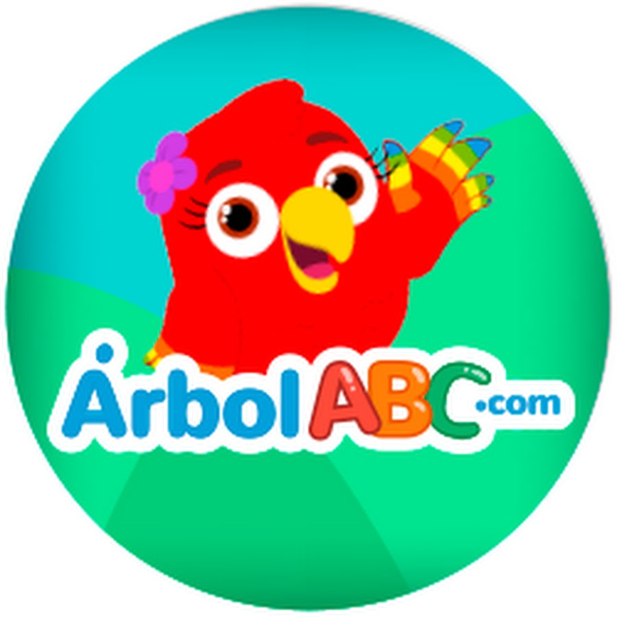
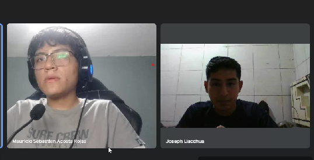
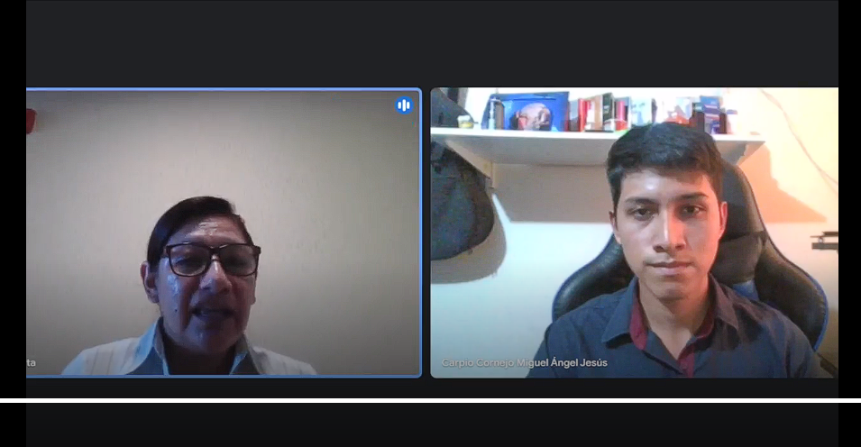
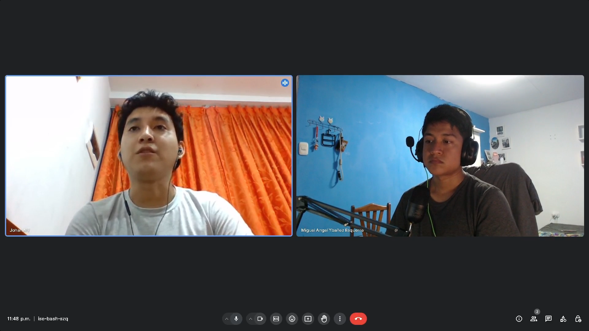
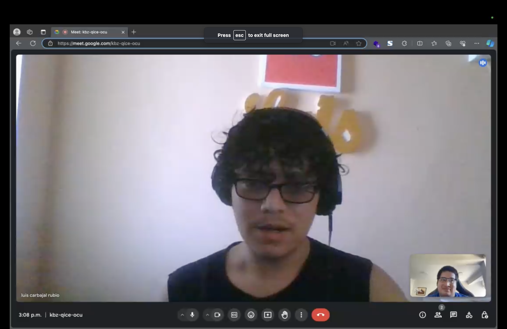
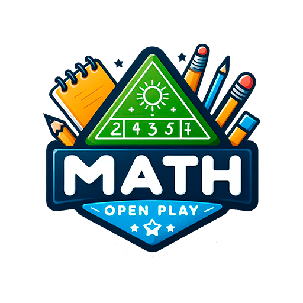
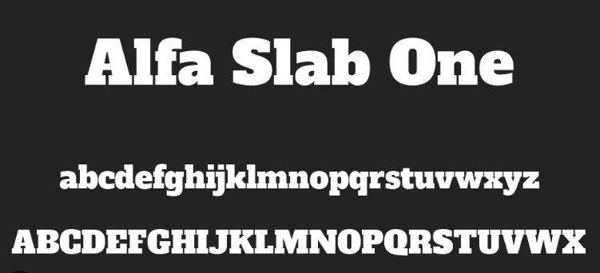
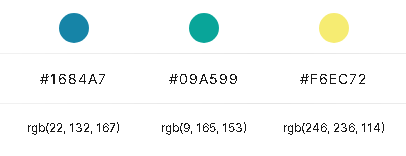
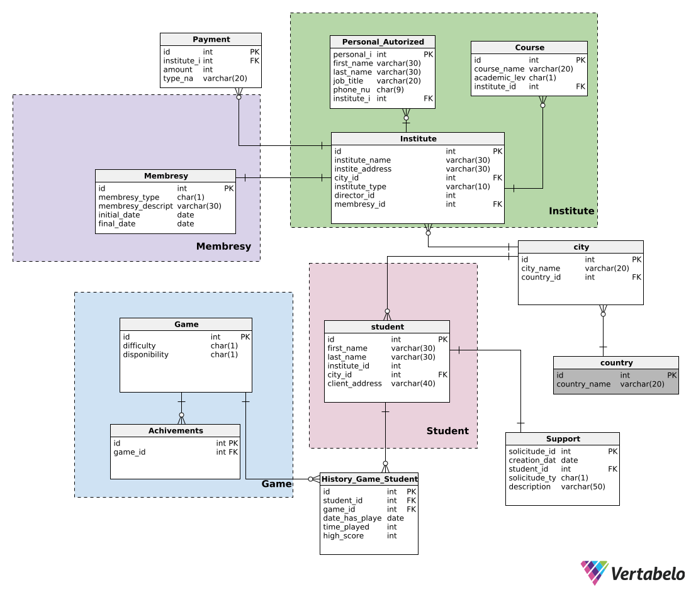

Universidad Peruana de Ciencias Aplicadas

Carrera: Ingeniería de Software

Ciclo: 2024-01

Curso: Desarrollo de Aplicaciones Open Source

Sección: WX52

Profesor: Elio Jefferrson Navarrete Vilca

Informe del Trabajo Final

Startup: 2squareD

Producto: MathPlayOpen

Integrantes:
- Barrial Marin, Sharon Antuanet Ivet - U202114900
- Carpio Cornejo, Miguel Ángel - U20221C360
- Llacchua Peralta, Joseph Ulysses - U202317002
- Minaya Mundines, Pietro Gerardo - U201718387
- Ybañez Esquerre, Miguel Angel - U20201B298
- Yen Cerna, Lucio Heli - U202213143

Junio del 2024

---
# Registro de Versiones del Informe

| Versión | Fecha | Author |Descripción de modificación|
|----------|----------|----------|----------|
| TB1    | XX/04/2024  | Miguel Carpio   |asd|

---
# Project Report Collaboration Insights


---
# Student Outcome
El curso contribuye al cumplimiento del Student Outcome ABET: **ABET – EAC - Student Outcome 3** <br> Criterio: *Capacidad de comunicarse efectivamente con un rango de audiencias.*

En el siguiente cuadro se describe las acciones realizadas y enunciados de conclusiones por parte del grupo, que permiten sustentar el haber alcanzado el logro del ABET – EAC - Student Outcome 3.

| Criterio específico | Acciones realizadas | Conclusiones |
| - | - | - |
| Comunica oralmente sus ideas y/o resultados con objetividad a público de diferentes especialidades y niveles jerarquicos, en el marco del desarrollo de un proyecto en ingeniería. | **Apellido Apellido Nombre Nombre** <br> ***TB1:*** Morbi vel tortor id eros dictum venenatis id ut dui.Mauris quis tellus sed nunc hendrerit vehicula ac id mauris. <br> ***TP:*** Morbi vel tortor id eros dictum venenatis id ut dui.Mauris quis tellus sed nunc hendrerit vehicula ac id mauris. <br> ***TB2:*** Morbi vel tortor id eros dictum venenatis id ut dui.Mauris quis tellus sed nunc hendrerit vehicula ac id mauris. <br> ***TF:*** Morbi vel tortor id eros dictum venenatis id ut dui.Mauris quis tellus sed nunc hendrerit vehicula ac id mauris. <br><br> **Apellido Apellido Nombre Nombre** <br> ***TB1:*** Morbi vel tortor id eros dictum venenatis id ut dui.Mauris quis tellus sed nunc hendrerit vehicula ac id mauris. <br> ***TP:*** Morbi vel tortor id eros dictum venenatis id ut dui.Mauris quis tellus sed nunc hendrerit vehicula ac id mauris. <br> ***TB2:*** Morbi vel tortor id eros dictum venenatis id ut dui.Mauris quis tellus sed nunc hendrerit vehicula ac id mauris. <br> ***TF:*** Morbi vel tortor id eros dictum venenatis id ut dui.Mauris quis tellus sed nunc hendrerit vehicula ac id mauris. <br><br> | ***TB1:*** Fusce cursus dolor et nulla suscipit, sit amet ullamcorper nibh vestibulum. <br><br> ***TP:*** Fusce cursus dolor et nulla suscipit, sit amet ullamcorper nibh vestibulum. <br><br> ***TB2:*** Fusce cursus dolor et nulla suscipit, sit amet ullamcorper nibh vestibulum. <br><br> ***TF:*** Fusce cursus dolor et nulla suscipit, sit amet ullamcorper nibh vestibulum. | 
| Comunica en forma escrita ideas y/o resultados con objetividad a público de diferentes especialidades y niveles jerarquicos, en el marco del desarrollo de un proyecto en ingeniería. | ***Apellido Apellido Nombre Nombre*** <br> ***TB1:*** Cras sed diam suscipit, malesuada ex rutrum, fringilla orci. Vestibulum in nunc quis elit suscipit sollicitudin. <br> ***TP:*** Cras sed diam suscipit, malesuada ex rutrum, fringilla orci. Vestibulum in nunc quis elit suscipit sollicitudin. <br> ***TB2:*** Cras sed diam suscipit, malesuada ex rutrum, fringilla orci. Vestibulum in nunc quis elit suscipit sollicitudin. <br> ***TF:*** Cras sed diam suscipit, malesuada ex rutrum, fringilla orci. Vestibulum in nunc quis elit suscipit sollicitudin. <br><br> ***Apellido Apellido Nombre Nombre*** <br> ***TB1:*** Cras sed diam suscipit, malesuada ex rutrum, fringilla orci. Vestibulum in nunc quis elit suscipit sollicitudin. <br> ***TP:*** Cras sed diam suscipit, malesuada ex rutrum, fringilla orci. Vestibulum in nunc quis elit suscipit sollicitudin. <br> ***TB2:*** Cras sed diam suscipit, malesuada ex rutrum, fringilla orci. Vestibulum in nunc quis elit suscipit sollicitudin. <br> ***TF:*** Cras sed diam suscipit, malesuada ex rutrum, fringilla orci. Vestibulum in nunc quis elit suscipit sollicitudin. | ***TB1:*** FEtiam imperdiet quam condimentum velit tempor porttitor. <br><br> ***TP:*** FEtiam imperdiet quam condimentum velit tempor porttitor. <br><br> ***TB2:*** FEtiam imperdiet quam condimentum velit tempor porttitor. <br><br> ***TF:*** FEtiam imperdiet quam condimentum velit tempor porttitor. |

---
# Contenido 
## Tabla de contenidos

### [Capítulo I: Introducción]()
- [1.1. Startup Profile]()
    - [1.1.1 Descripción de la Startup]()
    - [1.1.2 Perfiles de integrantes del equipo]()
- [1.2 Solution Profile]()
    - [1.2.1 Antecedentes y problemática]()
    - [1.2.2 Lean UX Process]()
        - [1.2.2.1. Lean UX Problem Statements]()
        - [1.2.2.2. Lean UX Assumptions]()
        - [1.2.2.3. Lean UX Hypothesis Statements]()
        - [1.2.2.4. Lean UX Canvas]()
- [1.3. Segmentos objetivo]()

### [Capítulo II: Requirements Elicitation & Analysis]()
- [2.1. Competidores]()
    - [2.1.1. Análisis competitivo]()
    - [2.1.2. Estrategias y tácticas frente a competidores]()
- [2.2. Entrevistas]()
    - [2.2.1. Diseño de entrevistas]()
    - [2.2.2. Registro de entrevistas]()
    - [2.2.3. Análisis de entrevistas]()
- [2.3. Needfinding]()
    - [2.3.1. User Personas]()
    - [2.3.2. User Task Matrix]()
    - [2.3.3. User Journey Mapping]()
    - [2.3.4. Empathy Mapping]()
    - [2.3.5. As-is Scenario Mapping]()
- [2.4. Ubiquitous Language]()

### [Capítulo III: Requirements Specification]()
- [3.1. To-Be Scenario Mapping]()
- [3.2. User Stories]()
- [3.3. Impact Mapping]()
- [3.4. Product Backlog]()


### [Capítulo IV: Product Design]()
- [4.1. Style Guidelines]()
    - [4.1.1. General Style Guidelines]()
    - [4.1.2. Web Style Guidelines]()
- [4.2. Information Architecture]()  
    - [4.2.1. Organization Systems]()
    - [4.2.2. Labeling Systems]()
    - [4.2.3. SEO Tags and Meta Tags]()
    - [4.2.4. Searching Systems]()
    - [4.2.5. Navigation Systems]()
- [4.3. Landing Page UI Design]()
    - [4.3.1. Landing Page Wireframe]()
    - [4.3.2. Landing Page Mock-up]()
- [4.4. Web Applications UX/UI Design]()
    - [4.4.1. Web Applications Wireframes]()
    - [4.4.2. Web Applications Wireflow Diagrams]()
    - [4.4.3. Web Applications Mock-ups]()
    - [4.4.4. Web Applications User Flow Diagrams]()
- [4.5. Web Applications Prototyping]()
- [4.6. Domain-Driven Software Architecture]()
    - [4.6.1. Software Architecture Context Diagram]()
    - [4.6.2. Software Architecture Container Diagrams]()
    - [4.6.3. Software Architecture Components Diagrams]()
- [4.7. Software Object-Oriented Design]()
    - [4.7.1. Class Diagrams]()
    - [4.7.2. Class Dictionary]()
- [4.8. Database Design]()
    - [4.8.1. Database Diagram]()


### [Capítulo V: Product Implementation, Validation & Deployment]()
- [5.1. Software Configuration Management]()
    - [5.1.1. Software Development Environment Configuration]()
    - [5.1.2. Source Code Management]()
    - [5.1.3. Source Code Style Guide & Conventions]()
    - [5.1.4. Software Deployment Configuration]()
- [5.2. Landing Page, Services & Applications Implementation]()
    - [5.2.1. Sprint 1]()
        - [5.2.1.1. Sprint Planning 1]()
        - [5.2.1.2. Sprint Backlog 1]()
        - [5.2.1.3. Development Evidence for Sprint Review]()
        - [5.2.1.4. Testing Suite Evidence for Sprint Review]()
        - [5.2.1.5. Execution Evidence for Sprint Review]()
        - [5.2.1.6. Services Documentation Evidence for Sprint Review]()
        - [5.2.1.7. Software Deployment Evidence for Sprint Review]()
        - [5.2.1.8. Team Collaboration Insights during Sprint]()
    - [5.2.2. Sprint 2]()
        - [5.2.2.1. Sprint Planning 2]()
        - [5.2.2.2. Sprint Backlog 2]()
        - [5.2.2.3. Development Evidence for Sprint Review]()
        - [5.2.2.4. Testing Suite Evidence for Sprint Review]()
        - [5.2.2.5. Execution Evidence for Sprint Review]()
        - [5.2.2.6. Services Documentation Evidence for Sprint Review]()
        - [5.2.2.7. Software Deployment Evidence for Sprint Review]()
        - [5.2.2.8. Team Collaboration Insights during Sprint]()
    - [5.2.3. Sprint 3]()
        - [5.2.3.1. Sprint Planning 3]()
        - [5.2.3.2. Sprint Backlog 3]()
        - [5.2.3.3. Development Evidence for Sprint Review]()
        - [5.2.3.4. Testing Suite Evidence for Sprint Review]()
        - [5.2.3.5. Execution Evidence for Sprint Review]()
        - [5.2.3.6. Services Documentation Evidence for Sprint Review]()
        - [5.2.3.7. Software Deployment Evidence for Sprint Review]()
        - [5.2.3.8. Team Collaboration Insights during Sprint]()
    - [5.2.4. Sprint 4]()
        - [5.2.4.1. Sprint Planning 4]()
        - [5.2.4.2. Sprint Backlog 4]()
        - [5.2.4.3. Development Evidence for Sprint Review]()
        - [5.2.4.4. Testing Suite Evidence for Sprint Review]()
        - [5.2.4.5. Execution Evidence for Sprint Review]()
        - [5.2.4.6. Services Documentation Evidence for Sprint Review]()
        - [5.2.4.7. Software Deployment Evidence for Sprint Review]()
        - [5.2.4.8. Team Collaboration Insights during Sprint]()
- [5.3. Validation Interviews]()
    - [5.3.1. Diseño de Entrevistas]()
    - [5.3.2. Registro de Entrevistas]()
    - [5.3.3. Evaluaciones según heurísticas]()
- [5.4. Video About-the-Product]()

---
# Capítulo I: Introducción
## 1.1. Startup Profile
### 1.1.1 Descripción de la Startup
2squareD: Transformando el Aprendizaje de las Matemáticas con MathPlayOpen

2squareD transforma el aprendizaje de las matemáticas. Con nuestra plataforma innovadora, MathPlayOpen, estamos cambiando la forma en que las personas interactúan con las matemáticas. En un mundo donde el dominio de estas habilidades es cada vez más crucial, nos enorgullece ofrecer una experiencia educativa accesible, dinámica y enriquecedora para personas de todas las edades y habilidades. Permita que nos sumerjamos en nuestra misión y visión, donde aspiramos a impactar positivamente el aprendizaje de las matemáticas en todo el pais.

<ins>**Misión:**</ins>
En 2squareD, nuestra misión es revolucionar la forma en que se aprenden las matemáticas, ofreciendo una experiencia educativa accesible, dinámica y enriquecedora a través de nuestra plataforma MathPlayOpen. Nos comprometemos a proporcionar a los usuarios de todas las edades herramientas interactivas y divertidas que fomenten el amor por las matemáticas y potencien su desarrollo académico.

<ins>**Visión:**</ins>
Nuestra visión en 2squareD es crear un mundo donde cada individuo tenga la oportunidad de dominar las habilidades matemáticas de manera significativa y gratificante. Buscamos convertirnos en líderes globales en educación matemática, ofreciendo una plataforma innovadora que trascienda las barreras tradicionales del aprendizaje y empodere a las personas para alcanzar su máximo potencial en el ámbito académico y profesional.

<ins>**Valores:**</ins>
1. **Excelencia Educativa:** Nos comprometemos a ofrecer contenido educativo de la más alta calidad, respaldado por métodos pedagógicos efectivos y actualizados.
2. **Innovación Continua:** Buscamos constantemente nuevas formas de mejorar y enriquecer la experiencia de aprendizaje de nuestros usuarios, mediante la incorporación de tecnologías emergentes y prácticas educativas innovadoras.
3. **Accesibilidad Universal:** Creemos en la importancia de hacer que el aprendizaje de las matemáticas sea accesible para todos, independientemente de su ubicación geográfica, nivel socioeconómico o habilidades previas.
4. **Empatía y Diversidad:** Valoramos la diversidad de perspectivas y experiencias, y nos esforzamos por crear un entorno inclusivo donde cada individuo se sienta valorado y respetado.
5. **Colaboración y Comunidad:** Reconocemos el poder del trabajo en equipo y la colaboración, tanto dentro de nuestra organización como con nuestros usuarios, educadores y socios estratégicos, para lograr un impacto positivo duradero en la educación matemática.

Con MathPlayOpen, en 2squareD estamos comprometidos a transformar el aprendizaje de las matemáticas en una experiencia emocionante, estimulante y verdaderamente transformadora para personas de todas las edades y habilidades.

### 1.1.2 Perfiles de integrantes del equipo


Nombre completo: Sharon Antuanet Ivet Barrial Marin

Código de estudiante: U202114900

Carrera: Ingeniería de Software

Acerca de mí: Soy una estudiante que se caracteriza por poseer cualidades como la perseverencia, el compañerismo y la comunicación interpersonal. Además de tener conocimientos en diversos lenguajes de programación (Python, C++, C#...), también tengo habilidades en la edición de fotos y videos, y en el enfoque al marketing digital. Espero que estas pocas cualidades sirvan como aporte al proyecto durante el presente ciclo y curso. 


Nombre completo: Miguel Angel Ybañez Esquerre

Código de estudiante: U20201B298

Carrera: Ingeniería de Software

Acerca de mí: Soy una persona amigable, me gusta hacer creación de contenido, y también me agrada el trabajo en equipo. Tengo experiencia en Frontend y Backend, he realizado proyectos para empresas pequeñas. Me especializo en la programación y tengo conocimientos en la creación de páginas web y videojuegos. Además de usar herramientas para edición de imágenes o videos.


Nombre completo: Joseph Ulysses Llacchua Peralta

Código de estudiante: U202317002

Carrera: Ingeniería de Software

Acerca de mí: Soy estudiante de Ingeniería de Software apasionado por la tecnología y el desarrollo de software. Me encanta explorar nuevas herramientas y técnicas para mejorar mis habilidades en programación y diseño de sistemas. Disfruto enfrentando desafíos y resolviendo problemas complejos mediante el desarrollo de soluciones innovadoras y eficientes. Mi objetivo es contribuir al avance de la industria del software y convertirme en un profesional altamente capacitado y comprometido con la excelencia en mi campo.


Nombre completo: Pietro Gerardo Minaya Mundines 

Código de estudiante: U201718387

Carrera: Ingeniería de Software

Acerca de mí: Soy un apasionado por la tecnologia y me apasiona el Ajedrez. 


Nombre completo: Lucio Heli Yen Cerna

Código de estudiante: U202213143

Carrera: Ingeniería de Software

Acerca de mí: Soy una persona líder, autodidacta y dedicada. Mis características me permiten tener un gran impacto en el trabajo en equipo debido a que siempre busco que todos los integrantes, entreguemos el mejor entregable posible y aprendamos durante el desarrollo del proyecto. Por otro lado, tengo conocimientos en C++, HTML, CSS, git bash, MsSql y MongoDB, los cuáles serán beneficiosos para cumplir con el Student Outcome y criterios de evaluación del curso. 


Nombre completo: Miguel Ángel Carpio Cornejo

Código de estudiante: U20221C360

Carrera: Ingeniería de Software

Acerca de mí: Soy estudiante de 5to ciclo en la Universidad Peruana de Ciencias Aplicadas, tengo conocimientos en lenguajes de programación como C++, C#, Python, HTML, Java, MySQL. Lo cual podré beneficiar en el progreso de nuestro trabajo de curso. 

## 1.2 Solution Profile
### 1.2.1 Antecedentes y problemática

En la actualidad, el aprendizaje de las matemáticas puede representar un desafío para muchos estudiantes debido a la falta de motivación y la dificultad para encontrar recursos educativos atractivos y efectivos. A menudo, los métodos tradicionales de enseñanza pueden resultar monótonos y poco estimulantes, lo que lleva a una falta de compromiso y participación por parte de los estudiantes.

Según El Comercio (2022), los resultados de la prueba PISA 2022 indicaron una disminución en el rendimiento académico de los estudiantes peruanos en matemáticas, con una reducción de nueve puntos en comparación con la evaluación anterior realizada hace cuatro años. Esto situó al país en el puesto 59 en la categoría de matemáticas, con un total de 391 puntos.

Esto resalta la urgencia de abordar las deficiencias en el aprendizaje de las matemáticas y promover enfoques innovadores para mejorar el rendimiento académico en esta área (El Comercio, 2022).

What: La falta de motivación y recursos educativos atractivos y efectivos, así como la disminución en el rendimiento académico en matemáticas según los resultados de la prueba PISA 2022, son las principales problemáticas identificadas.

Why: Los métodos tradicionales de enseñanza pueden resultar monótonos y poco estimulantes, lo que lleva a una falta de compromiso y participación por parte de los estudiantes. Además, la falta de recursos educativos efectivos puede contribuir al bajo rendimiento académico en matemáticas.

Who:Los estudiantes peruanos de primaria y secundaria son los principales involucrados en la problemática del bajo rendimiento académico en matemáticas, así como también sus padres y educadores que buscan herramientas educativas efectivas para apoyar su aprendizaje.

Where: Esta problemática se observa específicamente en el contexto educativo peruano, donde los estudiantes enfrentan desafíos en el aprendizaje de las matemáticas.

When: Los desafíos en el aprendizaje de las matemáticas y los resultados de la prueba PISA 2022 se están observando en la actualidad, lo que resalta la urgencia de abordar esta problemática.

How: Se identifica la necesidad de desarrollar un juego educativo de matemáticas en 2D que ofrezca una experiencia interactiva, motivadora y personalizable para ayudar a los estudiantes a mejorar sus habilidades matemáticas de manera efectiva y divertida.

How much: Aunque no se especifica una cantidad exacta, se reconoce que un porcentaje significativo de estudiantes peruanos enfrenta dificultades en el aprendizaje de las matemáticas y que el país ha experimentado una reducción en los resultados de la prueba PISA 2022 en esta área.

Cada estudiante tiene sus propias fortalezas, debilidades y ritmo de aprendizaje, por lo que es crucial proporcionar una experiencia de aprendizaje adaptativa que se ajuste a las necesidades individuales de cada usuario.

Por lo tanto, se identifica la necesidad de desarrollar un juego educativo de matemáticas en 2D que aborde estas problemáticas al ofrecer una experiencia interactiva, motivadora y personalizable que pueda ayudar a los estudiantes a mejorar sus habilidades matemáticas de manera efectiva y divertida.

### 1.2.2 Lean UX Process
#### 1.2.2.1. Lean UX Problem Statements
Segmento objetivo: Estudiantes de secundaria peruanos

Hemos observado que muchos estudiantes de secundaria en Perú enfrentan dificultades para comprometerse y progresar en el aprendizaje de las matemáticas. Esto se debe a la falta de recursos educativos interactivos y atractivos que aborden adecuadamente sus necesidades de aprendizaje. A menudo, los métodos tradicionales de enseñanza no logran captar su interés ni motivarlos para explorar y comprender conceptos matemáticos de manera efectiva. Este problema es especialmente significativo en entornos donde los recursos educativos son limitados o poco accesibles.

¿Cómo podríamos desarrollar una plataforma educativa innovadora y divertida que motive a los estudiantes de secundaria peruanos a mejorar sus habilidades matemáticas de una manera efectiva y accesible?

Segmento objetivo: Organizaciones e instituciones educativas

Hemos notado que las organizaciones e instituciones educativas que trabajan con estudiantes de secundaria en Perú carecen de herramientas digitales efectivas para mejorar la enseñanza y el aprendizaje de las matemáticas en este nivel educativo. Esta falta de recursos adecuados dificulta su capacidad para evaluar y monitorear el progreso de los estudiantes de manera efectiva, lo que puede limitar el impacto de sus programas educativos. Además, la falta de opciones interactivas y atractivas dificulta la implementación de prácticas educativas innovadoras que puedan mejorar significativamente la experiencia de aprendizaje de los estudiantes.

¿Cómo podríamos desarrollar una plataforma educativa digital que proporcione a organizaciones e instituciones educativas herramientas efectivas para mejorar la enseñanza y el aprendizaje de las matemáticas en estudiantes de secundaria peruanos, al tiempo que fomente la innovación en prácticas educativas?


#### 1.2.2.2. Lean UX Assumptions

**Bussiness Assumptions**

>Mejora el rendimiento académico de los estudiantes

 *MathPlayOpen* permite a los estudiantes desarrollar habilidades cognitivas como el razonamiento lógico, la resolución de problemas, la atención y la memoria. Estas habilidades son fundamentales para el éxito en matemáticas y en otras áreas académicas.

>Aumenta las formas didácticas de enseñar la asignatura

En comparación a los métodos de enseñanza tradicionales,*MathPlayOpen* ofrece un entorno interactivo donde los estudiantes experimentan directa y activamente con conceptos matemáticos mientras juegan, lo que aumenta su comprensión y retención de la información. Además, la competencia y la posibilidad de ganar incentivan a los estudiantes a participar y a dedicar tiempo a la práctica de las matemáticas de una manera divertida y entretenida.

>Motiva el aprendizaje de las matemáticas

Los juegos son inherentemente divertidos y atractivos. Por eso, al presentar en *MathPlayOpen* los conceptos matemáticos de una manera lúdica y entretenida, los estudiantes están más motivados para participar y comprometerse con el aprendizaje. Asimismo, el haber incluido elementos de desafío personal y competencia entre jugadores con tablas de clasificación, motiva a los estudiantes a esforzarse por mejorar su rendimiento y superar a sus compañeros de manera saludable.

>Estimula la mejora continua personalizada

*MathPlayOpen* proporciona a los estudiantes oportunidades para practicar conceptos matemáticos una y otra vez. En este tipo de situaciones, la repetición es clave para la memorización y la comprensión profunda de estos conceptos. Además, los estudiantes reciben una retroalimentación inmediata sobre su rendimiento después de resolver cada desafío o competencia, y eso les permite corregir sus errores y mejorar de manera continua mientras juegan. Esto fomenta el aprendizaje activo y autodirigido.

>Facilita la visualización del rendimiento académico de los estudiantes

No solo los alumnos tienen un reporte de su rendimiento académico, asimismo, la institución a la que pertenece el estudiante y solo si está inscrita a nuestro plan para empresas educativas recibe el mismo reporte. Esto les permite hacer una comparación de conocimientos entre sus alumnos, descubrir la deficiencia de un tema  o temas específicos en matemáticas y la comparación de su actual estado académico con el promedio del país.

Los servicios que brinda *MathPlayOpen* son muy importantes tanto para las empresas educativas que están suscritos a nuestro plan de paga para instituciones, como para los diversos estudiantes que están dentro de nuestro plan gratuito para estudiantes. Puesto que, ya sea por los convenios institucionales o por conocer la aplicación solo de nombre *MathPlayOpen* ha demostrado tener mayor validez que otras aplicaciones de juegos enfocados a conocimientos, mediante la entrega de feedback inmediata y el modo competencia multijugador. 

Aunque, corremos el riesgo de que esta función multijugador presente fallas, el hecho de que cada institución pueda obtener un reporte académico por cada uno de sus estudiantes y verificar lo que han aprendido fuera de clases, es la función clave de *MathPlayOpen* para que nuestros segmentos objetivos queden satisfechos y nuestra aplicación sea un éxito.
<br>
    
**User Assumptions**

>Empresas educativas

 Al ser una herramienta didáctica y con enfoque educativo, cada institución educativa opta por usar *MathPlayOpen* como reforzamiento de los conocimientos enseñados en clase. Pueden visualizar los reportes académicos de su institución y no solo comparar el nivel académico de sus estudiantes entre ellos, también compararlo con el promedio del país, demostrando en que rama de las matemáticas presentan mayor deficiencia y por lo que deberían darle más enfoque en clases. 

>Estudiantes

 Ligados o no a la misma institución, los estudiantes aprenden o refuerzan conocimientos matemáticos de manera más eficaz que las enseñanzas tradicionales. Incluso, el tratar de superar los desafíos o ganar las competencias con otros estudiantes los motiva a aprender de manera autodidacta y autodirigida. Aprendiendo no solo conceptos, también la mejor manera en que ellos pueden adquirir conocimientos.

 <br>

**Technical Assumptions**

>Computadoras de escritorio y portátiles (linux?)

>Dispositivos móviles

>Navegadores web modernos

Las capacidades de los dispositivos y navegadores pueden limitar la ejecución de gráficos o interacciones complejas, lo que puede causar problemas de rendimiento en dispositivos más antiguos o menos potentes, afectando la experiencia del usuario.

Es por lo que, *MathPlayOpen* tiene como compatibilidad a diferentes sistemas operativos como Windows, macOS y Linux.Asimismo, para su desarrollo hizo uso de bibliotecas como React, Angular o Vue.js. Y también se requirió del uso de la herramienta de desarrollo IntelliJ IDEA ULTIMATE para su compilación.

Por otro lado, también se hizo uso de APIs para los servicios externos y PostgreSQL para la base de datos. A su vez contamos con herramientas adecuadas para probar y depurar el producto en diversas plataformas y entornos.

-Además, es fundamental garantizar la accesibilidad del juego para estudiantes con discapacidades visuales o motoras.-

#### 1.2.2.3. Lean UX Hypothesis Statements

- **Basados en** la observación de la falta de motivación y recursos educativos efectivos, así como la disminución del rendimiento académico en matemáticas según los resultados de la prueba PISA 2022, **creemos que** al desarrollar un juego educativo de matemáticas en 2D interactivo y motivador, podemos impactar positivamente en el rendimiento académico de los estudiantes peruanos. **Si** implementamos esta solución, esperamos ver una mejora significativa en los puntajes de las pruebas estandarizadas y una mayor participación en el aprendizaje de las matemáticas entre los estudiantes. **Entonces sabremos que** es cierto cuando observemos un aumento en los puntajes promedio de matemáticas en las evaluaciones estandarizadas y un incremento en la participación activa de los estudiantes en actividades de aprendizaje de matemáticas.

- **Basados en** la identificación de que los métodos tradicionales de enseñanza pueden resultar monótonos y poco estimulantes, llevando a una falta de compromiso y participación estudiantil, **creemos que** al proporcionar una experiencia interactiva y personalizable a través del juego educativo de matemáticas en 2D, podemos mejorar el compromiso de los estudiantes. **Si** los estudiantes se involucran y participan activamente en el juego, esperamos observar un aumento en el tiempo dedicado al aprendizaje de matemáticas fuera del aula, una mayor participación en actividades relacionadas con las matemáticas y una actitud más positiva hacia el aprendizaje de esta materia. **Entonces sabremos que** es cierto cuando veamos un incremento en la asistencia a clases de matemáticas y una reducción en las tasas de deserción, así como una actitud más favorable hacia el aprendizaje de matemáticas.

- **Basados en** la falta de herramientas digitales efectivas para mejorar la enseñanza y el aprendizaje de las matemáticas en escuelas primarias, **creemos que** al desarrollar una plataforma educativa digital que proporcione estas herramientas, podemos fomentar la innovación educativa. **Si** implementamos esta solución, anticipamos un aumento en la adopción de la plataforma por parte de empresas educativas y organizaciones, así como una mejora en la calidad y efectividad de la enseñanza de matemáticas en escuelas secundarias, medida a través de la retroalimentación positiva de educadores y una mejora en los resultados académicos de los estudiantes. **Entonces sabremos que** es cierto cuando veamos una mayor colaboración entre los educadores para compartir mejores prácticas, así como una mayor participación en talleres y capacitaciones relacionadas con la implementación de tecnología educativa.

#### 1.2.2.4. Lean UX Canvas


## 1.3. Segmentos objetivo
Empresas Educativas:

- Las empresas educativas representan un segmento objetivo clave, ya que pueden utilizar el juego educativo de matemáticas en 2D como una herramienta didáctica para reforzar los conceptos enseñados en clase. Este juego puede servir como un complemento a los métodos tradicionales de enseñanza, ofreciendo una experiencia interactiva y motivadora para los estudiantes.
- Además, las empresas educativas pueden utilizar el juego para acceder a registros académicos y comparar el rendimiento de sus estudiantes con otras instituciones académicas del mismo nivel. Esto les permitirá identificar áreas de mejora y tomar medidas para fortalecer el aprendizaje de las matemáticas en su institución.

Estudiantes:

- Los estudiantes, ya sea que estén vinculados o no a una institución educativa específica, constituyen otro segmento objetivo importante. Pueden beneficiarse del juego educativo de matemáticas en 2D como una forma más eficaz de aprender y reforzar conocimientos matemáticos en comparación con las enseñanzas tradicionales.
Este juego les ofrece la oportunidad de participar en una experiencia de aprendizaje interactiva y personalizable, adaptada a sus necesidades individuales. 
- Además, les permite explorar conceptos matemáticos de manera lúdica y motivadora, lo que puede aumentar su compromiso y participación en el proceso de aprendizaje.

# Capítulo II: Requirements Elicitation & Analysis
## 2.1 Competidores


***Brilliant:*** Plataforma de aprendizaje en línea que se centra en temas relacionados con STEM. Cuenta con más de 60 cursos interactivos y ha crecido hasta tener 10 millones de usuarios desde su fundación en 2012.


***Smartick:*** Plataforma de aprendizaje en línea que ayuda a entender conceptos difíciles de STEM de manera atractiva. Fomenta en los estudiantes una mentalidad de resolución de problemas y desarrolla habilidades de razonamiento y lógica.



***ArbolABC:*** Plataforma de aprendizaje en línea que ofrece contenido en español a traves de minijuegos.

### 2.1.1 Análisis competitivo
<table border="1" style="text-align: center;">
	<tbody>
		<tr>
			<td colspan="6">Competitive Analysis Landscape</td>
		</tr>
		<tr>
			<td colspan="2">¿Por que llevar a cabo este análisis?</td>
			<td colspan="4">Llevar a cabo este análisis nos brindará información crítica que nos permitirá tomar decisiones más informadas y estratégicas para el desarrollo, comercialización y crecimiento de nuestra aplicación</td>
		</tr>
		<tr>
			<td colspan="2"></td>
			<td>2squareD</td>
			<td>Brilliant</td>
			<td>Smartick</td>
			<td>ArbolABC</td>
		</tr>
		<tr>
			<td rowspan="2">Perfil</td>
			<td>Overview</td>
			<td>Aplicación web diseñada para la enseñanza de matematicas a estudiantes de secundaria</td>
			<td>Aplicación diseñada para la enseñanza de diversos campos STEAM</td>
			<td>Aplicación web diseñada para la enseñanza de diversos campos STEAM</td>
			<td>Aplicación web diseñada para la enseñanza de diversos campos STEAM. Contenido en español</td>
		</tr>
		<tr>
			<td>Ventaja competitiva ¿Que valor ofrece a los clientes?</td>
			<td>Ser una plataforma que ofrece ensenar matematicas a estudiantes de secundaria a un precio acorder a la realidad socioeconomica del pais</td>
			<td>Ser una plataforma de aprendizaje en línea que se centra en temas relacionados con STEM</td>
			<td>Ser una plataforma de aprendizaje en línea que ayuda a entender conceptos difíciles de STEM de manera atractiva</td>
			<td>Ser una plataforma que de aprendizaje en línea que ofrece contenido en español a traves de minijuegos </td>
		</tr>
		<tr>
			<td rowspan="2">Perfil de Marketing</td>
			<td>Mercado objetivo</td>
			<td>
                <ul>
                    <li>Empresas Educativas</li>
                    <li>Estudiantes</li>
                </ul>
            </td>
			<td>
                <ul>
                    <li>Empresas Educativas</li>
                    <li>Estudiantes</li>
                </ul>
            </td>
			<td>
                <ul>
                    <li>Empresas Educativas</li>
                    <li>Estudiantes</li>
                </ul>
            </td>
			<td>
                <ul>
                    <li>Empresas Educativas</li>
                    <li>Estudiantes</li>
                </ul>
            </td>
		</tr>
		<tr>
			<td>Estrategias de marketing</td>
			<td>
                <ul>
                    <li>Marketing de contenido</li>
                    <li>Página web</li>
                </ul>
            </td>
			<td>
                <ul>
                    <li>Marketing de contenido</li>
                    <li>Página web</li>
                </ul>
            </td>
			<td>
                <ul>
                    <li>Marketing de contenido</li>
                    <li>Página web</li>
                </ul>
            </td>
			<td>
                <ul>
                    <li>Marketing de contenido</li>
                    <li>Página web</li>
                </ul>
            </td>
		</tr>
		<tr>
			<td rowspan="3">Perfil de Producto</td>
			<td>Productos &amp; Servicios</td>
			<td>
                <ul>
                    <li>Aplicación web</li>
                </ul>
            </td>
			<td>
                <ul>
                    <li>Aplicación web</li>
                </ul>
            </td>
			<td>
                <ul>
                    <li>Aplicación web</li>
                </ul>
            </td>
			<td>
                <ul>
                    <li>Aplicación web</li>
                </ul>
            </td>
		</tr>
		<tr>
			<td>Precios &amp; Costos</td>
			<td>
                <ul>
                    <li>Pago (con capa gratiuta)</li>
                </ul>
            </td>
			<td>
                <ul>
                    <li>Pago (con capa gratiuta)</li>
                </ul>
            </td>
			<td>
                <ul>
                    <li>Pago (con capa gratiuta)</li>
                </ul>
            </td>
			<td>
                <ul>
                    <li>Pago (con capa gratiuta)</li>
                </ul>
            </td>
		</tr>
		<tr>
			<td>Canales de distribución (Web y/o Móvil)</td>
			<td>
                <ul>
                    <li>Web</li>
                </ul>
            </td>
			<td>
                <ul>
                    <li>Web</li>
                    <li>Móvil</li>
                </ul>
            </td>
			<td>
                <ul>
                    <li>Web</li>
                </ul>
            </td>
			<td>
                <ul>
                    <li>Web</li>
                </ul>
            </td>
		</tr>
		<tr>
			<td rowspan="4">Análisis SWOT</td>
			<td>Fortalezas</td>
			<td>
                <ul>
                    <li>Precio competitivo</li>
                    <li>Actualizaciones continuas</li>
                    <li>Enfoque en matematicas secundarias a nivel de prueba PISA</li>
                </ul>
            </td>
			<td>
                <ul>
                    <li>Antiguedad</li>
                    <li>Reconocimiento</li>
                </ul>
            </td>
			<td>
                <ul>
                    <li>Interactividad</li>
                    <li>Enfocado en Matematicas y Lectura </li>
                </ul>
            </td>
			<td>
                <ul>
                    <li>Precio comenpetitivo</li>
                    <li>Varias materias y varios niveles</li>
                </ul>
            </td>
		</tr>
		<tr>
			<td>Debilidades</td>
			<td>
                <ul>
                    <li>Novedad en el mercado</li>
                    <li>Confianza en las empresas educactivas</li>
                </ul>
            </td>
			<td>
                <ul>
                    <li>Precio prohibitivo en dólares (facturado anualmente)</li>
                    <li>Solo en ingles</li>
                </ul>
            </td>
			<td>
                <ul>
                    <li>Precio variable (en funcion de la inscripcion de niños)</li>
                    <li>Material muy general</li>
                </ul>
            </td>
			<td>
                <ul>
                    <li>Precio alto dólares (facturado anualmente)</li>
                    <li>Enfocado en niños de entre 3 a 10 anos</li>
                </ul>
            </td>
		</tr>
		<tr>
			<td>Oportunidades</td>
			<td>
                <ul>
                    <li>Expansión de la plataforma a nivel internacional hispanoablante</li>
                    <li>Establecer asociaciones extensas y duraredas con empresas educativas</li>
                </ul>
            </td>
			<td>
                <ul>
                    <li>Precios en base a nivel socieconomico de cada region disponible</li>
                    <li>Permiter cambiar de idioma</li>
                </ul>
            </td>
			<td>
                <ul>
                    <li>Precio fijos en base a un usuario</li>
                    <li>Actualizacion del material</li>
                </ul>
            </td>
			<td>
                <ul>
                    <li>Precios en base a nivel socieconomico de cada region disponible</li>
                    <li>Optimizacion del redimiento de la aplicacion web</li>
                </ul>
            </td>
		</tr>
		<tr>
			<td>Amenazas</td>
			<td>
                <ul>
                    <li>Presencia de competidores estalecidos</li>
                    <li>Aceptacion por parte de las empresas educativas</li>
                </ul>
            </td>
			<td>
                <ul>
                    <li>App similares</li>
                    <li>Precio Caro (en dolares)</li>
                </ul>
            </td>
			<td>
                <ul>
                    <li>App similares</li>
                    <li>Precio Variable</li>
                </ul>
            </td>
			<td>
                <ul>
                    <li>App similares</li>
                    <li>Precio Caro (en dolares)</li>
                </ul>
            </td>
		</tr>
	</tbody>
</table>

### 2.1.2. Estrategias y tácticas frente a competidores
#### Estrategias
1. Diferenciación de Producto:
    - Destacar la especialización en la enseñanza de matemáticas para estudiantes de secundaria y el enfoque en el nivel de prueba PISA.
    - Desarrollar contenido específico y de alta calidad centrado en los estándares de matemáticas de nivel secundario. Realizar campañas de marketing destacando la especialización en matemáticas y su relevancia para el éxito académico.
2. Expansión Internacional:
    - Aprovechar la oportunidad de expandir la plataforma a nivel internacional, especialmente en regiones de habla hispana.
    - Localizar la plataforma y el contenido para adaptarse a diferentes culturas y sistemas educativos. Establecer alianzas con escuelas y organizaciones educativas en países de habla hispana para promover la plataforma.
3. Precios Competitivos y Flexibles:
    - Ofrecer precios competitivos y flexibles para atraer a una amplia gama de usuarios, especialmente en mercados donde los competidores tienen precios prohibitivos.
    - Implementar una estructura de precios escalonada que se adapte al nivel socioeconómico de cada región. Ofrecer opciones de pago flexibles, como suscripciones mensuales o anuales, para aumentar la accesibilidad.
#### Tácticas
1. Marketing de Contenido y SEO:
    - Crear contenido educativo de alta calidad relacionado con las matemáticas y optimizarlo para mejorar el ranking en los motores de búsqueda.
    - Publicar regularmente blogs, artículos y recursos educativos en el sitio web de 2squareD. Utilizar palabras clave relevantes y etiquetas meta para mejorar la visibilidad en línea.
2. Alianzas Estratégicas
    - Establecer asociaciones estratégicas con escuelas, maestros y organizaciones educativas para aumentar el alcance y la adopción de la plataforma.
    - Colaborar con escuelas locales para ofrecer descuentos o acceso gratuito a la plataforma para sus estudiantes. Participar en eventos educativos y conferencias para promover la plataforma y establecer contactos con educadores.
3. Optimización de la Experiencia del Usuario
    - Mejorar constantemente la experiencia del usuario en la plataforma para aumentar la retención y la satisfacción del cliente.
    - Realizar pruebas de usabilidad y recopilar comentarios de los usuarios para identificar áreas de mejora. Implementar actualizaciones periódicas de la plataforma para agregar nuevas características y mejorar la funcionalidad.

Estas estrategias y tácticas nos ayudaran a 2squareD a diferenciarse de sus competidores, expandir su alcance y proporcionar una experiencia educativa de alta calidad a sus usuarios.

## 2.2. Entrevistas
### 2.2.1. Diseño de entrevistas
Segmento Objetivo 1: Institución / Empresa educativa
1. ¿Cuáles son los principales desafíos que enfrenta la institución en el contexto educativo actual?
2. ¿Qué acciones se desarrollan para fortalecer la formación docente y la innovación pedagógica?
3. ¿En qué medida están familiarizados con el uso de videojuegos didácticos como herramienta educativa?
4. ¿Qué características o funcionalidades consideran imprescindibles en un videojuego didáctico?
5. ¿Cómo les gustaría que se realizara la evaluación del aprendizaje a través de los videojuegos didácticos?
6. ¿Qué tipo de videojuegos didácticos consideran más adecuados para sus necesidades?
7. ¿Qué tipo de soporte técnico o capacitación necesitarían para implementar el uso de videojuegos didácticos en su institución?
8. ¿Qué aspectos les preocupan o generan dudas sobre el uso de videojuegos didácticos en el ámbito educativo?
9. ¿Qué expectativas tienen sobre los resultados que se pueden obtener con la implementación de videojuegos didácticos?
10. ¿Qué información adicional necesitarían para tomar una decisión sobre la implementación de videojuegos didácticos en su institución?

Segmento Objetivo 2: Estudiantes de Secundaria 
1. ¿Qué aspectos de las matemáticas te resultan más desafiantes?
2. ¿Cómo crees que un enfoque interactivo podría mejorar tu experiencia de aprendizaje en matemáticas?
3. ¿Qué tipo de actividades o recursos en línea encuentras más útiles para aprender matemáticas?
4. ¿Cuáles son tus mayores dificultades al estudiar matemáticas y cómo crees que una aplicación web podría ayudarte a superarlas?
5. ¿Qué características te gustaría ver en una aplicación de aprendizaje de matemáticas para que te resulte más atractiva y útil?
6. ¿Consideras importante que una aplicación de aprendizaje de matemáticas tenga la capacidad de realizar un seguimiento de tu progreso y ofrecerte retroalimentación personalizada?
7. ¿Qué opinas sobre la idea de competir o colaborar con otros estudiantes a través de una aplicación de aprendizaje de matemáticas?
8. ¿Cómo crees que una aplicación de aprendizaje de matemáticas podría integrarse de manera efectiva en tu rutina diaria de estudio?
9. ¿Qué sugerencias tendrías para hacer que una aplicación de aprendizaje de matemáticas sea más atractiva y fácil de usar para estudiantes de tu edad?
10. ¿Qué impacto crees que podría tener una aplicación de aprendizaje interactivo de matemáticas en tu desempeño académico y tu actitud hacia esta materia?

### 2.2.2. Registro de entrevistas
Segmento Objetivo 1: Institución / Empresa educativa

Entrevistado 1

<table border="1" style="text-align: left;">
	<tbody>
		<tr>
			<td colspan="1" rowspan="6"></td>
            <td colspan="1" rowspan="1"><strong>Nombre del entrevistado
            <br>
            </strong> Mauricio Sebastian
            <br> Acosta Rojas
            </td>
		</tr>
        <tr>
            <td>
            <strong>Edad<br></strong> 28 años
            <br>
            </td>
        </tr>
        <tr>
            <td>
            <strong>Nombre del entrevistador</strong>
            <br>Joseph Ulysses
            <br>Llacchua Peralta
            </td>
        </tr>
        <tr>
            <td>
             <strong><a href="https://upcedupe-my.sharepoint.com/personal/u202317002_upc_edu_pe/_layouts/15/stream.aspx?id=%2Fpersonal%2Fu202317002%5Fupc%5Fedu%5Fpe%2FDocuments%2FEntrevista%2Ewebm&nav=eyJyZWZlcnJhbEluZm8iOnsicmVmZXJyYWxBcHAiOiJTdHJlYW1XZWJBcHAiLCJyZWZlcnJhbFZpZXciOiJTaGFyZURpYWxvZy1MaW5rIiwicmVmZXJyYWxBcHBQbGF0Zm9ybSI6IldlYiIsInJlZmVycmFsTW9kZSI6InZpZXcifX0%3D&nav=eyJyZWZlcnJhbEluZm8iOnsicmVmZXJyYWxBcHAiOiJTdHJlYW1XZWJBcHAiLCJyZWZlcnJhbFZpZXciOiJTaGFyZURpYWxvZy1MaW5rIiwicmVmZXJyYWxBcHBQbGF0Zm9ybSI6IldlYiIsInJlZmVycmFsTW9kZSI6InZpZXcifX0=&ga=1">URL Entrevista</a></strong>
            </td>
        </tr>
        <tr>
            <td>
            <strong>Timing Inicial</strong>
            <br>
            <a href="https://upcedupe-my.sharepoint.com/personal/u202317002_upc_edu_pe/_layouts/15/stream.aspx?id=%2Fpersonal%2Fu202317002%5Fupc%5Fedu%5Fpe%2FDocuments%2FEntrevista%2Ewebm&nav=eyJyZWZlcnJhbEluZm8iOnsicmVmZXJyYWxBcHAiOiJTdHJlYW1XZWJBcHAiLCJyZWZlcnJhbFZpZXciOiJTaGFyZURpYWxvZy1MaW5rIiwicmVmZXJyYWxBcHBQbGF0Zm9ybSI6IldlYiIsInJlZmVycmFsTW9kZSI6InZpZXcifX0%3D&nav=eyJyZWZlcnJhbEluZm8iOnsicmVmZXJyYWxBcHAiOiJTdHJlYW1XZWJBcHAiLCJyZWZlcnJhbFZpZXciOiJTaGFyZURpYWxvZy1MaW5rIiwicmVmZXJyYWxBcHBQbGF0Zm9ybSI6IldlYiIsInJlZmVycmFsTW9kZSI6InZpZXcifX0=&ga=1"><u>00:14</u>
            </td>
        </tr>
        <tr>
            <td>
            <strong>Timing Final</strong>
            <br>
            <a href="https://upcedupe-my.sharepoint.com/personal/u202317002_upc_edu_pe/_layouts/15/stream.aspx?id=%2Fpersonal%2Fu202317002%5Fupc%5Fedu%5Fpe%2FDocuments%2FEntrevista%2Ewebm&nav=eyJyZWZlcnJhbEluZm8iOnsicmVmZXJyYWxBcHAiOiJTdHJlYW1XZWJBcHAiLCJyZWZlcnJhbFZpZXciOiJTaGFyZURpYWxvZy1MaW5rIiwicmVmZXJyYWxBcHBQbGF0Zm9ybSI6IldlYiIsInJlZmVycmFsTW9kZSI6InZpZXcifX0%3D&nav=eyJyZWZlcnJhbEluZm8iOnsicmVmZXJyYWxBcHAiOiJTdHJlYW1XZWJBcHAiLCJyZWZlcnJhbFZpZXciOiJTaGFyZURpYWxvZy1MaW5rIiwicmVmZXJyYWxBcHBQbGF0Zm9ybSI6IldlYiIsInJlZmVycmFsTW9kZSI6InZpZXcifX0=&ga=1"><u>04:20</u>
            </td>
        </tr>
	</tbody>
</table>

Resumen: 
Mauricio Acosta, de 28 años, trabaja en una institución educativa dedicada a mejorar el aprendizaje mediante enfoques innovadores. Durante la entrevista, mencionó desafíos como la falta de participación estudiantil y la adaptación a nuevas tecnologías educativas. Aunque conocen los videojuegos didácticos, aún no los implementan en las aulas. Consideran esenciales la personalización, retroalimentación inmediata y alineación con estándares educativos en estos videojuegos. Prefieren evaluaciones transparentes e integradas en el juego. Valorarían capacitación para docentes y soporte técnico para implementarlos. Tienen inquietudes sobre distracción estudiantil y alineación con objetivos educativos. Esperan mejorar la participación y comprensión estudiantil con su implementación, pero necesitan más información para tomar una decisión.

Entrevistado 2

<table border="1" style="text-align: left;">
	<tbody>
		<tr>
			<td colspan="1" rowspan="6"></td>
            <td colspan="1" rowspan="1"><strong>Nombre del entrevistado
            <br>
            </strong> Magnolia Rocío
            <br> Cornejo Peralta
            </td>
		</tr>
        <tr>
            <td>
            <strong>Edad<br></strong> 49 años
            <br>
            </td>
        </tr>
        <tr>
            <td>
            <strong>Nombre del entrevistador</strong>
            <br>Miguel Ángel 
            <br>Carpio Cornejo
            </td>
        </tr>
        <tr>
            <td>
             <strong><a href="https://upcedupe-my.sharepoint.com/:v:/g/personal/u20221c360_upc_edu_pe/EWOP03rfpYFKhJTiheudN3gBtVCNF1hEzZOliQFPmB0S3Q?e=KzQNxq">URL Entrevista</a></strong>
            </td>
        </tr>
        <tr>
            <td>
            <strong>Timing Inicial</strong>
            <br>
            <a href="https://upcedupe-my.sharepoint.com/:v:/g/personal/u20221c360_upc_edu_pe/EWOP03rfpYFKhJTiheudN3gBtVCNF1hEzZOliQFPmB0S3Q?e=KzQNxq"><u>00:10</u>
            </td>
        </tr>
        <tr>
            <td>
            <strong>Timing Final</strong>
            <br>
            <a href="https://upcedupe-my.sharepoint.com/:v:/g/personal/u20221c360_upc_edu_pe/EWOP03rfpYFKhJTiheudN3gBtVCNF1hEzZOliQFPmB0S3Q?e=KzQNxq"><u>14:50</u>
            </td>
        </tr>
	</tbody>
</table>

Entrevistado 3

<table border="1" style="text-align: left;">
	<tbody>
		<tr>
			<td colspan="1" rowspan="6"></td>
            <td colspan="1" rowspan="1"><strong>Nombre del entrevistado
            <br>
            </strong> Johan Raul
            <br> Moreno Vergara
            </td>
		</tr>
        <tr>
            <td>
            <strong>Edad<br></strong> 24 años
            <br>
            </td>
        </tr>
        <tr>
            <td>
            <strong>Nombre del entrevistador</strong>
            <br>Miguel Angel 
            <br>Ybañez Esquerre
            </td>
        </tr>
        <tr>
            <td>
             <strong><a href="https://upcedupe-my.sharepoint.com/:v:/g/personal/u20201b298_upc_edu_pe/Ef4VwiV9w_FJgQUABrr7g4gBsIuMi0OqQiIlSq4XhrGcyA?e=UpZTxJ&nav=eyJyZWZlcnJhbEluZm8iOnsicmVmZXJyYWxBcHAiOiJTdHJlYW1XZWJBcHAiLCJyZWZlcnJhbFZpZXciOiJTaGFyZURpYWxvZy1MaW5rIiwicmVmZXJyYWxBcHBQbGF0Zm9ybSI6IldlYiIsInJlZmVycmFsTW9kZSI6InZpZXcifX0%3D">URL Entrevista</a></strong>
            </td>
        </tr>
        <tr>
            <td>
            <strong>Timing Inicial</strong>
            <br>
            <a href="https://upcedupe-my.sharepoint.com/:v:/g/personal/u20201b298_upc_edu_pe/Ef4VwiV9w_FJgQUABrr7g4gBsIuMi0OqQiIlSq4XhrGcyA?e=pPRrXr&nav=eyJyZWZlcnJhbEluZm8iOnsicmVmZXJyYWxBcHAiOiJTdHJlYW1XZWJBcHAiLCJyZWZlcnJhbFZpZXciOiJTaGFyZURpYWxvZy1MaW5rIiwicmVmZXJyYWxBcHBQbGF0Zm9ybSI6IldlYiIsInJlZmVycmFsTW9kZSI6InZpZXcifSwicGxheWJhY2tPcHRpb25zIjp7InN0YXJ0VGltZUluU2Vjb25kcyI6MzguNDV9fQ%3D%3D"><u>00:38</u>
            </td>
        </tr>
        <tr>
            <td>
            <strong>Timing Final</strong>
            <br>
            <a href="https://upcedupe-my.sharepoint.com/:v:/g/personal/u20201b298_upc_edu_pe/Ef4VwiV9w_FJgQUABrr7g4gBsIuMi0OqQiIlSq4XhrGcyA?e=LysWym&nav=eyJyZWZlcnJhbEluZm8iOnsicmVmZXJyYWxBcHAiOiJTdHJlYW1XZWJBcHAiLCJyZWZlcnJhbFZpZXciOiJTaGFyZURpYWxvZy1MaW5rIiwicmVmZXJyYWxBcHBQbGF0Zm9ybSI6IldlYiIsInJlZmVycmFsTW9kZSI6InZpZXcifSwicGxheWJhY2tPcHRpb25zIjp7InN0YXJ0VGltZUluU2Vjb25kcyI6NTQzLjQ3fX0%3D"><u>09:03</u>
            </td>
        </tr>
	</tbody>
</table>

Resumen: Johan menciona que los principales desafíos que enfrentan las instituciones en la actualidad son dos. En primer lugar, está la cuestión de los docentes, quienes a menudo no están debidamente capacitados para enseñar. Es decir, pueden tener un conocimiento sólido sobre la materia, pero carecen de la habilidad para retener la atención de los estudiantes o para hacer que las clases sean más dinámicas. Por otro lado, los jóvenes estudiantes presentan un déficit de atención debido al constante uso de las redes sociales en la actualidad.

Johan señala que en su institución reciben charlas pedagógicas con el fin de mejorar la capacidad de captar la atención de los alumnos. Respecto al uso de videojuegos como herramienta educativa, menciona que nunca ha visto uno específicamente diseñado con ese propósito. Considera que sería interesante desarrollar un videojuego didáctico que motive a los estudiantes hacia el aprendizaje. También expresa su interés en tener un mejor control sobre las evaluaciones que podrían implementarse en dicho videojuego.

La falta de atención de los estudiantes y la necesidad de mejorar las habilidades pedagógicas de los docentes son desafíos significativos en el ámbito educativo. Para abordar estos problemas, es importante implementar estrategias innovadoras y capacitación adecuada para los docentes. La integración de tecnologías educativas, como los videojuegos didácticos, podría ser una solución efectiva para involucrar a los estudiantes y fomentar su interés en el aprendizaje.

**Segmento Objetivo 2: Estudiantes de Secundaria**

**Entrevistado: 1**
<table border="1" style="text-align: left;">
	<tbody>
		<tr>
			<td colspan="1" rowspan="6"></td>
            <td colspan="1" rowspan="1"><strong>Nombre del entrevistado
            <br>
            </strong> Luis Carbajal
            </td>
		</tr>
        <tr>
            <td>
            <strong>Edad<br></strong> 16 años
            <br>
            </td>
        </tr>
        <tr>
            <td>
            <strong>Nombre del entrevistador</strong>
            <br>Sharon Antuanet Ivet 
            <br>Barrial Marin
            </td>
        </tr>
        <tr>
            <td>
             <strong><a href="https://upcedupe-my.sharepoint.com/:v:/g/personal/u201718387_upc_edu_pe/EcP3udKBWfNMoRhxyVpas0MBwYe2gqcMm4UizBRFioqaGg?e=IpxTJy">URL Entrevista</a></strong>
            </td>
        </tr>
        <tr>
            <td>
            <strong>Timing Inicial</strong>
            <br>
            <a href="https://upcedupe-my.sharepoint.com/:v:/g/personal/u201718387_upc_edu_pe/EcP3udKBWfNMoRhxyVpas0MBwYe2gqcMm4UizBRFioqaGg?e=IpxTJy"><u>02:04</u>
            </td>
        </tr>
        <tr>
            <td>
            <strong>Timing Final</strong>
            <br>
            <a href="https://upcedupe-my.sharepoint.com/:v:/g/personal/u201718387_upc_edu_pe/EcP3udKBWfNMoRhxyVpas0MBwYe2gqcMm4UizBRFioqaGg?e=IpxTJy"><u>09:05</u>
            </td>
        </tr>
	</tbody>
</table>

Resumen: Luis Carbajal es estudiante de quinto grado de secundaria del colegio Liceo Almirante Guise (San Borja, Lima). El estudiante comenta que los mas dificultoso de aprender es la parte mas abstracta de las matemitcas. Por ello, el interés y motivación del alumno por aprender disminuye drasticamente. En cuánto a sus métodos de estudio con herramientas digitales, menciona que ha utilizado algunas, y considera importante el dinamismo en estas herramientas para entender y aplicar las matematicas. Considera, que la idea de una plataforma web con videojuegos para el aprendizaje de conceptos matematicos podria ser una opcion adecuada para reforza los concimientos aprendidos en clase, agrega ademas que la plataforma con competencias entre los alumnos seria especialmente interesante. En resumen, Luis nos comenta que realizar la aprendizaje a traves de ejercicios genericos termina siendo cansino y aburrido por lo que una plataforma web que ensene los conceptos matematicos mas abstractos mediante el jugar sería ideal para aprender matematicas.

<br>

**Entrevistado 2**

<table border="1" style="text-align: left;">
	<tbody>
		<tr>
			<td colspan="1" rowspan="6"></td>
            <td colspan="1" rowspan="1"><strong>Nombre del entrevistado
            <br>
            </strong> Nicolás Fernando Javier
            <br> Barrial Marin
            </td>
		</tr>
        <tr>
            <td>
            <strong>Edad<br></strong> 16 años
            <br>
            </td>
        </tr>
        <tr>
            <td>
            <strong>Nombre del entrevistador</strong>
            <br>Sharon Antuanet Ivet 
            <br>Barrial Marin
            </td>
        </tr>
        <tr>
            <td>
             <strong><a href="https://upcedupe-my.sharepoint.com/:v:/g/personal/u202114900_upc_edu_pe/Ec23R8PSbkxMiUXJVqZ6m4sBNZ2IlfGFQ1QJ8pRZ72EFgA?nav=eyJyZWZlcnJhbEluZm8iOnsicmVmZXJyYWxBcHAiOiJTdHJlYW1XZWJBcHAiLCJyZWZlcnJhbFZpZXciOiJTaGFyZURpYWxvZy1MaW5rIiwicmVmZXJyYWxBcHBQbGF0Zm9ybSI6IldlYiIsInJlZmVycmFsTW9kZSI6InZpZXcifX0%3D&e=gxART0">URL Entrevista</a></strong>
            </td>
        </tr>
        <tr>
            <td>
            <strong>Timing Inicial</strong>
            <br>
            <a href="https://upcedupe-my.sharepoint.com/:v:/g/personal/u202114900_upc_edu_pe/Ec23R8PSbkxMiUXJVqZ6m4sBO-AHTPe9fKYFmpSXqB2-uQ?e=FZsUw6&nav=eyJyZWZlcnJhbEluZm8iOnsicmVmZXJyYWxBcHAiOiJTdHJlYW1XZWJBcHAiLCJyZWZlcnJhbFZpZXciOiJTaGFyZURpYWxvZy1MaW5rIiwicmVmZXJyYWxBcHBQbGF0Zm9ybSI6IldlYiIsInJlZmVycmFsTW9kZSI6InZpZXcifSwicGxheWJhY2tPcHRpb25zIjp7InN0YXJ0VGltZUluU2Vjb25kcyI6MTg2LjQ5fX0%3D"><u>03:04</u>
            </td>
        </tr>
        <tr>
            <td>
            <strong>Timing Final</strong>
            <br>
            <a href="https://upcedupe-my.sharepoint.com/:v:/g/personal/u202114900_upc_edu_pe/Ec23R8PSbkxMiUXJVqZ6m4sBO-AHTPe9fKYFmpSXqB2-uQ?e=vYdvMm&nav=eyJyZWZlcnJhbEluZm8iOnsicmVmZXJyYWxBcHAiOiJTdHJlYW1XZWJBcHAiLCJyZWZlcnJhbFZpZXciOiJTaGFyZURpYWxvZy1MaW5rIiwicmVmZXJyYWxBcHBQbGF0Zm9ybSI6IldlYiIsInJlZmVycmFsTW9kZSI6InZpZXcifSwicGxheWJhY2tPcHRpb25zIjp7InN0YXJ0VGltZUluU2Vjb25kcyI6NDczLjM4fX0%3D"><u>07:49</u>
            </td>
        </tr>
	</tbody>
</table>

Resumen: Nicolás Barrial es un estudiante de quinto nivel de secundaria, que como todo alumno, se le dificulta el aprendizaje sobre ciertos temas en la vida estudiantil. En este caso, la matemática. Nicolás comenta que lo que más se le dificulta en esta última etapa de nivel secundario son los cursos de geometría y trigonometría. Uno por tener que expandir no solo su conocimiento, sino su imaginación al tratar temas con respecto a la proyección de planos. Por otro lado, trigonometría es la nueva asignatura que su institución educativa decidió aplicar a la malla curricular del presente año escolar. Es por lo que, Nicolás opina que el uso de un reforzador presentado como videojuego le ayudaría a entender mejor los conceptos con respecto a trigonometría y los patrones que presentan los problemas de geometría para entender la proyección de planos. Debido a que, las sesiones tradicionales de la escuela no le ayudan a entender y ver tutoriales en youtube puede solucionar su problema, pero a corto plazo, ya que mientras más pasa el timepo, el nivel de dificultad aumenta. Además, siente que su cerebro trabaja mejor cuando estudia en grupo y debate sus conocimientos. Así que, la idea de una competencia amistosa entre compañeros no le desagrada porque le mostraría en qué lugar se encuentra y eso lo motivaría a susperar y conseguir mayores conocimientos en los cursos. 

<br>

**Entrevistado 3**

<table border="1" style="text-align: left;">
	<tbody>
		<tr>
			<td colspan="1" rowspan="6">
            <td colspan="1" rowspan="1"><strong>Nombre del entrevistado
            <br>
            </strong> Fabrizio Flores 
            </td>
		</tr>
        <tr>
            <td>
            <strong>Edad<br></strong> 16 años
            <br>
            </td>
        </tr>
        <tr>
            <td>
            <strong>Nombre del entrevistador</strong>
            <br>Lucio Heli Yen Cerna
            </td>
        </tr>
        <tr>
            <td>
             <strong><a href="https://upcedupe-my.sharepoint.com/:v:/g/personal/u202213143_upc_edu_pe/EXBp0YibIpFJkmQwcXfOQpMBT43UwpRwhhPf7uuZP5FPjw?e=xhzl8m&nav=eyJyZWZlcnJhbEluZm8iOnsicmVmZXJyYWxBcHAiOiJTdHJlYW1XZWJBcHAiLCJyZWZlcnJhbFZpZXciOiJTaGFyZURpYWxvZy1MaW5rIiwicmVmZXJyYWxBcHBQbGF0Zm9ybSI6IldlYiIsInJlZmVycmFsTW9kZSI6InZpZXcifX0%3D">URL Entrevista</strong>
            </td>
        </tr>
        <tr>
            <td>
            <strong>Timing Inicial</strong>
            <br>
            <a href="https://upcedupe-my.sharepoint.com/personal/u202317002_upc_edu_pe/_layouts/15/stream.aspx?id=%2Fpersonal%2Fu202317002%5Fupc%5Fedu%5Fpe%2FDocuments%2FEntrevista%2Ewebm&nav=eyJyZWZlcnJhbEluZm8iOnsicmVmZXJyYWxBcHAiOiJTdHJlYW1XZWJBcHAiLCJyZWZlcnJhbFZpZXciOiJTaGFyZURpYWxvZy1MaW5rIiwicmVmZXJyYWxBcHBQbGF0Zm9ybSI6IldlYiIsInJlZmVycmFsTW9kZSI6InZpZXcifX0%3D&nav=eyJyZWZlcnJhbEluZm8iOnsicmVmZXJyYWxBcHAiOiJTdHJlYW1XZWJBcHAiLCJyZWZlcnJhbFZpZXciOiJTaGFyZURpYWxvZy1MaW5rIiwicmVmZXJyYWxBcHBQbGF0Zm9ybSI6IldlYiIsInJlZmVycmFsTW9kZSI6InZpZXcifX0=&ga=1](https://upcedupe-my.sharepoint.com/:v:/g/personal/u202213143_upc_edu_pe/EXBp0YibIpFJkmQwcXfOQpMBT43UwpRwhhPf7uuZP5FPjw?e=WzL3bC&nav=eyJyZWZlcnJhbEluZm8iOnsicmVmZXJyYWxBcHAiOiJTdHJlYW1XZWJBcHAiLCJyZWZlcnJhbFZpZXciOiJTaGFyZURpYWxvZy1MaW5rIiwicmVmZXJyYWxBcHBQbGF0Zm9ybSI6IldlYiIsInJlZmVycmFsTW9kZSI6InZpZXcifSwicGxheWJhY2tPcHRpb25zIjp7InN0YXJ0VGltZUluU2Vjb25kcyI6MzEuNDN9fQ%3D%3D)"><u>00:31</u>
            </td>
        </tr>
        <tr>
            <td>
            <strong>Timing Final</strong>
            <br>
            <a href="https://upcedupe-my.sharepoint.com/personal/u202317002_upc_edu_pe/_layouts/15/stream.aspx?id=%2Fpersonal%2Fu202317002%5Fupc%5Fedu%5Fpe%2FDocuments%2FEntrevista%2Ewebm&nav=eyJyZWZlcnJhbEluZm8iOnsicmVmZXJyYWxBcHAiOiJTdHJlYW1XZWJBcHAiLCJyZWZlcnJhbFZpZXciOiJTaGFyZURpYWxvZy1MaW5rIiwicmVmZXJyYWxBcHBQbGF0Zm9ybSI6IldlYiIsInJlZmVycmFsTW9kZSI6InZpZXcifX0%3D&nav=eyJyZWZlcnJhbEluZm8iOnsicmVmZXJyYWxBcHAiOiJTdHJlYW1XZWJBcHAiLCJyZWZlcnJhbFZpZXciOiJTaGFyZURpYWxvZy1MaW5rIiwicmVmZXJyYWxBcHBQbGF0Zm9ybSI6IldlYiIsInJlZmVycmFsTW9kZSI6InZpZXcifX0=&ga=1](https://upcedupe-my.sharepoint.com/:v:/g/personal/u202213143_upc_edu_pe/EXBp0YibIpFJkmQwcXfOQpMBT43UwpRwhhPf7uuZP5FPjw?e=dO3mMg&nav=eyJyZWZlcnJhbEluZm8iOnsicmVmZXJyYWxBcHAiOiJTdHJlYW1XZWJBcHAiLCJyZWZlcnJhbFZpZXciOiJTaGFyZURpYWxvZy1MaW5rIiwicmVmZXJyYWxBcHBQbGF0Zm9ybSI6IldlYiIsInJlZmVycmFsTW9kZSI6InZpZXcifSwicGxheWJhY2tPcHRpb25zIjp7InN0YXJ0VGltZUluU2Vjb25kcyI6MzMxLjA1fX0%3D)"><u>05:31</u>
            </td>
        </tr>
	</tbody>
</table>

<br>
Nota. Fabrizio Flores es estudiante de quinto grado de secundaria del colegio San Luis Martistas de Barranco. El estudiante comenta que el área que le resulta más dificultosa de aprender del curso de matemáticas es trigonometría por la cantidad de fórmulas y práctica que requiere, debido a ello, el interés y motivación del alumno por aprender disminuye exponencialmente a pesar que afirma que esta materia es la más importante. En cuánto a sus métodos de estudio con herramientas digitales, menciona que ha utilizado geogebra o photomath, instrumentos que proporcionan soluciones gráficas y númericas mediante parámetros ingresados manualmente, y que se necesita dinamismo para evitar el desinterés y entender una gran cantidad de conceptos. Con respecto al dinamismo, aporta con la idea de que una plataforma web con videojuegos sería un gran instrumento de educación para los jóvenes como él debido a que es una forma de que estos estén enganchados, especialmente si estos videojuegos están diseñados para competir con otros usuarios. En síntesis, Fabrizio describe que realizar una gran cantidad de ejercicios termina siendo tedioso y aburrido por lo que una plataforma web que eduque mediante videojuegos sería ideal para neutralizar ese obstáculo de aprendizaje.

### 2.2.3. Análisis de entrevistas
Segmento Objetivo 1: Institución / Empresa educativa

Segmento Objetivo 2: Estudiantes de Secundaria 
- Desafíos en Matemáticas: El estudiante identifica aspectos desafiantes en las matemáticas, lo que sugiere una conciencia de las áreas en las que necesita más apoyo y comprensión.
- Valor del Enfoque Interactivo: Reconoce la utilidad de un enfoque interactivo para mejorar su experiencia de aprendizaje en matemáticas, lo que indica una apertura hacia métodos de enseñanza más dinámicos y participativos.
- Recursos en Línea: Muestra preferencia por recursos en línea para aprender matemáticas, lo que refleja la familiaridad y comodidad con la tecnología digital como medio de aprendizaje.
- Identificación de Dificultades y Soluciones Potenciales: El estudiante identifica sus mayores dificultades en el estudio de matemáticas y sugiere cómo una aplicación web podría ayudarlo a superarlas, demostrando una reflexión sobre sus propias necesidades y cómo una herramienta tecnológica podría abordarlas.
- Características Deseadas en una Aplicación: Expresa preferencias sobre las características que le gustaría ver en una aplicación de aprendizaje de matemáticas, lo que indica la importancia de la usabilidad y la funcionalidad para él como usuario.
- Valor de la Retroalimentación Personalizada: Reconoce la importancia de la retroalimentación personalizada en una aplicación de aprendizaje de matemáticas, lo que sugiere una comprensión de cómo la retroalimentación puede mejorar su aprendizaje y comprensión.
- Opinión sobre Colaboración y Competencia: Muestra interés en la idea de competir o colaborar con otros estudiantes a través de una aplicación de aprendizaje de matemáticas, lo que sugiere una apertura hacia la interacción social y la motivación a través de la competencia sana.
- Integración en la Rutina Diaria: Considera cómo una aplicación de aprendizaje de matemáticas podría integrarse efectivamente en su rutina diaria de estudio, lo que refleja una comprensión de la importancia de la consistencia y la practicidad en el aprendizaje.
- Sugerencias para Mejoras: Ofrece sugerencias para hacer que una aplicación de aprendizaje de matemáticas sea más atractiva y fácil de usar para estudiantes de su edad, lo que indica una participación activa en el diseño y la mejora de herramientas educativas.
- Impacto en el Desempeño y la Actitud: Considera el impacto potencial de una aplicación de aprendizaje interactivo de matemáticas en su desempeño académico y su actitud hacia la materia, lo que sugiere una expectativa positiva sobre el poder transformador de la tecnología en el aprendizaje.

## 2.3. Needfinding
### 2.3.1. User Personas
- Estudiante de secundaria:


- Institución educativa:


### 2.3.2. User Task Matrix  
| Tareas                                                   | Estudiantes de Secundaria | Institución Educativa |
|----------------------------------------------------------|----------------------------|------------------------|
| Resolver problemas de matemáticas                        | A menudo                  | Nunca                  |
| Estudiar para exámenes de matemáticas                    | A menudo                  | Nunca                  |
| Practicar ejercicios de matemáticas de manera divertida  | A menudo                  | Nunca                  |
| Utilizar herramientas educativas para el aprendizaje de matemáticas | A menudo           | A veces                |
| Monitorear el progreso académico de los estudiantes      | Nunca                     | A menudo               |
| Dar retroalimentación continua para mejorar el rendimiento | Nunca                    | A veces                |
| Comparar el desempeño académico con otras instituciones educativas | Nunca            | A veces                |

### 2.3.3. User Journey Mapping

- Estudiante de secundaria:


- Institución educativa:


### 2.3.4. Empathy Mapping
- Estudiante de secundaria:


- Institución educativa:


### 2.3.5. As-is Scenario Mapping

El mapa As-is proporciona una representación visual de cómo opera actualmente el proceso, identificando las decisiones, sentimientos y pensamientos que toman los usuarios.

>**Segmento Objetivo 1**

<table border="1" style="text-align: left;">
	<tbody>
		<tr>
			<td colspan="1" rowspan=2>As-is Scenario Mapping</td>
            <td colspan="5" rowspan="1">Estudiante de secundaria</td>
		</tr>
        <tr>
            <td colspan="5">Aina Soler</td>
		</tr>
		<tr>
            <td colspan="1">Phase</td>
            <td colspan="1">Elección de la rama de matemática</td>
            <td colspan="1">Iniciación del juego</td>
            <td colspan="1">Visualización de los resultados</td>
            <td colspan="1">Competición entre jugadores</td>
            <td colspan="1">Visualización la tabla de clasificación</td>
		</tr>
        <tr>
			<td colspan="1">Doing</td>
            <td colspan="1">Elige la rama de matemática a estudiar</td>
            <td colspan="1">Resuelve las diferentes preguntas</td>
            <td colspan="1">Visualiza sus resultados obtenidos</td>
            <td colspan="1">Resuelve preguntas junto con otro jugador</td>
            <td colspan="1">Observa sus resultados y su posición dentro de la tabla</td>
		</tr>
        <tr>
			<td colspan="1">Thinking</td>
            <td colspan="1">No existe una clasificación de temas</td>
            <td colspan="1">Las preguntas no están en orden</td>
            <td colspan="1">Las respuestas erróneas no presentan resolución ni explicación</td>
            <td colspan="1">Las batallas amistosas serían de gran ayuda</td>
            <td colspan="1">No hay una opción para volver a competir</td>
		</tr>
        <tr>
			<td colspan="1">Feeling</td>
            <td colspan="1">Confundido por no saber que estoy estudiando</td>
            <td colspan="1">Irritado por no saber a qué tema pertenece cada pregunta</td>
            <td colspan="1">Frustrado por no entender qué es lo que hice mal</td>
            <td colspan="1">Incómodo por no poder practicar para las competencias oficiales</td>
            <td colspan="1">Frustración por no poder volver a intentarlo<td>
		</tr>
	</tbody>
</table>

<br>

>Segmento objetivo 2
<table border="1" style="text-align: left;">
	<tbody>
		<tr>
			<td colspan="1" rowspan="2">As-is Scenario Mapping</td>
            <td colspan="4" rowspan="1">Institución Educativa</td>
		</tr>
        <tr>
            <td colspan="4">Harvey Specter</td>
		</tr>
		<tr>
			<td colspan="1">Phase</td>
            <td colspan="1">Inicialización de convenio</td>
            <td colspan="1">Visualización de los reportes de alumnos</td>
            <td colspan="1">Visualización de la tabla de lugares de los alumnos</td>  
            <td colspan="1">Visualización del reporte promedio de la escuela</td>
		</tr>
        <tr>
			<td colspan="1">Doing</td>
            <td colspan="1">Ingresa los datos de la esuela</td>
            <td colspan="1">Visualiza los resultados de los alumnos</td>
            <td colspan="1">Observa en que puesto están cada uno de los alumnos</td>
            <td colspan="1">Comtempla el reporte general de la escuela</td>
		</tr>
        <tr>
			<td colspan="1">Thinking</td>
            <td colspan="1">Este juego podría funcionar para mejorar el rendimiento académico de la escuela</td>
            <td colspan="1">No hay una forma de visualizar las deficiencias de enseñaza</td>
            <td colspan="1">Esta función sirve para saber como podemos agrepar a los alumnos</td>
            <td colspan="1">No hay muchos detalles</td>
		</tr>
        <tr>
			<td colspan="1">Feeling</td>
            <td colspan="1">Interés en este juego de matemáticas</td>
            <td colspan="1">Decepción por no poder ver esta función</td>
            <td colspan="1">Alivio y felicidad por saber cómo podemos seleccionar los grupos de estudio</td>
            <td colspan="1">Frustración y decepción por querer saber más detalles sobre el rendimiento de su escuela</td>
		</tr>
	</tbody>
</table>


## 2.4. Ubiquitous Language
Según Domain Driven Design (2019), The ubiquitous language o el lenguaje ubicuo es la descripción de conceptos y términos dentro del negocio para construir un lenguaje en común entre todos los implicados dentro del contexto del negocio. A continuación, se han identificado los siguientes conceptos que ayudarán a crear un nexo entre los usuarios y los desarrolladores:

- Problema: En lugar de “ejercicio” o “pregunta”, se utiliza “problema” como un término genérico.
- Operación: Para referirse a sumas, restas, multiplicaciones, divisiones, etc.
- Variable: En lugar de “incógnita”.
- Ecuación: Para describir relaciones matemáticas.
- Gráfico: Para representaciones visuales de datos.
- Geometría: Para conceptos relacionados con formas y figuras.
- Álgebra: Para expresiones algebraicas y fórmulas.
- Trigonometría: Para conceptos relacionados con la medición de triángulos.
- Aritmética: Para conceptos relacionados con operaciones y conteo.
- Nivel: En lugar de “lección” o “unidad”, utiliza “nivel” para describir las etapas de progreso en los videojuegos.
- Puntuación: Para medir el desempeño del estudiante en los juegos.
- Logros: Para destacar los hitos alcanzados por los estudiantes.
- Desafío: En lugar de “tarea” o “ejercicio”.
- Avatar: Para representar al estudiante en la plataforma web.
- Misión: Para describir las metas específicas del usuario en los videojuegos.
  
# Capítulo III: Requirements Specification
## 3.1. To-Be Scenario Mapping

El mapa To-Be crea una representación visual que muestra exactamente cómo debería funcionar el proceso, qué decisiones se deben tomar y qué resultados se pueden lograr.

>Segmento Objetivo 1

<table border="1" style="text-align: left;">
	<tbody>
		<tr>
			<td colspan="1" rowspan=2>To-Be Scenario Mapping</td>
            <td colspan="5" rowspan="1">Estudiante de secundaria</td>
		</tr>
        <tr>
            <td colspan="5">Aina Soler</td>
		</tr>
		<tr>
            <td colspan="1">Phase</td>
            <td colspan="1">Elección de la rama de matemática</td>
            <td colspan="1">Iniciación del juego</td>
            <td colspan="1">Visualización de los resultados</td>
            <td colspan="1">Competición entre jugadores</td>
            <td colspan="1">Visualización la tabla de clasificación</td>
		</tr>
        <tr>
			<td colspan="1">Doing</td>
            <td colspan="1">Elige la rama de matemática a estudiar</td>
            <td colspan="1">Resuelve las diferentes preguntas</td>
            <td colspan="1">Visualiza sus resultados obtenidos</td>
            <td colspan="1">Resuelve preguntas junto con otro jugador</td>
            <td colspan="1">Observa sus resultados y su posición dentro de la tabla</td>
		</tr>
        <tr>
			<td colspan="1">Thinking</td>
            <td colspan="1">Ojalá hubiera una clasificación de temas</td>
            <td colspan="1">Ojalá hubiera un orden en las preguntas</td>
            <td colspan="1">Ojalá hubiera resolución o explicación de las preguntas erróneas</td>
            <td colspan="1">Ojalá hubiera batallas amistosas de práctica</td>
            <td colspan="1">Ojalá hubiera opción de volver a competir</td>
		</tr>
        <tr>
			<td colspan="1">Feeling</td>
            <td colspan="1">Confundido por no saber que estoy estudiando</td>
            <td colspan="1">Irritado por no saber a qué tema pertenece cada pregunta</td>
            <td colspan="1">Frustrado por no entender qué es lo que hice mal</td>
            <td colspan="1">Incómodo por no poder practicar para las competencias oficiales</td>
            <td colspan="1">Frustración por no poder volver a intentarlo</td>
		</tr>
	</tbody>
</table>
<br>

>Segmento Objetivo 2
<table border="1" style="text-align: left;">
	<tbody>
		<tr>
			<td colspan="1" rowspan=2>To-Be Scenario Mapping</td>
            <td colspan="5" rowspan="1">Institución Educativa</td>
		</tr>
        <tr>
            <td colspan="5">Harvey Specter</td>
		</tr>
		<tr>
            <td colspan="1">Phase</td>
            <td colspan="1">Elección de la rama de matemática</td>
            <td colspan="1">Iniciación del juego</td>
            <td colspan="1">Visualización de los resultados</td>
            <td colspan="1">Competición entre jugadores</td>
            <td colspan="1">Visualización la tabla de clasificación</td>
		</tr>
        <tr>
			<td colspan="1">Doing</td>
            <td colspan="1">Elige la rama de matemática a estudiar</td>
            <td colspan="1">Resuelve las diferentes preguntas</td>
            <td colspan="1">Visualiza sus resultados obtenidos</td>
            <td colspan="1">Resuelve preguntas junto con otro jugador</td>
            <td colspan="1">Observa sus resultados y su posición dentro de la tabla</td>
		</tr>
        <tr>
			<td colspan="1">Thinking</td>
            <td colspan="1">Ojalá hubiera una clasificación de temas</td>
            <td colspan="1">Ojalá hubiera un orden en las preguntas</td>
            <td colspan="1">Ojalá hubiera resolución o explicación de las preguntas erróneas</td>
            <td colspan="1">Ojalá hubiera batallas amistosas de práctica</td>
            <td colspan="1">Ojalá hubiera opción de volver a competir</td>
		</tr>
        <tr>
			<td colspan="1">Feeling</td>
            <td colspan="1">Confundido por no saber que estoy estudiando</td>
            <td colspan="1">Irritado por no saber a qué tema pertenece cada pregunta</td>
            <td colspan="1">Frustrado por no entender qué es lo que hice mal</td>
            <td colspan="1">Incómodo por no poder practicar para las competencias oficiales</td>
            <td colspan="1">Frustración por no poder volver a intentarlo</td>
		</tr>
	</tbody>
</table>

## 3.2. User Stories

Para elaborar user stories que pertenecen a un epic. A continuación, las epics que consideramos como equipo:


<table border="1" style="text-align: left;">
	<tbody>
		<tr>
			<td colspan="1">Código</td>
            <td colspan="1">Título</td>
            <td colspan="1">Epic</td>
		</tr>
		<tr>
            <td colspan="1">EP001</td>
            <td colspan="1">Gestión de cuentas</td>
            <td colspan="1">
            <strong>Como</strong> usuario de la plataforma<strong> quiero</strong> acceder a la plataforma web <strong>para</strong> gestionar mi cuenta.
</td>
		</tr>
        <tr>
            <td colspan="1">EP002</td>
            <td colspan="1">Visualización de UI</td>
            <td colspan="1">
            <strong>Como</strong> usuario de la plataforma <strong>quiero</strong> visualizar la interfaz del landing page y la plataforma <strong>para </strong>explorar sus diferentes funcionalidades. 
            </td>
		</tr>
        <tr>
            <td colspan="1">EP003</td>
            <td colspan="1">Interacción con la plataforma</td>
            <td colspan="1">
            <strong>Como</strong> usuario de la plataforma <strong>quiero</strong> interactuar con sus diferentes características <strong>para</strong> realizar diversas acciones y obtener resultados esperados. 
            </td>
		</tr>
        <tr>
            <td colspan="1">EP004</td>
            <td colspan="1">Planificación de flujo de videojuegos</td>
            <td colspan="1">
            <strong>Como</strong> usuario de la plataforma <strong>quiero</strong> explorar los diferentes videojuegos <strong>para</strong> poder apredender cada rama de las matemáticas
            </td>
		</tr>
        <tr>
            <td colspan="1">EP005</td>
            <td colspan="1">Análisis de desempeño</td>
            <td colspan="1">
            <strong>Como</strong> usuario de la plataforma <strong>quiero</strong> acceder a un apartado donde se visualice el desempeño del usuario estudiante <strong>para</strong> analizar su rendimiento académico dentro de la plataforma.
            </td>
		</tr>
        <tr>
            <td colspan="1">EP006</td>
            <td colspan="1">Soporte técnico</td>
            <td colspan="1">
            <strong>Como</strong> usuario de la plataforma <strong>quiero</strong> contar con un apartado técnico <strong>para</strong> reportar cualquier problema que pueda haber en el sistema.
            </td>
		</tr>
	</tbody>
</table>

A continuacion, la realizacion de los user stories con sus criterios de aceptacion con escenarios e ID de Épica:

<table border="1" style="text-align: left;">
	<tbody>
		<tr>
			<td colspan="1">ID de Historia de Usuario</td>
            <td colspan="1">Título</td>
            <td colspan="1">Descripción</td>
            <td colspan="5">Criterios de Aceptación con Escenarios</td>
            <td colspan="1">ID de Épica</td>
		</tr>
		<tr>
            <td colspan="1">US001</td>
            <td colspan="1">
            Registro de usuarios estudiantes en la plataforma
            </td>
            <td colspan="1">
            <strong>Como</strong> usuario estudiante <strong>quiero</strong> crearme una cuenta <strong>para</strong> poder acceder a la aplicación y sus funciones.	
            </td>
            <td colspan="5">
            <strong>E01: Registro Exitoso</strong>
            <br><br>
            <strong>Caso 01: Registro con e-mail</strong>
            <br>
            <strong>Dado que</strong> el usuario estudiante ingresa por primera vez a la aplicación
            <br>
            <strong>Y</strong> el usuario estudiante selecciona la opción de registro
            <br>
            <strong>Cuando</strong> el sistema muestre el formulario de registro 
            <br>
            <strong>Y</strong> el usuario estudiante llene todo el formulario con sus datos y su dirección e-mail institucional
            <br>
            <strong>Y</strong> el usuario estudiante seleccione la opción "registrar cuenta"
            <br>
            <strong>Y</strong> el sistema verifique los datos colocados por el usuario estudiante
            <br>
            <strong>Entonces</strong> el sistema muestra un mensaje informando que su cuenta ha sido registrada exitosamente.
            <br><br>
            <strong>E02: Registro Fallido</strong>
            <br><br>
            <strong>Caso 01: Datos inválidos</strong>
            <br>
            <strong>Dado que</strong> el usuario estudiante ingresa por primera vez a la aplicación
            <br>
            <strong>Y</strong> el usuario estudiante selecciona la opción de registro
            <br>
            <strong>Cuando</strong> el sistema muestre el formulario de registro 
            <br>
            <strong>Y</strong> el usuario estudiante llene todo el formulario con sus datos y su dirección e-mail institucional
            <br>
            <strong>Y</strong> el usuario estudiante seleccione la opción "registrar cuenta"
            <br>
            <strong>Y</strong> el sistema detecte que los datos colocados por el usuario estudiante son incorrectos
            <br>
            <strong>Entonces</strong> el sistema muestra un mensaje informando que no se ha podido registrar la cuenta por los datos inválidos.
            <br><br>
            <u><strong>Caso 02: Datos incompletos</strong></u>
            <br><br>
            <strong>Dado que</strong> el usuario estudiante ingresa por primera vez a la aplicación
            <br>
            <strong>Y</strong> el usuario estudiante selecciona la opción de registro
            <br>
            <strong>Cuando</strong> el sistema muestre el formulario de registro 
            <br>
            <strong>Y</strong> el usuario estudiante llene solo algunas partes del formulario con sus datos
            <br>
            <strong>Y</strong> el usuario estudiante seleccione la opción "registrar cuenta"
            <br>
            <strong>Y</strong> el sistema detecte que el formulario de registro esté incompleto
            <br>
            <strong>Entonces</strong> el sistema muestra un mensaje informando que no se ha podido registrar la cuenta por no llenar el formulario completamente.
            <br><br>
            </td>
            <td colspan="1">EP01</td>
		</tr>
        <tr>
            <td colspan="1">US002</td>
            <td colspan="1">Registro de instituciones educativas en la plataforma</td>
            <td colspan="1">
            <strong>Como</strong> usuario esudcador <strong>quiero</strong> crearme una cuenta <strong>para</strong> poder acceder a la aplicación y sus funciones.
            </td>
            <td colspan="1">
            <strong>E01: Registro Exitoso</strong>
            <br><br>
            <strong><u>Caso 01: Registro con e-mail</u></strong>
            <br><br>
            <strong>Dado que</strong> el usuario educador ingresa por primera vez a la aplicación
            <br>
            <strong>Y</strong> el usuario educador selecciona la opción de registro
            <br>
            <strong>Cuando</strong> el sistema muestre el formulario de registro 
            <br>
            <strong>Y</strong> el usuario educador llene todo el formulario con sus datos y su dirección e-mail institucional
            <br>
            <strong>Y</strong> el usuario educador seleccione la opción "registrar cuenta"
            <br>
            <strong>Y</strong> el sistema verifique que los datos colocados por el usuario educador existen
            <br>
            <strong>Entonces</strong> el sistema muestra un mensaje informando que su cuenta ha sido registrada exitosamente.
            <br><br>
            <strong>E02: Registro Fallido</strong>
            <br><br>
            <u><strong>Caso 01: Datos inválidos</strong></u>
            <br><br>
            <strong>Dado que</strong> el usuario educador ingresa por primera vez a la aplicación
            <br>
            <strong>Y</strong> el usuario educador selecciona la opción de registro
            <br>
            <strong>Cuando</strong> el sistema muestre el formulario de registro 
            <br>
            <strong>Y</strong> el usuario educador llene todo el formulario con sus datos
            <br>
            <strong>Y</strong> el usuario educador seleccione la opción "registrar cuenta"
            <br>
            <strong>Y</strong> el sistema detecte que los datos colocados por el usuario cliente son incorrectos
            <br>
            <strong>Entonces</strong> el sistema muestra un mensaje informando que no se ha podido registrar la cuenta por los datos inválidos.
            <br><br>
            <u><strong>Caso 02: Datos incompletos</strong></u>
            <br><br>
            <strong>Dado que</strong> el usuario educador ingresa por primera vez a la aplicación
            <br>
            <strong>Y</strong> el usuario educador selecciona la opción de registro
            <br>
            <strong>Cuando</strong> el sistema muestre el formulario de registro 
            <br>
            <strong>Y</strong> el usuario educador llene solo algunas partes del formulario con sus datos
            <br>
            <strong>Y</strong> el usuario educador seleccione la opción "registrar cuenta"
            <br>
            <strong>Y</strong> el sistema detecte que los datos colocados por el usuario educador son incorrectos
            <br>
            <strong>Entonces</strong> el sistema muestra un mensaje informando que no se ha podido registrar la cuenta por no llenar el formulario completamente.
            <br><br>
            </td>
            <td colspan="1">EP001</td>
		</tr>
        <tr>
            <td colspan="1">US003</td>
            <td colspan="1">Inicio de sesión de usuarios estudiante en la plataforma</td>
            <td colspan="1">
            <strong>Como </strong> usuario estudiante quiero iniciar sesión en mi cuenta <strong>para</strong> utilizar los videojuegos de estudio.
            </td>
            <td colspan="1">
            <strong>E01: Inicio de sesión exitoso</strong>
            <br><br>
            <strong>Caso 01: Inicio de sesión con e-mail</strong>
            <br><br>
            <strong>Dado que</strong> el usuario estudiante se encuentra en la plataforma
            <br>
            <strong>Y</strong> el usuario estudiante selecciona la opción iniciar sesión
            <br>
            <strong>Y</strong> el usuario estudiante hace clic en la opción estudiante???
            <br>
            <strong>Cuando</strong> el usuario estudiante ingrese su correo y contraseña
            <br>
            <strong>Y</strong> el usuario estudiante seleccione la opción iniciar sesión
            <br>
            <strong>Entonces</strong> el sistema verifica que los datos existen dentro de la base de datos???
            <strong>Y</strong> el sistema muestra la interfaz inicial de la plataforma.
            <br><br>
            <strong>E02: Inicio de sesión fallido</strong> 
            <br><br>
            <strong>Caso 01: Correo e-mail incorrecto</strong>
            <strong>Caso 02: Contraseña incorrecta</strong>
            <strong>Caso 03: Correo inexistente en la base de datos</strong>
            </td>
            <td colspan="1">EP001</td>
		</tr>
        <tr>
            <td colspan="1">US003</td>
            <td colspan="1">Inicio de sesión de instituciones educativas en la plataforma</td>
            <td colspan="1">...</td>
            <td colspan="1">...</td>
            <td colspan="1">...</td>
		</tr>
        <tr>
            <td colspan="1">US004</td>
            <td colspan="1">Recuperación de contraseña para usuarios registrados</td>
            <td colspan="1">...</td>
            <td colspan="1">...</td>
            <td colspan="1">...</td>
		</tr>
        <tr>
            <td colspan="1">US005</td>
            <td colspan="1">Búsqueda de una rama de matemática</td>
            <td colspan="1">...</td>
            <td colspan="1">...</td>
            <td colspan="1">...</td>
		</tr>
        <tr>
            <td colspan="1">US006</td>
            <td colspan="1">Elección de una rama de matemática</td>
            <td colspan="1">...</td>
            <td colspan="1">...</td>
            <td colspan="1">...</td>
		</tr>
        <tr>
            <td colspan="1">US006</td>
            <td colspan="1">Búsqueda de una unidad</td>
            <td colspan="1">...</td>
            <td colspan="1">...</td>
            <td colspan="1">...</td>
		</tr>
        <tr>
            <td colspan="1">US007</td>
            <td colspan="1">Elección de una unidad</td>
            <td colspan="1">...</td>
            <td colspan="1">...</td>
            <td colspan="1">...</td>
		</tr>
        <tr>
            <td colspan="1">US008</td>
            <td colspan="1">Elección de un tema</td>
            <td colspan="1">...</td>
            <td colspan="1">...</td>
            <td colspan="1">...</td>
		</tr>
        <tr>
            <td colspan="1">US009</td>
            <td colspan="1">Elección de categoría</td>
            <td colspan="1">...</td>
            <td colspan="1">...</td>
            <td colspan="1">...</td>
		</tr>
        <tr>
            <td colspan="1">US010</td>
            <td colspan="1">Inicio del juego de preguntas con respecto a la categoría y el tema seleccionado</td>
            <td colspan="1">...</td>
            <td colspan="1">...</td>
            <td colspan="1">...</td>
		</tr>
        <tr>
            <td colspan="1">US011</td>
            <td colspan="1">Inicio del juego de preguntas con respecto a la categoría y el tema seleccionado</td>
            <td colspan="1">...</td>
            <td colspan="1">...</td>
            <td colspan="1">...</td>
		</tr>
        <tr>
            <td colspan="1">US012</td>
            <td colspan="1">Visualización del progreso del usuario en la plataforma</td>
            <td colspan="1"><strong>Como </strong> usuario de la plataforma, <strong>quiero </strong> poder ver mi progreso y actividad dentro de la plataforma, <strong>para </strong> tener una idea clara de mis logros y compromisos.</td>
            <td colspan="1"><strong>E01: Visualización de progreso por un estudiante</strong>
            <br><br> <strong>Dado que</strong> soy un estudiante registrado en la plataforma de aprendizaje<br>
    <strong>Y</strong> estoy interesado en seguir mi progreso en un curso específico,<br>
    <strong>Cuando</strong> inicio sesión en mi cuenta<br>
    <strong>Y</strong> accedo a la sección de cursos, selecciono el curso deseado<br>
    <strong>Y</strong> completo una lección o tarea dentro del curso,<br>
   <strong>Entonces</strong> puedo ver una lista de cursos y mi progreso, con información actualizada sobre lecciones completadas, porcentaje de avance y mi calificación (si está disponible).
	<br><br>
	<strong>E02: Visualización del progreso del estudiante por un docente</strong>
    	<br><br> 
    <strong>Dado que</strong> soy un docente registrado en la plataforma de aprendizaje
    <br><strong>Y</strong> necesito supervisar el progreso de mis estudiantes en un curso específico,
    <br><strong>Cuando</strong> accedo a mi cuenta como docente
    <br><strong>Y</strong> selecciono el curso deseado
    <br><strong>Y</strong> deseo revisar el progreso de un estudiante en particular,
    <br><strong>Entonces</strong> puedo ver el progreso del estudiante, incluyendo lecciones completadas, porcentaje de avance y calificación actual del curso.
</td>
            <td colspan="1">EP005</td>
		</tr>
	</tbody>
</table>


## 3.3. Impact Mapping

## 3.4. Product Backlog

# Capítulo IV: Product Design
## 4.1. Style Guidelines
En esta sección, vamos a exponer el plan que hemos desarrollado para el diseño, los estilos y la apariencia de nuestra página web y las páginas de nuestra aplicación, con el fin de asegurar que nuestros usuarios disfruten de una interfaz que sea fácil de usar y amigable. Para alcanzar este objetivo, hemos decidido utilizar elementos visuales que sean tanto claros como estéticamente agradables, al mismo tiempo que hemos establecido ciertas restricciones para evitar la inclusión de elementos gráficos poco atractivos.
### 4.1.1. General Style Guidelines

* Branding: Desarrollamos un logotipo distintivo y memorable que representa la identidad de la plataforma educativa. Incorporamos elementos visuales relacionados con las matemáticas, como lapices, numeros y colores habituales en el tema educativo.

    

* Tipografia: las directrices de estilo, que incluyen pautas para la tipografía, son esenciales para garantizar la coherencia y legibilidad del contenido. La consideración de la tipografía es crucial porque influye en la percepción del mensaje, la jerarquía de la información y la experiencia del usuario.

     Elegiremos una tipografía legible y moderna para garantizar una experiencia de lectura cómoda. 

    
    
    

    Alfa Slab Font para títulos,Bitter Font para subtítulos, y fuente serif para el cuerpo del texto para mejorar la legibilidad.

    * Los botones con texto de la aplicación utilizarán el tamaño de letra 12 y estilo “Regular”.

    * Los títulos de la aplicación utilizarán el tamaño 16 en estilo “SemiBold”.

    * Los textos de la aplicación utilizarán el tamaño 14 en estilo “Regular”.

    * Los títulos utilizarán el tamaño 55 y estilo “Regular”.
    
    * Los subtítulos utilizarán el tamaño 28 en estilo “Medium”.

    * Los textos medianos utilizarán el tamaño 22 en estilo “Regular”.

    * Los textos pequeños utilizarán el tamaño 12 en “Light”.


* Colores: la consideración de los colores es crucial porque influyen en la coherencia visual, la legibilidad y accesibilidad del diseño, la capacidad para transmitir mensajes y emociones, así como en la atracción visual y la usabilidad del producto final. En resumen, los colores dentro de las directrices de estilo son fundamentales para crear diseños atractivos, legibles, accesibles y coherentes que comuniquen eficazmente el mensaje deseado y mejoren la experiencia del usuario.

    
    

    Como colores primarios se utilizarán los colores hexadecimal #11698E y #16C79A. Los secundarios serán los sobrantes.

    Se escogieron tonalidades azules, verdes y blanco, ya que reflejan una sensación de frescura,claridad,confianza y tranquilidad,ideales para el sentido del negocio. Descartamos los colores demasiado vibrantes para evitar distracciones en los usuarios.

* Spacing: Utilizaremos un espaciado adecuado entre elementos para mejorar la legibilidad y la navegación del sitio web.
Nos aseguramos de que los elementos de la página tengan suficiente espacio alrededor para evitar la sensación de aglomeración y mejorar la organización visual.

    * Entre un título y un texto en la aplicación habrá una separación de 2.5 px.
    * Entre un título y un texto del landing page habrá una separación de 8 px.
    * Entre un subtítulo y el párrafo del landing page habrá una separación de 31 px.


* Tono de comunicacion y lenguaje aplicado: El tono de comunicación es un aspecto muy importante de los estilos que planeamos integrar en las páginas. Considerar el tono de comunicación implica definir si el contenido será formal, informal, técnico, amigable, entre otros. Estas decisiones afectan la manera en que la audiencia percibe la marca y su mensaje, así como la efectividad de la comunicación. 

    El tono de comunicación del aplicativo será amigable, accesible y profesional al mismo tiempo. Debe dirigirse tanto a los estudiantes como a los educadores de manera empática y motivadora. Un lenguaje claro y sencillo para explicar conceptos matemáticos, evitando tecnicismos innecesarios que puedan resultar intimidantes para algunos usuarios.


### 4.1.2. Web Style Guidelines
Los colores utilizados en la web de nuestra aplicación siguen las pautas de la guía general de diseño. Estas personalizaciones se basan no sólo en el nuevo formato y estilo de visualización, sino también en la sección o página específica que el usuario esté utilizando en la aplicación. Para corregir estas variaciones, hemos identificado diferentes secciones donde los colores y transparencias se ajustan según el diseño:

* Fondos: para asegurar una estética clásica que se adapte a los diversos fondos degradados presentes en nuestras aplicaciones, hemos elegido una paleta de grises. Esta decisión permite una mayor versatilidad visual, manteniendo la elegancia y la legibilidad del contenido sin importar la combinación de colores específica en la pantalla.


* Tipografia: 

La elección de colores en el diseño dependerá del fondo en el que se sitúen, y para mantener un estilo clásico, hemos optado por una paleta de grises que se adapta a la mayoría de los tipos de fondo. Esta selección permite una versatilidad visual que conserva la elegancia y la sobriedad requeridas para un estilo clásico, mientras garantiza una armonía estética con una amplia variedad de contextos. Además, los tonos de gris ofrecen un contraste suave y equilibrado, lo que asegura una legibilidad óptima del contenido en cualquier entorno, añadiendo una sensación de atemporalidad al diseño.


El estilo para la tipografía son fundamentales para crear diseños legibles, coherentes y efectivos que mejoren la experiencia del usuario y fortalezcan la identidad de la marca.
Por eso usaremos la tipografía Open Sans con un tamaño de 95px y estilo light ofrece una estética moderna y elegante, ideal para títulos y encabezados que requieran un aspecto sofisticado y fácil de leer. El peso ligero de la fuente proporciona una apariencia delicada y atractiva, mientras que el tamaño grande garantiza una excelente legibilidad, especialmente en dispositivos con pantallas de alta resolución. Esta combinación de tamaño y estilo es ideal para crear un impacto visual fuerte mientras se mantiene una sensación de sutileza y claridad en el diseño.


## 4.2. Information Architecture
Como equipo decidimos que el diseño de la aplicacion se organizara con una paleta de colores llamativos y de acuerdo con la temática de nuestro trabajo. La principal característica que decidimos llevar a cabo es en relación a la experiencia de los usuarios, queremos que los estudiantes tengan un contenido accesible y asegurado para que puedan resolver cualquiera de sus dudas.
### 4.2.1. Organization Systems
En el presente punto se indicará los grupos de información en los cuales se aplicarán los tipos de estructuración visual, además, se indicará para qué segmento objetivo está diseñado y que tipo de categorización se utilizará

**Segmento Objetivo: LLENAR**

**Jerárquica:**

- 
- 

**Secuencial:**

-

**Matricial:**

-

**Segmento: Exportadores o comerciantes que desean vender productos de calidad**

**Jerárquica:**

-

**Secuencial:**

-

**Jerarquica:**

-

**Matricial:**

-

### 4.2.2. Labeling Systems
A continuación, el equipo mostrará el sistema de etiquetado que otorgará una descripción breve y clara de la información brindada por la Landing Page.

**Los encabezados serán los siguientes:**

- Inicio/Home: Sección preseleccionada por defecto que brindara una frase representativa y el logo de la aplicación, además brindara una idea principal del objetivo de esta.

- Sobre nosotros/About Us: Sección donde el cliente obtiene información acerca del equipo de desarrollo, será capaz de visualizar nuestra misión, visión, quienes somos y qué hacemos.

- Services/Funcionalidades: Sección dividida para cada segmento objetivo donde se mostrará las funcionalidades que otorga la aplicación para ellos.

- Contactanos/Contact Us: Sección donde se muestran nuestros canales de comunicación.

A continuación, el equipo mostrará el sistema de etiquetado que otorgará una descripción breve y clara de las funcionalidades brindadas por la aplicación web-

**Los encabezados son los siguientes:**

**Para SEGMENTO OBJETIVO 1**

-  

**Para SEGMENTO OBJETIVO 2:**

- 

### 4.2.3. SEO Tags and Meta Tags
En esta sección, se presentarán las etiquetas que identificarán y diferenciarán al sitio web de los demás en internet. Gracias a ellos, se podrá encontrar a Ayni en los diversos buscadores.

Para el sitio web estático:

Tittle: 

Description: 

Keywords: 

Authors: 

Para la aplicación web:

Tittle: 

Description: 

Keywords: 

Authors: 

### 4.2.4. Searching Systems
En esta sección se presentarán los sistemas de búsqueda que se implementarán en la aplicación. Al hacer uso de esos sistemas, los usuarios podrán encontrar la información que requieran.

En el sitio web estático, los usuarios podrán utilizar la barra de navegación para buscar la información acerca del producto solución, paralelas funcionalidades se hará uso interactivo de un botón donde se alternará entre “Para productores” y “Para comerciantes”

**En la aplicación web:**

**Segmento: Productores que desean mejorar la calidad de sus productos**

- 

**Segmento: Exportadores o comerciantes que desean mejorar la calidad de sus ventas**

-

### 4.2.5. Navigation Systems
A continuación, el equipo mostrará los sistemas de navegación con los que contará Ayni para permitir a los usuarios navegar de manera rápida y segura a cualquier bloque de información.

En el Landing Page, se cuenta con encabezados que representan a las diversas secciones que estarán presentes. Estas estarán ubicadas en la parte superior de la página como menú horizontal siempre presente a la hora de bajar y subir con el ratón. Para que el usuario no tenga que realizar una traslación de manera manual por toda la página para llegar a una sección, se podrá usar estos encabezados para ubicarse inmediatamente en el sector que se desee. Obviamente, el visitante tiene que haber leído el título del encabezado para asegurarse de que se ubicará en la zona adecuada. Gracias a esto, se genera una traslación fácil e intuitiva.

En el caso de la aplicación web, se presenta un proceso similar para el menú principal, se utilizarán diversas opciones que presenta para trasladarse a otra página del sitio web. Estas opciones variarán de acuerdo al segmento objetivo al que pertenezca el usuario. Del mismo modo, se utilizan listados para los grupos de elementos, Dentro de estas listas podrán aplicar filtros que permitan a los usuarios navegar entre esas opciones.

## 4.3. Landing Page UI Design
En esta sección se mostrará el desarrollo visual del Landing Page. Para ello, se usuará la herramienta de diseño web Figma, debido a sus funciones y plugins que nos permite desarrollar el prototipo sin dificultades. Asimismo se evidenciará el uso de los Style Guidelines e Information architecture.
### 4.3.1. Landing Page Wireframe

### 4.3.2. Landing Page Mock-up
Trabajando con los wireframes anteriormente mostrados, luego se aplicó los Style Guidelines para el uso de los colores. Como se aprecia, estos tienen un contraste llamativo en cada sección de la landing page.


[Link Figma]()

## 4.4. Web Applications UX/UI Design
### 4.4.1. Web Applications Wireframes
Pantalla relacianada a la :


### 4.4.2. Web Applications Wireflow Diagrams
En esta sección, se presentan los wireflows de la aplicación guiándose de las historias de usuario en la herramienta LucidChart.

[Link LucidChart]()

**Usar Goal: Como usuario, quiero ...**

**Task Flow:**


**Usar Goal: Como usuario, quiero ...**

**Task Flow:**


### 4.4.3. Web Applications Mock-ups
En esta sección, se presenta el diseño viusal y de interacción en formato de mockups del producto solución.


### 4.4.4. Web Applications User Flow Diagrams 
En esta sección, se presentaran los User Flows, donde se mostrarán las rutas Happy y Unhappy que los usuarios pueden tener al momento de usar la aplicación web. Cabe resaltar que los Happy Paths están represetnadas con flechas en color verde y los Unhappy con flechas de color rojo.

[Link LucidChart]()

**User Goal:**

**Task Flow:**


## 4.5. Web Applications Prototyping
En esta sección, se puede acceder al prototipo en la herramienta Figma. Asismismo se pueden evidenciar los principios de arquitectura de información, esto hace que la aplicación se vea lo más eficiente posible.

**Principio de elección:**
Procuramos que la aplicación web posea una cantidad de secciones a todo momento, por lo que se cuenta con la barra superior siempre en la aplicación con 4 secciones, los cuales podrá acceder a las funcionalidades rapidamente desde cualquier pantalla.

**Principio de divulgación:**
La información presentada se separa por partes, de tal manera que el usuario encuentre lo que desee.


[Link Prototipo]()

## 4.6. Domain-Driven Software Architecture
### 4.6.1. Software Architecture Context Diagram


### 4.6.2. Software Architecture Container Diagrams


### 4.6.3. Software Architecture Components Diagrams
#### User Managment Context

#### Payment Context

#### Document Context

#### Content Management Context

#### Analytics Context


## 4.7. Software Object-Oriented Design
En esta sección, se utilizará el enfoque de diseño orientado a objetos para desarrollar la aplicación web. Asimismo, se aplicarán los principios y conceptos fundamentales de la programación orientada a objetos.
### 4.7.1. Class Diagrams
En esta sección, se presentarán los diagramas de clases, en las cuales se representan las clases y sus relaciones en el diseño orientado a objetos.


[Link del Diagrama de Clases]()

### 4.7.2. Class Dictionary


[Link del Diagrama de Clases]()

## 4.8. Database Design
En esta sección, se definirán las tablas y relaciones necesarias para almacenar y gestionar los datos de manera eficiente.
**Entidades**:  

### Payment:  
| Atributo      | Descripción            |
|---------------|------------------------|
| id (PK)       | Identificador          |
| institute_id  | Identificador de la institución (FK) |
| amount        | Monto del pago         |
| type_payment  | Tipo de pago           |


### Membresy:  
| Atributo            | Descripción                  |
|---------------------|------------------------------|
| id (PK)             | Identificador                |
| membresy_type       | Tipo de membresía            |
| membresy_description| Descripción de la membresía  |
| initial_date        | Fecha inicial de la membresía|
| final_date          | Fecha final de la membresía  |

### Game:  
| Atributo     | Descripción         |
|--------------|---------------------|
| id (PK)      | Identificador       |
| difficulty   | Dificultad del juego|
| disponibility| Disponibilidad      |
| description  | Descripción del juego|

### Achivements:  
| Atributo     | Descripción         |
|--------------|---------------------|
| id (PK)      | Identificador       |
| game_id (FK) | Identificador del juego asociado|
| description  | Descripción del logro|
| points       | Puntos del logro    |

### Student:  
| Atributo       | Descripción             |
|----------------|-------------------------|
| id (PK)        | Identificador           |
| first_name     | Nombre                  |
| last_name      | Apellido                |
| institute_id (FK)| Identificador de la institución asociada|
| city_id (FK)   | Identificador de la ciudad asociada|
| client_address | Dirección del cliente   |

### History_Game_Student:  
| Atributo         | Descripción                     |
|------------------|---------------------------------|
| id (PK)          | Identificador                   |
| student_id (FK)  | Identificador del estudiante asociado|
| game_id (FK)     | Identificador del juego asociado|
| date_has_played  | Fecha de juego                  |
| time_played      | Tiempo jugado                   |
| high_score       | Puntuación más alta             |

### City:  
| Atributo     | Descripción         |
|--------------|---------------------|
| id (PK)      | Identificador       |
| city_name    | Nombre de la ciudad |
| country_id (FK)| Identificador del país asociado|

### Country:  
| Atributo     | Descripción         |
|--------------|---------------------|
| id (PK)      | Identificador       |
| country_name | Nombre del país     |
 
### Support:  
| Atributo        | Descripción               |
|-----------------|---------------------------|
| solicitude_id (PK)| Identificador de solicitud|
| creation_date   | Fecha de creación         |
| student_id (FK) | Identificador del estudiante asociado|
| solicitude_type| Tipo de solicitud         |
| description     | Descripción de la solicitud|

### Institute:  
| Atributo         | Descripción                  |
|------------------|------------------------------|
| id (PK)          | Identificador                |
| institute_name   | Nombre de la institución     |
| institute_address| Dirección de la institución  |
| city_id (FK)     | Identificador de la ciudad asociada|
| institute_type   | Tipo de institución          |
| membresy_id (FK) | Identificador de membresía asociada|

### Personal_Autorized:  
| Atributo       | Descripción             |
|----------------|-------------------------|
| personal_id (PK)| Identificador del personal autorizado|
| first_name     | Nombre                  |
| last_name      | Apellido                |
| job_tittle     | Título de trabajo       |
| phone_number   | Número de teléfono      |
| institute_id (FK)| Identificador de la institución asociada|

### Course:  
| Atributo         | Descripción                  |
|------------------|------------------------------|
| id (PK)          | Identificador                |
| course_name      | Nombre del curso             |
| academic_level   | Nivel académico              |
| institute_id (FK)| Identificador de la institución asociada|

**Relaciones:**

- La tabla **payment** tiene una relación de clave foránea (**institute_id**) con la tabla **institute**.
- La tabla **membresy** no tiene relaciones directas con otras tablas.
- La tabla **game** no tiene relaciones directas con otras tablas.
- La tabla **achivements** tiene una relación de clave foránea (**game_id**) con la tabla **game**.
- La tabla **student** tiene relaciones de clave foránea (**institute_id** y **city_id**) con las tablas **institute** y **city** respectivamente.
- La tabla **history_game_student** tiene relaciones de clave foránea (**student_id** y **game_id**) con las tablas **student** y **game** respectivamente.
- La tabla **city** tiene una relación de clave foránea (**country_id**) con la tabla **country**.
- La tabla **support** tiene una relación de clave foránea (**student_id**) con la tabla **student**.
- La tabla **institute** tiene una relación de clave foránea (**city_id**) con la tabla **city** y (**membresy_id**) con la tabla **membresy**.
- La tabla **personal_autorized** tiene una relación de clave foránea (**institute_id**) con la tabla **institute**.
- La tabla **course** tiene una relación de clave foránea (**institute_id**) con la tabla **institute**.
### 4.8.1. Database Diagram
En esta sección, se presentará el diagrama de la base de datos, que muestra la estructura y las relaciones entre las tablas.



[Link de la Base de Datos](https://my.vertabelo.com/doc/c2pNMXNHAjv6lC48LTnQCxxGZJ5eckwK)

# Capítulo V: Product Implementation, Validation & Deployment
## 5.1. Software Configuration Management
En este apartado, el equipo establece las decisiones y pactos que asegurarán la coherencia en todas las etapas del proceso de desarrollo. Esto incluye la inclusión de secciones particulares enfocadas en la administración del código fuente, la configuración del entorno de desarrollo y la implementación de la configuración.

### 5.1.1. Software Development Environment Configuration
La siguiente tabla presenta los nombres de los productos, su función dentro del proyecto y ofrece enlaces de referencia o descarga para cada uno de los productos de software requeridos para colaborar a lo largo de todo el ciclo de vida del producto digital. Estos abarcan actividades como gestión de proyectos, gestión de requisitos, diseño de UX/UI del producto, desarrollo de software, pruebas de software, implementación de software y documentación de software, todo ello considerando las limitaciones especificadas sobre los productos de software y las herramientas autorizadas para su utilización.


| Actividad             | Propósito de uso       | Nombre del producto | Descripción                                                              |
|-----------------------|------------------------|---------------------|--------------------------------------------------------------------------|
| Project Management    | Gestión general        | Microsoft Office    | Suite de ofimática que permite trabajar con documentos de texto y presentaciones.              |
| Project Management    | Gestión general        | Google Drive        | Servicio en la nube que permite compartir documentos y avances de cada entregable.              |
| Project Management    | Gestión general        | Discord             | Servicio de mensajería instantánea que permite tener reuniones internas semanales.               |
| Project Management    | Gestión general        | Whatsapp            | Servicio de mensajería instantánea que se utiliza para tener conversaciones frecuentes.           |
| Project Management    | Gestión de proyectos   | Trello              | Software de administración de proyectos que facilita el seguimiento de las tareas de cada integrante. |
| Requirements Management| Elaboración de artefactos | Miro            | Plataforma colaborativa que permite utilizar pizarras interactivas con múltiples templates.     |
| Requirements Management| Elaboración de artefactos | Meet            | Software de videochat que permite entrevistar a los diferentes públicos objetivos.              |
| Requirements Management| Elaboración de artefactos | UXPressia       | Plataforma colaborativa que permite crear user personas e integrarlos con múltiples mapas.       |
| Requirements Management| Elaboración de artefactos | Structurizr     | Colección de herramientas que permite diagramar modelos C4 de nuestros productos de manera colaborativa. |
| Requirements Management| Elaboración de artefactos | Vertabelo       | Plataforma colaborativa que permite crear diagramas de base de datos.                             |
| Requirements Management| Elaboración de artefactos | LucidChart      | Plataforma colaborativa que permite crear diversos tipos de diagramas con templates.             |
| Product UX/UI Design  | Diseño de UX/UI        | Figma               | Herramienta colaborativa que permite desarrollar wireframes y mockups.                             |
| Product UX/UI Design  | Diseño de UX/UI        | LucidChart          | Herramienta colaborativa que permite desarrollar wireframes y mockups con templates.               |
| Software Development  | Gestión general        | Git                 | Software de control de versiones en proyectos colaborativos.             |
| Software Development  | Gestión general        | Node.js             | Entorno de ejecución de JavaScript que permite instalar bibliotecas externas de manera sencilla. |
| Software Development  | Gestión general        | GitHub              | Repositorio colaborativo en la nube que trabaja con Git en la gestión de proyectos.               |
| Software Development  | Gestión general        | GitHub Desktop      | Herramienta de escritorio que permite el manejo interactivo de versiones con GitHub.             |
| Software Development  | Frontend               | HTML5               | Lenguaje de marcado para la elaboración de páginas web.                   |
| Software Development  | Frontend               | CSS3                | Lenguaje de diseño gráfico para crear la presentación de un documento escrito en HTML.         |
| Software Development  | Frontend               | JavaScript          | Lenguaje de programación orientado a objetos dinámico que permite, en nuestro caso, implementar funcionalidades a un documento HTML. |
| Software Development  | Frontend               | WebStorm            | IDE diseñado específicamente para el desarrollo web. Está orientado principalmente al desarrollo con tecnologías web como HTML, CSS, JavaScript y sus frameworks como Angular, React y Vue.js.                          |
| Software Development  | Frontend               | Angular                 |  Framework de desarrollo de aplicaciones web desarrollado por Google que se utiliza para construir aplicaciones de una sola página (SPA).                            |
| Software Development  | Frontend               | Bootstrap           | Herramienta estándar de escritorio para el desarrollo de Vue.js.         |
| Software Development  | Backend                | Java                  | Java es un lenguaje de programación versátil y portátil, utilizado en una variedad de aplicaciones y conocido por su capacidad de ejecución en diferentes plataformas sin necesidad de recompilación. |
| Software Development  | Backend                | Webstorm            | IDE que utilizaremos para trabajar con C#.                             |
| Software Testing      | Pruebas de software    | Gherkin             | Herramienta de software que permite correr test automatizados en lenguaje plano.                |
| Software Deployment   | Despliegue de software | GitHub Pages        | Plataforma que permite hacer deployments sencillos desde un repositorio de GitHub.               |


### 5.1.2. Source Code Management

Enlace a la organización del equipo “InnovaTec” en GitHub, en la cual se incluirán todos los repositories del Proyecto: https://github.com/OpenSourceWX52-2024

Enlace al Landing Page Repository: https://github.com/OpenSourceWX52-2024/upc-pre-202401--si729-WX52-2SquareD-Landing-Page


### Master branch: 
Es la rama principal del proyecto, donde reside el código en uso actualmente en producción.

### Develop branch: 
Aquí se integran las últimas actualizaciones y cambios planificados para la próxima versión del proyecto.

### Release branch: 
Se emplea para preparar una nueva versión del producto, abordando correcciones de errores y permitiendo que la rama Develop continúe recibiendo actualizaciones.

### Feature branches: 
Utilizadas para desarrollar nuevas funcionalidades o características del producto destinadas a la próxima versión o a versiones futuras. Estas funcionalidades se fusionan con la rama Develop cuando están completas.

### Hotfix branch: 
Se utiliza para corregir rápidamente errores en la versión en producción del producto, permitiendo soluciones rápidas mientras el equipo continúa trabajando en otras áreas del proyecto.

### Semantic Versioning
El versionado semántico sigue una estructura X.Y.Z, donde X representa la versión principal, Y la versión secundaria y Z la versión de parche. Inicialmente, las versiones siguen el esquema 0.X.Y. Los incrementos en Z corresponden a correcciones de errores compatibles con versiones anteriores, Y indica la inclusión de nuevas funcionalidades compatibles con versiones anteriores, y X señala cambios incompatibles con versiones anteriores.

### Conventional Commits
En cuanto a los commits, estos siguen una plantilla específica: git commit -m "<tipo>[ámbito opcional]: <título>" -m "<descripción>". Esta convención está basada en el artículo Conventional Commits 1.0.0.

### Types
- add: Para la adición de archivos o carpetas.
- fix: Para la corrección de errores en el código.
- feat: Para la incorporación de nuevas funcionalidades.
- test: Para la inclusión de archivos de prueba.
- BREAKING CHANGE: Para indicar cambios importantes en el código que no son compatibles con versiones anteriores.

### optional scope
[ámbito opcional]: Se utilizará solo en las ramas release, hotfix y master para indicar la versión del producto.

### 5.1.3. Source Code Style Guide & Conventions

Como regla general, todos los miembros del equipo deben redactar todo el código en inglés completo.


- **Use Lowercase Element Names**: Se recomienda usar minúsculas para los nombres de los elementos HTML.

```[html]
    <body> 
        <p>Esto es un párrafo</p> 
    <body> 
```

- **Close All HTML Elements**: Se recomienda cerrar todos los elementos HTML.
```[html]
    <body> 
    <p>Esto es un párrafo</p> 
    <p>Esto es otro párrafo</p> 
    <body> 
```

- **Use Lowercase Attribute Names**: Se recomienda usar minúsculas para los nombres de los atributos HTML.

```[html]
    <a href="https://www.w3schools.com/html/">Visit our HTML tutorial</a>  
```

- **Always Specify alt, width, and height for Images**: Es recomendado especificar alt, width y height para imágenes.

```[html]
      
```

### CSS
Para información sobre las convenciones de CSS se usará como referencia [este enlace](https://google.github.io/styleguide/htmlcssguide.html#CSS).

- **ID and Class Naming**: Usar nombres de clases y ID significativos.
```[css]
    #gallery {} 
    #login {} 
    .video {} 
```

- **ID and Class Name Style**: Usar nombres cortos pero descriptivos.
```[css]
    #nav {} 
    .author {}
``` 

- **Shorthand Properties**: Usar propiedades abreviadas CSS cuando sea posible.
```[css]
    border-top: 0; 
    font: 100%/1.6 palatino, georgia, serif; 
    padding: 0 1em 2em; 
```

- **0 and Units**: Evitar unidades después de usar 0.
```[css]
    margin: 0; 
    padding: 0; 
```

- **ID and Class Name Delimiters**: Separar palabras en ID y clases con guiones.
```[css]
    #video-id {} 
    .ads-sample {} 
```
- **Declaration Order**: Colocar declaraciones en orden alfabético.
```[css]
    background: fuchsia; 
    border: 1px solid; 
    border-radius: 4px; 
    color: black; 
    text-align: center; 
    text-indent: 2em; 
```

- **Selector and Declaration Separation**: Separar selectores y declaraciones en nuevas líneas.
```[css]
    h1, h2, h3 { 
        font-weight: normal; 
        line-height: 1.2; 
    } 
```

### JavaScript
Para información sobre las convenciones de JavaScript se usará como referencia [este enlace](https://developer.mozilla.org/en-US/docs/MDN/Guidelines/Code_guidelines/JavaScript#creating_arrays).

- **Use expanded syntax**: Cada línea de JavaScript en una nueva línea.
```[javascript]
    function myFunc() { 
     console.log('Hello!');  
    }; 
```

- **Variable naming**: Usar lowerCamelCase para el nombre de variables.
```[javascript]
    let playerScore = 0; 
    let speed = distance / time; 
```

- **Declaring variables**: Usar let y const, evitar var.
```[javascript]
    const myName = 'Chris'; 
    console.log(myName); 
    let myAge = '40'; 
    myAge++; 
    console.log('Happy birthday!');  
```

- **Use strict equality**: Siempre usar igualdad estricta.
```[javascript]
    name === 'Chris'; 
    age !== 25; 
```

- **Function naming**: Usar lowerCamelCase para el nombre de funciones.
```[javascript]
    function sayHello() { 
     alert('Hello!'); 
    }; 
```

- **Creating objects**: Usar literales para la creación de objetos.
```[javascript]
    let myObject = {}; 
```

- **Object classes**: Usar la sintaxis de clase de ES para objetos.
```[javascript]
    class Person { 
     constructor(name, age, gender) {  
        this.name = name; 
        this.age = age; 
        this.gender = gender; 
     } 
     greeting() { 
        console.log(`Hi! I'm ${this.name}`); 
     }; 
    } 
```

- **Creating arrays**: Usar literales para la creación de arrays.
```[javascript]
    let myArray = [ ]; 
```

### Angular
Para información sobre las convenciones de Angular se usará como referencia [este enlace](https://angular.io/guide/styleguide/).

- **Component nomenclature:** PascalCase para nombres de componentes: Los nombres de los componentes deben seguir el formato PascalCase.

```[typescript]

@Component({
  selector: 'AppComponent',
  templateUrl: './app.component.html',
  styleUrls: ['./app.component.css']
})
export class AppComponent { }

```
- **File naming:** Kebab-case para nombres de archivos: Los nombres de archivos deben usar kebab-case para separar palabras con guiones.
  
```[typescript]
    kebab-case.ts
    mat-form-field.html
    hero-detail.component.ts
```
- **File and folder organization:** División por funcionalidad: Los archivos y carpetas deben organizarse en función de la funcionalidad que proporcionan.
  
```[bash]
    /app
        /components
            /home
                home.component.ts
                home.component.html
                home.component.css
            /user
                user.component.ts
                user.component.html
                user.component.css
        /services
            user.service.ts 
```
- **interpolation:** Una forma de enlace de datos de propiedad en la que una expresión de plantilla entre llaves dobles se representa como texto. 
```[javascript]  
    <label>My current hero is {{hero.name}}</label>
```
- **Built-in control flow**: en esta version nueva de Angular 17 la documentación dice lo siguiente: "Usamos una nueva sintaxis de bloque para un flujo de control integrado y optimizado. Después de realizar estudios de usuarios, identificamos que muchos desarrolladores tienen dificultades con , y *ngIf *ngSwitch *ngFor" la cual es la siguiente.
  
```[javascript]
    //declaraciones condicionales:
    @if (loggedIn) {
        The user is logged in
    } @else {
        The user is not logged in
    }

    //Declaraciones de cambio:
    @switch (accessLevel) {
        @case ('admin') { <admin-dashboard/> }
        @case ('moderator') { <moderator-dashboard/> }
        @default { <user-dashboard/> }
    }
    
    //Y para bucle:
    @for (user of users; track user.id) {
        {{ user.name }}
    } @empty {
        Empty list of users
    }
```

### 5.1.4. Software Deployment Configuration

## 5.2. Landing Page, Services & Applications Implementation
### 5.2.1. Sprint 1
#### 5.2.1.1. Sprint Planning 1

#### 5.2.1.2. Sprint Backlog 1

#### 5.2.1.3. Development Evidence for Sprint Review

#### 5.2.1.4. Testing Suite Evidence for Sprint Review

#### 5.2.1.5. Execution Evidence for Sprint Review

#### 5.2.1.6. Services Documentation Evidence for Sprint Review

#### 5.2.1.7. Software Deployment Evidence for Sprint Review

#### 5.2.1.8. Team Collaboration Insights during Sprint

# Conclusiones
### Conclusiones y recomendaciones
### Video About-the-Team

---
# Bibliografía
- El Comercio. (2022). Prueba PISA 2022: Estudiantes peruanos redujeron su nivel de rendimiento en matemáticas. Recuperado de [El Comercio](https://elcomercio.pe/peru/prueba-pisa-2022-resultados-de-los-estudiantes-peruanos-en-matematicas-lectura-y-ciencias-rendimiento-academico-ultimas-noticia/).
- Domain Driven Design. (2019, 21 de abril). Developing the ubiquituos language Recuperado el 3 de abril de 2024, de [Domain Driven Deisgn](https://thedomaindrivendesign.io/developing-the-ubiquitous-language/)  
 ---
# Anexos
