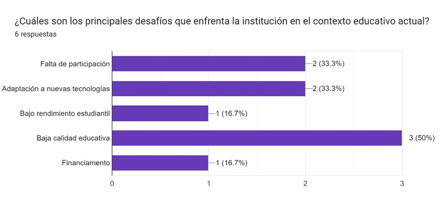
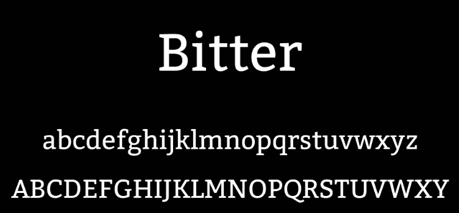
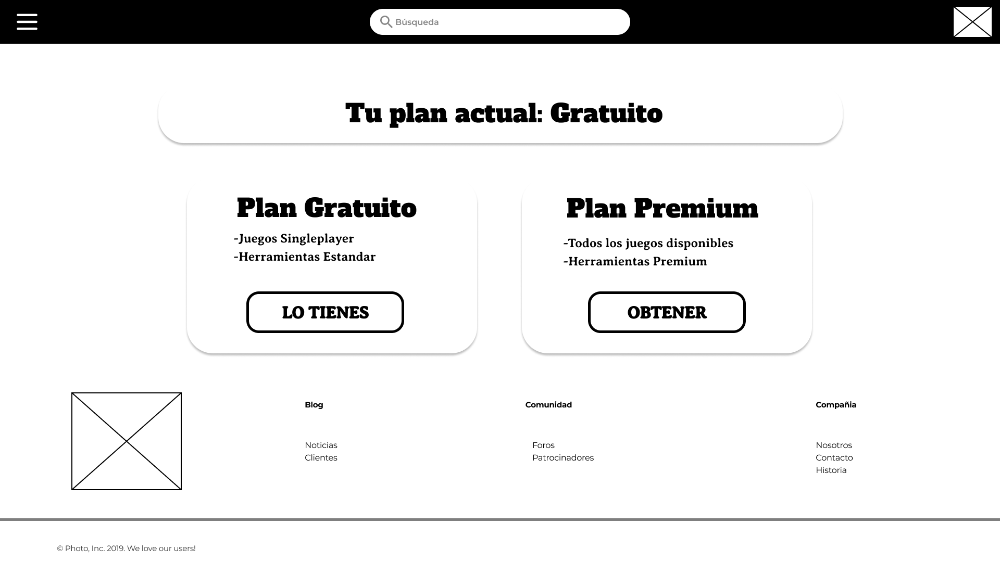
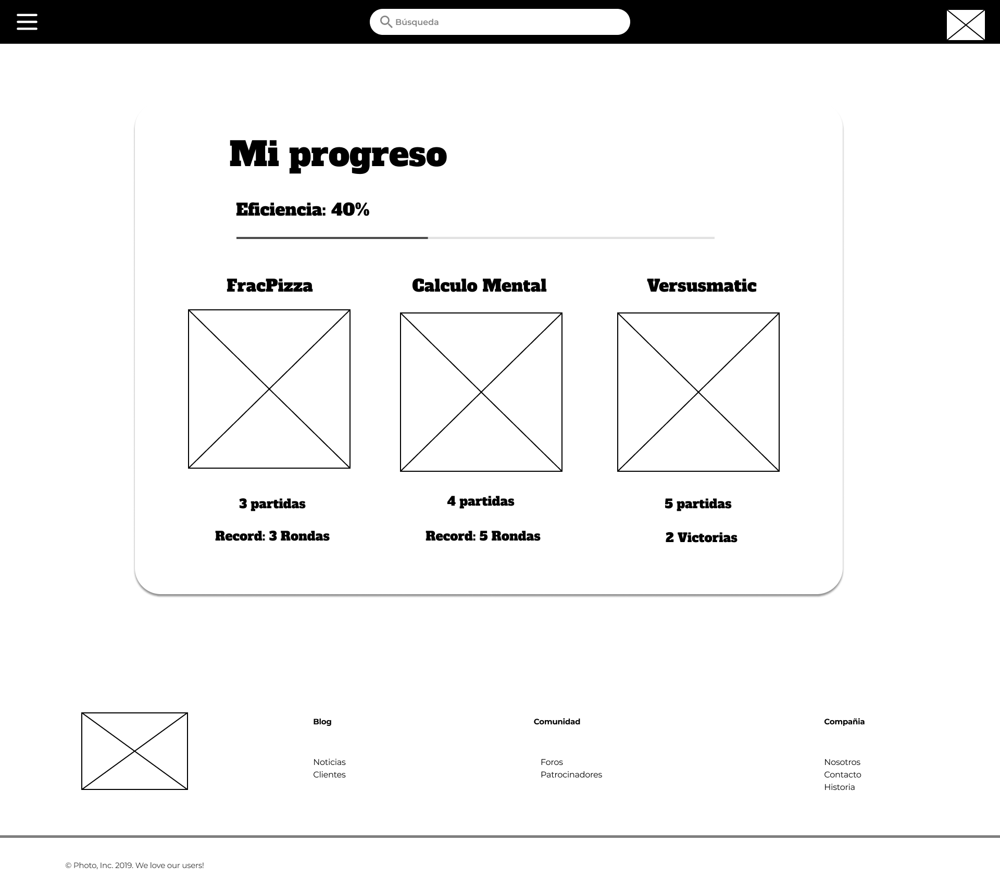
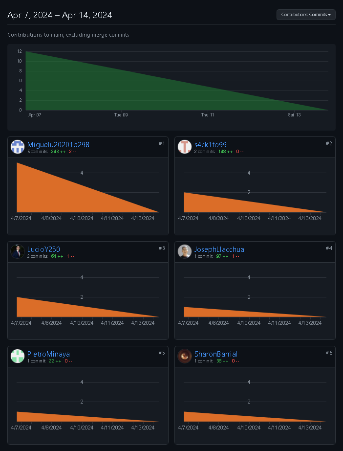
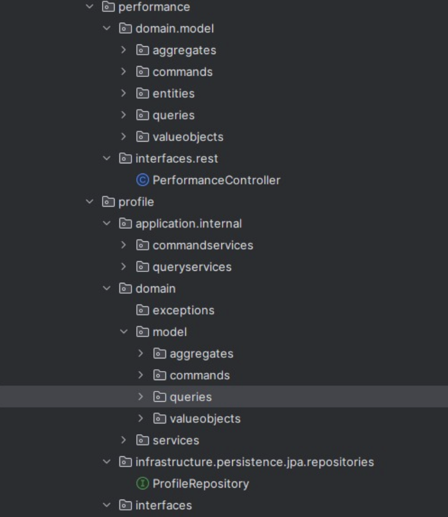

Universidad Peruana de Ciencias Aplicadas

Carrera: Ingeniería de Software

Ciclo: 2024-01

Curso: Desarrollo de Aplicaciones Open Source

Sección: WX52

Profesor: Elio Jefferrson Navarrete Vilca

Informe del Trabajo Final

Startup: 2squareD

Producto: MathPlayOpen

Integrantes:
- Barrial Marin, Sharon Antuanet Ivet - U202114900
- Carpio Cornejo, Miguel Ángel - U20221C360
- Llacchua Peralta, Joseph Ulysses - U202317002
- Minaya Mundines, Pietro Gerardo - U201718387
- Ybañez Esquerre, Miguel Angel - U20201B298
- Yen Cerna, Lucio Heli - U202213143

Junio del 2024

---
# Registro de Versiones del Informe

<table>
  <thead>
    <tr>
      <th>Versión</th>
      <th>Fecha</th>
      <th>Autor</th>
      <th>Descripción de la modificación</th>
    </tr>
  </thead>
  <tbody>
    <tr>
      <td>1.00 - TB1</td>
      <td>14/04/2024</td>
      <td>Barrial Marin, Sharon Antuanet Ivet - Carpio Cornejo, Miguel Angel - Llacchua Peralta, Joseph Ulysses - Minaya Mundines, Pietro Gerardo - Ybañez Esquerre, Miguel Angel - Yen Cerna, Lucio Heli</td>
      <td>Desarrollo del capítulo I, capítulo II, capítulo III, capítulo IV, capítulo V y Sprint 1: Landing Page.</td>
    </tr>
        <tr>
      <td>2.00 - TP</td>
      <td>03/05/2024</td>
      <td>Barrial Marin, Sharon Antuanet Ivet - Carpio Cornejo, Miguel Angel - Llacchua Peralta, Joseph Ulysses - Minaya Mundines, Pietro Gerardo - Ybañez Esquerre, Miguel Angel - Yen Cerna, Lucio Heli</td>
      <td>Subsanación de errores del Student Outcome, capítulo II: Entrevistas y análisis, capítulo II: User Stories, Product Backlog; capítulo IV: Wireframes, Mockups, User Flow, Diagramas C4, diagrama de base de datos y diagrama de clases; capítulo V: Source Code Management; y Landing Page. Desarrollo del Sprint 2: Frontend.</td>
    </tr>
        <tr>
      <td>3.00 - TB2</td>
      <td>09/06/2024</td>
      <td>Barrial Marin, Sharon Antuanet Ivet - Carpio Cornejo, Miguel Angel - Llacchua Peralta, Joseph Ulysses - Minaya Mundines, Pietro Gerardo - Ybañez Esquerre, Miguel Angel - Yen Cerna, Lucio Heli</td>
      <td>Mejora del Sprint 2 en cuánto código y documentación. Desarrollo y revisión del Sprint 3.</td>
    </tr>
    <tr>
    <td>4.00 - TF</td>
    <td>25/06/2024</td>
          <td>Barrial Marin, Sharon Antuanet Ivet - Carpio Cornejo, Miguel Angel - Llacchua Peralta, Joseph Ulysses - Minaya Mundines, Pietro Gerardo - Ybañez Esquerre, Miguel Angel - Yen Cerna, Lucio Heli</td>
      <td>Mejora del Sprint 3 en cuánto código y documentación. Desarrollo y revisión del Sprint 4 y conclusión del proyecto.</td>
    </tr>
  </tbody>
</table>


---
# Project Report Collaboration Insights

Se han realizado todas las tareas asignadas para la entrega TF, las cuales se encuentran registradas en el repositorio de Github de la organización del equipo bajo el enlace ["upc-pre-202401--si729-WX52-2SquareD-report"](https://github.com/OpenSourceWX52-2024/upc-pre-202401--si729-WX52-2SquareD-report/tree/main). Para elaborar el informe, cada miembro ha redactado y creado gráficos en formato Markdown según los puntos asignados, realizando commits para registrar el avance en el repositorio.

---
# Student Outcome

El curso contribuye al cumplimiento del Student Outcome ABET: **ABET – EAC - Student Outcome 3** <br> Criterio: *Capacidad de comunicarse efectivamente con un rango de audiencias.*

En el siguiente cuadro se describe las acciones realizadas y enunciados de conclusiones por parte del grupo, que permiten sustentar el haber alcanzado el logro del ABET – EAC - Student Outcome 3.

<table>
  <thead>
    <tr>
      <th>Criterio específico</th>
      <th>Acciones realizadas</th>
      <th>Conclusiones</th>
    </tr>
  </thead>
  <tbody>
    <tr>
      <td>Comunica oralmente sus ideas y/o resultados con objetividad a público de diferentes especialidades y niveles jerarquicos, en el marco del desarrollo de un proyecto en ingeniería.</td>
      <td>
        <ul>
          <li>Carpio Cornejo, Miguel Ángel:
            <ul>
              <li><strong>TB1:</strong> Realizó entrevistas al segmento objetivo, compartió ideas del proyecto con el público objetivo y recopiló información para priorizar las características del producto.</li> <li><strong>TP: </strong> Para la entrega parcial, las reuniones del grupo comenzaron enfocándose en los puntos de mejora del Sprint 1 y de las reflexiones que sacabamos como conclusión. Una vez identificados todos los puntos que podrían tener mejor calidad, se separó equilibradamente las correciones para que el avance del proyecto no se vea afectado. Una vez finalizadas las correciones, se llevó a cabo una Sprint Meeting que consistió en ordenar al equipo para ejecutar este sprint de la mejor manera posible. Gracias a la comunicación oral del equipo, pudimos conocer las tareas que cada uno podría desempeñar mejor y asignarlas respectivamente para foomentar un trabajo ágil colaborativo. Finalmente, se llevaron a cabo reuniones de revisión del Sprint para revisar en conjunto si es que existe algún error o un punto de mejora.</li>
              <li><strong>TB2: </strong></li> 
              <li><strong>TF:Para comunicar mis ideas y resultados de manera objetiva a diferentes audiencias, realicé entrevistas de validación, lo que me permitió recibir retroalimentación valiosa y ajustar el proyecto según las necesidades y expectativas de los usuarios. Además, implementé endpoints específicos para guardar y obtener la información necesaria para monitorear el progreso de los alumnos, garantizando así un seguimiento efectivo del rendimiento académico. El impacto esperado de este proyecto es motivar a los alumnos en sus cursos mediante una metodología lúdica y atractiva, utilizando juegos como herramienta educativa.</strong></li> 
            </ul>
          </li>
          <li>Miguel Ángel Ybañez Esquerre:
            <ul>
              <li><strong>TB1:</strong> Participó en el desarrollo del Sprint 1, gestionó el código fuente y realizó actividades de búsqueda de necesidades en colaboración con el equipo.</li>
		    <li><strong>TP:</strong> se respetó rigurosamente el diseño de domain design, asegurando la coherencia y consistencia en la arquitectura de la aplicación. Esta aproximación centrada en los dominios del negocio facilitó la escalabilidad y mantenibilidad del sistema a largo plazo, al tiempo que proporcionaba una base sólida para futuras iteraciones y expansiones del proyecto. En conjunto, la implementación de los componentes frontend durante el segundo sprint se llevó a cabo de manera disciplinada y orientada a resultados, contribuyendo significativamente al avance general del desarrollo del proyecto.</li> <li><strong>TB2: </strong>Se comunicaron las propuestas para las tareas del Sprint 3, los resultados de los avances diarios de los features delegados, y las propuestas para preguntas de entrevistas de validación. Además, se informó sobre el desarrollo del bounded context y se establecieron las fechas para hacer push de branches y realizar merges en la rama develop.</li>
            <li><strong>TF: </strong> Durante el desarrollo del proyecto, se corrigieron errores en el frontend y se implementaron mejoras en la base de datos junto a todo el equipo. Se aplicaron verificaciones en los campos de registro tanto en el login como en el sign up, y se crearon ramas para el correcto desarrollo de correcciones e implementaciones. Además, se realizaron modificaciones en los modelos que recibe el frontend.</li>    
            </ul>
          </li>
          <li>Pietro Gerardo Minaya Mundines: <ul><li><strong> TB1: </Strong>Estructura del informe en Markdown, Entrevista y Registro de Entrevista para Segmento Objetivo 1, Capitulo 4.6 Software Architecture C4 Model. Repositorio, Creacion y Despliegue del Landing Page</li> <li><strong>TP: </strong> Para la entrega parcial, las reuniones del grupo comenzaron enfocándose en los puntos de mejora del Sprint 1 y de las reflexiones que sacabamos como conclusión. Una vez identificados todos los puntos que podrían tener mejor calidad, se separó equilibradamente las correciones para que el avance del proyecto no se vea afectado. Una vez finalizadas las correciones, se llevó a cabo una Sprint Meeting que consistió en ordenar al equipo para ejecutar este sprint de la mejor manera posible. Gracias a la comunicación oral del equipo, pudimos conocer las tareas que cada uno podría desempeñar mejor y asignarlas respectivamente para foomentar un trabajo ágil colaborativo. Finalmente, se llevaron a cabo reuniones de revisión del Sprint para revisar en conjunto si es que existe algún error o un punto de mejora.</li><li>TB2:La realización del bounded context de games consistio en entender sus funcionamiento e interrelacion entre todo los bounded context. Paralelamente, se llevaron a cabo correcciones y adiciones de vistas en el frontend para mejorar la interfaz de usuario. Además, se realizaron pruebas de aceptación de los features relacionados con las historias de usuario del backend.</li>
          <li><strong>TF: </strong></li>
          </ul>
          <li>Yen Cerna, Lucio Heli:
            <ul>
              <li><strong>TB1:</strong> Tras una gran cantidad de reuniones que permitieron encaminar al grupo hacia el objetivo, se pudo lograr un incremento que cumple con las expectativas del Sprint 1. En mi caso, realicé entrevistas que recopilaron información importante, coordiné con mis compañeros la organización de trabajo y los guié para entregar la mayor calidad posible en el proyecto. La comunicación fue fundamental en el equiipo de trabajo debido a que de esta manera todo el grupo pudo identificar lo que los clientes necesitan y pudimos mantener una sola idea en el desarrollo del producto.</li>
              <li><strong>TP: </strong> Para la entrega parcial, las reuniones del grupo comenzaron enfocándose en los puntos de mejora del Sprint 1 y de las reflexiones que sacabamos como conclusión. Una vez identificados todos los puntos que podrían tener mejor calidad, se separó equilibradamente las correciones para que el avance del proyecto no se vea afectado. Una vez finiquitadas las correciones, se llevó a cabo una Sprint Meeting que consistió en ordenar al equipo para ejecutar este sprint de la mejor manera posible. Gracias a la comunicación oral del equipo, pudimos conocer las tareas que cada uno podría desempeñar mejor y asignarlas respectivamente para foomentar un trabajo ágil colaborativo. Finalmente, se llevaron a cabo reuniones de revisión del Sprint para revisar en conjunto si es que existe algún error o un punto de mejora.</li><li>TB2: Para la entrega número 2, la coordinación de grupo fue importante para seguir con el desarrollo del proyecto. Al ya saber el velocity del equipo, la coordinación fue más sencilla tras saber la metodolgía del grupo. Una vez identificados todos los puntos que podrían tener mejor calidad, se separó equilibradamente las correciones para que el avance del proyecto no se vea afectado. Una vez finiquitadas las correciones, se llevó a cabo una Sprint Meeting que consistió en ordenar al equipo para ejecutar este sprint de la mejor manera posible. Gracias a la comunicación oral del equipo, pudimos conocer las tareas que cada uno podría desempeñar mejor y asignarlas respectivamente para foomentar un trabajo ágil colaborativo. Uno de los aspectos más importantes que se tuvo que comunicar fue la repartición/afinamiento de bounded context</li> 
              <li><strong>TF: A modo de conclusión del proyecto, el grupo se retroalimentó de la última entrega y estableció los requerimientos que añadirían más valor al producto final, para entregar el mejor incremento posible. Tras ello, se separó el equipo por habilidades y se llevó a cabo el desarrollo del sprint 4. En mi caso, se me asignó la responsabilidad del desarrollo del front end de la aplicación de tal manera que todas las views estén implementadas. La comunicación del equipo fue contínua puesto que avanzamos el desarrollo en conjunto, gracias a ello, avanzamos de forma eficiente y nos complementamos para implementar distintas funcionalidades.</strong></li>
            </ul>
          </li>
          <li>Llacchua Peralta Joseph Ulysses:
            <ul>
              <li><strong>TB1:</strong> Participé en el proyecto como parte de un equipo multidisciplinario con eficacia, eficiencia y objetividad. Durante mi contribución, destacé en la implementación colaborativa y el despliegue exitoso de la Landing Page y el diseño de la aplicación web, cumpliendo con los requisitos del backlog y los objetivos del sprint.</li>
              <li><strong>TP: </strong> Tuve la oportunidad de trabajar en el campo de la investigación y diseño de productos tecnológicos. Durante mi participación en el proyecto, me enfoqué en la fase inicial de investigación, realizando entrevistas y análisis de las mismas para comprender las necesidades y deseos de los usuarios. A partir de estos hallazgos, desarrollé wireframes y formularios para estructurar la información obtenida y guiar el proceso de diseño. Mi contribución ayudó a establecer una base sólida para el desarrollo de soluciones centradas en el usuario.</li><li>TB2: En esta entrega del proyecto, tuve la oportunidad de ampliar mis conocimientos y habilidades técnicas. Pude aprender a utilizar Spring Boot, una popular framework de Java, para desarrollar las APIs de mensajería. Esto me permitió construir soluciones que facilitaban la comunicación entre los usuarios del sistema.</li>
              <li><strong>TF:</strong>Para esta entrega, se ha implementado el bounded context de IAM en el backend. Como resultado, se ha actualizado el frontend para que sea compatible con las nuevas verificaciones, y se han realizado mejoras para que los mensajes de la plataforma sean uniformes. </li>
            </ul>
          </li>
          <li>Barrial Marin, Sharon Antuanet Ivet:
            <ul>
              <li><strong>TB1:</strong> Participó en el desarrollo del Sprint 1, gestionó el código fuente y realizó actividades correspondientes al Lean UX Assumptions, As-is scenario mapping, to-be scenario mapping, epics, user stories y class diagrams con su respectivo class dictionary</li>
		    <li><strong>TP:</strong> La información desarrollada en el sprint Sprint Planning 2 y  El Sprint Backlog 2  fue crucial para evaluar el progreso alcanzado y tomar decisiones informadas sobre los siguientes pasos a seguir. Además, se fomentó la colaboración activa entre los miembros del equipo, aprovechando las oportunidades para compartir conocimientos y experiencias que enriquecieran el proceso de desarrollo. En resumen, el segundo sprint se caracterizó por una planificación meticulosa, una ejecución eficiente y una colaboración efectiva, sentando así las bases para el éxito continuo del proyecto.</li>
            <li><strong>TB2:</strong>La realización parcial del backend perteneciente al bounded context de performance implicó reconocer las funcionalidades esenciales que permiten gestionar y optimizar el rendimiento del estudiante en el ambito academico. Paralelamente, se llevaron a cabo correcciones y adiciones de vistas en el frontend para mejorar la interfaz de usuario. Además, se realizaron pruebas de aceptación de los features relacionados con las historias de usuario del backend.</li>
            <li><strong>TF: </strong> Se realizó la implementación del endpoint score dentro del backend para el bounded context de performance, permitiendo calcular y devolver puntuaciones de rendimiento a través de un método POST. Se revisó y actualizó el product backlog, priorizando y documentando cada historia de usuario con sus criterios de aceptación claros. Se desarrollaron casos de prueba usando Gherkin, asegurando que los escenarios de cálculo de puntuación con datos válidos e inválidos estén bien cubiertos. Además, se generó evidencia detallada de los procedimientos de despliegue tanto del front como del backend, garantizando que todos los componentes funcionen correctamente en producción. </li>
            </ul>
          </li>
        </ul>
      </td>
      <td><li><strong>TB1:</strong> 
La asignación individual de tareas permitió que cada miembro se concentrara en un área específica, lo que resultó en una finalización exitosa de todas las responsabilidades asignadas que constituían el contexto del proyecto y el diseño de la plataforma web y landing page. Al concluir, cada miembro del equipo pudo comunicar sus ideas de manera efectiva durante las interacciones verbales, demostrando habilidades de comunicación objetiva y clara con audiencias de diversas especialidades y niveles jerárquicos, en línea con el criterio evaluado de comunicación oral en el contexto de un proyecto de ingeniería. Para que el grupo se comunicara de manera virtual se emplearon diversas herramientas como Discord, Whatsapp, Trello, entre otros. Por último, se utilizó github Desktop, Visual Studio Code y JetBrains WebStorm para el desarrollo colaborativo del reporte y  del Sprint 1.</li> <br> <br> <li><strong> TP:</strong> En el marco de una entrega tan importante como la entrega parcial, el grupo decidió juntarse tras el feedback brindado para reflexionar sobre la primera entrega y hallar los puntos de mejoria. Tras ello, se llevaron a cabo las correciones del proyecto para posteriormente coomenzar con el desarrollo del Sprint 2. En consideración con este sprint, se coordinó de manera oral las actividades que realizaría cada miembro dependiendo de sus habilidades fomentando un desarrollo ágil y eficiente. En síntesis, el equipo cumple con el student outcome al  comunicarse oralmente sobre las correciones, reflexiones, coordinaciones y entre otros para seguir con el desarrollo del Sprint 2.</li> <li><strong>TB2: </strong>La realización del backend y el reconocimiento e interpretación de los endpoints a implementar para esta entrega, aunque fue parcial, fue excelente para cumplir con el requisito propuesto para esta penúltima etapa. Además, las correcciones hechas en el frontend mejoraron significativamente la experiencia del usuario, lo que fue fundamental para cumplir con el Student Outcome. Estas mejoras no solo optimizaron la funcionalidad y usabilidad del sistema, sino que también sentaron una base sólida para los desarrollos futuros y aseguraron que los objetivos de la etapa se alcanzaran con éxito.</li>
<li><strong>TF: El desarrollo de este proyecto no solo nos permitió alcanzar los objetivos técnicos y de ingeniería planteados, sino que también fortaleció nuestras habilidades de comunicación multidimensional. A través de una planificación meticulosa y la adaptación de nuestras presentaciones a diferentes audiencias, hemos demostrado nuestra capacidad para comunicar ideas y resultados con objetividad, asegurando una comprensión clara y efectiva por parte de todos los stakeholders involucrados. Este enfoque ha sido crucial para el éxito del proyecto y ha subrayado la importancia de la comunicación en el marco del desarrollo de proyectos en ingeniería. </strong></li></td>  
    </tr>
    <tr>
      <td>Comunica en forma escrita ideas y/o resultados con objetividad a público de diferentes especialidades y niveles jerarquicos, en el marco del desarrollo de un proyecto en ingeniería.</td>
      <td>
        <ul>
          <li>Carpio Cornejo, Miguel Ángel:
            <ul>
              <li><strong>TB1:</strong> Lideró reuniones de avance donde comunicó de manera objetiva los resultados y progresos del proyecto a un público diverso, incluyendo miembros del equipo con diferentes puntos de vista y edades, así como stakeholders externos.</li>  <li><strong>TP:</strong> En el segundo sprint, se comunicaron las ideas reconocidas y desarrolladas en varios puntos clave. Como el Sprint Planning 2 permitió establecer las metas y prioridades para el periodo en cuestión, definiendo claramente las tareas a realizar. El Sprint Backlog 2 para organizar y gestionar el trabajo asignado a cada miembro del equipo, garantizando así un avance fluido y eficiente del proyecto. Durante el proceso de desarrollo, se dedicó especial atención a recopilar evidencia relevante para la Revisión del Sprint, incluyendo pruebas de funcionalidad y rendimiento, así como documentación detallada de los servicios y despliegue de software. Esta información fue crucial para evaluar el progreso alcanzado y tomar decisiones informadas sobre los siguientes pasos a seguir.</li><li><strong>TB2: </strong></li>
              <li><strong>TF: </strong></li>
            </ul>
          </li>
          <li>Miguel Ángel Ybañez Esquerre:
            <ul>
              <li><strong>TB1:</strong> Se analizaron las convenciones de código para el desarrollo correcto de características, landing pages y próximamente la aplicación web. Se elaboraron los wireframes y mockups de las páginas de destino, así como la guía de estilos.</li>
	<li><strong>TP:</strong> Durante el transcurso del segundo sprint, se llevó a cabo la implementación de los componentes esenciales para el frontend del proyecto. Este proceso implicó la traducción de los diseños y especificaciones en código funcional y estéticamente atractivo para el usuario final. Se prestaron especial atención a los detalles de usabilidad y experiencia de usuario, garantizando así que la interfaz fuera intuitiva y fácil de navegar. Además, se adoptó una metodología de desarrollo basada en el uso correcto de branches, siguiendo fielmente el flujo de trabajo establecido por Gitflow. Esta práctica permitió una gestión eficiente del código, facilitando la colaboración entre los miembros del equipo y minimizando el riesgo de conflictos durante el proceso de integración. </li>   
    <li><strong>TB2: </strong>Se redactaron las propuestas para el desarrollo del feature delegado en Web Services, así como las correcciones y adiciones para Web Applications, y se compartieron con todo el equipo para su verificación. Además, se documentaron los commits realizados. Se informó al equipo sobre los avances en sus respectivas branches y se comunicaron los pasos para desplegar la nueva versión de Web Applications.</li>
        <li><strong>TF: </strong>A lo largo del proyecto, se documento de manera detallada las mejoras e implementaciones de correcion. Distribuyendo asi las tareas para cada miembro del equipo segun de especialidad y velocidad en el desarrollo. Se hizo saber si las implementaciones fueron realizadas por el integrante, manteniendo asi una comunicacion continua.
        </li>
            </ul>
          </li>
          <li>Llacchua Peralta Joseph Ulysses:
            <ul>
              <li><strong>TB1:</strong> He tenido la oportunidad de trabajar en el sector empresarial de soluciones de software, donde he destacado en áreas como el diseño de experiencia de usuario (UX) y la especificación de requisitos. Durante mi participación en el proyecto, pude identificar problemáticas y aplicar un proceso de UX Design basado en Lean UX. Realicé investigaciones de UX Research para establecer User Personas, Task Matrix y Journey Maps, integrándolos en el diseño del Landing Page y las Web Apps.</li>
            <li><strong>TP:</strong>Durante la realización de este proyecto, me comprometí a diseñar mockups para ordenador, cuidando la selección de colores, texturas y tamaños. Además, llevé a cabo entrevistas adicionales y realicé sus respectivos análisis para profundizar en la comprensión de las necesidades de los usuarios.</li> <li><strong>TB2:</strong> Para esta entrega del proyecto, se implementó una estrategia para mejorar la gestión y planificación del trabajo en equipo. Específicamente, se realizó una distribución detallada del boudent context a fin de facilitar la planificación de las tareas del sprint.</li>
            <li><strong>TF:</strong>En esta cuarta entrega, se integraron servicios IAM para el registro y el inicio de sesión en el frontend, y se documentaron las mejoras realizadas en el backend y frontend durante el Sprint 4. Además, se actualizaron el diseño de la base de datos y los diagramas de clases. Se añadieron las conclusiones y recomendaciones, abarcando todo el trabajo realizado desde el Sprint 1 hasta el Sprint 4.</li>
            </ul> 
          </li>
          <li>Pietro Gerardo Minaya Mundines: <ul><li><strong>TB1:</strong>Software Architecture Context Diagram, Software Architecture Context Diagram, Software Architecture Container Diagrams, Software Architecture Components Diagrams, Creacion Landing Page, Codificacion Landing Page y Despliegue Landing Page.</li> <li><strong>TP:</strong> En el segundo sprint, se comunicaron las ideas reconocidas y desarrolladas en varios puntos clave. Como el Sprint Planning 2 permitió establecer las metas y prioridades para el periodo en cuestión, definiendo claramente las tareas a realizar. El Sprint Backlog 2 para organizar y gestionar el trabajo asignado a cada miembro del equipo, garantizando así un avance fluido y eficiente del proyecto. Durante el proceso de desarrollo, se dedicó especial atención a recopilar evidencia relevante para la Revisión del Sprint, incluyendo pruebas de funcionalidad y rendimiento, así como documentación detallada de los servicios y despliegue de software. Esta información fue crucial para evaluar el progreso alcanzado y tomar decisiones informadas sobre los siguientes pasos a seguir.</li> <li><strong>TB2: </strong>Durante la TB2, realicé las correciones respectivas en documentación y frontend. Me involucrado en la organización de carpetas del backend y en el deployment el que desplegar nuestro producto. Gracias a estos aportes, mi participación en el equipo tuvo un impacto considerable.</li><li><strong>TF: </strong></li>
         </ul>
          <li>Yen Cerna, Lucio Heli:
            <ul>
              <li><strong>TB1:</strong> Durante el proyecto, documenté efectivamente diferentes secciones como el LEAN UX CANVAS, El Ubiquitous language que es fundamental para comunicarse con los stakeholders, las epics y user stories, el impact mapping y la arquitectura de información de la plataforma web y landing page. De esta manera, he podido aportar en el desarrollo del proyecto de forma escrita incorporando información vital para el desarrollo del producto a nivel de usuario y a nivel de estructura</li>
              <li><strong>TP: </strong>Durante la TP, corregí los errores identificados en el Sprint Review, además, agregue documentación de calidad en las entrevistas, User Stories, los Wireframes, Userflows, Mockups, Wireflows y prototyping. Mi aporte en este proyecto ha tenido un impactoo positivo puesto que alimenté la documentación del proyecto brindando información que refleja mayor entendimiento y permite comunicar el propósito de nuestr product a los interesados del negocio.</li> <li><strong>TB2: </strong> Durante la TB2, realicé las correciones respectivas en documentación y frontend. Estuve involucrado en la organización de carpetas del backend y en el deployment para que desplegar nuestro producto. Gracias a estos aportes, mi participación como equipo fue de buen impacto.</li><li><strong>TF: Mi participación en el equipo constó de ser un facilitador que fomente la comunicación continua y dar apoyo en la toma de decisiones. Estuve involucrado en el desarrollo de bounded context, características y diseño de vistas, entre otros requerimientos que añadieron valor al producto final </strong></li>
            </ul>
          </li>
          <li>Barrial Marin, Sharon Antuanet Ivet:
            <ul>
              <li><strong>TB1:</strong> Análisis y comparación de los registros de entrevistas, junto con los assumptions y la retroalimentación.</li>
              <li><strong>TP:</strong> En el segundo sprint, se comunicaron las ideas reconocidas y desarrolladas en varios puntos clave. Como el Sprint Planning 2 permitió establecer las metas y prioridades para el periodo en cuestión, definiendo claramente las tareas a realizar. El Sprint Backlog 2 para organizar y gestionar el trabajo asignado a cada miembro del equipo, garantizando así un avance fluido y eficiente del proyecto. Durante el proceso de desarrollo, se dedicó especial atención a recopilar evidencia relevante para la Revisión del Sprint, incluyendo pruebas de funcionalidad y rendimiento, así como documentación detallada de los servicios y despliegue de software. Esta información fue crucial para evaluar el progreso alcanzado y tomar decisiones informadas sobre los siguientes pasos a seguir.</li> <li><strong>TB2: </strong>La comunicación asertiva fue clave para la repartición eficiente de los bounded contexts, asegurando que cada miembro del equipo comprendiera claramente sus responsabilidades y las interdependencias entre las distintas áreas del proyecto. Además, creamos un video sobre el equipo para compartir nuestras reflexiones como grupo, lo que fomentó la cohesión y permitió una autoevaluación constructiva de nuestro trabajo y dinámicas de colaboración. Durante la exposición del Sprint 3 y la Sprint Review, presentamos los avances logrados, discutimos los desafíos encontrados y recopilamos feedback valioso, permitiendo ajustes precisos y mejoras continuas en el desarrollo del proyecto.</li>
              <li><strong>TF: </strong> Se llevaron a cabo entrevistas detalladas para la validación del sitio web, enfocadas en el segmento objetivo de estudiantes. Durante este proceso, se registraron y analizaron minuciosamente las respuestas obtenidas para identificar áreas de mejora y confirmar la satisfacción del usuario. Además, se produjo el video "About the Team", en el cual compartimos nuestras reflexiones tanto a nivel personal como grupal. Este video también incluyó una revisión exhaustiva del sprint más reciente, destacando los logros y aprendizajes obtenidos durante esta última entrega. Finalmente, se expusieron los resultados completos del trabajo final, proporcionando una visión integral de los esfuerzos y resultados alcanzados por el equipo.</li>
            </ul>
          </li>
        </ul>
      </td>
      <td><li><strong>TB1:</strong> 
Durante este sprint, cada miembro del equipo se dedicó de manera focalizada al desarrollo de las tareas escritas asignadas para esta fase que documentaban el contexto y diseño del proyecto relacionando los conceptos con el sector correspondiente, lo que garantizó un progreso significativo y eficiente en el proyecto. Posteriormente, cada integrante compartió formalmente sus contribuciones por escrito, lo que resultó en una presentación unificada y clara de nuestros avances mediante Github Desktop y otros medios de comunicación. Esta práctica aseguró que las ideas y resultados se comunicaran de manera objetiva y comprensible a un público diverso, incluidos aquellos con diferentes especialidades y niveles jerárquicos. Este enfoque en la comunicación escrita demostró una habilidad efectiva para transmitir información técnica y compleja de manera accesible, cumpliendo así con el criterio evaluado de comunicación escrita en el contexto del desarrollo de un proyecto en ingeniería. Además, el equipo de trabajo avanzó de forma pareja con una meta en común lo cuál logró que cada aporte sea beneficioso para el desarrollo.</li> <br> <br> <li><strong> TP:</strong> Durante este Sprint, cada miembro del equipó brindo documentación de calidad que permitió alimentar la articulación del proyecto, por otro lado, existió comunicación oral para desarrollar el código de la plataforma web mediante Github Desktop permitiendo al grupo trabajar de forma asíncrona mediante un desarrollo iterativo. Igualmente, hubo comunicación escrita en el código del proyecto para que todos los miembros del equipo puedan conocer todas las funcionalidades implementadas mediante breves explicación en forma de comentarios o en descripciones de los commits registrados en el repositorio donde está alojado el proyecto. En síntesis, se cumplió el criterio del student outcome de manera que el grupo pudo brindar documentación de mayor calidad a los interesados del negocio y pudo comunicarse mediante explicaciones para entender y seguir desarrollando el proyecto</li> <li><strong>TB2: </strong>La elaboración de nuestras entrevistas fue crucial para transmitir a nuestro usuario el propósito, la finalidad y los beneficios de nuestro proyecto. Además, la exposición clara y precisa de lo logrado en el video sobre el producto mostró que se cumplieron los objetivos de esta entrega. Asimismo, la exposición de nuestras reflexiones, tanto individuales como grupales, nos ayudó a identificar formas de mejorar nuestro funcionamiento como equipo, cumpliendo con el punto del Student Outcome correspondiente. Estas acciones no solo demostraron nuestro progreso, sino que también reforzaron nuestra capacidad de comunicación y colaboración efectiva.</li>
<li><strong>TF: El desarrollo de este proyecto ha subrayado la importancia de la comunicación escrita objetiva y clara, especialmente en el ámbito de la ingeniería donde los proyectos involucran a personas de diversas especialidades y niveles jerárquicos. A través de una documentación meticulosa, informes periódicos y resúmenes ejecutivos bien elaborados, hemos demostrado nuestra capacidad para comunicar ideas y resultados de manera efectiva. Este enfoque no solo ha facilitado la comprensión y el apoyo de todos los stakeholders, sino que también ha contribuido al éxito general del proyecto, asegurando que todos los participantes estuvieran alineados y bien informados en cada etapa del desarrollo.</strong></li>
</td>
   </tr>
  </tbody>
</table>


---
# Contenido 
## Tabla de contenidos

### [Capítulo I: Introducción]()
- [1.1. Startup Profile]()
    - [1.1.1 Descripción de la Startup]()
    - [1.1.2 Perfiles de integrantes del equipo]()
- [1.2 Solution Profile]()
    - [1.2.1 Antecedentes y problemática]()
    - [1.2.2 Lean UX Process]()
        - [1.2.2.1. Lean UX Problem Statements]()
        - [1.2.2.2. Lean UX Assumptions]()
        - [1.2.2.3. Lean UX Hypothesis Statements]()
        - [1.2.2.4. Lean UX Canvas]()
- [1.3. Segmentos objetivo]()

### [Capítulo II: Requirements Elicitation & Analysis]()
- [2.1. Competidores]()
    - [2.1.1. Análisis competitivo]()
    - [2.1.2. Estrategias y tácticas frente a competidores]()
- [2.2. Entrevistas]()
    - [2.2.1. Diseño de entrevistas]()
    - [2.2.2. Registro de entrevistas]()
    - [2.2.3. Análisis de entrevistas]()
- [2.3. Needfinding]()
    - [2.3.1. User Personas]()
    - [2.3.2. User Task Matrix]()
    - [2.3.3. User Journey Mapping]()
    - [2.3.4. Empathy Mapping]()
    - [2.3.5. As-is Scenario Mapping]()
- [2.4. Ubiquitous Language]()

### [Capítulo III: Requirements Specification]()
- [3.1. To-Be Scenario Mapping]()
- [3.2. User Stories]()
- [3.3. Impact Mapping]()
- [3.4. Product Backlog]()


### [Capítulo IV: Product Design]()
- [4.1. Style Guidelines]()
    - [4.1.1. General Style Guidelines]()
    - [4.1.2. Web Style Guidelines]()
- [4.2. Information Architecture]()  
    - [4.2.1. Organization Systems]()
    - [4.2.2. Labeling Systems]()
    - [4.2.3. SEO Tags and Meta Tags]()
    - [4.2.4. Searching Systems]()
    - [4.2.5. Navigation Systems]()
- [4.3. Landing Page UI Design]()
    - [4.3.1. Landing Page Wireframe]()
    - [4.3.2. Landing Page Mock-up]()
- [4.4. Web Applications UX/UI Design]()
    - [4.4.1. Web Applications Wireframes]()
    - [4.4.2. Web Applications Wireflow Diagrams]()
    - [4.4.3. Web Applications Mock-ups]()
    - [4.4.4. Web Applications User Flow Diagrams]()
- [4.5. Web Applications Prototyping]()
- [4.6. Domain-Driven Software Architecture]()
    - [4.6.1. Software Architecture Context Diagram]()
    - [4.6.2. Software Architecture Container Diagrams]()
    - [4.6.3. Software Architecture Components Diagrams]()
- [4.7. Software Object-Oriented Design]()
    - [4.7.1. Class Diagrams]()
    - [4.7.2. Class Dictionary]()
- [4.8. Database Design]()
    - [4.8.1. Database Diagram]()


### [Capítulo V: Product Implementation, Validation & Deployment]()
- [5.1. Software Configuration Management]()
    - [5.1.1. Software Development Environment Configuration]()
    - [5.1.2. Source Code Management]()
    - [5.1.3. Source Code Style Guide & Conventions]()
    - [5.1.4. Software Deployment Configuration]()
- [5.2. Landing Page, Services & Applications Implementation]()
    - [5.2.1. Sprint 1]()
        - [5.2.1.1. Sprint Planning 1]()
        - [5.2.1.2. Sprint Backlog 1]()
        - [5.2.1.3. Development Evidence for Sprint Review]()
        - [5.2.1.4. Testing Suite Evidence for Sprint Review]()
        - [5.2.1.5. Execution Evidence for Sprint Review]()
        - [5.2.1.6. Services Documentation Evidence for Sprint Review]()
        - [5.2.1.7. Software Deployment Evidence for Sprint Review]()
        - [5.2.1.8. Team Collaboration Insights during Sprint]()
    - [5.2.2. Sprint 2]()
        - [5.2.2.1. Sprint Planning 2]()
        - [5.2.2.2. Sprint Backlog 2]()
        - [5.2.2.3. Development Evidence for Sprint Review]()
        - [5.2.2.4. Testing Suite Evidence for Sprint Review]()
        - [5.2.2.5. Execution Evidence for Sprint Review]()
        - [5.2.2.6. Services Documentation Evidence for Sprint Review]()
        - [5.2.2.7. Software Deployment Evidence for Sprint Review]()
        - [5.2.2.8. Team Collaboration Insights during Sprint]()
    - [5.2.3. Sprint 3]()
        - [5.2.3.1. Sprint Planning 3]()
        - [5.2.3.2. Sprint Backlog 3]()
        - [5.2.3.3. Development Evidence for Sprint Review]()
        - [5.2.3.4. Testing Suite Evidence for Sprint Review]()
        - [5.2.3.5. Execution Evidence for Sprint Review]()
        - [5.2.3.6. Services Documentation Evidence for Sprint Review]()
        - [5.2.3.7. Software Deployment Evidence for Sprint Review]()
        - [5.2.3.8. Team Collaboration Insights during Sprint]()
    - [5.2.4. Sprint 4]()
        - [5.2.4.1. Sprint Planning 4]()
        - [5.2.4.2. Sprint Backlog 4]()
        - [5.2.4.3. Development Evidence for Sprint Review]()
        - [5.2.4.4. Testing Suite Evidence for Sprint Review]()
        - [5.2.4.5. Execution Evidence for Sprint Review]()
        - [5.2.4.6. Services Documentation Evidence for Sprint Review]()
        - [5.2.4.7. Software Deployment Evidence for Sprint Review]()
        - [5.2.4.8. Team Collaboration Insights during Sprint]()
- [5.3. Validation Interviews]()
    - [5.3.1. Diseño de Entrevistas]()
    - [5.3.2. Registro de Entrevistas]()
    - [5.3.3. Evaluaciones según heurísticas]()
- [5.4. Video About-the-Product]()

---
# Capítulo I: Introducción
## 1.1. Startup Profile
### 1.1.1 Descripción de la Startup
2squareD: Transformando el Aprendizaje de las Matemáticas con MathPlayOpen

2squareD transforma el aprendizaje de las matemáticas. Con nuestra plataforma innovadora, MathPlayOpen, estamos cambiando la forma en que las personas interactúan con las matemáticas. En un mundo donde el dominio de estas habilidades es cada vez más crucial, nos enorgullece ofrecer una experiencia educativa accesible, dinámica y enriquecedora para personas de todas las edades y habilidades. Permita que nos sumerjamos en nuestra misión y visión, donde aspiramos a impactar positivamente el aprendizaje de las matemáticas en todo el pais.

<ins>**Misión:**</ins>
En 2squareD, nuestra misión es revolucionar la forma en que se aprenden las matemáticas, ofreciendo una experiencia educativa accesible, dinámica y enriquecedora a través de nuestra plataforma MathPlayOpen. Nos comprometemos a proporcionar a los usuarios de todas las edades herramientas interactivas y divertidas que fomenten el amor por las matemáticas y potencien su desarrollo académico.

<ins>**Visión:**</ins>
Nuestra visión en 2squareD es crear un mundo donde cada individuo tenga la oportunidad de dominar las habilidades matemáticas de manera significativa y gratificante. Buscamos convertirnos en líderes globales en educación matemática, ofreciendo una plataforma innovadora que trascienda las barreras tradicionales del aprendizaje y empodere a las personas para alcanzar su máximo potencial en el ámbito académico y profesional.

<ins>**Valores:**</ins>
1. **Excelencia Educativa:** Nos comprometemos a ofrecer contenido educativo de la más alta calidad, respaldado por métodos pedagógicos efectivos y actualizados.
2. **Innovación Continua:** Buscamos constantemente nuevas formas de mejorar y enriquecer la experiencia de aprendizaje de nuestros usuarios, mediante la incorporación de tecnologías emergentes y prácticas educativas innovadoras.
3. **Accesibilidad Universal:** Creemos en la importancia de hacer que el aprendizaje de las matemáticas sea accesible para todos, independientemente de su ubicación geográfica, nivel socioeconómico o habilidades previas.
4. **Empatía y Diversidad:** Valoramos la diversidad de perspectivas y experiencias, y nos esforzamos por crear un entorno inclusivo donde cada individuo se sienta valorado y respetado.
5. **Colaboración y Comunidad:** Reconocemos el poder del trabajo en equipo y la colaboración, tanto dentro de nuestra organización como con nuestros usuarios, educadores y socios estratégicos, para lograr un impacto positivo duradero en la educación matemática.

Con MathPlayOpen, en 2squareD estamos comprometidos a transformar el aprendizaje de las matemáticas en una experiencia emocionante, estimulante y verdaderamente transformadora para personas de todas las edades y habilidades.

### 1.1.2 Perfiles de integrantes del equipo


Nombre completo: Sharon Antuanet Ivet Barrial Marin

Código de estudiante: U202114900

Carrera: Ingeniería de Software

Acerca de mí: Soy una estudiante que se caracteriza por poseer cualidades como la perseverencia, el compañerismo y la comunicación interpersonal. Además de tener conocimientos en diversos lenguajes de programación (Python, C++, C#...), también tengo habilidades en la edición de fotos y videos, y en el enfoque al marketing digital. Espero que estas pocas cualidades sirvan como aporte al proyecto durante el presente ciclo y curso. 


Nombre completo: Miguel Angel Ybañez Esquerre

Código de estudiante: U20201B298

Carrera: Ingeniería de Software

Acerca de mí: Soy una persona amigable, me gusta hacer creación de contenido, y también me agrada el trabajo en equipo. Tengo experiencia en Frontend y Backend, he realizado proyectos para empresas pequeñas. Me especializo en la programación y tengo conocimientos en la creación de páginas web y videojuegos. Además de usar herramientas para edición de imágenes o videos.


Nombre completo: Joseph Ulysses Llacchua Peralta

Código de estudiante: U202317002

Carrera: Ingeniería de Software

Acerca de mí: Soy estudiante de Ingeniería de Software apasionado por la tecnología y el desarrollo de software. Me encanta explorar nuevas herramientas y técnicas para mejorar mis habilidades en programación y diseño de sistemas. Disfruto enfrentando desafíos y resolviendo problemas complejos mediante el desarrollo de soluciones innovadoras y eficientes. Mi objetivo es contribuir al avance de la industria del software y convertirme en un profesional altamente capacitado y comprometido con la excelencia en mi campo.


Nombre completo: Pietro Gerardo Minaya Mundines 

Código de estudiante: U201718387

Carrera: Ingeniería de Software

Acerca de mí: Soy un apasionado por la tecnologia y me apasiona el Ajedrez. 


Nombre completo: Lucio Heli Yen Cerna

Código de estudiante: U202213143

Carrera: Ingeniería de Software

Acerca de mí: Soy una persona líder, autodidacta y dedicada. Mis características me permiten tener un gran impacto en el trabajo en equipo debido a que siempre busco que todos los integrantes, entreguemos el mejor entregable posible y aprendamos durante el desarrollo del proyecto. Por otro lado, tengo conocimientos en C++, HTML, CSS, git bash, MsSql y MongoDB, los cuáles serán beneficiosos para cumplir con el Student Outcome y criterios de evaluación del curso. 


Nombre completo: Miguel Ángel Carpio Cornejo

Código de estudiante: U20221C360

Carrera: Ingeniería de Software

Acerca de mí: Soy estudiante de 5to ciclo en la Universidad Peruana de Ciencias Aplicadas, tengo conocimientos en lenguajes de programación como C++, C#, Python, HTML, Java, MySQL. Lo cual podré beneficiar en el progreso de nuestro trabajo de curso. 

## 1.2 Solution Profile
### 1.2.1 Antecedentes y problemática

En la actualidad, el aprendizaje de las matemáticas puede representar un desafío para muchos estudiantes debido a la falta de motivación y la dificultad para encontrar recursos educativos atractivos y efectivos. A menudo, los métodos tradicionales de enseñanza pueden resultar monótonos y poco estimulantes, lo que lleva a una falta de compromiso y participación por parte de los estudiantes.

Según El Comercio (2022), los resultados de la prueba PISA 2022 indicaron una disminución en el rendimiento académico de los estudiantes peruanos en matemáticas, con una reducción de nueve puntos en comparación con la evaluación anterior realizada hace cuatro años. Esto situó al país en el puesto 59 en la categoría de matemáticas, con un total de 391 puntos.

Esto resalta la urgencia de abordar las deficiencias en el aprendizaje de las matemáticas y promover enfoques innovadores para mejorar el rendimiento académico en esta área (El Comercio, 2022).

What: La falta de motivación y recursos educativos atractivos y efectivos, así como la disminución en el rendimiento académico en matemáticas según los resultados de la prueba PISA 2022, son las principales problemáticas identificadas.

Why: Los métodos tradicionales de enseñanza pueden resultar monótonos y poco estimulantes, lo que lleva a una falta de compromiso y participación por parte de los estudiantes. Además, la falta de recursos educativos efectivos puede contribuir al bajo rendimiento académico en matemáticas.

Who:Los estudiantes peruanos de primaria y secundaria son los principales involucrados en la problemática del bajo rendimiento académico en matemáticas, así como también sus padres y educadores que buscan herramientas educativas efectivas para apoyar su aprendizaje.

Where: Esta problemática se observa específicamente en el contexto educativo peruano, donde los estudiantes enfrentan desafíos en el aprendizaje de las matemáticas.

When: Los desafíos en el aprendizaje de las matemáticas y los resultados de la prueba PISA 2022 se están observando en la actualidad, lo que resalta la urgencia de abordar esta problemática.

How: Se identifica la necesidad de desarrollar un juego educativo de matemáticas en 2D que ofrezca una experiencia interactiva, motivadora y personalizable para ayudar a los estudiantes a mejorar sus habilidades matemáticas de manera efectiva y divertida.

How much: Aunque no se especifica una cantidad exacta, se reconoce que un porcentaje significativo de estudiantes peruanos enfrenta dificultades en el aprendizaje de las matemáticas y que el país ha experimentado una reducción en los resultados de la prueba PISA 2022 en esta área.

Cada estudiante tiene sus propias fortalezas, debilidades y ritmo de aprendizaje, por lo que es crucial proporcionar una experiencia de aprendizaje adaptativa que se ajuste a las necesidades individuales de cada usuario.

Por lo tanto, se identifica la necesidad de desarrollar un juego educativo de matemáticas en 2D que aborde estas problemáticas al ofrecer una experiencia interactiva, motivadora y personalizable que pueda ayudar a los estudiantes a mejorar sus habilidades matemáticas de manera efectiva y divertida.

### 1.2.2 Lean UX Process
#### 1.2.2.1. Lean UX Problem Statements
Segmento objetivo: Estudiantes de secundaria peruanos

Hemos observado que muchos estudiantes de secundaria en Perú enfrentan dificultades para comprometerse y progresar en el aprendizaje de las matemáticas. Esto se debe a la falta de recursos educativos interactivos y atractivos que aborden adecuadamente sus necesidades de aprendizaje. A menudo, los métodos tradicionales de enseñanza no logran captar su interés ni motivarlos para explorar y comprender conceptos matemáticos de manera efectiva. Este problema es especialmente significativo en entornos donde los recursos educativos son limitados o poco accesibles.

¿Cómo podríamos desarrollar una plataforma educativa innovadora y divertida que motive a los estudiantes de secundaria peruanos a mejorar sus habilidades matemáticas de una manera efectiva y accesible?

Segmento objetivo: Organizaciones e instituciones educativas

Hemos notado que las organizaciones e instituciones educativas que trabajan con estudiantes de secundaria en Perú carecen de herramientas digitales efectivas para mejorar la enseñanza y el aprendizaje de las matemáticas en este nivel educativo. Esta falta de recursos adecuados dificulta su capacidad para evaluar y monitorear el progreso de los estudiantes de manera efectiva, lo que puede limitar el impacto de sus programas educativos. Además, la falta de opciones interactivas y atractivas dificulta la implementación de prácticas educativas innovadoras que puedan mejorar significativamente la experiencia de aprendizaje de los estudiantes.

¿Cómo podríamos desarrollar una plataforma educativa digital que proporcione a organizaciones e instituciones educativas herramientas efectivas para mejorar la enseñanza y el aprendizaje de las matemáticas en estudiantes de secundaria peruanos, al tiempo que fomente la innovación en prácticas educativas?


#### 1.2.2.2. Lean UX Assumptions

**Bussiness Assumptions**

>Mejora el rendimiento académico de los estudiantes

 *MathPlayOpen* permite a los estudiantes desarrollar habilidades cognitivas como el razonamiento lógico, la resolución de problemas, la atención y la memoria. Estas habilidades son fundamentales para el éxito en matemáticas y en otras áreas académicas.

>Aumenta las formas didácticas de enseñar la asignatura

En comparación a los métodos de enseñanza tradicionales,*MathPlayOpen* ofrece un entorno interactivo donde los estudiantes experimentan directa y activamente con conceptos matemáticos mientras juegan, lo que aumenta su comprensión y retención de la información. Además, la competencia y la posibilidad de ganar incentivan a los estudiantes a participar y a dedicar tiempo a la práctica de las matemáticas de una manera divertida y entretenida.

>Motiva el aprendizaje de las matemáticas

Los juegos son inherentemente divertidos y atractivos. Por eso, al presentar en *MathPlayOpen* los conceptos matemáticos de una manera lúdica y entretenida, los estudiantes están más motivados para participar y comprometerse con el aprendizaje. Asimismo, el haber incluido elementos de desafío personal y competencia entre jugadores con tablas de clasificación, motiva a los estudiantes a esforzarse por mejorar su rendimiento y superar a sus compañeros de manera saludable.

>Estimula la mejora continua personalizada

*MathPlayOpen* proporciona a los estudiantes oportunidades para practicar conceptos matemáticos una y otra vez. En este tipo de situaciones, la repetición es clave para la memorización y la comprensión profunda de estos conceptos. Además, los estudiantes reciben una retroalimentación inmediata sobre su rendimiento después de resolver cada desafío o competencia, y eso les permite corregir sus errores y mejorar de manera continua mientras juegan. Esto fomenta el aprendizaje activo y autodirigido.

>Facilita la visualización del rendimiento académico de los estudiantes

No solo los alumnos tienen un reporte de su rendimiento académico, asimismo, la institución a la que pertenece el estudiante y solo si está inscrita a nuestro plan para empresas educativas recibe el mismo reporte. Esto les permite hacer una comparación de conocimientos entre sus alumnos, descubrir la deficiencia de un tema  o temas específicos en matemáticas y la comparación de su actual estado académico con el promedio del país.

Los servicios que brinda *MathPlayOpen* son muy importantes tanto para las empresas educativas que están suscritos a nuestro plan de paga para instituciones, como para los diversos estudiantes que están dentro de nuestro plan gratuito para estudiantes. Puesto que, ya sea por los convenios institucionales o por conocer la aplicación solo de nombre *MathPlayOpen* ha demostrado tener mayor validez que otras aplicaciones de juegos enfocados a conocimientos, mediante la entrega de feedback inmediata y el modo competencia multijugador. 

Aunque, corremos el riesgo de que esta función multijugador presente fallas, el hecho de que cada institución pueda obtener un reporte académico por cada uno de sus estudiantes y verificar lo que han aprendido fuera de clases, es la función clave de *MathPlayOpen* para que nuestros segmentos objetivos queden satisfechos y nuestra aplicación sea un éxito.
<br>
    
**User Assumptions**

>Empresas educativas

 Al ser una herramienta didáctica y con enfoque educativo, cada institución educativa opta por usar *MathPlayOpen* como reforzamiento de los conocimientos enseñados en clase. Pueden visualizar los reportes académicos de su institución y no solo comparar el nivel académico de sus estudiantes entre ellos, también compararlo con el promedio del país, demostrando en que rama de las matemáticas presentan mayor deficiencia y por lo que deberían darle más enfoque en clases. 

>Estudiantes

 Ligados o no a la misma institución, los estudiantes aprenden o refuerzan conocimientos matemáticos de manera más eficaz que las enseñanzas tradicionales. Incluso, el tratar de superar los desafíos o ganar las competencias con otros estudiantes los motiva a aprender de manera autodidacta y autodirigida. Aprendiendo no solo conceptos, también la mejor manera en que ellos pueden adquirir conocimientos.

 <br>

**Technical Assumptions**

>Computadoras de escritorio y portátiles 

>Dispositivos móviles

>Navegadores web modernos

Las capacidades de los dispositivos y navegadores pueden limitar la ejecución de gráficos o interacciones complejas, lo que puede causar problemas de rendimiento en dispositivos más antiguos o menos potentes, afectando la experiencia del usuario.

Es por lo que, *MathPlayOpen* tiene como compatibilidad a diferentes sistemas operativos como Windows, macOS y Linux.Asimismo, para su desarrollo hizo uso de bibliotecas como React, Angular o Vue.js. Y también se requirió del uso de la herramienta de desarrollo IntelliJ IDEA ULTIMATE para su compilación.

Por otro lado, también se hizo uso de APIs para los servicios externos y PostgreSQL para la base de datos. A su vez contamos con herramientas adecuadas para probar y depurar el producto en diversas plataformas y entornos.

-Además, es fundamental garantizar la accesibilidad del juego para estudiantes con discapacidades visuales o motoras.-

#### 1.2.2.3. Lean UX Hypothesis Statements

- **Basados en** la observación de la falta de motivación y recursos educativos efectivos, así como la disminución del rendimiento académico en matemáticas según los resultados de la prueba PISA 2022, **creemos que** al desarrollar un juego educativo de matemáticas en 2D interactivo y motivador, podemos impactar positivamente en el rendimiento académico de los estudiantes peruanos. **Si** implementamos esta solución, esperamos ver una mejora significativa en los puntajes de las pruebas estandarizadas y una mayor participación en el aprendizaje de las matemáticas entre los estudiantes. **Entonces sabremos que** es cierto cuando observemos un aumento en los puntajes promedio de matemáticas en las evaluaciones estandarizadas y un incremento en la participación activa de los estudiantes en actividades de aprendizaje de matemáticas. <br><br>

- **Basados en** la identificación de que los métodos tradicionales de enseñanza pueden resultar monótonos y poco estimulantes, llevando a una falta de compromiso y participación estudiantil, **creemos que** al proporcionar una experiencia interactiva y personalizable a través del juego educativo de matemáticas en 2D, podemos mejorar el compromiso de los estudiantes. **Si** los estudiantes se involucran y participan activamente en el juego, esperamos observar un aumento en el tiempo dedicado al aprendizaje de matemáticas fuera del aula, una mayor participación en actividades relacionadas con las matemáticas y una actitud más positiva hacia el aprendizaje de esta materia. **Entonces sabremos que** es cierto cuando veamos un incremento en la asistencia a clases de matemáticas y una reducción en las tasas de deserción, así como una actitud más favorable hacia el aprendizaje de matemáticas.<br><br>

- **Basados en** la falta de herramientas digitales efectivas para mejorar la enseñanza y el aprendizaje de las matemáticas en escuelas primarias, **creemos que** al desarrollar una plataforma educativa digital que proporcione estas herramientas, podemos fomentar la innovación educativa. **Si** implementamos esta solución, anticipamos un aumento en la adopción de la plataforma por parte de empresas educativas y organizaciones, así como una mejora en la calidad y efectividad de la enseñanza de matemáticas en escuelas secundarias, medida a través de la retroalimentación positiva de educadores y una mejora en los resultados académicos de los estudiantes. **Entonces sabremos que** es cierto cuando veamos una mayor colaboración entre los educadores para compartir mejores prácticas, así como una mayor participación en talleres y capacitaciones relacionadas con la implementación de tecnología educativa.

#### 1.2.2.4. Lean UX Canvas


## 1.3. Segmentos objetivo
>Empresas Educativas:

- Las empresas educativas representan un segmento objetivo clave, ya que pueden utilizar el juego educativo de matemáticas en 2D como una herramienta didáctica para reforzar los conceptos enseñados en clase. Este juego puede servir como un complemento a los métodos tradicionales de enseñanza, ofreciendo una experiencia interactiva y motivadora para los estudiantes.
- Además, las empresas educativas pueden utilizar el juego para acceder a registros académicos y comparar el rendimiento de sus estudiantes con otras instituciones académicas del mismo nivel. Esto les permitirá identificar áreas de mejora y tomar medidas para fortalecer el aprendizaje de las matemáticas en su institución.

>Estudiantes:

- Los estudiantes, ya sea que estén vinculados o no a una institución educativa específica, constituyen otro segmento objetivo importante. Pueden beneficiarse del juego educativo de matemáticas en 2D como una forma más eficaz de aprender y reforzar conocimientos matemáticos en comparación con las enseñanzas tradicionales.
Este juego les ofrece la oportunidad de participar en una experiencia de aprendizaje interactiva y personalizable, adaptada a sus necesidades individuales. 
- Además, les permite explorar conceptos matemáticos de manera lúdica y motivadora, lo que puede aumentar su compromiso y participación en el proceso de aprendizaje.

# Capítulo II: Requirements Elicitation & Analysis
## 2.1 Competidores


***Brilliant:*** Plataforma de aprendizaje en línea que se centra en temas relacionados con STEM. Cuenta con más de 60 cursos interactivos y ha crecido hasta tener 10 millones de usuarios desde su fundación en 2012.


***Smartick:*** Plataforma de aprendizaje en línea que ayuda a entender conceptos difíciles de STEM de manera atractiva. Fomenta en los estudiantes una mentalidad de resolución de problemas y desarrolla habilidades de razonamiento y lógica.


***ArbolABC:*** Plataforma de aprendizaje en línea que ofrece contenido en español a traves de minijuegos.

### 2.1.1 Análisis competitivo
<table border="1" style="text-align: center;">
	<tbody>
		<tr>
			<td colspan="6">Competitive Analysis Landscape</td>
		</tr>
		<tr>
			<td colspan="2">¿Por que llevar a cabo este análisis?</td>
			<td colspan="4">Llevar a cabo este análisis nos brindará información crítica que nos permitirá tomar decisiones más informadas y estratégicas para el desarrollo, comercialización y crecimiento de nuestra aplicación</td>
		</tr>
		<tr>
			<td colspan="2"></td>
			<td>2squareD</td>
			<td>Brilliant</td>
			<td>Smartick</td>
			<td>ArbolABC</td>
		</tr>
		<tr>
			<td rowspan="2">Perfil</td>
			<td>Overview</td>
			<td>Aplicación web diseñada para la enseñanza de matematicas a estudiantes de secundaria</td>
			<td>Aplicación diseñada para la enseñanza de diversos campos STEAM</td>
			<td>Aplicación web diseñada para la enseñanza de diversos campos STEAM</td>
			<td>Aplicación web diseñada para la enseñanza de diversos campos STEAM. Contenido en español</td>
		</tr>
		<tr>
			<td>Ventaja competitiva ¿Que valor ofrece a los clientes?</td>
			<td>Ser una plataforma que ofrece ensenar matematicas a estudiantes de secundaria a un precio acorder a la realidad socioeconomica del pais</td>
			<td>Ser una plataforma de aprendizaje en línea que se centra en temas relacionados con STEM</td>
			<td>Ser una plataforma de aprendizaje en línea que ayuda a entender conceptos difíciles de STEM de manera atractiva</td>
			<td>Ser una plataforma que de aprendizaje en línea que ofrece contenido en español a traves de minijuegos </td>
		</tr>
		<tr>
			<td rowspan="2">Perfil de Marketing</td>
			<td>Mercado objetivo</td>
			<td>
                <ul>
                    <li>Empresas Educativas</li>
                    <li>Estudiantes</li>
                </ul>
            </td>
			<td>
                <ul>
                    <li>Empresas Educativas</li>
                    <li>Estudiantes</li>
                </ul>
            </td>
			<td>
                <ul>
                    <li>Empresas Educativas</li>
                    <li>Estudiantes</li>
                </ul>
            </td>
			<td>
                <ul>
                    <li>Empresas Educativas</li>
                    <li>Estudiantes</li>
                </ul>
            </td>
		</tr>
		<tr>
			<td>Estrategias de marketing</td>
			<td>
                <ul>
                    <li>Marketing de contenido</li>
                    <li>Página web</li>
                </ul>
            </td>
			<td>
                <ul>
                    <li>Marketing de contenido</li>
                    <li>Página web</li>
                </ul>
            </td>
			<td>
                <ul>
                    <li>Marketing de contenido</li>
                    <li>Página web</li>
                </ul>
            </td>
			<td>
                <ul>
                    <li>Marketing de contenido</li>
                    <li>Página web</li>
                </ul>
            </td>
		</tr>
		<tr>
			<td rowspan="3">Perfil de Producto</td>
			<td>Productos &amp; Servicios</td>
			<td>
                <ul>
                    <li>Aplicación web</li>
                </ul>
            </td>
			<td>
                <ul>
                    <li>Aplicación web</li>
                </ul>
            </td>
			<td>
                <ul>
                    <li>Aplicación web</li>
                </ul>
            </td>
			<td>
                <ul>
                    <li>Aplicación web</li>
                </ul>
            </td>
		</tr>
		<tr>
			<td>Precios &amp; Costos</td>
			<td>
                <ul>
                    <li>Pago (con capa gratiuta)</li>
                </ul>
            </td>
			<td>
                <ul>
                    <li>Pago (con capa gratiuta)</li>
                </ul>
            </td>
			<td>
                <ul>
                    <li>Pago (con capa gratiuta)</li>
                </ul>
            </td>
			<td>
                <ul>
                    <li>Pago (con capa gratiuta)</li>
                </ul>
            </td>
		</tr>
		<tr>
			<td>Canales de distribución (Web y/o Móvil)</td>
			<td>
                <ul>
                    <li>Web</li>
                </ul>
            </td>
			<td>
                <ul>
                    <li>Web</li>
                    <li>Móvil</li>
                </ul>
            </td>
			<td>
                <ul>
                    <li>Web</li>
                </ul>
            </td>
			<td>
                <ul>
                    <li>Web</li>
                </ul>
            </td>
		</tr>
		<tr>
			<td rowspan="4">Análisis SWOT</td>
			<td>Fortalezas</td>
			<td>
                <ul>
                    <li>Precio competitivo</li>
                    <li>Actualizaciones continuas</li>
                    <li>Enfoque en matematicas secundarias a nivel de prueba PISA</li>
                </ul>
            </td>
			<td>
                <ul>
                    <li>Antiguedad</li>
                    <li>Reconocimiento</li>
                </ul>
            </td>
			<td>
                <ul>
                    <li>Interactividad</li>
                    <li>Enfocado en Matematicas y Lectura </li>
                </ul>
            </td>
			<td>
                <ul>
                    <li>Precio comenpetitivo</li>
                    <li>Varias materias y varios niveles</li>
                </ul>
            </td>
		</tr>
		<tr>
			<td>Debilidades</td>
			<td>
                <ul>
                    <li>Novedad en el mercado</li>
                    <li>Confianza en las empresas educactivas</li>
                </ul>
            </td>
			<td>
                <ul>
                    <li>Precio prohibitivo en dólares (facturado anualmente)</li>
                    <li>Solo en ingles</li>
                </ul>
            </td>
			<td>
                <ul>
                    <li>Precio variable (en funcion de la inscripcion de niños)</li>
                    <li>Material muy general</li>
                </ul>
            </td>
			<td>
                <ul>
                    <li>Precio alto dólares (facturado anualmente)</li>
                    <li>Enfocado en niños de entre 3 a 10 anos</li>
                </ul>
            </td>
		</tr>
		<tr>
			<td>Oportunidades</td>
			<td>
                <ul>
                    <li>Expansión de la plataforma a nivel internacional hispanoablante</li>
                    <li>Establecer asociaciones extensas y duraredas con empresas educativas</li>
                </ul>
            </td>
			<td>
                <ul>
                    <li>Precios en base a nivel socieconomico de cada region disponible</li>
                    <li>Permiter cambiar de idioma</li>
                </ul>
            </td>
			<td>
                <ul>
                    <li>Precio fijos en base a un usuario</li>
                    <li>Actualizacion del material</li>
                </ul>
            </td>
			<td>
                <ul>
                    <li>Precios en base a nivel socieconomico de cada region disponible</li>
                    <li>Optimizacion del redimiento de la aplicacion web</li>
                </ul>
            </td>
		</tr>
		<tr>
			<td>Amenazas</td>
			<td>
                <ul>
                    <li>Presencia de competidores estalecidos</li>
                    <li>Aceptacion por parte de las empresas educativas</li>
                </ul>
            </td>
			<td>
                <ul>
                    <li>App similares</li>
                    <li>Precio Caro (en dolares)</li>
                </ul>
            </td>
			<td>
                <ul>
                    <li>App similares</li>
                    <li>Precio Variable</li>
                </ul>
            </td>
			<td>
                <ul>
                    <li>App similares</li>
                    <li>Precio Caro (en dolares)</li>
                </ul>
            </td>
		</tr>
	</tbody>
</table>

### 2.1.2. Estrategias y tácticas frente a competidores
#### Estrategias
1. Diferenciación de Producto:
    - Destacar la especialización en la enseñanza de matemáticas para estudiantes de secundaria y el enfoque en el nivel de prueba PISA.
    - Desarrollar contenido específico y de alta calidad centrado en los estándares de matemáticas de nivel secundario. Realizar campañas de marketing destacando la especialización en matemáticas y su relevancia para el éxito académico.
2. Expansión Internacional:
    - Aprovechar la oportunidad de expandir la plataforma a nivel internacional, especialmente en regiones de habla hispana.
    - Localizar la plataforma y el contenido para adaptarse a diferentes culturas y sistemas educativos. Establecer alianzas con escuelas y organizaciones educativas en países de habla hispana para promover la plataforma.
3. Precios Competitivos y Flexibles:
    - Ofrecer precios competitivos y flexibles para atraer a una amplia gama de usuarios, especialmente en mercados donde los competidores tienen precios prohibitivos.
    - Implementar una estructura de precios escalonada que se adapte al nivel socioeconómico de cada región. Ofrecer opciones de pago flexibles, como suscripciones mensuales o anuales, para aumentar la accesibilidad.
#### Tácticas
1. Marketing de Contenido y SEO:
    - Crear contenido educativo de alta calidad relacionado con las matemáticas y optimizarlo para mejorar el ranking en los motores de búsqueda.
    - Publicar regularmente blogs, artículos y recursos educativos en el sitio web de 2squareD. Utilizar palabras clave relevantes y etiquetas meta para mejorar la visibilidad en línea.
2. Alianzas Estratégicas
    - Establecer asociaciones estratégicas con escuelas, maestros y organizaciones educativas para aumentar el alcance y la adopción de la plataforma.
    - Colaborar con escuelas locales para ofrecer descuentos o acceso gratuito a la plataforma para sus estudiantes. Participar en eventos educativos y conferencias para promover la plataforma y establecer contactos con educadores.
3. Optimización de la Experiencia del Usuario
    - Mejorar constantemente la experiencia del usuario en la plataforma para aumentar la retención y la satisfacción del cliente.
    - Realizar pruebas de usabilidad y recopilar comentarios de los usuarios para identificar áreas de mejora. Implementar actualizaciones periódicas de la plataforma para agregar nuevas características y mejorar la funcionalidad.

Estas estrategias y tácticas nos ayudaran a 2squareD a diferenciarse de sus competidores, expandir su alcance y proporcionar una experiencia educativa de alta calidad a sus usuarios.

## 2.2. Entrevistas
### 2.2.1. Diseño de entrevistas
Segmento Objetivo 1: Institución / Empresa educativa
1. ¿Cuáles son los principales desafíos que enfrenta la institución en el contexto educativo actual?
2. ¿Qué acciones se desarrollan para fortalecer la formación docente y la innovación pedagógica?
3. ¿En qué medida están familiarizados con el uso de videojuegos didácticos como herramienta educativa?
4. ¿Qué características o funcionalidades consideran imprescindibles en un videojuego didáctico?
5. ¿Cómo les gustaría que se realizara la evaluación del aprendizaje a través de los videojuegos didácticos?
6. ¿Qué tipo de videojuegos didácticos consideran más adecuados para sus necesidades?
7. ¿Qué tipo de soporte técnico o capacitación necesitarían para implementar el uso de videojuegos didácticos en su institución?
8. ¿Qué aspectos les preocupan o generan dudas sobre el uso de videojuegos didácticos en el ámbito educativo?
9. ¿Qué expectativas tienen sobre los resultados que se pueden obtener con la implementación de videojuegos didácticos?
10. ¿Qué información adicional necesitarían para tomar una decisión sobre la implementación de videojuegos didácticos en su institución?

Segmento Objetivo 2: Estudiantes de Secundaria 
1. ¿Qué aspectos de las matemáticas te resultan más desafiantes?
2. ¿Cómo crees que un enfoque interactivo podría mejorar tu experiencia de aprendizaje en matemáticas?
3. ¿Qué tipo de actividades o recursos en línea encuentras más útiles para aprender matemáticas?
4. ¿Cuáles son tus mayores dificultades al estudiar matemáticas y cómo crees que una aplicación web podría ayudarte a superarlas?
5. ¿Qué características te gustaría ver en una aplicación de aprendizaje de matemáticas para que te resulte más atractiva y útil?
6. ¿Consideras importante que una aplicación de aprendizaje de matemáticas tenga la capacidad de realizar un seguimiento de tu progreso y ofrecerte retroalimentación personalizada?
7. ¿Qué opinas sobre la idea de competir o colaborar con otros estudiantes a través de una aplicación de aprendizaje de matemáticas?
8. ¿Cómo crees que una aplicación de aprendizaje de matemáticas podría integrarse de manera efectiva en tu rutina diaria de estudio?
9. ¿Qué sugerencias tendrías para hacer que una aplicación de aprendizaje de matemáticas sea más atractiva y fácil de usar para estudiantes de tu edad?
10. ¿Qué impacto crees que podría tener una aplicación de aprendizaje interactivo de matemáticas en tu desempeño académico y tu actitud hacia esta materia?

### 2.2.2. Registro de entrevistas
Segmento Objetivo 1: Institución / Empresa educativa

**Entrevistado 1**

<table border="1" style="text-align: left;">
	<tbody>
		<tr>
			<td colspan="1" rowspan="6"></td>
            <td colspan="1" rowspan="1"><strong>Nombre del entrevistado
            <br>
            </strong> Mauricio Sebastian
            <br> Acosta Rojas
            </td>
		</tr>
        <tr>
            <td>
            <strong>Edad<br></strong> 28 años
            <br>
            </td>
        </tr>
        <tr>
            <td>
            <strong>Nombre del entrevistador</strong>
            <br>Joseph Ulysses
            <br>Llacchua Peralta
            </td>
        </tr>
        <tr>
            <td>
             <strong><a href="https://upcedupe-my.sharepoint.com/personal/u202317002_upc_edu_pe/_layouts/15/stream.aspx?id=%2Fpersonal%2Fu202317002%5Fupc%5Fedu%5Fpe%2FDocuments%2FEntrevista%2Ewebm&nav=eyJyZWZlcnJhbEluZm8iOnsicmVmZXJyYWxBcHAiOiJTdHJlYW1XZWJBcHAiLCJyZWZlcnJhbFZpZXciOiJTaGFyZURpYWxvZy1MaW5rIiwicmVmZXJyYWxBcHBQbGF0Zm9ybSI6IldlYiIsInJlZmVycmFsTW9kZSI6InZpZXcifX0%3D&nav=eyJyZWZlcnJhbEluZm8iOnsicmVmZXJyYWxBcHAiOiJTdHJlYW1XZWJBcHAiLCJyZWZlcnJhbFZpZXciOiJTaGFyZURpYWxvZy1MaW5rIiwicmVmZXJyYWxBcHBQbGF0Zm9ybSI6IldlYiIsInJlZmVycmFsTW9kZSI6InZpZXcifX0=&ga=1">URL Entrevista</a></strong>
            </td>
        </tr>
        <tr>
            <td>
            <strong>Timing Inicial</strong>
            <br>
            <a href="https://upcedupe-my.sharepoint.com/personal/u202317002_upc_edu_pe/_layouts/15/stream.aspx?id=%2Fpersonal%2Fu202317002%5Fupc%5Fedu%5Fpe%2FDocuments%2FEntrevista%2Ewebm&nav=eyJyZWZlcnJhbEluZm8iOnsicmVmZXJyYWxBcHAiOiJTdHJlYW1XZWJBcHAiLCJyZWZlcnJhbFZpZXciOiJTaGFyZURpYWxvZy1MaW5rIiwicmVmZXJyYWxBcHBQbGF0Zm9ybSI6IldlYiIsInJlZmVycmFsTW9kZSI6InZpZXcifX0%3D&nav=eyJyZWZlcnJhbEluZm8iOnsicmVmZXJyYWxBcHAiOiJTdHJlYW1XZWJBcHAiLCJyZWZlcnJhbFZpZXciOiJTaGFyZURpYWxvZy1MaW5rIiwicmVmZXJyYWxBcHBQbGF0Zm9ybSI6IldlYiIsInJlZmVycmFsTW9kZSI6InZpZXcifX0=&ga=1"><u>00:14</u>
            </td>
        </tr>
        <tr>
            <td>
            <strong>Timing Final</strong>
            <br>
            <a href="https://upcedupe-my.sharepoint.com/personal/u202317002_upc_edu_pe/_layouts/15/stream.aspx?id=%2Fpersonal%2Fu202317002%5Fupc%5Fedu%5Fpe%2FDocuments%2FEntrevista%2Ewebm&nav=eyJyZWZlcnJhbEluZm8iOnsicmVmZXJyYWxBcHAiOiJTdHJlYW1XZWJBcHAiLCJyZWZlcnJhbFZpZXciOiJTaGFyZURpYWxvZy1MaW5rIiwicmVmZXJyYWxBcHBQbGF0Zm9ybSI6IldlYiIsInJlZmVycmFsTW9kZSI6InZpZXcifX0%3D&nav=eyJyZWZlcnJhbEluZm8iOnsicmVmZXJyYWxBcHAiOiJTdHJlYW1XZWJBcHAiLCJyZWZlcnJhbFZpZXciOiJTaGFyZURpYWxvZy1MaW5rIiwicmVmZXJyYWxBcHBQbGF0Zm9ybSI6IldlYiIsInJlZmVycmFsTW9kZSI6InZpZXcifX0=&ga=1"><u>04:20</u>
            </td>
        </tr>
	</tbody>
</table>

Resumen: 
Mauricio Acosta, de 28 años, trabaja en una institución educativa dedicada a mejorar el aprendizaje mediante enfoques innovadores. Durante la entrevista, mencionó desafíos como la falta de participación estudiantil y la adaptación a nuevas tecnologías educativas. Aunque conocen los videojuegos didácticos, aún no los implementan en las aulas. Consideran esenciales la personalización, retroalimentación inmediata y alineación con estándares educativos en estos videojuegos. Prefieren evaluaciones transparentes e integradas en el juego. Valorarían capacitación para docentes y soporte técnico para implementarlos. Tienen inquietudes sobre distracción estudiantil y alineación con objetivos educativos. Esperan mejorar la participación y comprensión estudiantil con su implementación, pero necesitan más información para tomar una decisión.

**Entrevistado 2**

<table border="1" style="text-align: left;">
	<tbody>
		<tr>
			<td colspan="1" rowspan="6"></td>
            <td colspan="1" rowspan="1"><strong>Nombre del entrevistado
            <br>
            </strong> Magnolia Rocío
            <br> Cornejo Peralta
            </td>
		</tr>
        <tr>
            <td>
            <strong>Edad<br></strong> 49 años
            <br>
            </td>
        </tr>
        <tr>
            <td>
            <strong>Nombre del entrevistador</strong>
            <br>Miguel Ángel 
            <br>Carpio Cornejo
            </td>
        </tr>
        <tr>
            <td>
             <strong><a href="https://upcedupe-my.sharepoint.com/:v:/g/personal/u20221c360_upc_edu_pe/EWOP03rfpYFKhJTiheudN3gBtVCNF1hEzZOliQFPmB0S3Q?e=KzQNxq">URL Entrevista</a></strong>
            </td>
        </tr>
        <tr>
            <td>
            <strong>Timing Inicial</strong>
            <br>
            <a href="https://upcedupe-my.sharepoint.com/:v:/g/personal/u20221c360_upc_edu_pe/EWOP03rfpYFKhJTiheudN3gBtVCNF1hEzZOliQFPmB0S3Q?e=KzQNxq"><u>00:10</u>
            </td>
        </tr>
        <tr>
            <td>
            <strong>Timing Final</strong>
            <br>
            <a href="https://upcedupe-my.sharepoint.com/:v:/g/personal/u20221c360_upc_edu_pe/EWOP03rfpYFKhJTiheudN3gBtVCNF1hEzZOliQFPmB0S3Q?e=KzQNxq"><u>14:50</u>
            </td>
        </tr>
	</tbody>
</table>

Resumen: La docente en educación menciona que la institución enfrenta varios retos en el ámbito educativo actual, entre ellos, el bajo rendimiento escolar de los estudiantes y la necesidad de adaptarse a las demandas contemporáneas. Destaca la importancia de la formación docente continua y flexible, así como la creación de ambientes de aprendizaje dinámicos. Además, enfatiza la relevancia de desarrollar competencias digitales y la implementación de estrategias innovadoras para mejorar los procesos de enseñanza y aprendizaje.

En cuanto a la formación docente, resalta la necesidad de una capacitación permanente y actualizada, proporcionada por equipos especializados. Estos equipos deben estar equipados con teorías y conocimientos actualizados que respondan a las demandas cambiantes del mundo actual. Asimismo, destaca la importancia de que los docentes sean innovadores y estén dispuestos a utilizar diversas estrategias y herramientas para generar un cambio significativo en los procesos de aprendizaje, reconociendo que el mundo está en constante evolución y los métodos de enseñanza deben adaptarse en consecuencia.

Por otro lado, la docente también aborda el uso de videojuegos didácticos como herramientas educativas y menciona la necesidad de familiarizarse con ellos. Señala que estos juegos pueden ser útiles para mejorar la comprensión lectora, las habilidades matemáticas y otros aspectos del aprendizaje. Sin embargo, expresa preocupaciones sobre posibles desventajas, como el desarrollo de comportamientos agresivos o la adicción a los videojuegos, y destaca la importancia de implementarlos de manera cuidadosa y con el apoyo adecuado para maximizar su efectividad educativa.  

**Entrevistado 3**

<table border="1" style="text-align: left;">
	<tbody>
		<tr>
			<td colspan="1" rowspan="6"></td>
            <td colspan="1" rowspan="1"><strong>Nombre del entrevistado
            <br>
            </strong> Johan Raul
            <br> Moreno Vergara
            </td>
		</tr>
        <tr>
            <td>
            <strong>Edad<br></strong> 24 años
            <br>
            </td>
        </tr>
        <tr>
            <td>
            <strong>Nombre del entrevistador</strong>
            <br>Miguel Angel 
            <br>Ybañez Esquerre
            </td>
        </tr>
        <tr>
            <td>
             <strong><a href="https://upcedupe-my.sharepoint.com/:v:/g/personal/u20201b298_upc_edu_pe/Ef4VwiV9w_FJgQUABrr7g4gBsIuMi0OqQiIlSq4XhrGcyA?e=UpZTxJ&nav=eyJyZWZlcnJhbEluZm8iOnsicmVmZXJyYWxBcHAiOiJTdHJlYW1XZWJBcHAiLCJyZWZlcnJhbFZpZXciOiJTaGFyZURpYWxvZy1MaW5rIiwicmVmZXJyYWxBcHBQbGF0Zm9ybSI6IldlYiIsInJlZmVycmFsTW9kZSI6InZpZXcifX0%3D">URL Entrevista</a></strong>
            </td>
        </tr>
        <tr>
            <td>
            <strong>Timing Inicial</strong>
            <br>
            <a href="https://upcedupe-my.sharepoint.com/:v:/g/personal/u20201b298_upc_edu_pe/Ef4VwiV9w_FJgQUABrr7g4gBsIuMi0OqQiIlSq4XhrGcyA?e=pPRrXr&nav=eyJyZWZlcnJhbEluZm8iOnsicmVmZXJyYWxBcHAiOiJTdHJlYW1XZWJBcHAiLCJyZWZlcnJhbFZpZXciOiJTaGFyZURpYWxvZy1MaW5rIiwicmVmZXJyYWxBcHBQbGF0Zm9ybSI6IldlYiIsInJlZmVycmFsTW9kZSI6InZpZXcifSwicGxheWJhY2tPcHRpb25zIjp7InN0YXJ0VGltZUluU2Vjb25kcyI6MzguNDV9fQ%3D%3D"><u>00:38</u>
            </td>
        </tr>
        <tr>
            <td>
            <strong>Timing Final</strong>
            <br>
            <a href="https://upcedupe-my.sharepoint.com/:v:/g/personal/u20201b298_upc_edu_pe/Ef4VwiV9w_FJgQUABrr7g4gBsIuMi0OqQiIlSq4XhrGcyA?e=LysWym&nav=eyJyZWZlcnJhbEluZm8iOnsicmVmZXJyYWxBcHAiOiJTdHJlYW1XZWJBcHAiLCJyZWZlcnJhbFZpZXciOiJTaGFyZURpYWxvZy1MaW5rIiwicmVmZXJyYWxBcHBQbGF0Zm9ybSI6IldlYiIsInJlZmVycmFsTW9kZSI6InZpZXcifSwicGxheWJhY2tPcHRpb25zIjp7InN0YXJ0VGltZUluU2Vjb25kcyI6NTQzLjQ3fX0%3D"><u>09:03</u>
            </td>
        </tr>
	</tbody>
</table>

Resumen: Johan menciona que los principales desafíos que enfrentan las instituciones en la actualidad son dos. En primer lugar, está la cuestión de los docentes, quienes a menudo no están debidamente capacitados para enseñar. Es decir, pueden tener un conocimiento sólido sobre la materia, pero carecen de la habilidad para retener la atención de los estudiantes o para hacer que las clases sean más dinámicas. Por otro lado, los jóvenes estudiantes presentan un déficit de atención debido al constante uso de las redes sociales en la actualidad.

Johan señala que en su institución reciben charlas pedagógicas con el fin de mejorar la capacidad de captar la atención de los alumnos. Respecto al uso de videojuegos como herramienta educativa, menciona que nunca ha visto uno específicamente diseñado con ese propósito. Considera que sería interesante desarrollar un videojuego didáctico que motive a los estudiantes hacia el aprendizaje. También expresa su interés en tener un mejor control sobre las evaluaciones que podrían implementarse en dicho videojuego.

La falta de atención de los estudiantes y la necesidad de mejorar las habilidades pedagógicas de los docentes son desafíos significativos en el ámbito educativo. Para abordar estos problemas, es importante implementar estrategias innovadoras y capacitación adecuada para los docentes. La integración de tecnologías educativas, como los videojuegos didácticos, podría ser una solución efectiva para involucrar a los estudiantes y fomentar su interés en el aprendizaje.

**Entrevistado 4**

<table border="1" style="text-align: left;">
	<tbody>
		<tr>
			<td colspan="1" rowspan="6"></td>
            <td colspan="1" rowspan="1"><strong>Nombre del entrevistado
            <br>
            </strong> Rodrigo Nicolas
            <br> Merchan Chumpitaz
            </td>
		</tr>
        <tr>
            <td>
            <strong>Edad<br></strong> 35 años
            <br>
            </td>
        </tr>
        <tr>
            <td>
            <strong>Nombre del entrevistador</strong>
            <br>Joseph Ulysses 
            <br>Llacchua Peralta
            </td>
        </tr>
        <tr>
            <td>
             <strong><a href="https://upcedupe-my.sharepoint.com/:v:/g/personal/u202317002_upc_edu_pe/ESm9mD2XE91Cmpubie6fHVoBO2SCvQi9E5lFR2P-g6wePA?e=wHN2LZ&nav=eyJyZWZlcnJhbEluZm8iOnsicmVmZXJyYWxBcHAiOiJTdHJlYW1XZWJBcHAiLCJyZWZlcnJhbFZpZXciOiJTaGFyZURpYWxvZy1MaW5rIiwicmVmZXJyYWxBcHBQbGF0Zm9ybSI6IldlYiIsInJlZmVycmFsTW9kZSI6InZpZXcifX0%3D">URL Entrevista</a></strong>
            </td>
        </tr>
        <tr>
            <td>
            <strong>Timing Inicial</strong>
            <br>
            <a href="https://upcedupe-my.sharepoint.com/:v:/g/personal/u202317002_upc_edu_pe/ESm9mD2XE91Cmpubie6fHVoBO2SCvQi9E5lFR2P-g6wePA?e=wHN2LZ&nav=eyJyZWZlcnJhbEluZm8iOnsicmVmZXJyYWxBcHAiOiJTdHJlYW1XZWJBcHAiLCJyZWZlcnJhbFZpZXciOiJTaGFyZURpYWxvZy1MaW5rIiwicmVmZXJyYWxBcHBQbGF0Zm9ybSI6IldlYiIsInJlZmVycmFsTW9kZSI6InZpZXcifX0%3D"><u>00:20</u>
            </td>
        </tr>
        <tr>
            <td>
            <strong>Timing Final</strong>
            <br>
            <a href="https://upcedupe-my.sharepoint.com/:v:/g/personal/u202317002_upc_edu_pe/ESm9mD2XE91Cmpubie6fHVoBO2SCvQi9E5lFR2P-g6wePA?e=wHN2LZ&nav=eyJyZWZlcnJhbEluZm8iOnsicmVmZXJyYWxBcHAiOiJTdHJlYW1XZWJBcHAiLCJyZWZlcnJhbFZpZXciOiJTaGFyZURpYWxvZy1MaW5rIiwicmVmZXJyYWxBcHBQbGF0Zm9ybSI6IldlYiIsInJlZmVycmFsTW9kZSI6InZpZXcifX0%3D"><u>04:17</u>
            </td>
        </tr>
	</tbody>
</table>

Resumen: En la entrevista, Rodrigo Nicolás Merchan Chumpitaz, de 35 años, compartió los desafíos que enfrenta su institución educativa, como la falta de recursos tecnológicos adecuados y la necesidad de adaptarse a los cambios en los planes de estudio. También expresó interés en explorar el uso de videojuegos didácticos como herramienta educativa y mencionó características clave que consideran importantes, como la adaptabilidad al ritmo de aprendizaje de cada estudiante y la retroalimentación inmediata. Rodrigo destacó la importancia de la capacitación docente y expresó preocupación por la distracción que pueden generar los videojuegos. Esperan que implementar videojuegos didácticos mejore la motivación y el compromiso de los estudiantes, y les gustaría obtener más información sobre su impacto en el rendimiento académico.

**Entrevistado 5**

<table border="1" style="text-align: left;">
	<tbody>
		<tr>
			<td colspan="1" rowspan="6"></td>
            <td colspan="1" rowspan="1"><strong>Nombre del entrevistado
            <br>
            </strong> Augusto Mathias 
            <br> Leonardo Vasquez
            </td>
		</tr>
        <tr>
            <td>
            <strong>Edad<br></strong> 30 años
            <br>
            </td>
        </tr>
        <tr>
            <td>
            <strong>Nombre del entrevistador</strong>
            <br>Joseph Ulysses 
            <br>Llacchua Peralta
            </td>
        </tr>
        <tr>
            <td>
             <strong><a href="https://upcedupe-my.sharepoint.com/:v:/g/personal/u202317002_upc_edu_pe/EWKVdgxV7zBAgIBNsCCXHyUBCdmEKyUXs1uUY_adBXzN6Q?e=kYTACr&nav=eyJyZWZlcnJhbEluZm8iOnsicmVmZXJyYWxBcHAiOiJTdHJlYW1XZWJBcHAiLCJyZWZlcnJhbFZpZXciOiJTaGFyZURpYWxvZy1MaW5rIiwicmVmZXJyYWxBcHBQbGF0Zm9ybSI6IldlYiIsInJlZmVycmFsTW9kZSI6InZpZXcifX0%3D">URL Entrevista</a></strong>
            </td>
        </tr>
        <tr>
            <td>
            <strong>Timing Inicial</strong>
            <br>
            <a href="https://upcedupe-my.sharepoint.com/:v:/g/personal/u202317002_upc_edu_pe/EWKVdgxV7zBAgIBNsCCXHyUBCdmEKyUXs1uUY_adBXzN6Q?e=kYTACr&nav=eyJyZWZlcnJhbEluZm8iOnsicmVmZXJyYWxBcHAiOiJTdHJlYW1XZWJBcHAiLCJyZWZlcnJhbFZpZXciOiJTaGFyZURpYWxvZy1MaW5rIiwicmVmZXJyYWxBcHBQbGF0Zm9ybSI6IldlYiIsInJlZmVycmFsTW9kZSI6InZpZXcifX0%3D"><u>00:20</u>
            </td>
        </tr>
        <tr>
            <td>
            <strong>Timing Final</strong>
            <br>
            <a href="https://upcedupe-my.sharepoint.com/:v:/g/personal/u202317002_upc_edu_pe/EWKVdgxV7zBAgIBNsCCXHyUBCdmEKyUXs1uUY_adBXzN6Q?e=kYTACr&nav=eyJyZWZlcnJhbEluZm8iOnsicmVmZXJyYWxBcHAiOiJTdHJlYW1XZWJBcHAiLCJyZWZlcnJhbFZpZXciOiJTaGFyZURpYWxvZy1MaW5rIiwicmVmZXJyYWxBcHBQbGF0Zm9ybSI6IldlYiIsInJlZmVycmFsTW9kZSI6InZpZXcifX0%3D"><u>05:08</u>
            </td>
        </tr>
	</tbody>
</table>

Resumen: Augusto Mathias, de 30 años, es parte de una institución educativa comprometida con proporcionar educación de calidad a los estudiantes a través de enfoques innovadores y soluciones efectivas. Durante la entrevista, se destacaron los desafíos que enfrenta la institución, como la falta de recursos tecnológicos adecuados y la necesidad de adaptarse rápidamente a los cambios educativos debido a la pandemia. Augusto expresó interés en el uso de videojuegos didácticos como herramienta educativa, aunque aún no han explorado su implementación debido a limitaciones de recursos y tiempo. Además, subrayó la importancia de la formación docente, la evaluación continua del aprendizaje y la preocupación por posibles efectos negativos como la adicción a los videojuegos. Esperan que la implementación de videojuegos didácticos mejore la motivación de los estudiantes, promueva el aprendizaje activo y aumente la retención de conocimientos.

**Segmento Objetivo 2: Estudiantes de Secundaria**

**Entrevistado: 1**
<table border="1" style="text-align: left;">
	<tbody>
		<tr>
			<td colspan="1" rowspan="6"></td>
            <td colspan="1" rowspan="1"><strong>Nombre del entrevistado
            <br>
            </strong> Luis Carbajal
            </td>
		</tr>
        <tr>
            <td>
            <strong>Edad<br></strong> 16 años
            <br>
            </td>
        </tr>
        <tr>
            <td>
            <strong>Nombre del entrevistador</strong>
            <br>Pietro Gerardo
            <br>Minaya Mundines
            </td>
        </tr>
        <tr>
            <td>
             <strong><a href="https://upcedupe-my.sharepoint.com/:v:/g/personal/u201718387_upc_edu_pe/EcP3udKBWfNMoRhxyVpas0MBwYe2gqcMm4UizBRFioqaGg?e=IpxTJy">URL Entrevista</a></strong>
            </td>
        </tr>
        <tr>
            <td>
            <strong>Timing Inicial</strong>
            <br>
            <a href="https://upcedupe-my.sharepoint.com/:v:/g/personal/u201718387_upc_edu_pe/EcP3udKBWfNMoRhxyVpas0MBwYe2gqcMm4UizBRFioqaGg?e=IpxTJy"><u>02:04</u>
            </td>
        </tr>
        <tr>
            <td>
            <strong>Timing Final</strong>
            <br>
            <a href="https://upcedupe-my.sharepoint.com/:v:/g/personal/u201718387_upc_edu_pe/EcP3udKBWfNMoRhxyVpas0MBwYe2gqcMm4UizBRFioqaGg?e=IpxTJy"><u>09:05</u>
            </td>
        </tr>
	</tbody>
</table>

Resumen: Luis Carbajal es estudiante de quinto grado de secundaria del colegio Liceo Almirante Guise (San Borja, Lima). El estudiante comenta que los mas dificultoso de aprender es la parte mas abstracta de las matemitcas. Por ello, el interés y motivación del alumno por aprender disminuye drasticamente. En cuánto a sus métodos de estudio con herramientas digitales, menciona que ha utilizado algunas, y considera importante el dinamismo en estas herramientas para entender y aplicar las matematicas. Considera, que la idea de una plataforma web con videojuegos para el aprendizaje de conceptos matematicos podria ser una opcion adecuada para reforza los concimientos aprendidos en clase, agrega ademas que la plataforma con competencias entre los alumnos seria especialmente interesante. En resumen, Luis nos comenta que realizar la aprendizaje a traves de ejercicios genericos termina siendo cansino y aburrido por lo que una plataforma web que ensene los conceptos matematicos mas abstractos mediante el jugar sería ideal para aprender matematicas.

<br>

**Entrevistado 2**

<table border="1" style="text-align: left;">
	<tbody>
		<tr>
			<td colspan="1" rowspan="6"></td>
            <td colspan="1" rowspan="1"><strong>Nombre del entrevistado
            <br>
            </strong> Nicolás Fernando Javier
            <br> Barrial Marin
            </td>
		</tr>
        <tr>
            <td>
            <strong>Edad<br></strong> 16 años
            <br>
            </td>
        </tr>
        <tr>
            <td>
            <strong>Nombre del entrevistador</strong>
            <br>Sharon Antuanet Ivet 
            <br>Barrial Marin
            </td>
        </tr>
        <tr>
            <td>
             <strong><a href="https://upcedupe-my.sharepoint.com/:v:/g/personal/u202114900_upc_edu_pe/Ec23R8PSbkxMiUXJVqZ6m4sBNZ2IlfGFQ1QJ8pRZ72EFgA?nav=eyJyZWZlcnJhbEluZm8iOnsicmVmZXJyYWxBcHAiOiJTdHJlYW1XZWJBcHAiLCJyZWZlcnJhbFZpZXciOiJTaGFyZURpYWxvZy1MaW5rIiwicmVmZXJyYWxBcHBQbGF0Zm9ybSI6IldlYiIsInJlZmVycmFsTW9kZSI6InZpZXcifX0%3D&e=gxART0">URL Entrevista</a></strong>
            </td>
        </tr>
        <tr>
            <td>
            <strong>Timing Inicial</strong>
            <br>
            <a href="https://upcedupe-my.sharepoint.com/:v:/g/personal/u202114900_upc_edu_pe/Ec23R8PSbkxMiUXJVqZ6m4sBO-AHTPe9fKYFmpSXqB2-uQ?e=FZsUw6&nav=eyJyZWZlcnJhbEluZm8iOnsicmVmZXJyYWxBcHAiOiJTdHJlYW1XZWJBcHAiLCJyZWZlcnJhbFZpZXciOiJTaGFyZURpYWxvZy1MaW5rIiwicmVmZXJyYWxBcHBQbGF0Zm9ybSI6IldlYiIsInJlZmVycmFsTW9kZSI6InZpZXcifSwicGxheWJhY2tPcHRpb25zIjp7InN0YXJ0VGltZUluU2Vjb25kcyI6MTg2LjQ5fX0%3D"><u>03:04</u>
            </td>
        </tr>
        <tr>
            <td>
            <strong>Timing Final</strong>
            <br>
            <a href="https://upcedupe-my.sharepoint.com/:v:/g/personal/u202114900_upc_edu_pe/Ec23R8PSbkxMiUXJVqZ6m4sBO-AHTPe9fKYFmpSXqB2-uQ?e=vYdvMm&nav=eyJyZWZlcnJhbEluZm8iOnsicmVmZXJyYWxBcHAiOiJTdHJlYW1XZWJBcHAiLCJyZWZlcnJhbFZpZXciOiJTaGFyZURpYWxvZy1MaW5rIiwicmVmZXJyYWxBcHBQbGF0Zm9ybSI6IldlYiIsInJlZmVycmFsTW9kZSI6InZpZXcifSwicGxheWJhY2tPcHRpb25zIjp7InN0YXJ0VGltZUluU2Vjb25kcyI6NDczLjM4fX0%3D"><u>07:49</u>
            </td>
        </tr>
	</tbody>
</table>

Resumen: Nicolás Barrial es un estudiante de quinto nivel de secundaria, que como todo alumno, se le dificulta el aprendizaje sobre ciertos temas en la vida estudiantil. En este caso, la matemática. Nicolás comenta que lo que más se le dificulta en esta última etapa de nivel secundario son los cursos de geometría y trigonometría. Uno por tener que expandir no solo su conocimiento, sino su imaginación al tratar temas con respecto a la proyección de planos. Por otro lado, trigonometría es la nueva asignatura que su institución educativa decidió aplicar a la malla curricular del presente año escolar. Es por lo que, Nicolás opina que el uso de un reforzador presentado como videojuego le ayudaría a entender mejor los conceptos con respecto a trigonometría y los patrones que presentan los problemas de geometría para entender la proyección de planos. Debido a que, las sesiones tradicionales de la escuela no le ayudan a entender y ver tutoriales en youtube puede solucionar su problema, pero a corto plazo, ya que mientras más pasa el timepo, el nivel de dificultad aumenta. Además, siente que su cerebro trabaja mejor cuando estudia en grupo y debate sus conocimientos. Así que, la idea de una competencia amistosa entre compañeros no le desagrada porque le mostraría en qué lugar se encuentra y eso lo motivaría a susperar y conseguir mayores conocimientos en los cursos. 

<br>

**Entrevistado 3**

<table border="1" style="text-align: left;">
	<tbody>
		<tr>
			<td colspan="1" rowspan="6">
            <td colspan="1" rowspan="1"><strong>Nombre del entrevistado
            <br>
            </strong> Fabrizio Flores 
            </td>
		</tr>
        <tr>
            <td>
            <strong>Edad<br></strong> 16 años
            <br>
            </td>
        </tr>
        <tr>
            <td>
            <strong>Nombre del entrevistador</strong>
            <br>Lucio Heli Yen Cerna
            </td>
        </tr>
        <tr>
            <td>
             <strong><a href="https://upcedupe-my.sharepoint.com/:v:/g/personal/u202213143_upc_edu_pe/EXBp0YibIpFJkmQwcXfOQpMBT43UwpRwhhPf7uuZP5FPjw?e=xhzl8m&nav=eyJyZWZlcnJhbEluZm8iOnsicmVmZXJyYWxBcHAiOiJTdHJlYW1XZWJBcHAiLCJyZWZlcnJhbFZpZXciOiJTaGFyZURpYWxvZy1MaW5rIiwicmVmZXJyYWxBcHBQbGF0Zm9ybSI6IldlYiIsInJlZmVycmFsTW9kZSI6InZpZXcifX0%3D">URL Entrevista</strong>
            </td>
        </tr>
        <tr>
            <td>
            <strong>Timing Inicial</strong>
            <br>
            <a href="https://upcedupe-my.sharepoint.com/personal/u202317002_upc_edu_pe/_layouts/15/stream.aspx?id=%2Fpersonal%2Fu202317002%5Fupc%5Fedu%5Fpe%2FDocuments%2FEntrevista%2Ewebm&nav=eyJyZWZlcnJhbEluZm8iOnsicmVmZXJyYWxBcHAiOiJTdHJlYW1XZWJBcHAiLCJyZWZlcnJhbFZpZXciOiJTaGFyZURpYWxvZy1MaW5rIiwicmVmZXJyYWxBcHBQbGF0Zm9ybSI6IldlYiIsInJlZmVycmFsTW9kZSI6InZpZXcifX0%3D&nav=eyJyZWZlcnJhbEluZm8iOnsicmVmZXJyYWxBcHAiOiJTdHJlYW1XZWJBcHAiLCJyZWZlcnJhbFZpZXciOiJTaGFyZURpYWxvZy1MaW5rIiwicmVmZXJyYWxBcHBQbGF0Zm9ybSI6IldlYiIsInJlZmVycmFsTW9kZSI6InZpZXcifX0=&ga=1](https://upcedupe-my.sharepoint.com/:v:/g/personal/u202213143_upc_edu_pe/EXBp0YibIpFJkmQwcXfOQpMBT43UwpRwhhPf7uuZP5FPjw?e=WzL3bC&nav=eyJyZWZlcnJhbEluZm8iOnsicmVmZXJyYWxBcHAiOiJTdHJlYW1XZWJBcHAiLCJyZWZlcnJhbFZpZXciOiJTaGFyZURpYWxvZy1MaW5rIiwicmVmZXJyYWxBcHBQbGF0Zm9ybSI6IldlYiIsInJlZmVycmFsTW9kZSI6InZpZXcifSwicGxheWJhY2tPcHRpb25zIjp7InN0YXJ0VGltZUluU2Vjb25kcyI6MzEuNDN9fQ%3D%3D)"><u>00:31</u>
            </td>
        </tr>
        <tr>
            <td>
            <strong>Timing Final</strong>
            <br>
            <a href="https://upcedupe-my.sharepoint.com/personal/u202317002_upc_edu_pe/_layouts/15/stream.aspx?id=%2Fpersonal%2Fu202317002%5Fupc%5Fedu%5Fpe%2FDocuments%2FEntrevista%2Ewebm&nav=eyJyZWZlcnJhbEluZm8iOnsicmVmZXJyYWxBcHAiOiJTdHJlYW1XZWJBcHAiLCJyZWZlcnJhbFZpZXciOiJTaGFyZURpYWxvZy1MaW5rIiwicmVmZXJyYWxBcHBQbGF0Zm9ybSI6IldlYiIsInJlZmVycmFsTW9kZSI6InZpZXcifX0%3D&nav=eyJyZWZlcnJhbEluZm8iOnsicmVmZXJyYWxBcHAiOiJTdHJlYW1XZWJBcHAiLCJyZWZlcnJhbFZpZXciOiJTaGFyZURpYWxvZy1MaW5rIiwicmVmZXJyYWxBcHBQbGF0Zm9ybSI6IldlYiIsInJlZmVycmFsTW9kZSI6InZpZXcifX0=&ga=1](https://upcedupe-my.sharepoint.com/:v:/g/personal/u202213143_upc_edu_pe/EXBp0YibIpFJkmQwcXfOQpMBT43UwpRwhhPf7uuZP5FPjw?e=dO3mMg&nav=eyJyZWZlcnJhbEluZm8iOnsicmVmZXJyYWxBcHAiOiJTdHJlYW1XZWJBcHAiLCJyZWZlcnJhbFZpZXciOiJTaGFyZURpYWxvZy1MaW5rIiwicmVmZXJyYWxBcHBQbGF0Zm9ybSI6IldlYiIsInJlZmVycmFsTW9kZSI6InZpZXcifSwicGxheWJhY2tPcHRpb25zIjp7InN0YXJ0VGltZUluU2Vjb25kcyI6MzMxLjA1fX0%3D)"><u>05:31</u>
            </td>
        </tr>
	</tbody>
</table>

<br>
Nota. Fabrizio Flores es estudiante de quinto grado de secundaria del colegio San Luis Martistas de Barranco. El estudiante comenta que el área que le resulta más dificultosa de aprender del curso de matemáticas es trigonometría por la cantidad de fórmulas y práctica que requiere, debido a ello, el interés y motivación del alumno por aprender disminuye exponencialmente a pesar que afirma que esta materia es la más importante. En cuánto a sus métodos de estudio con herramientas digitales, menciona que ha utilizado geogebra o photomath, instrumentos que proporcionan soluciones gráficas y númericas mediante parámetros ingresados manualmente, y que se necesita dinamismo para evitar el desinterés y entender una gran cantidad de conceptos. Con respecto al dinamismo, aporta con la idea de que una plataforma web con videojuegos sería un gran instrumento de educación para los jóvenes como él debido a que es una forma de que estos estén enganchados, especialmente si estos videojuegos están diseñados para competir con otros usuarios. En síntesis, Fabrizio describe que realizar una gran cantidad de ejercicios termina siendo tedioso y aburrido por lo que una plataforma web que eduque mediante videojuegos sería ideal para neutralizar ese obstáculo de aprendizaje.

**Entrevistado 4**

<table border="1" style="text-align: left;">
	<tbody>
		<tr>
			<td colspan="1" rowspan="6"></td>
            <td colspan="1" rowspan="1"><strong>Nombre del entrevistado
            <br>
            </strong> Samanta Angela
            <br> Quesada Marin
            </td>
		</tr>
        <tr>
            <td>
            <strong>Edad<br></strong> 15 años
            <br>
            </td>
        </tr>
        <tr>
            <td>
            <strong>Nombre del entrevistador</strong>
            <br>Sharon Antuanet Ivet 
            <br>Barrial Marin
            </td>
        </tr>
        <tr>
            <td>
             <strong><a href="https://upcedupe-my.sharepoint.com/:v:/g/personal/u202114900_upc_edu_pe/EUlZhFt1Tw1CtkyNauu-K4YBHl5BIIJvzeWjyzYZvjliSQ?e=bBTo9r&nav=eyJyZWZlcnJhbEluZm8iOnsicmVmZXJyYWxBcHAiOiJTdHJlYW1XZWJBcHAiLCJyZWZlcnJhbFZpZXciOiJTaGFyZURpYWxvZy1MaW5rIiwicmVmZXJyYWxBcHBQbGF0Zm9ybSI6IldlYiIsInJlZmVycmFsTW9kZSI6InZpZXcifX0%3D">URL Entrevista</a></strong>
            </td>
        </tr>
        <tr>
            <td>
            <strong>Timing Inicial</strong>
            <br>
            <a href="https://upcedupe-my.sharepoint.com/:v:/g/personal/u202114900_upc_edu_pe/EUlZhFt1Tw1CtkyNauu-K4YBHl5BIIJvzeWjyzYZvjliSQ?e=Htm7Ov&nav=eyJyZWZlcnJhbEluZm8iOnsicmVmZXJyYWxBcHAiOiJTdHJlYW1XZWJBcHAiLCJyZWZlcnJhbFZpZXciOiJTaGFyZURpYWxvZy1MaW5rIiwicmVmZXJyYWxBcHBQbGF0Zm9ybSI6IldlYiIsInJlZmVycmFsTW9kZSI6InZpZXcifSwicGxheWJhY2tPcHRpb25zIjp7InN0YXJ0VGltZUluU2Vjb25kcyI6MTA2Ljk3fX0%3D"><u>01:46</u>
            </td>
        </tr>
        <tr>
            <td>
            <strong>Timing Final</strong>
            <br>
            <a href="https://upcedupe-my.sharepoint.com/:v:/g/personal/u202114900_upc_edu_pe/EUlZhFt1Tw1CtkyNauu-K4YBHl5BIIJvzeWjyzYZvjliSQ?e=hIKmwc&nav=eyJyZWZlcnJhbEluZm8iOnsicmVmZXJyYWxBcHAiOiJTdHJlYW1XZWJBcHAiLCJyZWZlcnJhbFZpZXciOiJTaGFyZURpYWxvZy1MaW5rIiwicmVmZXJyYWxBcHBQbGF0Zm9ybSI6IldlYiIsInJlZmVycmFsTW9kZSI6InZpZXcifSwicGxheWJhY2tPcHRpb25zIjp7InN0YXJ0VGltZUluU2Vjb25kcyI6ODk0LjI0fX0%3D"><u>14:45</u>
            </td>
        </tr>
	</tbody>
</table>

Resumen: Ángela es una estudiante de secundaria que actualmente reside en Estados Unidos, sin embargo, nos cuenta sus dificultades con aprender las matemáticas cuando residía en Perú. Una de ellas es aprender las teorías antes que las fórmulas más en álgebra que en trigonometría o geometría. Es por lo que, ella opina que el uso de un reforzador presentado como videojuego le ayudaría a entender mejor los conceptos con respecto a la teoría para aplicar las fórmulas correspondientes. Debido a que, las sesiones tradicionales de su escuela anterior y la actual no le dejan tarea para resolver, solo le dan evaluaciones y muchas veces ella no supo como se solucionaba tales ejercicios. Aunque se guiaba de tutoriales de youtube, siente que su conocimiento se borra una vez que pasa el examen. Un problema muy común en los estudiantes de hoy en día. Además, nos cuenta que sentiría mayor motivación de aprender y elevar su nivel si compitiera con los de su misma edad. Por último, ninguna de sus escuelas les daba la resolución de los problemas que ella marcaba por error, eso le dificultaba y elevaba sus niveles de estrés por no saber como mejorar su conocimiento.

**Entrevistado 5**

<table border="1" style="text-align: left;">
	<tbody>
		<tr>
			<td colspan="1" rowspan="6"></td>
            <td colspan="1" rowspan="1"><strong>Nombre del entrevistado
            <br>
            </strong> Andree
            <br> Perez Marin
            </td>
		</tr>
        <tr>
            <td>
            <strong>Edad<br></strong> 15 años
            <br>
            </td>
        </tr>
        <tr>
            <td>
            <strong>Nombre del entrevistador</strong>
            <br>Sharon Antuanet Ivet 
            <br>Barrial Marin
            </td>
        </tr>
        <tr>
            <td>
             <strong><a href="https://upcedupe-my.sharepoint.com/:v:/g/personal/u202114900_upc_edu_pe/EZL3UEUvWmpKuH4rpqX_QIUBOy1oz01X_DVvV2V8m7Ls1w?e=Twwyhv&nav=eyJyZWZlcnJhbEluZm8iOnsicmVmZXJyYWxBcHAiOiJTdHJlYW1XZWJBcHAiLCJyZWZlcnJhbFZpZXciOiJTaGFyZURpYWxvZy1MaW5rIiwicmVmZXJyYWxBcHBQbGF0Zm9ybSI6IldlYiIsInJlZmVycmFsTW9kZSI6InZpZXcifX0%3D">URL Entrevista</a></strong>
            </td>
        </tr>
        <tr>
            <td>
            <strong>Timing Inicial</strong>
            <br>
            <a href="https://upcedupe-my.sharepoint.com/:v:/g/personal/u202114900_upc_edu_pe/EZL3UEUvWmpKuH4rpqX_QIUBOy1oz01X_DVvV2V8m7Ls1w?e=uBchwu&nav=eyJyZWZlcnJhbEluZm8iOnsicmVmZXJyYWxBcHAiOiJTdHJlYW1XZWJBcHAiLCJyZWZlcnJhbFZpZXciOiJTaGFyZURpYWxvZy1MaW5rIiwicmVmZXJyYWxBcHBQbGF0Zm9ybSI6IldlYiIsInJlZmVycmFsTW9kZSI6InZpZXcifSwicGxheWJhY2tPcHRpb25zIjp7InN0YXJ0VGltZUluU2Vjb25kcyI6NTIuNTZ9fQ%3D%3D"><u>00:52</u>
            </td>
        </tr>
        <tr>
            <td>
            <strong>Timing Final</strong>
            <br>
            <a href="https://upcedupe-my.sharepoint.com/:v:/g/personal/u202114900_upc_edu_pe/EZL3UEUvWmpKuH4rpqX_QIUBOy1oz01X_DVvV2V8m7Ls1w?e=S1qx1i&nav=eyJyZWZlcnJhbEluZm8iOnsicmVmZXJyYWxBcHAiOiJTdHJlYW1XZWJBcHAiLCJyZWZlcnJhbFZpZXciOiJTaGFyZURpYWxvZy1MaW5rIiwicmVmZXJyYWxBcHBQbGF0Zm9ybSI6IldlYiIsInJlZmVycmFsTW9kZSI6InZpZXcifSwicGxheWJhY2tPcHRpb25zIjp7InN0YXJ0VGltZUluU2Vjb25kcyI6NTkyLjM1fX0%3D"><u>09:52</u>
            </td>
        </tr>
	</tbody>
</table>

Resumen: Andree es un estudiante de secundaria que actualmente también reside en Estados Unidos, sin embargo, nos cuenta sus dificultades con aprender las matemáticas cuando residía en Perú. Al igual que Samanta sus dificultades en cuanto aprender un tema son las teorías, incluyendo las fórmulas tanto en álgebra, trigonometría o geometría. Debido a eso, él opina que hubiera querdo reforzar los conocimientos enseñados en el salón de clases en forma de videojuego. Ya que como amante de videojuegos, le hubiera ayudado a entender mejor todos los conceptos correspondientes. Debido a que, siente que en las sesiones tradicionales de su escuela anterior y la actual dan clases aburridas y tediosas para llevarlas en un turno mañana, además de solo le dan evaluaciones y muchas veces él no sabe solucionar ese ejercicio. Aunque trata de guiarse de youtube y foros de ayuda como Brainly, siente que su conocimiento se borra una vez que pasa una evaluación. Un problema muy común en los estudiantes de hoy en día. Además, nos cuenta que sentiría mayor motivación de aprender y elevar su nivel si compitiera con sus compañeros de su misma edad. Por último, ninguna de sus escuelas les daba la resolución de los problemas que él recibía como error, eso le dificultaba y le quitaba más motivos para querer estudiar.


### 2.2.3. Análisis de entrevistas
Segmento Objetivo 1: Institución / Empresa educativa
- Principales desafíos: Es el bajo rendimiento escolar de los estudiantes, la falta de participación estudiantil, la adaptación a nuevas tecnologías educativas y la necesidad de mejorar las habilidades pedagógicas de los docentes (Rodríguez A. J., 2021).
- Acciones que fortalecen la formación e innovación pedagógica: Se desarrollan acciones como la capacitación permanente y actualizada proporcionada por equipos especializados. Además, se promueve la creación de ambientes de aprendizaje dinámicos y se fomenta la disposición de los docentes a utilizar diversas estrategias y herramientas innovadoras (Universidad Internacional del Ecuador, 2020). 
- Videojuegos didácticos como herramienta educativa: Manifiestan que están familiarizados con el uso de videojuegos didácticos como herramienta educativa, aunque aún no los implementan en las aulas.
- Características imprescindibles:  La personalización, la retroalimentación inmediata y la alineación con estándares educativos (Fernández-Lara, 2020).
- Evaluación del aprendizaje a través de los videojuegos didácticos: Les gustaría que la evaluación del aprendizaje a través de los videojuegos didácticos fuera transparente e integrada en el juego.
- Videojuegos más adecuados para sus necesidades: Los videojuegos didácticos que ayuden a mejorar la comprensión lectora, las habilidades matemáticas y otros aspectos del aprendizaje (Fernández-Lara, 2020).
- Soporte técnico o capacitación para la implementación de su uso: Necesitarían soporte técnico y capacitación especializada para implementar el uso de videojuegos didácticos en su institución (Cabeza Lorena, 2023).
- Dudas sobre el uso de videojuegos didácticos: Les preocupan aspectos como la distracción estudiantil, la alineación con los objetivos educativos, el desarrollo de comportamientos agresivos y la posible adicción a los videojuegos (Fernández-Lara, 2020).
- Expectativas tienen sobre los resultados: Tienen expectativas de mejorar la participación y comprensión estudiantil con la implementación de videojuegos didácticos (Mauroner, 2019).
- Toma de decisión sobre la implementación de videojuegos didácticos: Necesitarían información adicional sobre la capacitación para los docentes, el soporte técnico y los posibles aliados estratégicos para tomar una decisión sobre la implementación de videojuegos didácticos en su institución.

<h3>Se obeserba que el %83,3 tomarian la accion de capacitacion para fortalecer la foramcion docente</h3>

<h3>Se obeserba que los principales desafios que enfrenta la instituciones son la baja calidad educativa </h3>

<h3>Este gráfico proporciona una visión sobre las preferencias de los métodos de evaluación del aprendizaje en los videojuegos educativos, mostrando que el Seguimiento automatizado y las Evaluaciones formales son preferidos por la mitad de los encuestados. </h3>


<h3>Este gráfico proporciona una visión sobre la familiaridad o experiencia de las personas con el uso de videojuegos en un contexto educativo, destacando que la mayoría de los encuestados están familiarizados con él como una herramienta educativa. </h3>


<h3>Este gráfico proporciona una visión sobre las preferencias de los videojuegos educativos entre un grupo de encuestados, destacando que los ‘Juegos de preguntas y respuestas’ y los ‘Juegos de habilidades’ son los más preferidos.</h3>


<h3>Esto indica que la mayoría de los encuestados consideran que la investigación y evidencia, así como la infraestructura tecnológica, son aspectos esenciales para tomar una decisión sobre la implementación de videojuegos didácticos en su institución.</h3>


<h3>El gráfico muestra que las características o funcionalidades consideradas esenciales en un videojuego didáctico son la respuesta educativa, el feedback inmediato, la adaptabilidad, la variedad de actividades y el seguimiento del progreso, cada uno con un 50% de respuestas, mientras que la motivación obtuvo un 33.3% de respuestas..</h3>


<h3>Este gráfico proporciona una visión sobre las preferencias de los videojuegos educativos entre un grupo de encuestados, destacando que los ‘Juegos de preguntas y respuestas’ y los ‘Juegos de habilidades’ son los más preferidos.</h3>


<h3>Este gráfico es interesante ya que representa visualmente las preocupaciones de las personas sobre el impacto de los videojuegos educativos en los entornos de aprendizaje.</h3>


<h3>Cada categoría tiene barras que representan el número de respuestas, con “Instalación y configuración” y “Soporte y mantenimiento” recibiendo cuatro respuestas cada uno (66.7%), mientras que “Capacitación de profesores” tiene una respuesta (16.7%). Esta imagen proporciona información sobre las necesidades percibidas de soporte técnico en las instituciones educativas con respecto a la implementación de videojuegos.</h3>


Segmento Objetivo 2: Estudiantes de Secundaria 
- Desafíos en Matemáticas: El estudiante identifica aspectos desafiantes en las matemáticas, lo que sugiere una conciencia de las áreas en las que necesita más apoyo y comprensión (Triveños Dislia, 2023).
- Valor del Enfoque Interactivo: Reconoce la utilidad de un enfoque interactivo para mejorar su experiencia de aprendizaje en matemáticas, lo que indica una apertura hacia métodos de enseñanza más dinámicos y participativos (Lara Cristina, 2023).
- Recursos en Línea: Muestra preferencia por recursos en línea para aprender matemáticas, lo que refleja la familiaridad y comodidad con la tecnología digital como medio de aprendizaje (Castillo Graciela, 2024).
- Identificación de Dificultades y Soluciones Potenciales: El estudiante identifica sus mayores dificultades en el estudio de matemáticas y sugiere cómo una aplicación web podría ayudarlo a superarlas, demostrando una reflexión sobre sus propias necesidades y cómo una herramienta tecnológica podría abordarlas (Valarezo Enma, 2023).
- Características Deseadas en una Aplicación: Expresa preferencias sobre las características que le gustaría ver en una aplicación de aprendizaje de matemáticas, lo que indica la importancia de la usabilidad y la funcionalidad para él como usuario.
- Valor de la Retroalimentación Personalizada: Reconoce la importancia de la retroalimentación personalizada en una aplicación de aprendizaje de matemáticas, lo que sugiere una comprensión de cómo la retroalimentación puede mejorar su aprendizaje y comprensión (Acuña Edwin, 2023). 
- Opinión sobre Colaboración y Competencia: Muestra interés en la idea de competir o colaborar con otros estudiantes a través de una aplicación de aprendizaje de matemáticas, lo que sugiere una apertura hacia la interacción social y la motivación a través de la competencia sana.
- Integración en la Rutina Diaria: Considera cómo una aplicación de aprendizaje de matemáticas podría integrarse efectivamente en su rutina diaria de estudio, lo que refleja una comprensión de la importancia de la consistencia y la practicidad en el aprendizaje.
- Sugerencias para Mejoras: Ofrece sugerencias para hacer que una aplicación de aprendizaje de matemáticas sea más atractiva y fácil de usar para estudiantes de su edad, lo que indica una participación activa en el diseño y la mejora de herramientas educativas.
- Impacto en el Desempeño y la Actitud: Considera el impacto potencial de una aplicación de aprendizaje interactivo de matemáticas en su desempeño académico y su actitud hacia la materia, lo que sugiere una expectativa positiva sobre el poder transformador de la tecnología en el aprendizaje (Tamayo Jose, 2024). 


<h3>El gráfico muestra que los aspectos más desafiantes de las matemáticas para los encuestados son el álgebra (70%), el cálculo y la estadística y probabilidad (ambos con 50%), seguidos de la trigonometría (40%) y la geometría (30%).</h3>

<h3>Cada categoría tiene barras que representan el número de respuestas, con “Instalación y configuración” y “Soporte y mantenimiento” recibiendo cuatro respuestas cada uno (66.7%), mientras que “Capacitación de profesores” tiene una respuesta (16.7%). Esta imagen proporciona información sobre las necesidades percibidas de soporte técnico en las instituciones educativas con respecto a la implementación de videojuegos.</h3>

<h3>El gráfico muestra que las características más deseadas en una aplicación de aprendizaje de matemáticas son explicaciones claras (100% de respuestas), interactividad y variedad de problemas (ambos con 70% de respuestas), entre otras características.</h3>


<h3>El gráfico muestra que la mayoría de los estudiantes encuentran desafiantes la comprensión de conceptos y la insuficiencia de práctica en matemáticas, y creen que una aplicación web podría ayudar a superar estos desafíos.</h3>


<h3>El gráfico muestra que los estudiantes encuentran desafiantes la comprensión de conceptos, la práctica insuficiente, la dificultad para seguir el ritmo de la clase y la dificultad para resolver problemas complejos en matemáticas, y creen que una aplicación web podría ayudar a superar estos desafíos.</h3>


<h3>El gráfico muestra que la mayoría de los encuestados considera importante que una aplicación de aprendizaje de matemáticas tenga la capacidad de rastrear su progreso y ofrecer retroalimentación personalizada, especialmente para la mejora continua (80% de las respuestas).</h3>


<h3>El gráfico muestra que la mayoría de los estudiantes están a favor de la idea de colaborar con otros estudiantes a través de una aplicación de aprendizaje de matemáticas, destacando la preferencia por el desarrollo de habilidades sociales y la motivación para seguir jugando.</h3>


<h3>El gráfico muestra que la mayoría de los estudiantes consideran que utilizar la aplicación en tiempos de espera y recibir premios diarios son las formas más efectivas de integrar una aplicación de aprendizaje de matemáticas en su rutina diaria de estudio.</h3>


<h3>El gráfico muestra que la mayoría de los estudiantes consideran que un diseño atractivo es la característica más importante para hacer que una aplicación de aprendizaje de matemáticas sea más atractiva y fácil de usar.</h3>


<h3>El gráfico muestra que la mayoría de los encuestados considera importante que una aplicación de aprendizaje de matemáticas tenga la capacidad de rastrear su progreso y ofrecer retroalimentación personalizada, especialmente para la mejora continua (80% de las respuestas).</h3>


## 2.3. Needfinding
### 2.3.1. User Personas
- Estudiante de secundaria:


- Institución educativa:


### 2.3.2. User Task Matrix  
| Tareas                                                   | Estudiantes de Secundaria | Institución Educativa |
|----------------------------------------------------------|----------------------------|------------------------|
| Resolver problemas de matemáticas                        | A menudo                  | Nunca                  |
| Estudiar para exámenes de matemáticas                    | A menudo                  | Nunca                  |
| Practicar ejercicios de matemáticas de manera divertida  | A menudo                  | Nunca                  |
| Utilizar herramientas educativas para el aprendizaje de matemáticas | A menudo           | A veces                |
| Monitorear el progreso académico de los estudiantes      | Nunca                     | A menudo               |
| Dar retroalimentación continua para mejorar el rendimiento | Nunca                    | A veces                |
| Comparar el desempeño académico con otras instituciones educativas | Nunca            | A veces                |

### 2.3.3. User Journey Mapping

- Estudiante de secundaria:


- Institución educativa:


### 2.3.4. Empathy Mapping
- Estudiante de secundaria:


- Institución educativa:


### 2.3.5. As-is Scenario Mapping

El mapa As-is proporciona una representación visual de cómo opera actualmente el proceso, identificando las decisiones, sentimientos y pensamientos que toman los usuarios.

>**Segmento Objetivo 1**

<table border="1" style="text-align: left;">
	<tbody>
		<tr>
			<td colspan="1" rowspan=2>As-is Scenario Mapping</td>
            <td colspan="5" rowspan="1">Estudiante de secundaria</td>
		</tr>
        <tr>
            <td colspan="5">Aina Soler</td>
		</tr>
		<tr>
            <td colspan="1">Phase</td>
            <td colspan="1">Elección de la rama de matemática</td>
            <td colspan="1">Iniciación del juego</td>
            <td colspan="1">Visualización de los resultados</td>
            <td colspan="1">Competición entre jugadores</td>
            <td colspan="1">Visualización la tabla de clasificación</td>
		</tr>
        <tr>
			<td colspan="1">Doing</td>
            <td colspan="1">Elige la rama de matemática a estudiar</td>
            <td colspan="1">Resuelve las diferentes preguntas</td>
            <td colspan="1">Visualiza sus resultados obtenidos</td>
            <td colspan="1">Resuelve preguntas junto con otro jugador</td>
            <td colspan="1">Observa sus resultados y su posición dentro de la tabla</td>
		</tr>
        <tr>
			<td colspan="1">Thinking</td>
            <td colspan="1">No existe una clasificación de temas</td>
            <td colspan="1">Las preguntas no están en orden</td>
            <td colspan="1">Las respuestas erróneas no presentan resolución ni explicación</td>
            <td colspan="1">Las batallas amistosas serían de gran ayuda</td>
            <td colspan="1">No hay una opción para volver a competir</td>
		</tr>
        <tr>
			<td colspan="1">Feeling</td>
            <td colspan="1">Confundido por no saber que estoy estudiando</td>
            <td colspan="1">Irritado por no saber a qué tema pertenece cada pregunta</td>
            <td colspan="1">Frustrado por no entender qué es lo que hice mal</td>
            <td colspan="1">Incómodo por no poder practicar para las competencias oficiales</td>
            <td colspan="1">Frustración por no poder volver a intentarlo<td>
		</tr>
	</tbody>
</table>

<br>

>Segmento objetivo 2
<table border="1" style="text-align: left;">
	<tbody>
		<tr>
			<td colspan="1" rowspan="2">As-is Scenario Mapping</td>
            <td colspan="4" rowspan="1">Institución Educativa</td>
		</tr>
        <tr>
            <td colspan="4">Harvey Specter</td>
		</tr>
		<tr>
			<td colspan="1">Phase</td>
            <td colspan="1">Inicialización de convenio</td>
            <td colspan="1">Visualización de los reportes de alumnos</td>
            <td colspan="1">Visualización de la tabla de lugares de los alumnos</td>  
            <td colspan="1">Visualización del reporte promedio de la escuela</td>
		</tr>
        <tr>
			<td colspan="1">Doing</td>
            <td colspan="1">Ingresa los datos de la esuela</td>
            <td colspan="1">Visualiza los resultados de los alumnos</td>
            <td colspan="1">Observa en que puesto están cada uno de los alumnos</td>
            <td colspan="1">Comtempla el reporte general de la escuela</td>
		</tr>
        <tr>
			<td colspan="1">Thinking</td>
            <td colspan="1">Este juego podría funcionar para mejorar el rendimiento académico de la escuela</td>
            <td colspan="1">No hay una forma de visualizar las deficiencias de enseñaza</td>
            <td colspan="1">Esta función sirve para saber como podemos agrepar a los alumnos</td>
            <td colspan="1">No hay muchos detalles</td>
		</tr>
        <tr>
			<td colspan="1">Feeling</td>
            <td colspan="1">Interés en este juego de matemáticas</td>
            <td colspan="1">Decepción por no poder ver esta función</td>
            <td colspan="1">Alivio y felicidad por saber cómo podemos seleccionar los grupos de estudio</td>
            <td colspan="1">Frustración y decepción por querer saber más detalles sobre el rendimiento de su escuela</td>
		</tr>
	</tbody>
</table>


## 2.4. Ubiquitous Language
Según Domain Driven Design (2019), The ubiquitous language o el lenguaje ubicuo es la descripción de conceptos y términos dentro del negocio para construir un lenguaje en común entre todos los implicados dentro del contexto del negocio. A continuación, se han identificado los siguientes conceptos que ayudarán a crear un nexo entre los usuarios y los desarrolladores:

- Problema: En lugar de “ejercicio” o “pregunta”, se utiliza “problema” como un término genérico.
- Operación: Para referirse a sumas, restas, multiplicaciones, divisiones, etc.
- Variable: En lugar de “incógnita”.
- Ecuación: Para describir relaciones matemáticas.
- Gráfico: Para representaciones visuales de datos.
- Geometría: Para conceptos relacionados con formas y figuras.
- Álgebra: Para expresiones algebraicas y fórmulas.
- Trigonometría: Para conceptos relacionados con la medición de triángulos.
- Aritmética: Para conceptos relacionados con operaciones y conteo.
- Nivel: En lugar de “lección” o “unidad”, utiliza “nivel” para describir las etapas de progreso en los videojuegos.
- Puntuación: Para medir el desempeño del estudiante en los juegos.
- Logros: Para destacar los hitos alcanzados por los estudiantes.
- Desafío: En lugar de “tarea” o “ejercicio”.
- Avatar: Para representar al estudiante en la plataforma web.
- Misión: Para describir las metas específicas del usuario en los videojuegos.
  
# Capítulo III: Requirements Specification
## 3.1. To-Be Scenario Mapping

El mapa To-Be crea una representación visual que muestra exactamente cómo debería funcionar el proceso, qué decisiones se deben tomar y qué resultados se pueden lograr.

>Segmento Objetivo 1

<table border="1" style="text-align: left;">
	<tbody>
		<tr>
			<td colspan="1" rowspan=2>To-Be Scenario Mapping</td>
            <td colspan="5" rowspan="1">Estudiante de secundaria</td>
		</tr>
        <tr>
            <td colspan="5">Aina Soler</td>
		</tr>
		<tr>
            <td colspan="1">Phase</td>
            <td colspan="1">Elección de la rama de matemática</td>
            <td colspan="1">Iniciación del juego</td>
            <td colspan="1">Visualización de los resultados</td>
            <td colspan="1">Competición entre jugadores</td>
            <td colspan="1">Visualización la tabla de clasificación</td>
		</tr>
        <tr>
			<td colspan="1">Doing</td>
            <td colspan="1">Elige la rama de matemática a estudiar</td>
            <td colspan="1">Resuelve las diferentes preguntas</td>
            <td colspan="1">Visualiza sus resultados obtenidos</td>
            <td colspan="1">Resuelve preguntas junto con otro jugador</td>
            <td colspan="1">Observa sus resultados y su posición dentro de la tabla</td>
		</tr>
        <tr>
			<td colspan="1">Thinking</td>
            <td colspan="1">Ojalá hubiera una clasificación de temas</td>
            <td colspan="1">Ojalá hubiera un orden en las preguntas</td>
            <td colspan="1">Ojalá hubiera resolución o explicación de las preguntas erróneas</td>
            <td colspan="1">Ojalá hubiera batallas amistosas de práctica</td>
            <td colspan="1">Ojalá hubiera opción de volver a competir</td>
		</tr>
        <tr>
			<td colspan="1">Feeling</td>
            <td colspan="1">Confundido por no saber que estoy estudiando</td>
            <td colspan="1">Irritado por no saber a qué tema pertenece cada pregunta</td>
            <td colspan="1">Frustrado por no entender qué es lo que hice mal</td>
            <td colspan="1">Incómodo por no poder practicar para las competencias oficiales</td>
            <td colspan="1">Frustración por no poder volver a intentarlo</td>
		</tr>
	</tbody>
</table>
<br>

>Segmento Objetivo 2
<table border="1" style="text-align: left;">
	<tbody>
		<tr>
			<td colspan="1" rowspan=2>To-Be Scenario Mapping</td>
            <td colspan="5" rowspan="1">Institución Educativa</td>
		</tr>
        <tr>
            <td colspan="5">Harvey Specter</td>
		</tr>
		<tr>
            <td colspan="1">Phase</td>
            <td colspan="1">Elección de la rama de matemática</td>
            <td colspan="1">Iniciación del juego</td>
            <td colspan="1">Visualización de los resultados</td>
            <td colspan="1">Competición entre jugadores</td>
            <td colspan="1">Visualización la tabla de clasificación</td>
		</tr>
        <tr>
			<td colspan="1">Doing</td>
            <td colspan="1">Elige la rama de matemática a estudiar</td>
            <td colspan="1">Resuelve las diferentes preguntas</td>
            <td colspan="1">Visualiza sus resultados obtenidos</td>
            <td colspan="1">Resuelve preguntas junto con otro jugador</td>
            <td colspan="1">Observa sus resultados y su posición dentro de la tabla</td>
		</tr>
        <tr>
			<td colspan="1">Thinking</td>
            <td colspan="1">Ojalá hubiera una clasificación de temas</td>
            <td colspan="1">Ojalá hubiera un orden en las preguntas</td>
            <td colspan="1">Ojalá hubiera resolución o explicación de las preguntas erróneas</td>
            <td colspan="1">Ojalá hubiera batallas amistosas de práctica</td>
            <td colspan="1">Ojalá hubiera opción de volver a competir</td>
		</tr>
        <tr>
			<td colspan="1">Feeling</td>
            <td colspan="1">Confundido por no saber que estoy estudiando</td>
            <td colspan="1">Irritado por no saber a qué tema pertenece cada pregunta</td>
            <td colspan="1">Frustrado por no entender qué es lo que hice mal</td>
            <td colspan="1">Incómodo por no poder practicar para las competencias oficiales</td>
            <td colspan="1">Frustración por no poder volver a intentarlo</td>
		</tr>
	</tbody>
</table>

## 3.2. User Stories

Para elaborar user stories que pertenecen a un epic. A continuación, las epics que consideramos como equipo:


<table border="1" style="text-align: left;">
	<tbody>
		<tr>
			<td colspan="1">Código</td>
            <td colspan="1">Título</td>
            <td colspan="1">Epic</td>
		</tr>
		<tr>
            <td colspan="1">EP001</td>
            <td colspan="1">Gestión de cuentas</td>
            <td colspan="1">
            <strong>Como</strong> usuario de la plataforma<strong> quiero</strong> acceder a la plataforma web <strong>para</strong> gestionar mi cuenta
</td>
		</tr>
        <tr>
            <td colspan="1">EP002</td>
            <td colspan="1">Implementación de interfaz de usuario de la plataforma web</td>
            <td colspan="1">
            <strong>Como</strong> usuario de la plataforma <strong>quiero</strong> visualizar una interfaz amigable y didáctica <strong>para </strong>entender lo que ofrece la plataforma a primera vista 
            </td>
		</tr>
        <tr>
            <td colspan="1">EP003</td>
            <td colspan="1">Implementación de la experiencia de navegación de la plataforma web</td>
            <td colspan="1">
            <strong>Como</strong> usuario de la plataforma <strong>quiero</strong> manipular diferentes herramientas de búsqueda y atajos<strong>para</strong> optimizar mi tiempo de navegación dentro de la plataforma
            </td>
		</tr>
        <tr>
            <td colspan="1">EP004</td>
            <td colspan="1">Planificación de experiencia de videojuegos</td>
            <td colspan="1">
            <strong>Como</strong> usuario de la plataforma <strong>quiero</strong> explorar diferentes videojuego <strong>para</strong> aprender matemáticas con una experiencia satisfactoria
            </td>
		</tr>
        <tr>
            <td colspan="1">EP005</td>
            <td colspan="1">Desarrollo de videojuegos</td>
            <td colspan="1">
            <strong>Como</strong> desarrolador  de la plataforma <strong>quiero</strong> implementar las funcionalidades e interfaz de los videojuegos <strong>para</strong> establecer una base sólida que fomente el desarrollo ágil de otros videojuegos
            </td>
		</tr>
        <tr>
            <td colspan="1">EP006</td>
            <td colspan="1">Análisis de desempeño</td>
            <td colspan="1">
            <strong>Como</strong> usuario de la plataforma <strong>quiero</strong> acceder a un apartado donde se visualice el desempeño del usuario estudiante <strong>para</strong> analizar su rendimiento académico dentro de la plataforma
            </td>
		</tr>
				</tr>
        <tr>
            <td colspan="1">EP007</td>
            <td colspan="1">Soporte técnico</td>
            <td colspan="1">
            <strong>Como</strong> usuario de la plataforma <strong>quiero</strong> contar con un apartado técnico <strong>para</strong> reportar cualquier problema que pueda haber en el sistema.
            </td>
		</tr>
			</tr>
        <tr>
            <td colspan="1">EP008</td>
            <td colspan="1">Monetización de la plataforma</td>
            <td colspan="1">
            <strong>Como</strong> stakeholder de la plataforma <strong>quiero</strong>  informarme sobre los planes de monetización de la aplicación<strong> para</strong> saciar mis intereses mediante los beneficios que brinda la plataforma
            </td>
		</tr>
				</tr>
        <tr>
            <td colspan="1">EP009</td>
            <td colspan="1">Implementación de la experiencia UI/UX de la landing page</td>
            <td colspan="1">
            <strong>Como</strong> usuario de la plataforma <strong>quiero</strong> visualizar la interfaz del landing page<strong> para</strong> explorar sus diferentes secciones y funcionalidades
		</tr>
	</tbody>
</table>

A continuacion, la realizacion de los user stories con sus criterios de aceptacion con escenarios e ID de Épica:

<table  style="text-align: left;">
	<tbody>
		<tr>
			<td colspan="1">ID de Historia de Usuario</td>
            <td colspan="1">Título</td>
            <td colspan="1">Descripción</td>
            <td colspan="5">Criterios de Aceptación con Escenarios</td>
            <td colspan="1">ID de Épica</td>
		</tr>
		<tr>
            <td colspan="1">US001</td>
            <td colspan="1">
            Registro de usuarios estudiantes en la plataforma
            </td>
            <td colspan="1">
            <strong>Como</strong> usuario estudiante <strong>quiero
            </strong> crearme una cuenta <strong>para</strong> poder acceder a la aplicación y sus funciones.	
            </td>
            <td colspan="5">
            <strong>E01: Registro Exitoso</strong>
            <br>
            <strong>Dado que</strong> el usuario estudiante ingresa por primera vez a la aplicación
            <br>
            <strong>Y</strong> el usuario estudiante selecciona la opción de registro
            <br>
            <strong>Cuando</strong> el sistema muestre el formulario de registro 
            <br>
            <strong>Y</strong> el usuario estudiante llene todo el formulario con sus datos
            <br>
            <strong>Y</strong> el usuario estudiante seleccione la opción "registrar cuenta"
            <br>
            <strong>Y</strong> el sistema verifique los datos colocados por el usuario estudiante
            <br>
            <strong>Entonces</strong> el sistema muestra un mensaje informando que su cuenta ha sido registrada exitosamente.
            <br><br>
            <strong>E02: Registro Fallido por datos inválidos</strong>
            <br>
            <strong>Dado que</strong> el usuario estudiante ingresa por primera vez a la aplicación
            <br>
            <strong>Y</strong> el usuario estudiante selecciona la opción de registro
            <br>
            <strong>Cuando</strong> el sistema muestre el formulario de registro 
            <br>
            <strong>Y</strong> el usuario estudiante llene todo el formulario con sus datos
            <br>
            <strong>Y</strong> el usuario estudiante seleccione la opción "registrar cuenta"
            <br>
            <strong>Y</strong> el sistema detecte que los datos colocados por el usuario estudiante son incorrectos
            <br>
            <strong>Entonces</strong> el sistema muestra un mensaje informando que no se ha podido registrar la cuenta por los datos inválidos.
            <br><br>
            <strong>E03: Registro fallido por datos incompletos</strong>
            <br>
            <strong>Dado que</strong> el usuario estudiante ingresa por primera vez a la aplicación
            <br>
            <strong>Y</strong> el usuario estudiante selecciona la opción de registro
            <br>
            <strong>Cuando</strong> el sistema muestre el formulario de registro 
            <br>
            <strong>Y</strong> el usuario estudiante llene solo algunas partes del formulario con sus datos
            <br>
            <strong>Y</strong> el usuario estudiante seleccione la opción "registrar cuenta"
            <br>
            <strong>Y</strong> el sistema detecte que el formulario de registro esté incompleto
            <br>
            <strong>Entonces</strong> el sistema muestra un mensaje informando que no se ha podido registrar la cuenta por no llenar el formulario completamente.
            <br>
            </td>
            <td colspan="1">EP001</td>
		</tr>
        <tr>
            <td colspan="1">US002</td>
            <td colspan="1">Registro de instituciones educativas en la plataforma</td>
            <td colspan="1">
            <strong>Como</strong> usuario encargado de una institución educativa <strong>quiero</strong> crearme una cuenta <strong>para</strong> poder acceder a la aplicación y sus funciones.
            </td>
            <td colspan="5">
             <strong>E01: Registro Exitoso</strong>
            <br>
            <strong>Dado que</strong> el usuario estudiante ingresa por primera vez a la aplicación
            <br>
            <strong>Y</strong> el usuario estudiante selecciona la opción de registro
            <br>
            <strong>Cuando</strong> el sistema muestre el formulario de registro 
            <br>
            <strong>Y</strong> el usuario estudiante llene todo el formulario con sus datos
            <br>
            <strong>Y</strong> el usuario estudiante seleccione la opción "registrar cuenta"
            <br>
            <strong>Y</strong> el sistema verifique los datos colocados por el usuario estudiante
            <br>
            <strong>Entonces</strong> el sistema muestra un mensaje informando que su cuenta ha sido registrada exitosamente.
            <br><br>
            <strong>E02: Registro Fallido por datos inválidos</strong>
            <br>
            <strong>Dado que</strong> el usuario estudiante ingresa por primera vez a la aplicación
            <br>
            <strong>Y</strong> el usuario estudiante selecciona la opción de registro
            <br>
            <strong>Cuando</strong> el sistema muestre el formulario de registro 
            <br>
            <strong>Y</strong> el usuario estudiante llene todo el formulario con sus datos
            <br>
            <strong>Y</strong> el usuario estudiante seleccione la opción "registrar cuenta"
            <br>
            <strong>Y</strong> el sistema detecte que los datos colocados por el usuario estudiante son incorrectos
            <br>
            <strong>Entonces</strong> el sistema muestra un mensaje informando que no se ha podido registrar la cuenta por los datos inválidos.
            <br><br>
            <strong>E03: Registro fallido por datos incompletos</strong>
            <br>
            <strong>Dado que</strong> el usuario estudiante ingresa por primera vez a la aplicación
            <br>
            <strong>Y</strong> el usuario estudiante selecciona la opción de registro
            <br>
            <strong>Cuando</strong> el sistema muestre el formulario de registro 
            <br>
            <strong>Y</strong> el usuario estudiante llene solo algunas partes del formulario con sus datos
            <br>
            <strong>Y</strong> el usuario estudiante seleccione la opción "registrar cuenta"
            <br>
            <strong>Y</strong> el sistema detecte que el formulario de registro esté incompleto
            <br>
            <strong>Entonces</strong> el sistema muestra un mensaje informando que no se ha podido registrar la cuenta por no llenar el formulario completamente.
            <br>
            </td>
            <td colspan="1">EP001</td>
	        </tr>
        	<tr>
            <td colspan="1">US003</td>
<td colspan="1">Inicio de sesión de usuarios en la plataforma</td>
<td colspan="1">
<strong>Como </strong> usuario<strong> quiero</strong> iniciar sesión en mi cuenta <strong>para</strong> utilizar los videojuegos de estudio.
</td>
<td colspan="5">
<strong>E01: Inicio de sesión exitoso</strong>
<br>
<strong>Dado que</strong> el usuario se encuentra en la plataforma
<br>
<strong>Y</strong> el usuario selecciona la opción iniciar sesión
<br>
<strong>Cuando</strong> el usuario ingrese su correo y contraseña en el formulario
<br>
<strong>Y</strong> el usuario seleccione la opción iniciar sesión
<br>
<strong>Entonces</strong> el sistema verifica que los datos existen dentro de la base de datos
<strong>Y</strong> el sistema muestra la interfaz inicial de la plataforma.
<br><br>
<strong>E02: Inicio de sesión fallido por credenciales incorrectas o inexistentes</strong> 
<br>
<strong>Dado que</strong> el usuario se encuentra en la plataforma
<br>
<strong>Y</strong> el usuario selecciona la opción iniciar sesión
<br>
<strong>Cuando</strong> el usuario ingrese su correo y contraseña en el formulario
<br>
<strong>Y</strong> el usuario seleccione la opción iniciar sesión
<br>
<strong>Entonces</strong> el sistema detecta que los datos no existen dentro de la base de datos
<strong>Y</strong> el sistema muestra un mensaje indicando que las credenciales son incorrectas o inexistentes.
<br><br>
<strong>E03: Inicio de sesión fallido por campos vacíos</strong>
<br>
<strong>Dado que</strong> el usuario se encuentra en la plataforma
<br>
<strong>Y</strong> el usuario selecciona la opción iniciar sesión
<br>
<strong>Cuando</strong> el usuario deja los campos de correo y contraseña vacíos
<br>
<strong>Y</strong> el usuario seleccione la opción iniciar sesión
<br>
<strong>Entonces</strong> el sistema muestra un mensaje indicando que los campos son obligatorios.
<br><br>
<strong>E04: Inicio de sesión fallido por correo electrónico inválido</strong>
<br>
<strong>Dado que</strong> el usuario se encuentra en la plataforma
<br>
<strong>Y</strong> el usuario selecciona la opción iniciar sesión
<br>
<strong>Cuando</strong> el usuario ingresa un correo electrónico inválido en el formulario
<br>
<strong>Y</strong> el usuario seleccione la opción iniciar sesión
<br>
<strong>Entonces</strong> el sistema muestra un mensaje indicando que el correo electrónico es inválido.
<br><br>
<strong>E05: Inicio de sesión fallido por contraseña inválida</strong>
<br>
<strong>Dado que</strong> el usuario se encuentra en la plataforma
<br>
<strong>Y</strong> el usuario selecciona la opción iniciar sesión
<br>
<strong>Cuando</strong> el usuario ingresa una contraseña inválida en el formulario
<br>
<strong>Y</strong> el usuario seleccione la opción iniciar sesión
<br>
<strong>Entonces</strong> el sistema muestra un mensaje indicando que la contraseña es inválida.
<br>
</td>
<td colspan="1">EP001</td>
</tr>
        <tr>
            <td colspan="1">US004</td>
            <td colspan="1">Recuperación de contraseña para usuarios registrados</td>
            <td colspan="1"><strong>Como</strong> usuario registrado,<strong> quiero</strong> poder restablecer mi contraseña utilizando mi dirección de correo electrónico asociada a mi cuenta,<strong> para</strong> poder recuperar el acceso a mi cuenta en caso de olvidar mi contraseña.</td>
            <td colspan="5"><strong> E01: Recuperación de contraseña exitosa con gmail</strong>
            Dado que el usuario olvida su contraseña
            Y el usuario quiere ingresar a su cuenta
            Cuando el usuario seleccione la opción recuperar contraseña
            Y el sistema envía un código al correo del usuario
            Y el usuario coloca el código en el formulario
            Y el sistema detecta que el código es incorrecto
            Entonces el sistema muestra el mensaje que se ha podido recuperar la contraseña.
            <br><br>
            E02: Recuperación de contraseña fallida 
            Dado que el usuario olvida su contraseña
            Y el usuario quiere ingresar a su cuenta
            Cuando el usuario seleccione la opción recuperar contraseña
            Y el sistema envía un código al correo del usuario
            Y el usuario coloca el código en el formulario
            Y el sistema detecta que el código es incorrecto
            Entonces el sistema muestra el mensaje que no se ha podido recuperar la contraseña.
            </td>
            <td colspan="1">EP001</td>
		</tr>
        <tr>
            <td colspan="1">US005</td>
            <td colspan="1">Modificación de cuenta</td>
            <td colspan="1">Como usuario registrado, quiero poder actualizar mi información personal para garantizar que mi perfil esté siempre completo y actualizado.</td>
            <td colspan="5">E01: Modificación exitosa de cuenta
            Dado que el usuario ve la información de su cuenta desactualizada
            Y el usuario quiere actualizar la información de su cuenta
            Cuando el usuario seleccione la opción de editar perfil
            Y el usuario cambia datos en su perfil 
            Y el usuario selecciona la opción guardar cambios
            Entonces el sistema muestra los datos actualizados de la cuenta del usuario.
            E02: Modificación fallida
            Dado que el usuario ve la información de su cuenta desactualizada
            Y el usuario quiere actualizar la información de su cuenta
            Cuando el usuario seleccione la opción de editar perfil
            Y el usuario cambia datos en su perfil 
            Y el usuario olvida seleccionar la opción guardar cambios
            Entonces el sistema muestra la cuenta sin datos actualizados.
            </td>
            <td colspan="1">EP001</td>
		</tr>
        <tr>
            <td colspan="1">US006</td>
            <td colspan="1">Cierre de sesión de cuenta</td>
            <td colspan="1">Como usuario registrado, quiero poder cerrar sesión en mi cuenta con un solo clic desde cualquier página de la plataforma, para poder proteger mi privacidad y seguridad cuando haya terminado de utilizar el servicio.</td>
            <td colspan="5">E01: Cierre de sesión exitosa
            Dado que el usuario termina de utilizar los servicios del aplicación
            Y el usuario quiere cerrar sesión en el dispositivo que está usando
            Cuando el usuario seleccione la opción cerrar sesión 
            Y el sistema muestre una advertencia de cierre de sesión
            Y el usuario seleccione aceptar 
            Entonces el sistema cierra la sesión de cuenta dentro de ese dispositivo.
            E02: Cierre de sesión fallida
            Dado que el usuario termina de utilizar los servicios del aplicación
            Y el usuario quiere cerrar sesión en el dispositivo que está usando
            Cuando el usuario seleccione la opción cerrar sesión 
            Y el sistema muestre una advertencia de cierre de sesión
            Y el usuario seleccione cancelar
            Entonces el sistema cierra la sesión de cuenta dentro de ese dispositivo.
            </td>
            <td colspan="1">EP001</td>
		</tr>
        <tr>
            <td colspan="1">US007</td>
            <td colspan="1">Eliminación de cuenta</td>
            <td colspan="1">Como usuario registrado, quiero tener la opción de eliminar permanentemente mi cuenta desde la configuración de mi perfil para tener control sobre mis datos personales y mi participación en la plataforma.</td>
            <td colspan="5">E01: Eliminación de cuenta exitosa
            Dado que el usuario quiere eliminar su cuenta
            Cuando el usuario seleccione eliminar cuenta desde el apartado de configuración
            Y el sistema muestra una advertencia de que la cuenta se eliminará para siempre
            Y el usuario selecciona aceptar
            Entonces el sistema elimina la cuenta
            E02: Eliminación de cuenta fallida
            Dado que el usuario quiere eliminar su cuenta
            Cuando el usuario seleccione eliminar cuenta desde el apartado de configuración
            Y el sistema muestra una advertencia de que la cuenta se eliminará para siempre
            Y el usuario selecciona cancelar
            Entonces el sistema no elimina la cuenta
            </td>
            <td colspan="1">EP001</td>
		</tr>
       <tr>
    <td colspan="1">US008</td>
    <td colspan="1">Implementación del menú principal</td>
    <td colspan="1">
        <strong>Como</strong> usuario, <strong>quiero</strong> tener un menú principal claramente visible y funcional cuando accedo a la plataforma, <strong>para</strong> poder acceder fácilmente a las diferentes secciones y funcionalidades de la aplicación.
    </td>
    <td colspan="5">
        <strong>E01: Dado que</strong> el usuario accede a la plataforma, <br>
        <strong>Cuando</strong> la aplicación se carga correctamente, <br>
        <strong>Entonces</strong> el menú principal debe estar visible en la pantalla principal. <br><br>
        <strong>E02: Dado que</strong> el usuario selecciona una opción del menú, <br>
        <strong>Cuando</strong> hace clic en la opción deseada, <br>
        <strong>Entonces</strong> debe ser redirigido a la sección correspondiente de la aplicación. <br><br>
        <strong>E03: Dado que</strong> el usuario intenta acceder a una sección protegida sin haber iniciado sesión, <br>
        <strong>Cuando</strong> hace clic en la opción del menú correspondiente, <br>
        <strong>Entonces</strong> debe ser redirigido a la pantalla de inicio de sesión.
    </td>
    <td colspan="1">EP002</td>
</tr>
        <tr>
    <td colspan="1">US009</td>
    <td colspan="1">Visualización de carrusel de videojuegos</td>
    <td colspan="1">
        <strong>Como</strong> usuario, <strong>quiero</strong> poder visualizar un carrusel de videojuegos en la plataforma, <strong>para</strong> descubrir fácilmente los juegos destacados y populares.
    </td>
    <td colspan="5">
        <strong>E01: Dado que</strong> el usuario accede a la plataforma, <br>
        <strong>Cuando</strong> la página principal se carga correctamente, <br>
        <strong>Entonces</strong> debe aparecer un carrusel de videojuegos en la sección destacada. <br><br>
        <strong>E02: Dado que</strong> el usuario hace clic en un juego del carrusel, <br>
        <strong>Cuando</strong> selecciona un juego específico, <br>
        <strong>Entonces</strong> debe ser redirigido a la página de detalles de ese juego. <br><br>
        <strong>E03: Dado que</strong> el usuario interactúa con el carrusel, <br>
        <strong>Cuando</strong> desliza hacia la izquierda o derecha, <br>
        <strong>Entonces</strong> debe navegar entre los diferentes juegos del carrusel.
    </td>
    <td colspan="1">EP002</td>
</tr>
       <tr>
    <td colspan="1">US010</td>
    <td colspan="1">Visualización de información relevante en componentes</td>
    <td colspan="1">
        <strong>Como</strong> usuario, <strong>quiero</strong> poder ver información relevante presentada en los componentes de la plataforma, <strong>para</strong> saber rápidamente qué información se encuentra en cada componente y acceder a la información que necesito de manera eficiente.
    </td>
    <td colspan="5">
        <strong>E01: Dado que</strong> el usuario accede a la plataforma, <br>
        <strong>Cuando</strong> la página principal se carga correctamente, <br>
        <strong>Entonces</strong> debe mostrarse información relevante en los componentes específicos de la interfaz. <br><br>
        <strong>E02: Dado que</strong> el usuario navega por la plataforma, <br>
        <strong>Cuando</strong> interactúa con diferentes secciones, <br>
        <strong>Entonces</strong> debe encontrar componentes con información relevante que indiquen la acción que ejecutará. <br>
    </td>
    <td colspan="1">EP002</td>
</tr>
        <tr>
    <td colspan="1">US011</td>
    <td colspan="1">Visualización de catálogo de todos los videojuegos</td>
    <td colspan="1">
        <strong>Como</strong> usuario, <strong>quiero</strong> poder ver un catálogo completo de todos los videojuegos disponibles en la plataforma, <strong>para</strong> explorar todas las opciones disponibles y encontrar los juegos que me interesan.
    </td>
    <td colspan="5">
        <strong>E01: Dado que</strong> el usuario accede a la plataforma, <br>
        <strong>Cuando</strong> la página principal se carga correctamente, <br>
        <strong>Entonces</strong> debe mostrarse el catálogo completo de todos los videojuegos disponibles en la plataforma. <br><br>
        <strong>E02: Dado que</strong> el usuario busca un juego específico, <br>
        <strong>Cuando</strong> realiza una búsqueda utilizando el filtro de búsqueda, <br>
        <strong>Entonces</strong> debe ver los resultados de la búsqueda en el catálogo de videojuegos. <br><br>
        <strong>E03: Dado que</strong> el usuario quiere explorar diferentes categorías de videojuegos, <br>
        <strong>Cuando</strong> navega por las diferentes secciones del catálogo, <br>
        <strong>Entonces</strong> debe poder acceder fácilmente a cada categoría y ver los videojuegos asociados a ellas.
    </td>
    <td colspan="1">EP002</td>
</tr>
       <tr>
    <td colspan="1">US012</td>
    <td colspan="1">Visualización de barra de búsqueda</td>
    <td colspan="1">
        <strong>Como</strong> usuario, <strong>quiero</strong> poder ver una barra de búsqueda visible y funcional en la plataforma, <strong>para</strong> buscar fácilmente contenido específico que me interese.
    </td>
    <td colspan="5">
        <strong>E01: Dado que</strong> el usuario accede a la plataforma, <br>
        <strong>Cuando</strong> la página principal se carga correctamente, <br>
        <strong>Entonces</strong> debe mostrarse una barra de búsqueda en una ubicación visible de la interfaz. <br><br>
        <strong>E02: Dado que</strong> el usuario desea buscar contenido específico, <br>
        <strong>Cuando</strong> interactúa con la barra de búsqueda y realiza una búsqueda, <br>
        <strong>Entonces</strong> debe recibir resultados relevantes relacionados con la búsqueda. <br>
    </td>
    <td colspan="1">EP002</td>
</tr>
        <tr>
    <td colspan="1">US013</td>
    <td colspan="1">Visualización de botones y atajos</td>
    <td colspan="1">
        <strong>Como</strong> usuario, <strong>quiero</strong> poder ver botones y atajos claramente visibles en la plataforma, <strong>para</strong> acceder fácilmente a las funciones y acciones disponibles.
    </td>
    <td colspan="5">
        <strong>E01: Dado que</strong> el usuario accede a la plataforma, <br>
        <strong>Cuando</strong> la página se carga correctamente, <br>
        <strong>Entonces</strong> los botones y atajos deben estar visibles en la interfaz de usuario. <br><br>
        <strong>E02: Dado que</strong> el usuario desea realizar una acción específica, <br>
        <strong>Cuando</strong> interactúa con los botones y atajos correspondientes, <br>
        <strong>Entonces</strong> debe poder completar la acción deseada de manera intuitiva y eficiente. <br>
    </td>
    <td colspan="1">EP002</td>
</tr>
        <tr>
    <td colspan="1">US014</td>
    <td colspan="1">Agregar funcionalidades de barra de navegación </td>
    <td colspan="1">
        <strong>Como</strong> usuario, <strong>quiero</strong> quiero que se agreguen funcionalidades adicionales a la barra de navegación de la plataforma, <strong>para</strong> facilitar la navegación y el acceso a diferentes secciones y características
    </td>
    <td colspan="5">
        <strong>E01: Dado que</strong> el usuario accede a la plataforma, <br>
        <strong>Cuando</strong> la página se carga correctamente, <br>
        <strong>Entonces</strong> Entonces la barra de navegación debe mostrar todas las funcionalidades adicionales de manera clara y organizada. <br><br>
        <strong>E02: Dado que</strong> el usuario desea realizar una acción específica, <br>
        <strong>Cuando</strong> hace clic en el enlace correspondiente en la barra de navegación, <br>
        <strong>Entonces</strong> debe ser redirigido de manera rápida y precisa a la sección deseada. <br> 
    </td>
    <td colspan="1">EP003</td>
</tr>
       <tr>
    <td colspan="1">US015</td>
    <td colspan="1">Anclar atajos a otros apartados</td>
    <td colspan="1">
        <strong>Como</strong> usuario, <strong>quiero</strong> poder anclar atajos o accesos directos a secciones específicas de la plataforma, <strong>para</strong> acceder rápidamente a las áreas de interés sin necesidad de navegar a través de múltiples páginas.
    </td>
    <td colspan="5">
        <strong>E01: Dado que</strong> el usuario accede a la plataforma, <br>
        <strong>Cuando</strong> la página se carga correctamente, <br>
        <strong>Entonces</strong> los atajos anclados deben estar disponibles y visibles para el usuario. <br><br>
        <strong>E02: Dado que</strong> el usuario desea acceder a una sección específica de forma rápida, <br>
        <strong>Cuando</strong> hace clic en un atajo anclado correspondiente, <br>
        <strong>Entonces</strong> debe ser redirigido instantáneamente a la sección deseada sin necesidad de navegación adicional. <br> 
    </td>
    <td colspan="1">EP003</td>
</tr>
<tr>
    <td colspan="1">US016</td>
    <td colspan="1">Agregar funcionalidades de Iconos</td>
    <td colspan="1">
        <strong>Como</strong> usuario, <strong>quiero</strong> que se agreguen funcionalidades de iconos a la plataforma, <strong>para</strong> mejorar la experiencia visual y facilitar la identificación de diferentes acciones y elementos dentro de la interfaz.
    </td>
    <td colspan="5">
        <strong>E01: Dado que</strong> el usuario accede a la plataforma, <br>
        <strong>Cuando</strong> la página se carga correctamente, <br>
        <strong>Entonces</strong> los iconos deben estar presentes en la interfaz y ser comprensibles para el usuario. <br><br>
        <strong>E02: Dado que</strong> el usuario desea acceder a una sección específica de forma rápida, <br>
        <strong>Cuando</strong> interactúa con los iconos correspondientes, <br>
        <strong>Entonces</strong> debe poder comprender fácilmente su función y completar la acción deseada de manera intuitiva. <br> 
    </td>
    <td colspan="1">EP003</td>
</tr>
<tr>
    <td colspan="1">US017</td>
    <td colspan="1">Agregar un buzón de notificaciones </td>
    <td colspan="1">
        <strong>Como</strong> usuario, <strong>quiero</strong> que se agregue un buzón de notificaciones a la plataforma, <strong>para</strong> recibir actualizaciones, alertas y mensajes importantes de forma clara y organizada.
    </td>
    <td colspan="5">
        <strong>E01: Dado que</strong> el usuario accede a la plataforma, <br>
        <strong>Cuando</strong> la página se carga correctamente, <br>
        <strong>Entonces</strong> el buzón de notificaciones debe estar visible y accesible para el usuario. <br><br>
        <strong>E02: Dado que</strong> el usuario recibe una notificación o mensaje, <br>
        <strong>Cuando</strong> accede al buzón de notificaciones, <br>
        <strong>Entonces</strong> debe poder ver el contenido del mensaje de manera clara y entender la acción requerida, si corresponde. <br> 
    </td>
    <td colspan="1">EP003</td>
</tr>
<tr>
    <td colspan="1">US018</td>
    <td colspan="1">Agregar carruseles funcionales </td>
    <td colspan="1">
        <strong>Como</strong> usuario, <strong>quiero</strong> quiero que se agreguen carruseles funcionales a la plataforma, <strong>para</strong> visualizar y explorar contenido de manera dinámica y atractiva.
    </td>
    <td colspan="5">
        <strong>E01: Dado que</strong> el usuario accede a la plataforma, <br>
        <strong>Cuando</strong> la página se carga correctamente, <br>
        <strong>Entonces</strong> los carruseles funcionales deben estar presentes y mostrar contenido relevante de manera atractiva. <br><br>
        <strong>E02: Dado que</strong> el usuario recibe una notificación o mensaje, <br>
        <strong>Cuando</strong> interactúa con los controles del carrusel, <br>
        <strong>Entonces</strong> debe poder navegar de manera fluida entre las diferentes imágenes o elementos del carrusel y acceder a más información si es necesario. <br>
    </td>
    <td colspan="1">EP003</td>
</tr>
<tr>
    <td colspan="1">US019</td>
    <td colspan="1">Ingreso al videojuego singleplayer</td>
    <td colspan="1">
        <strong>Como</strong> estudiante de la plataforma <strong> Quiero </strong> interactuar con un botón "JUGAR" <strong> Para </strong> acceder al videojuego que deseo jugar 
    </td>
    <td colspan="5">
        <strong>E01: El usuario ingresa correctamente al videojuego</strong> <br><br>
        <strong>Dado que</strong> el usuario se encuentra en el menú principal <br>
        <strong>Cuando</strong> le dé CLICK a un videojuego <br>
        <strong>Y se muestre un apartado con los detalles del mismo y un botón JUGAR</strong> <br>
        <strong>Y el usuario presiona JUGAR</strong> <br>
        <strong>Entonces</strong> accederá al apartado donde el videojuego se ejecute <br><br>
        <strong>E02: El usuario no ingresa correctamente al videojuego por no estar conectado a internet</strong> <br><br>
        <strong>Dado que</strong> el usuario se encuentra en el menú principal <br>
        <strong>Cuando</strong> le dé CLICK a un videojuego <br>
        <strong>Y se muestre un apartado con los detalles del mismo y un botón JUGAR</strong> <br>
        <strong>Y el usuario presiona JUGAR pero se le va el internet</strong> <br>
        <strong>Entonces</strong> la plataforma soltará un error por ausencia de internet <br><br>
    </td>
    <td colspan="1">EP004</td>
</tr>
        <tr>
    <td colspan="1">US020</td>
    <td colspan="1">Ingreso a la sala del videojuego  multi-jugador</td>
    <td colspan="1">
        <strong>Como</strong> estudiante de la plataforma <strong>quiero</strong> interactuar con un botón "JUGAR" <strong>para</strong> acceder a la sala de espera con otros jugadores antes de comenzar a jugar
    </td>
    <td colspan="5">
        <strong>E01: El usuario ingresa correctamente a la sala multi-jugador</strong> <br><br>
        <strong>Dado que</strong> el usuario se encuentra en el menú principal <br>
        <strong>Cuando</strong> le dé CLICK a un videojuego multi-jugador <br>
        <strong>Y se muestre un apartado con los detalles del mismo y un botón JUGAR</strong> <br>
        <strong>Y el usuario presiona JUGAR</strong> <br>
        <strong>Entonces</strong> accederá al apartado donde el videojuego se ejecute y se mostrará la sala de espera multi-jugador <br><br>
        <strong>E02: El usuario no ingresa correctamente a la sala multi-jugador por no estar conectado a internet</strong> <br><br>
        <strong>Dado que</strong> el usuario se encuentra en el menú principal <br>
        <strong>Cuando</strong> le dé CLICK a un videojuego multi-jugador <br>
        <strong>Y se muestre un apartado con los detalles del mismo y un botón JUGAR</strong> <br>
        <strong>Y el usuario presiona JUGAR</strong> <br>
        <strong>Entonces</strong> accederá al apartado donde el videojuego se ejecute y al detectar que no se está conectado a internet se mostrará un error <br><br>
    </td>
    <td colspan="1">EP004</td>
</tr>
<tr>
    <td colspan="1">US021</td>
    <td colspan="1">Visualizar instrucciones de juego</td>
    <td colspan="1">
        <strong>Como</strong> estudiante de la plataforma <strong>quiero</strong> un apartado de instrucciones <strong>para</strong> entender el funcionamiento del videojuego
    </td>
    <td colspan="5">
        <strong>E01: Usuario accede a la ventana de instrucciones</strong> <br><br>
        <strong>Dado que el usuario se encuentra dentro del videojuego</strong> <br>
        <strong>Cuando comience a ejecutarse y se muestre el menú principal</strong> <br>
        <strong>Y se presione en INSTRUCCIONES</strong> <br>
        <strong>Entonces se mostrarán las instrucciones del videojuego</strong> <br><br>
        <strong>E02: Usuario no puede acceder a la ventana de instrucciones</strong> <br><br>
        <strong>Dado que el usuario se encuentra dentro del videojuego</strong> <br>
        <strong>Cuando comience a ejecutarse y se muestre el menú principal</strong> <br>
        <strong>Y se presione en INSTRUCCIONES</strong> <br>
        <strong>Y el botón no funcione</strong> <br>
        <strong>Entonces la ventana de instrucciones no se desplegará</strong> <br><br>
    </td>
    <td colspan="1">EP004</td>
</tr>
<tr>
    <td colspan="1">US022</td>
    <td colspan="1">Visualizacion de participantes</td>
    <td colspan="1">
        <strong>Como</strong> estudiante de la plataforma <strong>quiero</strong> visualizar una lista de participantes <strong>para</strong> informarme con quiénes estoy jugando
    </td>
    <td colspan="5">
        <strong>E01: Usuario visualiza la lista de participantes con la tecla por defecto</strong> <br><br>
        <strong>Dado que el usuario se encuentra dentro del videojuego multi-jugador</strong> <br>
        <strong>Cuando esté jugando y presiones la tecla TAB</strong> <br>
        <strong>Entonces se mostrará la lista de participantes</strong> <br><br>
        <strong>E02: Usuario visualiza la lista de participantes con tecla personalizada</strong> <br><br>
        <strong>Dado que el usuario se encuentra dentro del videojuego multi-jugador</strong> <br>
        <strong>Cuando esté jugando y presiones la tecla que personalizó en los AJUSTES del videojuego</strong> <br>
        <strong>Entonces se mostrará la lista de participantes</strong> <br><br>
    </td>
    <td colspan="1">EP004</td>
</tr>
<tr>
    <td colspan="1">US023</td>
    <td colspan="1">Visualizacion de resultados </td>
    <td colspan="1">
        <strong>Como</strong> estudiante de la plataforma <strong>quiero</strong> visualizar mis resultados <strong>para</strong> ver mi progreso en el tema
    </td>
    <td colspan="5">
        <strong>E01: Se muestra el resultado de la partida</strong> <br><br>
        <strong>Dado que el usuario termina de jugar</strong> <br>
        <strong>Cuando se detecte el final del juego</strong> <br>
        <strong>Entonces se mostrará el resultado de su desempeño</strong> <br><br>
        <strong>E02: Se muestra el resultado de la partida multi-jugador</strong> <br><br>
        <strong>Dado que todos los usuarios terminan de jugar</strong> <br>
        <strong>Cuando se detecte el final del juego</strong> <br>
        <strong>Entonces se mostrarán los resultados de los jugadores de forma jerárquica</strong> <br><br>
    </td>
    <td colspan="1">EP004</td>
</tr>
<tr>
    <td colspan="1">US024</td>
    <td colspan="1">Abandonar sala de videojuego</td>
    <td colspan="1">
        <strong>Como</strong> estudiante de la plataforma <strong>quiero</strong> interactuar con un botón "SALIR" <strong>para</strong> salir del videojuego hacia el apartado para ingresar nuevamente
    </td>
    <td colspan="5">
        <strong>E01: El usuario sale correctamente del videojuego</strong> <br><br>
        <strong>Dado que</strong> el usuario se encuentra en el videojuego <br>
        <strong>Cuando le dé CLICK a SALIR</strong> <br>
        <strong>Entonces redirigirá al apartado previo al inicio del videojuego </strong> <br><br>
        <strong>E02: El usuario no sale correctamente al videojuego</strong> <br><br>
        <strong>Dado que</strong> el usuario se encuentra en el videojuego  <br>
        <strong>Cuando le dé CLICK a SALIR</strong> <br>
        <strong>Y el botón esté presentando errores</strong> <br>
        <strong>Entonces el botón no redirigirá al usuario al apartado previo al inicio del videojuego </strong>  <br><br>
    </td>
    <td colspan="1">EP004</td>
</tr>
<tr>
    <td colspan="1">TS025</td>
    <td colspan="1">Implementación de jugabilidad</td>
    <td colspan="1">Como desarrollador, Quiero implementar las mecánicas de cada juego, Para brindar distintas experiencias de juego al usuario</td>
    <td colspan="5">
        <strong>E01: Dado que El desarrollador comienza a implementar las mecánicas de juego para cada juego en la plataforma</strong> <br><br>
        <strong>Cuando Diseña mecánicas que sean únicas, desafiantes y divertidas para cada juego</strong> <br>
        <strong>Y Asegura que las mecánicas estén bien equilibradas y proporcionen una experiencia de juego satisfactoria</strong> <br>
        <strong>Y Prueba exhaustivamente las mecánicas para detectar y corregir cualquier error o problema de jugabilidad</strong> <br>
        <strong>Entonces Los usuarios disfrutan de distintas experiencias de juego que ofrecen diversión y entretenimiento</strong> <br>
        <strong>Y Encuentran las mecánicas del juego interesantes y desafiantes, lo que aumenta su compromiso y tiempo de juego en la plataforma</strong> <br><br>
        <strong>E02: Dado que El desarrollador está implementando las mecánicas de juego para cada juego en la plataforma</strong> <br><br>
        <strong>Cuando Diseña mecánicas que resultan ser aburridas, desequilibradas o poco intuitivas para los usuarios</strong> <br>
        <strong>O No realiza pruebas adecuadas de las mecánicas, lo que conduce a problemas de jugabilidad y errores graves</strong> <br>
        <strong>O Las mecánicas implementadas no se ajustan bien a la temática o estilo de cada juego</strong> <br>
        <strong>Entonces Los usuarios encuentran las experiencias de juego poco atractivas o frustrantes</strong> <br>
        <strong>Y Pueden abandonar los juegos rápidamente en busca de opciones más satisfactorias</strong> <br>
        <strong>O La reputación de la plataforma puede verse afectada negativamente debido a una implementación deficiente de las mecánicas de juego</strong> <br><br>
    </td>
    <td colspan="1">EP005</td>
</tr>
<tr>
    <td colspan="1">TS026</td>
    <td colspan="1">Implementación de interactividad</td>
    <td colspan="1">Como desarrollador, Quiero implementar un sistema de interactividad en el juego, Para que el usuario pueda ajustarse a los diferentes controles</td>
    <td colspan="5">
        <strong>E01:</strong><br>
        <strong>Dado que</strong> el desarrollador inicia la implementación del sistema de interactividad en el juego,<br>
        <strong>Cuando</strong> diseña controles intuitivos y receptivos que se ajusten a la temática y mecánicas del juego,<br>
        <strong>Y</strong> incorpora opciones de personalización para que los usuarios puedan ajustar los controles según sus preferencias,<br>
        <strong>Y</strong> realiza pruebas exhaustivas para garantizar que los controles funcionen de manera fluida en todas las plataformas compatibles,<br>
        <strong>Entonces</strong> los usuarios disfrutan de una experiencia de juego cómoda y adaptada a sus necesidades,<br>
        <strong>Y</strong> pueden interactuar con el juego de manera efectiva y sin frustraciones debido a controles poco intuitivos o deficientes.<br>
        <br>
        <strong>E02:</strong><br>
        <strong>Dado que</strong> el desarrollador está implementando el sistema de interactividad en el juego,<br>
        <strong>Cuando</strong> selecciona una tecnología que no es adecuada para la comunicación en tiempo real,<br>
        <strong>O</strong> diseña una interfaz de usuario complicada o poco intuitiva para interactuar con el sistema multijugador,<br>
        <strong>O</strong> implementa un sistema de notificaciones poco confiable o ineficiente,<br>
        <strong>Entonces</strong> los usuarios experimentan dificultades al intentar interactuar con otros jugadores en tiempo real,<br>
        <strong>Y</strong> pueden sentirse frustrados por la falta de claridad en las acciones de otros jugadores,<br>
        <strong>O</strong> la experiencia de juego puede verse afectada negativamente debido a la falta de sincronización entre los usuarios.<br>
    </td>
    <td colspan="1">EP005</td>
</tr>

<tr>
    <td colspan="1">TS027</td>
    <td colspan="1">Desarrollo del Game Manager</td>
    <td colspan="1">Como desarrollador, Quiero crear un GameManager en los videojuegos, Para tener un mayor control sobre el juego desde el inicio a fin</td>
    <td colspan="5">
        <strong>E01:</strong><br>
        <strong>Dado que</strong> el desarrollador inicia la creación del GameManager para los videojuegos,<br>
        <strong>Cuando</strong> diseña una estructura modular y escalable para el GameManager,<br>
        <strong>Y</strong> implementa funcionalidades para controlar el flujo del juego, gestionar eventos y administrar recursos,<br>
        <strong>Y</strong> integra el GameManager con las mecánicas específicas de cada juego de manera eficiente,<br>
        <strong>Entonces</strong> el desarrollador tiene un mayor control sobre el juego desde el inicio hasta el final,<br>
        <strong>Y</strong> puede realizar ajustes y mejoras en el juego de manera más rápida y fácil,<br>
        <strong>Y</strong> los usuarios experimentan una experiencia de juego más fluida y coherente gracias al GameManager bien diseñado.<br>
        <br>
        <strong>E02:</strong><br>
        <strong>Dado que</strong> el desarrollador está creando el GameManager para los videojuegos,<br>
        <strong>Cuando</strong> diseña una estructura poco modular o difícil de mantener,<br>
        <strong>O</strong> implementa funcionalidades del GameManager de manera confusa o poco eficiente,<br>
        <strong>O</strong> el GameManager no se integra correctamente con las mecánicas específicas de cada juego,<br>
        <strong>Entonces</strong> el desarrollador enfrenta dificultades para controlar el flujo del juego y gestionar eventos,<br>
        <strong>Y</strong> realizar ajustes y mejoras en el juego se vuelve complicado y propenso a errores,<br>
        <strong>O</strong> los usuarios pueden experimentar problemas de rendimiento o inconsistencias en el juego debido a un GameManager mal diseñado.<br>
    </td>
    <td colspan="1">EP005</td>
</tr>
<tr>
    <td colspan="1">TS028</td>
    <td colspan="1">Desarrollo de reglas de juego</td>
    <td colspan="1">Como desarrollador, Quiero establecer las reglas de cada juego en la plataforma, Para que los usuarios sepan qué acciones tomar para progresar</td>
    <td colspan="5">
        <strong>E01:</strong><br>
        <strong>Dado que</strong> el desarrollador comienza a definir las reglas de cada juego en la plataforma,<br>
        <strong>Cuando</strong> investiga y analiza juegos similares para determinar reglas efectivas y equilibradas,<br>
        <strong>Y</strong> documenta claramente las reglas de cada juego, incluyendo objetivos, mecánicas y condiciones de victoria,<br>
        <strong>Y</strong> integra las reglas en la interfaz de usuario del juego de manera accesible y comprensible,<br>
        <strong>Entonces</strong> los usuarios pueden consultar las reglas fácilmente antes y durante el juego,<br>
        <strong>Y</strong> tienen claridad sobre las acciones que deben tomar para progresar y tener éxito en el juego,<br>
        <strong>Y</strong> disfrutan de una experiencia de juego coherente y satisfactoria.<br>
        <br>
        <strong>E02:</strong><br>
        <strong>Dado que</strong> el desarrollador está estableciendo las reglas de cada juego en la plataforma,<br>
        <strong>Y</strong> no investiga ni analiza adecuadamente juegos similares para determinar reglas efectivas,<br>
        <strong>O</strong> documenta las reglas de manera confusa o incompleta, dejando espacio para interpretaciones erróneas,<br>
        <strong>O</strong> no integra las reglas de manera clara en la interfaz de usuario del juego,<br>
        <strong>Entonces</strong> los usuarios encuentran dificultades para comprender las reglas del juego,<br>
        <strong>Y</strong> pueden sentirse frustrados o desanimados al no saber qué acciones tomar para progresar,<br>
        <strong>O</strong> experimentan inconsistencias o situaciones injustas debido a reglas poco claras o mal definidas.<br>
    </td>
    <td colspan="1">EP005</td>
</tr>

<tr>
    <td colspan="1">TS029</td>
    <td colspan="1">Implementación de salas multijugador</td>
    <td colspan="1">Como desarrollador, Quiero implementar un sistema multijugador asincrónico y sencillo, Para la interacción en tiempo real entre los usuarios</td>
    <td colspan="5">
        <strong>E01:</strong><br>
        <strong>Dado que</strong> el desarrollador comienza a diseñar e implementar el sistema multijugador asíncrono,<br>
        <strong>Cuando</strong> selecciona una tecnología adecuada para la comunicación entre usuarios en tiempo real,<br>
        <strong>Y</strong> diseña una interfaz de usuario intuitiva que permita a los usuarios interactuar fácilmente con el sistema multijugador,<br>
        <strong>Y</strong> implementa un sistema de notificaciones para informar a los usuarios sobre las actualizaciones y acciones de otros jugadores,<br>
        <strong>Entonces</strong> los usuarios pueden disfrutar de la interacción en tiempo real con otros jugadores de forma sencilla y fluida.<br>
        <br>
        <strong>E02:</strong><br>
        <strong>Dado que</strong> el desarrollador está implementando el sistema multijugador asíncrono,<br>
        <strong>Cuando</strong> selecciona una tecnología que no es adecuada para la comunicación en tiempo real,<br>
        <strong>O</strong> diseña una interfaz de usuario complicada o poco intuitiva para interactuar con el sistema multijugador,<br>
        <strong>O</strong> implementa un sistema de notificaciones poco confiable o ineficiente,<br>
        <strong>Entonces</strong> los usuarios experimentan dificultades al intentar interactuar con otros jugadores en tiempo real,<br>
        <strong>Y</strong> pueden sentirse frustrados por la falta de claridad en las acciones de otros jugadores,<br>
        <strong>O</strong> la experiencia de juego puede verse afectada negativamente debido a la falta de sincronización entre los usuarios.<br>
    </td>
    <td colspan="1">EP005</td>
</tr>

<tr>
    <td colspan="1">TS030</td>
    <td colspan="1">Implementación de interfaz de videojuego</td>
    <td colspan="1">Como desarrollador, Quiero implementar una interfaz amigable y clara para el videojuego, Para que los usuarios lo usen con facilidad</td>
    <td colspan="5">
        <strong>E01:</strong><br>
        <strong>Dado que</strong> el desarrollador comienza a diseñar la interfaz de usuario del videojuego,<br>
        <strong>Cuando</strong> selecciona una paleta de colores que sea atractiva y fácil de distinguir,<br>
        <strong>Y</strong> utiliza iconos intuitivos y representativos para las funciones del juego,<br>
        <strong>Y</strong> organiza los elementos de la interfaz de manera lógica y coherente,<br>
        <strong>Entonces</strong> los usuarios encuentran la interfaz fácil de entender y navegar.<br>
        <br>
        <strong>E02:</strong><br>
        <strong>Dado que</strong> el desarrollador está diseñando la interfaz de usuario del videojuego,<br>
        <strong>Cuando</strong> selecciona una paleta de colores poco atractiva o difícil de distinguir,<br>
        <strong>O</strong> utiliza iconos confusos o poco representativos para las funciones del juego,<br>
        <strong>Y</strong> organiza los elementos de la interfaz de manera desordenada o poco coherente,<br>
        <strong>Entonces</strong> los usuarios encuentran la interfaz confusa y difícil de usar,<br>
        <strong>Y</strong> experimentan frustración al tratar de navegar por el juego,<br>
        <strong>Y</strong> abandonan el juego en busca de una experiencia más intuitiva.<br>
    </td>
    <td colspan="1">EP005</td>
</tr>

<tr>
    <td colspan="1">US031</td>
    <td colspan="1">Evaluación del progreso de estudiantes</td>
    <td colspan="1">
        <strong>Como</strong> usuario de la plataforma, quiero que mi progreso como estudiante sea evaluado <strong>para</strong> poder realizar un seguimiento de mi desempeño académico.
    </td>
    <td colspan="5">
        <strong>E01: Evaluación exitosa del progreso</strong>
        <br><br>
        <strong>Caso 01: Visualización de resultados de pruebas</strong>
        <br><br>
        <strong>Dado que</strong> el usuario está utilizando la plataforma educativa,
        <br>
        <strong>Y</strong> el usuario completa una prueba o evaluación,
        <br>
        <strong>Cuando</strong> el usuario finaliza la prueba,
        <br>
        <strong>Entonces</strong> el sistema evalúa los resultados de la prueba y muestra al usuario su progreso académico, incluyendo calificaciones, áreas de fortaleza y áreas de mejora.
        <br><br>
        <strong>Caso 02: Seguimiento de logros alcanzados</strong>
        <br><br>
        <strong>Dado que</strong> el usuario está utilizando la plataforma educativa,
        <br>
        <strong>Y</strong> el usuario completa una tarea o actividad,
        <br>
        <strong>Cuando</strong> el usuario alcanza un logro o objetivo específico,
        <br>
        <strong>Entonces</strong> el sistema registra el logro y lo muestra al usuario como parte de su progreso académico.
    </td>
    <td colspan="1">EP006</td>
</tr>

<tr>
    <td colspan="1">US032</td>
    <td colspan="1">Evaluación de la dificultad de los videojuegos</td>
    <td colspan="1">
        <strong>Como</strong> usuario de la plataforma, quiero que los videojuegos sean evaluados en cuanto a su dificultad <strong>para</strong> tener una experiencia de juego equilibrada y desafiante.
    </td>
    <td colspan="5">
        <strong>E01: Evaluación exitosa de la dificultad</strong>
        <br><br>
        <strong>Caso 01: Evaluación de niveles de dificultad</strong>
        <br><br>
        <strong>Dado que</strong> el usuario está jugando un videojuego en la plataforma,
        <br>
        <strong>Y</strong> el usuario completa un nivel o sección del juego,
        <br>
        <strong>Cuando</strong> el usuario finaliza el nivel,
        <br>
        <strong>Entonces</strong> el sistema evalúa la dificultad del nivel en base a la experiencia del usuario y proporciona una retroalimentación sobre su equilibrio y desafío.
        <br><br>
        <strong>Caso 02: Ajuste dinámico de dificultad</strong>
        <br><br>
        <strong>Dado que</strong> el usuario está jugando un videojuego en la plataforma,
        <br>
        <strong>Y</strong> el usuario muestra un patrón de juego coherente,
        <br>
        <strong>Cuando</strong> el sistema detecta un nivel de dificultad inadecuado para el usuario,
        <br>
        <strong>Entonces</strong> el sistema ajusta dinámicamente la dificultad del juego para adaptarse al nivel de habilidad del usuario.
    </td>
    <td colspan="1">EP006</td>
</tr>

<tr>
    <td colspan="1">US033</td>
    <td colspan="1">Medición de eficacia de los elementos de enseñanza dentro del juego</td>
    <td colspan="1">
        <strong>Como</strong> usuario de la plataforma, quiero que los elementos de enseñanza dentro de los juegos sean medidos en cuanto a su eficacia <strong>para</strong> asegurarme de que estoy recibiendo una educación efectiva mientras juego.
    </td>
    <td colspan="5">
        <strong>E01: Medición exitosa de eficacia</strong>
        <br><br>
        <strong>Caso 01: Evaluación de conocimientos adquiridos</strong>
        <br><br>
        <strong>Dado que</strong> el usuario está jugando un juego educativo en la plataforma,
        <br>
        <strong>Y</strong> el usuario completa una sección o nivel del juego,
        <br>
        <strong>Cuando</strong> el usuario finaliza la actividad educativa,
        <br>
        <strong>Entonces</strong> el sistema evalúa la eficacia de los elementos de enseñanza, como preguntas, ejercicios o tutoriales, en base al conocimiento adquirido por el usuario durante el juego.
        <br><br>
        <strong>Caso 02: Retroalimentación en tiempo real</strong>
        <br><br>
        <strong>Dado que</strong> el usuario está jugando un juego educativo en la plataforma,
        <br>
        <strong>Y</strong> el usuario realiza una acción o responde a una pregunta,
        <br>
        <strong>Cuando</strong> el usuario proporciona una respuesta incorrecta o incompleta,
        <br>
        <strong>Entonces</strong> el sistema proporciona retroalimentación inmediata para corregir el error y mejorar la comprensión del usuario.
    </td>
    <td colspan="1">EP006</td>
</tr>

<tr>
    <td colspan="1">US034</td>
    <td colspan="1">Visualización del progreso del usuario en la plataforma</td>
    <td colspan="1">
        <strong>Como</strong> usuario de la plataforma, quiero poder ver mi progreso y rendimiento dentro de la plataforma <strong>para</strong> seguir mi evolución y desempeño.
    </td>
    <td colspan="5">
        <strong>E01: Visualización exitosa del progreso</strong>
        <br><br>
        <strong>Caso 01: Visualización de progreso general</strong>
        <br><br>
        <strong>Dado que</strong> el usuario está en la plataforma,
        <br>
        <strong>Y</strong> el usuario accede a su perfil o panel de usuario,
        <br>
        <strong>Cuando</strong> el usuario selecciona la opción para ver su progreso,
        <br>
        <strong>Entonces</strong> el sistema muestra una vista general del progreso del usuario, incluyendo estadísticas, logros alcanzados y áreas de mejora.
        <br><br>
        <strong>Caso 02: Seguimiento de objetivos personales</strong>
        <br><br>
        <strong>Dado que</strong> el usuario está utilizando la plataforma educativa,
        <br>
        <strong>Y</strong> el usuario establece objetivos de aprendizaje específicos,
        <br>
        <strong>Cuando</strong> el usuario realiza actividades relacionadas con sus objetivos,
        <br>
        <strong>Entonces</strong> el sistema muestra el progreso del usuario hacia el logro de dichos objetivos, proporcionando una visión clara de su desempeño personal.
    </td>
    <td colspan="1">EP006</td>
</tr>
<tr>
    <td colspan="1">TS035</td>
    <td colspan="1">Despliegue de datos al apartado de visualización del progreso</td>
    <td colspan="1">
        <strong>Como</strong> usuario de la plataforma, quiero que los datos relevantes sobre mi progreso se muestren de manera clara y organizada en el apartado de visualización del progreso <strong>para</strong> facilitar su comprensión y seguimiento.
    </td>
    <td colspan="5">
        <strong>E01: Despliegue exitoso de datos</strong>
        <br><br>
        <strong>Caso 01: Visualización de estadísticas</strong>
        <br><br>
        <strong>Dado que</strong> el usuario está en la plataforma,
        <br>
        <strong>Y</strong> el usuario accede a su perfil o panel de usuario,
        <br>
        <strong>Cuando</strong> el usuario selecciona la opción para ver su progreso,
        <br>
        <strong>Entonces</strong> el sistema despliega de manera clara y organizada las estadísticas relevantes sobre el progreso del usuario, como puntajes, tiempos de juego y áreas de mejora.
        <br><br>
        <strong>Caso 02: Personalización de la visualización</strong>
        <br><br>
        <strong>Dado que</strong> el usuario está en la plataforma,
        <br>
        <strong>Y</strong> el usuario desea enfocarse en áreas específicas de su progreso,
        <br>
        <strong>Cuando</strong> el usuario selecciona preferencias de visualización,
        <br>
        <strong>Entonces</strong> el sistema permite al usuario personalizar la visualización de los datos según sus necesidades y preferencias individuales.
    </td>
    <td colspan="1">EP006</td>
</tr>
<tr>
    <td colspan="1">US036</td>
    <td colspan="1">Comunicación de errores o reclamos con soporte técnico</td>
    <td colspan="1">
        <strong>Como</strong> usuario de la plataforma, quiero poder comunicar errores o reclamos al equipo de soporte técnico <strong>para</strong> recibir ayuda y solucionar problemas.
    </td>
    <td colspan="5">
        <strong>E01: Comunicación exitosa de error o reclamo</strong>
        <br><br>
        <strong>Caso 01: Reporte de error</strong>
        <br><br>
        <strong>Dado que</strong> el usuario está en la plataforma,
        <br>
        <strong>Y</strong> el usuario encuentra un error o fallo en la aplicación,
        <br>
        <strong>Cuando</strong> el usuario accede al apartado de soporte técnico,
        <br>
        <strong>Y</strong> el usuario selecciona la opción de reportar un error,
        <br>
        <strong>Entonces</strong> el sistema registra el reporte de error y lo envía al equipo de soporte técnico para su revisión y solución.
        <br><br>
        <strong>Caso 02: Solicitud de asistencia técnica</strong>
        <br><br>
        <strong>Dado que</strong> el usuario está en la plataforma,
        <br>
        <strong>Y</strong> el usuario necesita ayuda o asistencia técnica,
        <br>
        <strong>Cuando</strong> el usuario accede al apartado de soporte técnico,
        <br>
        <strong>Entonces</strong> el sistema le permite al usuario enviar una solicitud de asistencia técnica, proporcionando detalles sobre el problema o pregunta.
    </td>
    <td colspan="1">EP007</td>
</tr>

<tr>
    <td colspan="1">US037</td>
    <td colspan="1">Implementación de apartado de preguntas frecuentes (FAQ)</td>
    <td colspan="1">
        <strong>Como</strong> usuario, quiero tener acceso a un apartado de preguntas frecuentes (FAQ) <strong>para</strong> resolver dudas comunes de manera rápida y sencilla.
    </td>
    <td colspan="5">
        <strong>E01: Implementación de FAQ exitosa</strong>
        <br><br>
        <strong>Caso 01: Acceso al apartado de preguntas frecuentes</strong>
        <br><br>
        <strong>Dado que</strong> el usuario está en la plataforma,
        <br>
        <strong>Y</strong> el usuario accede al apartado de preguntas frecuentes (FAQ),
        <br>
        <strong>Cuando</strong> el sistema muestra una lista clara y organizada de preguntas y respuestas comunes,
        <br>
        <strong>Entonces</strong> el usuario puede resolver sus dudas de manera rápida y sencilla.
        <br><br>
        <strong>Caso 02: Búsqueda de preguntas específicas</strong>
        <br><br>
        <strong>Dado que</strong> el usuario está en la plataforma,
        <br>
        <strong>Y</strong> el usuario tiene una pregunta específica o problema,
        <br>
        <strong>Cuando</strong> el usuario utiliza la función de búsqueda en el apartado de preguntas frecuentes,
        <br>
        <strong>Entonces</strong> el sistema muestra resultados relevantes que ayudan al usuario a encontrar respuestas específicas a sus preguntas.
    </td>
    <td colspan="1">EP007</td>
</tr>

<tr>
            <td colspan="1">BS038</td>
            <td colspan="1">Análisis de los beneficios del plan premium</td>
        <td colspan="1"><strong>Como</strong> administrador, <strong>quiero</strong> realizar un análisis detallado de los beneficios ofrecidos por el plan premium, <strong>para</strong> comprender su impacto en la satisfacción del cliente y en la rentabilidad del negocio.</td>
        <td colspan="5">
        <strong>E01: Dado que</strong> el administrador accede al panel de control, <br>
        <strong>Cuando</strong> selecciona la opción de análisis de beneficios del plan premium, <br>
        <strong>Entonces</strong> debe poder visualizar estadísticas detalladas sobre el uso y la satisfacción de los usuarios con respecto al plan premium. <br> 
        <br>
        <strong>E02: Dado que</strong> el administrador realiza un análisis comparativo, <br>
        <strong>Cuando</strong> compara los beneficios del plan premium con otras ofertas de la competencia, <br>
        <strong>Entonces</strong> debe obtener insights sobre cómo mejorar y posicionar mejor el plan premium en el mercado. <br> 
        </td>
        <td colspan="1">EP008</td>
		</tr>          
		<tr>
            <td colspan="1">TS039</td>
            <td colspan="1">Detección y establecimiento de plan</td>
            <td colspan="1"><strong>Como desarrollador</strong>, <strong>quiero</strong> implementar un sistema que detecte automáticamente el plan más adecuado para el usuario según sus necesidades y preferencias, <strong>para</strong> facilitar el proceso de selección y establecimiento del plan.</td>
            <td colspan="5">
            <strong>E01: Dado que</strong> la plataforma recibe la información de perfil y comportamiento del usuario, <br>
            <strong>Cuando</strong> se procesan estos datos utilizando algoritmos de detección, <br>
            <strong>Entonces</strong> la plataforma debe determinar el plan más adecuado para el usuario. <br>
            <br>
            <strong>E02: Dado que</strong> se han establecido criterios claros para cada plan disponible, <br>
            <strong>Cuando</strong> se comparan los requisitos del usuario con los criterios de cada plan, <br>
            <strong>Entonces</strong> se identifica el plan que mejor se ajusta a las necesidades del usuario. <br>
            <br>
            <strong>E03: Dado que</strong> se ha identificado el plan óptimo para el usuario, <br>
            <strong>Cuando</strong> se confirma la selección del plan sugerido, <br>
            <strong>Entonces</strong> la plataforma debe establecer automáticamente ese plan para el usuario y proporcionar acceso a todas las funcionalidades asociadas.
            </td>
            <td colspan="1">EP008</td>
		</tr>          
		<tr>
            <td colspan="1">TS040</td>
            <td colspan="1">Implementación de medios de pago</td>
             <td colspan="1"><strong>Como desarrollador</strong>, <strong>quiero</strong> implementar diversos medios de pago en la plataforma, <strong>para</strong> ofrecer opciones flexibles y seguras a los usuarios al momento de realizar transacciones.</td>
            <td colspan="5">
            <strong>E01: Dado que</strong> un usuario desea realizar una transacción en la plataforma, <br>
            <strong>Cuando</strong> selecciona la opción de pago, <br>
            <strong>Entonces</strong> la plataforma debe mostrar una lista de medios de pago disponibles. <br>
            <br>
            <strong>E02: Dado que</strong> un usuario elige un medio de pago, <br>
            <strong>Cuando</strong> proporciona los detalles necesarios, como información de la tarjeta, <br>
            <strong>Entonces</strong> la plataforma debe procesar el pago de forma segura y confiable. <br>
            <br>
            <strong>E03: Dado que</strong> se ha completado una transacción con éxito, <br>
            <strong>Cuando</strong> se confirma el pago, <br>
            <strong>Entonces</strong> la plataforma debe proporcionar una confirmación al usuario y actualizar su estado de membresía si corresponde.
            </td>
            <td colspan="1">EP008</td>
		</tr>
		<tr>
            <td colspan="1">BS041</td>
            <td colspan="1">Exposición de métricas de la plataforma</td>
            <td colspan="1"><strong>Como inversor,</strong> <strong>quiero</strong> tener acceso a métricas clave de la plataforma, <strong>para</strong> evaluar el rendimiento y tomar decisiones de inversión informadas.</td>
            <td colspan="5">
                <strong>E01: </strong> <strong>Dado que</strong> un inversor accede al panel de métricas, <br>
                <strong>Cuando</strong> se cargan los datos de rendimiento de la plataforma, <br>
                <strong>Entonces</strong> el panel debe mostrar métricas como el tiempo de carga, la velocidad de respuesta y el crecimiento de usuarios. <br>
                <br>
                <strong>E02: </strong> <strong>Dado que</strong> se muestran las métricas de la plataforma, <br>
                <strong>Cuando</strong> un inversor analiza los datos, <br>
                <strong>Entonces</strong> debe poder identificar tendencias y tomar decisiones de inversión basadas en el rendimiento histórico y las proyecciones futuras. <br>
                <br>
                <strong>E03: </strong> <strong>Dado que</strong> se realizan actualizaciones en la plataforma, <br>
                <strong>Cuando</strong> se monitorea el impacto de las actualizaciones en las métricas, <br>
                <strong>Entonces</strong> los cambios en el rendimiento deben reflejarse en el panel de control para evaluar el impacto en el valor de la inversión.
            </td>
            <td colspan="1">EP008</td>
		</tr>
  		<tr>
            <td colspan="1">US042</td>
            <td colspan="1">Visualización de caracteristicas de la aplicación web</td>
            <td colspan="1">Como usuario que navega en el landing page,Quiero ver caracteristicas de la aplicación, Para saber sobre la motivación del proyecto</td>
            <td colspan="5"><strong>E01: Caracteristicas del aplicativo encontradas 
            Dado<strong> que El usuario está en la página de inicio del landing page
Cuando Selecciona la sección "Características" desde el menú de navegación
Entonces El usuario es llevado a una página que presenta las características clave de la aplicación de manera clara y concisa
Y Puede leer sobre las funcionalidades y beneficios que ofrece la aplicación
Y Comprende la motivación del proyecto y cómo la aplicación puede satisfacer sus necesidades o intereses

E02:Dado que El usuario está en la página de inicio del landing page
Cuando Intenta encontrar las características de la aplicación pero no puede ubicar la sección correspondiente
Entonces El usuario se siente frustrado por la falta de información clara sobre las características de la aplicación
Y Puede abandonar el landing page si no puede encontrar la información que busca.
O El usuario intenta hacer clic en otras secciones, como "Servicios" o "Nosotros", en busca de información relevante sobre las características, pero no encuentra lo que necesita
Entonces Experimenta una experiencia de usuario insatisfactoria y puede tener una percepción negativa de la aplicación y el proyecto en general</td>
<td colspan="1">EP009</td>
</tr>
<tr>
<td colspan="1">US043</td>
<td colspan="1">Landing Page Responsive Design</td>
<td colspan="1">Como usuario navegando en la landing page, Quiero visualizarla desde cualquier dispositivo, Para mi comodidad como usuario</td>
<td colspan="5"><strong>E01: Responsive desing exitoso</strong>
<strong>Dado</strong> que El usuario accede a la landing page desde cualquier dispositivo, ya sea un ordenador de escritorio, una tableta o un teléfono móvil
<strong>Cuando </strong> La landing page está diseñada con un diseño responsivo que se adapta automáticamente al tamaño de la pantalla del dispositivo
<strong>Entonces</strong> El usuario puede navegar por la landing page de manera cómoda y sin problemas, sin importar el dispositivo que esté utilizando
<strong>Y</strong> La experiencia de usuario es consistente y agradable en todos los dispositivos, lo que aumenta la satisfacción del usuario

<strong>E02: Responsive Desing fallido
Dado</strong> que El usuario intenta acceder a la landing page desde un dispositivo móvil
<strong>Entonces</strong> La landing page no está optimizada para dispositivos móviles y no tiene un diseño responsivo
<strong>Entonces</strong> El usuario encuentra difícil o incómoda la navegación en la landing page desde su dispositivo móvil
<strong>Y</strong> Puede experimentar problemas de visualización, como texto o imágenes cortadas, botones difíciles de clicar, o una interfaz desordenada
<strong>O</strong> El usuario intenta acceder a ciertas secciones de la landing page pero encuentra que algunas funciones no están disponibles o son difíciles de utilizar en su dispositivo
<strong>Entonces</strong> Experimenta una experiencia de usuario insatisfactoria y puede abandonar la landing page en busca de una alternativa más compatible con su dispositivo</td>
<td colspan="1">EP009</td>
</tr>
<tr>
<td colspan="1">US044</td>
<td colspan="1">Botón Call to action</td>
<td colspan="1">Como usuario interesado en la plataforma, quiero ver un botón de "Llamar a la Acción" (Call to Action), para poder realizar una acción específica fácilmente</td>
<td colspan="5"><strong>E01: Hay un Call to action bien segmentado
Dado</strong> que El usuario está interesado en la plataforma y visita la landing page
<strong>Cuando</strong> Visualiza la landing page
<strong>Entonces</strong> Debe ver claramente un botón de "Llamar a la Acción" (Call to Action) en una posición prominente y estratégica de la página
<strong>Y</strong> El texto del botón debe ser claro y persuasivo, invitando al usuario a realizar una acción específica
<strong>Y</strong> El diseño del botón debe ser atractivo y coherente con la estética general de la página
<strong>Y</strong> Al hacer clic en el botón, el usuario debe ser dirigido de manera efectiva a la página o acción correspondiente, como el formulario de registro o la página de descarga de la aplicación

<strong>E02: Mala implementacion de Call to action
Dado</strong> que El usuario está interesado en la plataforma y visita la landing page
<strong>Cuando</strong> Visualiza la landing page
<strong>Entonces</strong> No encuentra ningún botón visible de "Llamar a la Acción" (Call to Action) que lo guíe hacia la acción deseada
<strong>Y</strong> Se siente frustrado y confundido al no poder proceder con la acción deseada
<strong>Y<strong> Puede abandonar la página en busca de una alternativa más clara y funcional</td>
<td colspan="1">EP009</td>
</tr>
</tbody>
</table>


## 3.3. Impact Mapping


## 3.4. Product Backlog

<table>
  <thead>
    <tr>
      <th>#Orden</th>
      <th>User Story Id</th>
      <th>Título</th>
      <th>Descripción</th>
      <th>Story Points</th>
    </tr>
  </thead>
  <tbody>
    <tr>
      <td>01</td>
      <td>HU-42</td>
      <td>Visualización de características de la aplicación web</td>
      <td>Como usuario que navega en el landing page, quiero ver características de la aplicación, para saber sobre la motivación del proyecto</td>
      <td>3</td>
    </tr>
    <tr>
      <td>02</td>
      <td>HU-43</td>
      <td>Landing Page Responsive Design</td>
      <td>Como usuario navegando en la landing page, quiero visualizarla desde cualquier dispositivo, para mi comodidad como usuario</td>
      <td>3</td>
    </tr>
    <tr>
      <td>03</td>
      <td>HU-44</td>
      <td>Botón Call to Action</td>
      <td>Como usuario interesado en la plataforma, quiero ver un botón de "Llamar a la Acción" (Call to Action), para poder realizar una acción específica fácilmente</td>
      <td>3</td>
    </tr>
     <tr>
      <td>04</td>
      <td>HU-08</td>
      <td>Implementación del menú principal</td>
      <td>Como usuario, quiero tener un menú principal claramente visible y funcional cuando accedo a la plataforma, para poder acceder fácilmente a las diferentes secciones y funcionalidades de la aplicación.</td>
      <td>3</td>
    </tr>
	  <tr>
      <td>05</td>
      <td>HU-14</td>
      <td>Agregar funcionalidades de barra de navegación</td>
      <td>Como usuario deseo ver las principales características de la aplicación para decidir si usar el producto en mi trabajo</td>
      <td>3</td>
    </tr>
     <tr>
      <td>06</td>
      <td>HU-09</td>
      <td>Visualización de carrusel de videojuegos</td>
      <td>Como usuario, quiero poder visualizar un carrusel de videojuegos en la plataforma, para descubrir fácilmente los juegos destacados y populares.</td>
      <td>3</td>
    </tr>
     <tr>
      <td>07</td>
      <td>HU-19</td>
      <td>Ingreso al videojuego singleplayer</td>
      <td>Como estudiante de la plataforma **quiero** interactuar con un botón "JUGAR" para acceder al videojuego que deseo jugar</td>
      <td>5</td>
    </tr>
     <tr>
      <td>08</td>
      <td>HU-13</td>
      <td>Ingreso a la sala del videojuego multi-jugador</td>
      <td>Como estudiante de la plataforma quiero interactuar con un botón "JUGAR" para acceder a la sala de espera con otros jugadores antes de comenzar a jugar</td>
      <td>3</td>
    </tr>
	  <tr>
      <td>09</td>
      <td>HU-35</td>
      <td>Visualización del progreso del usuario en la plataforma</td>
      <td>Como usuario de la plataforma, quiero poder ver mi progreso y rendimiento dentro de la plataforma para seguir mi evolución y desempeño.</td>
      <td>5</td>
    </tr>
	  <tr>
      <td>10</td>
      <td>HU-36</td>
      <td>Despliegue de datos al apartado de visualización del progreso</td>
      <td>Como usuario de la plataforma, quiero que los datos relevantes sobre mi progreso se muestren de manera clara y organizada en el apartado de visualización del progreso para facilitar su comprensión y seguimiento.</td>
      <td>2</td>
    </tr>
	  <tr>
      <td>11</td>
      <td>HU-05</td>
      <td>Modificación de cuenta</td>
      <td>Como usuario deseo ver las principales características de la aplicación para decidir si usar el producto en mi trabajo</td>
      <td>3</td>
    </tr>
	  <tr>
      <td>12</td>
      <td>HU-18</td>
      <td>Agregar carruseles funcionales</td>
      <td>Como usuario deseo ver las principales características de la aplicación para decidir si usar el producto en mi trabajo</td>
      <td>3</td>
    </tr>
	   <tr>
      <td>13</td>
      <td>HU-40</td>
      <td>Análisis de los beneficios del plan premium</td>
      <td>Como usuario deseo ver las principales características de la aplicación para decidir si usar el producto en mi trabajo</td>
      <td>3</td>
    </tr>
     <tr>
      <td>14</td>
      <td>HU-42</td>
      <td>Implementación de medios de pago</td>
      <td>Como usuario deseo ver las principales características de la aplicación para decidir si usar el producto en mi trabajo</td>
      <td>2</td>
    </tr>
	   <tr>
      <td>15</td>
      <td>HU-32</td>
      <td>Evaluación del progreso de estudiantes</td>
      <td>Como usuario de la plataforma, quiero que mi progreso como estudiante sea evaluado para poder realizar un seguimiento de mi desempeño académico.</td>
      <td>5</td>
    </tr>
	       <tr>
      <td>16</td>
      <td>HU-01</td>
      <td>Registro de usuarios estudiantes en la plataforma</td>
      <td>Como usuario estudiante quiero crearme una cuenta para poder acceder a la aplicación y sus funciones.</td>
      <td>3</td>
    </tr>
     <tr>
      <td>17</td>
      <td>HU-02</td>
      <td>Registro de instituciones educativas en la plataforma</td>
      <td>Como usuario encargado de una institución educativa quiero crearme una cuenta para poder acceder a la aplicación y sus funciones.</td>
      <td>3</td>
    </tr>
     <tr>
      <td>18</td>
      <td>HU-03</td>
      <td>Inicio de sesión de usuarios en la plataforma</td>
      <td>Como usuario quiero iniciar sesión en mi cuenta para utilizar los videojuegos de estudio.</td>
      <td>3</td>
    </tr>
	   <tr>
      <td>19</td>
      <td>HU-04</td>
      <td>Recuperación de contraseña para usuarios registrados</td>
      <td>Como usuario deseo ver las principales características de la aplicación para decidir si usar el producto en mi trabajo</td>
      <td>3</td>
    </tr>
     <tr>
      <td>20</td>
      <td>HU-25</td>
      <td>Implementación de jugabilidad</td>
      <td>Como desarrollador, Quiero implementar las mecánicas de cada juego, Para brindar diferentes experiencias de juego al usuario</td>
      <td>5</td>
    </tr>
     <tr>
      <td>21</td>
      <td>HU-34</td>
      <td>Medición de eficacia de los elementos de enseñanza dentro del juego</td>
      <td>Como usuario de la plataforma, quiero que los elementos de enseñanza dentro de los juegos sean medidos en cuanto a su eficacia para asegurarme de que estoy recibiendo una educación efectiva mientras juego.</td>
      <td>3</td>
    </tr>
     <tr>
      <td>22</td>
      <td>HU-31</td>
      <td>Visualización de barra de búsqueda</td>
      <td>Como usuario de la plataforma, quiero poder acceder fácilmente a la barra de búsqueda para encontrar contenido específico</td>
      <td>3</td>
    </tr>
     <tr>
      <td>23</td>
      <td>HU-29</td>
      <td>Implementación de salas multijugador</td>
      <td>Como desarrollador, Quiero implementar un sistema multijugador asíncrono y sencillo, Para la interacción en tiempo real entre los usuarios</td>
      <td>5</td>
    </tr>
     <tr>
      <td>24</td>
      <td>HU-28</td>
      <td>Desarrollo de reglas de juego</td>
      <td>Como desarrollador, Quiero establecer las reglas de cada juego en la plataforma, Para que los usuarios sepan qué acciones tomar para progresar</td>
      <td>2</td>
    </tr>
     <tr>
      <td>25</td>
      <td>HU-27</td>
      <td>Desarrollo del Game Manager</td>
      <td>Como desarrollador, Quiero crear un GameManager en los videojuegos, Para tener un mayor control sobre el juego desde el inicio hasta el fin</td>
      <td>3</td>
    </tr>
     <tr>
      <td>26</td>
      <td>HU-30</td>
      <td>Implementación de interfaz de videojuego</td>
      <td>Como desarrollador, Quiero implementar una interfaz amigable y clara para el videojuego, Para que los usuarios lo usen con facilidad</td>
      <td>3</td>
    </tr>
     <tr>
      <td>27</td>
      <td>HU-33</td>
      <td>Evaluación de la dificultad de los videojuegos</td>
      <td>Como usuario de la plataforma, quiero que los videojuegos sean evaluados en cuanto a su dificultad para tener una experiencia de juego equilibrada y desafiante.</td>
      <td>2</td>
    </tr>
     <tr>
      <td>28</td>
      <td>HU-24</td>
      <td>Abandonar sala de videojuego</td>
      <td>Como estudiante de la plataforma quiero interactuar con un botón "SALIR" para salir del videojuego hacia el apartado para ingresar nuevamente</td>
      <td>2</td>
    </tr>
     <tr>
      <td>29</td>
      <td>HU-23</td>
      <td>Visualización de resultados</td>
      <td>Como estudiante de la plataforma quiero visualizar mis resultados para ver mi progreso en el tema</td>
      <td>3</td>
    </tr>
     <tr>
      <td>30</td>
      <td>HU-22</td>
      <td>Visualización de participantes</td>
      <td>Como estudiante de la plataforma quiero visualizar una lista de participantes" para informarme con quiénes estoy jugando</td>
      <td>3</td>
    </tr>
     <tr>
      <td>31</td>
      <td>HU-21</td>
      <td>Visualizar instrucciones de juego</td>
      <td>Como estudiante de la plataforma quiero un apartado de instrucciones para entender el funcionamiento del videojuego</td>
      <td>2</td>
    </tr>
     <tr>
      <td>32</td>
      <td>HU-10</td>
      <td>Visualización de información relevante en componentes</td>
      <td>Como usuario, quiero poder ver información relevante presentada en los componentes de la plataforma, para saber rápidamente qué información se encuentra en cada componente y acceder a la información que necesito de manera eficiente.</td>
      <td>2</td>
    </tr>
     <tr>
      <td>33</td>
      <td>HU-20</td>
      <td>Ingreso a la sala del videojuego multi-jugador</td>
      <td>Como estudiante de la plataforma quiero interactuar con un botón "JUGAR" para acceder a la sala de espera con otros jugadores antes de comenzar a jugar</td>
      <td>3</td>
    </tr>
     <tr>
      <td>34</td>
      <td>HU-26</td>
      <td>Implementación de interactividad</td>
      <td>Como desarrollador, Quiero implementar un sistema de interactividad en el juego, Para que el usuario pueda ajustarse a los diferentes controles</td>
      <td>3</td>
    </tr>
     <tr>
      <td>35</td>
      <td>HU-39</td>
      <td>Implementación de apartado de preguntas frecuentes (FAQ)</td>
      <td>Como usuario deseo ver las principales características de la aplicación para decidir si usar el producto en mi trabajo</td>
      <td>3</td>
    </tr>
     <tr>
      <td>36</td>
      <td>HU-41</td>
      <td>Detección y establecimiento de plan</td>
      <td>Como usuario deseo ver las principales características de la aplicación para decidir si usar el producto en mi trabajo</td>
      <td>3</td>
    </tr>
     <tr>
      <td>37</td>
      <td>HU-37</td>
      <td>Comunicación de errores o reclamos con soporte técnico</td>
      <td>Como usuario de la plataforma, quiero poder comunicar errores o reclamos al equipo de soporte técnico para recibir ayuda y solucionar problemas.</td>
      <td>3</td>
    </tr>
     <tr>
      <td>38</td>
      <td>HU-06</td>
      <td>Cierre de sesión de cuenta</td>
      <td>Como usuario deseo ver las principales características de la aplicación para decidir si usar el producto en mi trabajo</td>
      <td>3</td>
    </tr>
     <tr>
      <td>39</td>
      <td>HU-07</td>
      <td>Eliminación de cuenta</td>
      <td>Como usuario deseo ver las principales características de la aplicación para decidir si usar el producto en mi trabajo</td>
      <td>3</td>
    </tr>
     <tr>
      <td>40</td>
      <td>HU-11</td>
      <td>Visualización de catálogo de todos los videojuegos</td>
      <td>Como usuario, quiero poder ver un catálogo completo de todos los videojuegos disponibles en la plataforma, para explorar todas las opciones disponibles y encontrar los juegos que me interesan.</td>
      <td>3</td>
    </tr>
     <tr>
      <td>41</td>
      <td>HU-12</td>
      <td>Visualización de barra de búsqueda</td>
      <td>Como usuario, quiero poder ver una barra de búsqueda visible y funcional en la plataforma, para buscar fácilmente contenido específico que me interese.</td>
      <td>3</td>
    </tr>
     <tr>
      <td>42</td>
      <td>HU-16</td>
      <td>Agregar funcionalidades de Iconos</td>
      <td>Como usuario deseo ver las principales características de la aplicación para decidir si usar el producto en mi trabajo</td>
      <td>3</td>
    </tr>
     <tr>
      <td>43</td>
      <td>HU-17</td>
      <td>Agregar un buzón de notificaciones</td>
      <td>Como usuario deseo ver las principales características de la aplicación para decidir si usar el producto en mi trabajo</td>
      <td>3</td>
    </tr>
	  <tr>
      <td>44</td>
      <td>HU-43</td>
      <td>Exposición de métricas de la plataforma</td>
      <td>Como usuario deseo ver las principales características de la aplicación para decidir si usar el producto en mi trabajo</td>
      <td>1</td>
    </tr>
  </tbody>
</table>


# Capítulo IV: Product Design
## 4.1. Style Guidelines
En esta sección, vamos a exponer el plan que hemos desarrollado para el diseño, los estilos y la apariencia de nuestra página web y las páginas de nuestra aplicación, con el fin de asegurar que nuestros usuarios disfruten de una interfaz que sea fácil de usar y amigable. Para alcanzar este objetivo, hemos decidido utilizar elementos visuales que sean tanto claros como estéticamente agradables, al mismo tiempo que hemos establecido ciertas restricciones para evitar la inclusión de elementos gráficos poco atractivos.
### 4.1.1. General Style Guidelines

* Branding: Desarrollamos un logotipo distintivo y memorable que representa la identidad de la plataforma educativa. Incorporamos elementos visuales relacionados con las matemáticas, como lapices, numeros y colores habituales en el tema educativo.

    

* Tipografia: las directrices de estilo, que incluyen pautas para la tipografía, son esenciales para garantizar la coherencia y legibilidad del contenido. La consideración de la tipografía es crucial porque influye en la percepción del mensaje, la jerarquía de la información y la experiencia del usuario.

     Elegiremos una tipografía legible y moderna para garantizar una experiencia de lectura cómoda. 

    
    
    

    Alfa Slab Font para títulos,Bitter Font para subtítulos, y fuente serif para el cuerpo del texto para mejorar la legibilidad.

    * Los botones con texto de la aplicación utilizarán el tamaño de letra 12 y estilo “Regular”.

    * Los títulos de la aplicación utilizarán el tamaño 16 en estilo “SemiBold”.

    * Los textos de la aplicación utilizarán el tamaño 14 en estilo “Regular”.

    * Los títulos utilizarán el tamaño 55 y estilo “Regular”.
    
    * Los subtítulos utilizarán el tamaño 28 en estilo “Medium”.

    * Los textos medianos utilizarán el tamaño 22 en estilo “Regular”.

    * Los textos pequeños utilizarán el tamaño 12 en “Light”.


* Colores: la consideración de los colores es crucial porque influyen en la coherencia visual, la legibilidad y accesibilidad del diseño, la capacidad para transmitir mensajes y emociones, así como en la atracción visual y la usabilidad del producto final. En resumen, los colores dentro de las directrices de estilo son fundamentales para crear diseños atractivos, legibles, accesibles y coherentes que comuniquen eficazmente el mensaje deseado y mejoren la experiencia del usuario.

    
    

    Como colores primarios se utilizarán los colores hexadecimal #11698E y #16C79A. Los secundarios serán los sobrantes.

    Se escogieron tonalidades azules, verdes y blanco, ya que reflejan una sensación de frescura,claridad,confianza y tranquilidad,ideales para el sentido del negocio. Descartamos los colores demasiado vibrantes para evitar distracciones en los usuarios.

* Spacing: Utilizaremos un espaciado adecuado entre elementos para mejorar la legibilidad y la navegación del sitio web.
Nos aseguramos de que los elementos de la página tengan suficiente espacio alrededor para evitar la sensación de aglomeración y mejorar la organización visual.

    * Entre un título y un texto en la aplicación habrá una separación de 2.5 px.
    * Entre un título y un texto del landing page habrá una separación de 8 px.
    * Entre un subtítulo y el párrafo del landing page habrá una separación de 31 px.


* Tono de comunicacion y lenguaje aplicado: El tono de comunicación es un aspecto muy importante de los estilos que planeamos integrar en las páginas. Considerar el tono de comunicación implica definir si el contenido será formal, informal, técnico, amigable, entre otros. Estas decisiones afectan la manera en que la audiencia percibe la marca y su mensaje, así como la efectividad de la comunicación. 

    El tono de comunicación del aplicativo será amigable, accesible y profesional al mismo tiempo. Debe dirigirse tanto a los estudiantes como a los educadores de manera empática y motivadora. Un lenguaje claro y sencillo para explicar conceptos matemáticos, evitando tecnicismos innecesarios que puedan resultar intimidantes para algunos usuarios.


### 4.1.2. Web Style Guidelines
Los colores utilizados en la web de nuestra aplicación siguen las pautas de la guía general de diseño. Estas personalizaciones se basan no sólo en el nuevo formato y estilo de visualización, sino también en la sección o página específica que el usuario esté utilizando en la aplicación. Para corregir estas variaciones, hemos identificado diferentes secciones donde los colores y transparencias se ajustan según el diseño:

El sitio del landing page utiliza el patron F.

## 4.2. Information Architecture
Como equipo decidimos que el diseño de la aplicacion se organizara con una paleta de colores llamativos y de acuerdo con la temática de nuestro trabajo. La principal característica que decidimos llevar a cabo es en relación a la experiencia de los usuarios, queremos que los estudiantes tengan un contenido accesible y asegurado para que puedan resolver cualquiera de sus dudas.
### 4.2.1. Organization Systems
En el presente punto se indicará los grupos de información en los cuales se aplicarán los tipos de estructuración visual, además, se indicará para qué segmento objetivo está diseñado y que tipo de categorización se utilizará

**Segmento Objetivo: Estudiantes de secundaria que desean reforzar sus conocimientos

**Jerárquica:**

- El menu principal contiene una bienvenida al usuario, un carrusel de videojuegos, íconos y botones. Todos estos están organizados con la jerarquía visual de manera que la bienvenida es el elemento visual más grande, después las miniaturas de videojuegos y finalmente los íconos, barra de navegación y botones.
- El apartado de interfaz de inicio de un videojuego contiene una imagen más grande que los demás elementos visuales, posteriormente se denota un botón para iniciar el juego y por último se visualiza información sobre el vieojuego.

**Secuencial:**

-El sistema de organización secuencial se encuentra en una lista compuesta por videojuegos que forman un carrusel. Este sistema está presente debido a que al momento de interactuar con las flechas IZQUIERDA o DERECHA, el carrusel seguirá moviendose en la dirección con la que se interactuó mostrando el siguiente videojuego correspondiente de la secuencia.

**Matricial:**

-El sistema de organización matricial se encuentra en el apartado de catálogo de videojuegos, en el buzón de notificaciones y en el barra de herramientas. Todos estos apartados están distribuídos uniformemente sin tener tamaños distintos que diferencien los elementos visuales unos a otros.

**Segmento: Docentes y instituciones educationes que deseen cambiar su modelo educativo 

**Jerárquica:**

- El reporte de desempeño de cadda alumno contendrá una jerarquía visual que depende de la relevancia de la información. En este apartado se puede encontrar datos estadísticos, gráficos, entre otros elementos.

**Secuencial:**

- Los docentes tienen la opción de ordenar videojuegos según la ruta de aprendizaje que desean utilizar para enseñar a sus alumnos.

**Matricial:**

- Los planes de suscripción de la landing page están ordenados uniformemente con información de cada plan.

### 4.2.2. Labeling Systems
A continuación, el equipo mostrará el sistema de etiquetado que otorgará una descripción breve y clara de la información brindada por la Landing Page.

**Los encabezados serán los siguientes:**

- Inicio/Home: Sección preseleccionada por defecto que brindara una frase representativa y el logo de la aplicación, además brindara una idea principal del objetivo de esta.

- Sobre nosotros/About Us: Sección donde el cliente obtiene información acerca del equipo de desarrollo, será capaz de visualizar nuestra misión, visión, quienes somos y qué hacemos.

- Services/Servicios: Sección dividida para cada segmento objetivo donde se mostrará las funcionalidades que otorga la aplicación para ellos.

-Suscripciones/Suscriptions: Sección que contiene información de cada plan disponible en la plataforma con información relevante de cada membresía.

- Contactanos/Contact Us: Sección donde se muestran nuestros canales de comunicación.

A continuación, el equipo mostrará el sistema de etiquetado que otorgará una descripción breve y clara de las funcionalidades brindadas por la aplicación web-

**Los encabezados son los siguientes:**

**Para Estudiantes**

- Inicio/Home: Sección preseleccionada por defecto que redirige a la sección principal. 
- Mi cuenta: Sección que redirige a una Vista previa de la cuenta con los datos registrados.
- Mi Progreso: Progreso desempeñado dentro de los videojuegos y historial de videojuegos.
- Ajustes: Sección de ajustes de cuenta y interfaz web.
  
**Para Docentes/Instituciones Educativas:**

- Inicio/Home: Sección preseleccionada por defecto que redirige a la sección principal. 
- Mi cuenta: Sección que redirige a una Vista previa de la cuenta con los datos registrados.
- Mi Progreso: Progreso desempeñado dentro de los videojuegos de los estudiantes y historial de videojuegos.
- Ajustes: Sección de ajustes de cuenta y interfaz web.

### 4.2.3. SEO Tags and Meta Tags
En esta sección, se presentarán las etiquetas que identificarán y diferenciarán al sitio web de los demás en internet. Gracias a ellos, se podrá encontrar a Ayni en los diversos buscadores.

Para el sitio web estático:

Tittle: MathPlayOpen

Description: MathPlayOpen - 2SquareD Landing Page

Keywords: Videogames/Videojuegos - Maths/Matemáticas - Education/Educaion

Authors: 2SquareD Team

Para la aplicación web:

Tittle: MathPlayOpen

Description: MathPlayOpen - 2SquareD Web Page

Keywords: Videogames/Videojuegos - Maths/Matemáticas - Education/Educaion

Authors: 2SquareD Team

### 4.2.4. Searching Systems
En esta sección se presentarán los sistemas de búsqueda que se implementarán en la aplicación. Al hacer uso de esos sistemas, los usuarios podrán encontrar la información que requieran.
Los sistemas de búsqueda permitirán al usuario explorar la plataforma y consultar por información de su interés de manera rápida. A modo de mejorar la experiencia de usuario, se utilizará la intención de búsqueda. Este tipo de búsqueda funciona de manera que a medida que el usuario ingresa un INPUT, se van mostrando diferentes resultados como OUTPUT. En otras palabras, la intención de búsqueda analiza las palabras claves que el usuario escribe para mostrar distintas respuestas que están incluídas en la base de datos.

### 4.2.5. Navigation Systems
A continuación, el equipo mostrará los sistemas de navegación con los que contará Ayni para permitir a los usuarios navegar de manera rápida y segura a cualquier bloque de información.

En el Landing Page, se cuenta con encabezados que representan a las diversas secciones que estarán presentes. Estas estarán ubicadas en la parte superior de la página como menú horizontal siempre presente a la hora de bajar y subir con el ratón. Para que el usuario no tenga que realizar una traslación de manera manual por toda la página para llegar a una sección, se podrá usar estos encabezados para ubicarse inmediatamente en el sector que se desee. Obviamente, el visitante tiene que haber leído el título del encabezado para asegurarse de que se ubicará en la zona adecuada. Gracias a esto, se genera una traslación fácil e intuitiva.

En el caso de la aplicación web, la navegación constará de una barra de navegación que contendrá filtros y respuestas en tiempo real por palabras claves, además, el sistema de navegación estará constituido por atajos, íconos y botones que redigirán a diferentes apartados y tendrán sus propias funcionalidades. 

## 4.3. Landing Page UI Design
En esta sección se mostrará el desarrollo visual del Landing Page. Para ello, se usuará la herramienta de diseño web Figma, debido a sus funciones y plugins que nos permite desarrollar el prototipo sin dificultades. Asimismo se evidenciará el uso de los Style Guidelines e Information architecture.
### 4.3.1. Landing Page Wireframe

Trabajando con los wireframes anteriormente mostrados, luego se aplicó los Style Guidelines para el uso de los colores. Como se aprecia, estos tienen un contraste llamativo en cada sección de la landing page.


[Link Figma](https://www.figma.com/file/ouLaVfRYtXJZVydNfC3k5E/Landing-Page?type=design&node-id=0%3A1&mode=design&t=TtWx43ixHhKrUZKs-1)

### 4.3.2. Landing Page Mock-up

Después de haber trabajado con los wireframes previamente diseñados, se procedió a aplicar los Style Guidelines para definir la paleta de colores a utilizar. Se puede observar que estos colores presentan un contraste llamativo en cada sección de la landing page, lo que contribuye a destacar visualmente los distintos elementos y mejorar la legibilidad y la estética general del diseño.


[Link Figma](https://www.figma.com/file/ouLaVfRYtXJZVydNfC3k5E/Landing-Page?type=design&node-id=0%3A1&mode=design&t=TtWx43ixHhKrUZKs-1)

## 4.4. Web Applications UX/UI Design
### 4.4.1. Web Applications Wireframes







### 4.4.2. Web Applications Wireflow Diagrams
En esta sección, se presentan los wireflows de la aplicación guiándose de las historias de usuario en la herramienta LucidChart.
[Link LucidChart](https://lucid.app/lucidspark/6be66904-d598-4d02-96cc-7d63ff138086/edit?viewport_loc=-2211%2C-5901%2C21312%2C10684%2C0_0&invitationId=inv_b442328b-beb7-4338-9589-de2fc1c4f750)

Registro y Inicio de sesión

Apartado de configuración

Proceso de búsqueda e ingreso a videjuego

Proceso de adquisición de plan

Apartado de Progreso


### 4.4.3. Web Applications Mock-ups
En esta sección, se presenta el diseño viusal y de interacción en formato de mockups del producto solución.


### 4.4.4. Web Applications User Flow Diagrams 
En esta sección, se presentaran los User Flows, donde se mostrarán las rutas Happy y Unhappy que los usuarios pueden tener al momento de usar la aplicación web. Cabe resaltar que los Happy Paths están represetnadas con flechas en color verde y los Unhappy con flechas de color rojo.

[Link LucidChart](https://lucid.app/lucidspark/6be66904-d598-4d02-96cc-7d63ff138086/edit?viewport_loc=-2211%2C-5901%2C21312%2C10684%2C0_0&invitationId=inv_b442328b-beb7-4338-9589-de2fc1c4f750)
User Goal: Ingresar a Home-
Task Flow: Registrarse, Iniciar Sesión e ingresar a Home-

User Goal: Ingresar a un videojuego-
Task Flow: Navegar por home, emplear la barra de búsqueda,ingresar a la vista previa principal y comenzar a jugar.

User Goal: Adquirir Plan Premium.
Task Flow: Ir a la pasarela de Pago, Ingresar datos del método de pago, pagar y adquirir el plan.

User Goal: Revisar el progreso del usuario.
Task Flow: Navegar por Home y presionar el atajo de mi progreso.

## 4.5. Web Applications Prototyping
En esta sección, se puede acceder al prototipo en la herramienta Figma. Asismismo se pueden evidenciar los principios de arquitectura de información, esto hace que la aplicación se vea lo más eficiente posible.

[link del video](https://upcedupe-my.sharepoint.com/:v:/g/personal/u202213143_upc_edu_pe/EVjMBhA5jJxFpnWGWz7rjgoBnY33QUBV8dE81X9s9LW4fw?e=KqPvT6&nav=eyJyZWZlcnJhbEluZm8iOnsicmVmZXJyYWxBcHAiOiJTdHJlYW1XZWJBcHAiLCJyZWZlcnJhbFZpZXciOiJTaGFyZURpYWxvZy1MaW5rIiwicmVmZXJyYWxBcHBQbGF0Zm9ybSI6IldlYiIsInJlZmVycmFsTW9kZSI6InZpZXcifX0%3D)


**Principio de divulgación:**
La información presentada se separa por partes, de tal manera que el usuario encuentre lo que desee.


## 4.6. Domain-Driven Software Architecture
### 4.6.1. Software Architecture Context Diagram


### 4.6.2. Software Architecture Container Diagrams


### 4.6.3. Software Architecture Components Diagrams
#### User Managment Context

#### Document Context

#### Content Management Context

#### Analytics Context


## 4.7. Software Object-Oriented Design
En esta sección, se utilizará el enfoque de diseño orientado a objetos para desarrollar la aplicación web. Asimismo, se aplicarán los principios y conceptos fundamentales de la programación orientada a objetos.
### 4.7.1. Class Diagrams
En esta sección, se presentarán los diagramas de clases, en las cuales se representan las clases y sus relaciones en el diseño orientado a objetos.


[Link del Diagrama de Clases](https://lucid.app/lucidchart/f58ea7fc-222c-4299-af31-1d88a5b1fdef/edit?viewport_loc=-1993%2C60%2C2332%2C1151%2C0_0&invitationId=inv_2f6f7303-c62f-472a-a137-88ce0a8958f2)

### 4.7.2. Class Dictionary

<table border="1" style="text-align: left;">
	<tbody>
		<tr>
			<td colspan="1"><strong>Clases</strong></td>
            <td colspan="1"><strong>Significado</strong></td>
		</tr>
        <tr>
            <td>Class User</td>
            <td>Clase encargada de contener un objeto usuario y poder obtenerlo.</td>
        </tr>
        <tr>
            <td>Class UserBuilder</td>
            <td>Clase base encargada dde construir un tipo de Usuario.</td>
        </tr>
        <tr>
            <td>Class Student</td>
            <td>Clase similar a usuario que representa un tipo de segmento objetivo</td>
        </tr>
        <tr>
            <td>Class Teacher</td>
            <td>Clase similar a usuario que representa un tipo de segmento objetivo</td>
        </tr>
        <tr>
            <td>Class UserManager</td>
            <td>Esta clase tiene métodos construir un tipo de usuario específico.</td>
        </tr>
        <tr>
            <td>Class Progress</td>
            <td>Esta clase almacena la información del progreso del usuario.</td>
        </tr>
        <tr>
            <td>Class Game</td>
            <td>Esta clase se encarga de dar inicio a los juegos, medir el tiempo de juego y calcular el score.</td>
        </tr>
        <tr>
            <td>Class RooManager</td>
            <td>Esta clase gestiona las salas dentro del juego.</td>
        </tr>
        <tr>
            <td>Enum Gametype</td>
            <td>Esta clase presenta el tipo de videojuego considerando el número de jugadores.</td>
        </tr>
        <tr>
            <td>Class Report/td>
            <td>Esta clase genera un reporte del desempeño odel usuario dentro del juego.</td>
        </tr>
        <tr>
            <td>Class SinglePlayerGame</td>
            <td>Esta clase gestiona los eventos de loos videojuegos singleplayer.</td>
        </tr>
        <tr>
            <td>Class MultiPlayerGame</td>
            <td>Esta clase gestiona los eventos de loos videojuegos multiplayer..</td>
        </tr>
        <tr>
            <td>Room</td>
            <td>Esta clase genera una sala multijugador y la gestiona</td>
        </tr>
        <tr>
            <td>Enum GameRoomState</td>
            <td>Esta lista indica el estado de la sala multijugador</td>
        </tr>
                <tr>
            <td>Interface Subscriber</td>
            <td>Esta interface actualiza el estado de la sala</td>
        </tr>
	</tbody>
</table>

**Relaciones:**

- La tabla **payment** tiene una relación de clave foránea (**institute_id**) con la tabla **institute**.
- La tabla **membresy** no tiene relaciones directas con otras tablas.
- La tabla **game** no tiene relaciones directas con otras tablas.
- La tabla **achivements** tiene una relación de clave foránea (**game_id**) con la tabla **game**.
- La tabla **student** tiene relaciones de clave foránea (**institute_id** y **city_id**) con las tablas **institute** y **city** respectivamente.
- La tabla **history_game_student** tiene relaciones de clave foránea (**student_id** y **game_id**) con las tablas **student** y **game** respectivamente.
- La tabla **city** tiene una relación de clave foránea (**country_id**) con la tabla **country**.
- La tabla **support** tiene una relación de clave foránea (**student_id**) con la tabla **student**.
- La tabla **institute** tiene una relación de clave foránea (**city_id**) con la tabla **city** y (**membresy_id**) con la tabla **membresy**.
- La tabla **personal_autorized** tiene una relación de clave foránea (**institute_id**) con la tabla **institute**.
- La tabla **course** tiene una relación de clave foránea (**institute_id**) con la tabla **institute**.
### 4.8.1. Database Diagram
En esta sección, se presentará el diagrama de la base de datos, que muestra la estructura y las relaciones entre las tablas.


[Link de la Base de Datos](https://my.vertabelo.com/doc/c2pNMXNHAjv6lC48LTnQCxxGZJ5eckwK)

# Capítulo V: Product Implementation, Validation & Deployment
## 5.1. Software Configuration Management
En este apartado, el equipo establece las decisiones y pactos que asegurarán la coherencia en todas las etapas del proceso de desarrollo. Esto incluye la inclusión de secciones particulares enfocadas en la administración del código fuente, la configuración del entorno de desarrollo y la implementación de la configuración.

### 5.1.1. Software Development Environment Configuration
La siguiente tabla presenta los nombres de los productos, su función dentro del proyecto y ofrece enlaces de referencia o descarga para cada uno de los productos de software requeridos para colaborar a lo largo de todo el ciclo de vida del producto digital. Estos abarcan actividades como gestión de proyectos, gestión de requisitos, diseño de UX/UI del producto, desarrollo de software, pruebas de software, implementación de software y documentación de software, todo ello considerando las limitaciones especificadas sobre los productos de software y las herramientas autorizadas para su utilización.


| Actividad             | Propósito de uso       | Nombre del producto | Descripción                                                              |
|-----------------------|------------------------|---------------------|--------------------------------------------------------------------------|
| Project Management    | Gestión general        | Microsoft Office    | Suite de ofimática que permite trabajar con documentos de texto y presentaciones.              |
| Project Management    | Gestión general        | Google Drive        | Servicio en la nube que permite compartir documentos y avances de cada entregable.              |
| Project Management    | Gestión general        | Discord             | Servicio de mensajería instantánea que permite tener reuniones internas semanales.               |
| Project Management    | Gestión general        | Whatsapp            | Servicio de mensajería instantánea que se utiliza para tener conversaciones frecuentes.           |
| Project Management    | Gestión de proyectos   | Trello              | Software de administración de proyectos que facilita el seguimiento de las tareas de cada integrante. |
| Requirements Management| Elaboración de artefactos | Miro            | Plataforma colaborativa que permite utilizar pizarras interactivas con múltiples templates.     |
| Requirements Management| Elaboración de artefactos | Meet            | Software de videochat que permite entrevistar a los diferentes públicos objetivos.              |
| Requirements Management| Elaboración de artefactos | UXPressia       | Plataforma colaborativa que permite crear user personas e integrarlos con múltiples mapas.       |
| Requirements Management| Elaboración de artefactos | Structurizr     | Colección de herramientas que permite diagramar modelos C4 de nuestros productos de manera colaborativa. |
| Requirements Management| Elaboración de artefactos | Vertabelo       | Plataforma colaborativa que permite crear diagramas de base de datos.                             |
| Requirements Management| Elaboración de artefactos | LucidChart      | Plataforma colaborativa que permite crear diversos tipos de diagramas con templates.             |
| Product UX/UI Design  | Diseño de UX/UI        | Figma               | Herramienta colaborativa que permite desarrollar wireframes y mockups.                             |
| Product UX/UI Design  | Diseño de UX/UI        | LucidChart          | Herramienta colaborativa que permite desarrollar wireframes y mockups con templates.               |
| Software Development  | Gestión general        | Git                 | Software de control de versiones en proyectos colaborativos.             |
| Software Development  | Gestión general        | Node.js             | Entorno de ejecución de JavaScript que permite instalar bibliotecas externas de manera sencilla. |
| Software Development  | Gestión general        | GitHub              | Repositorio colaborativo en la nube que trabaja con Git en la gestión de proyectos.               |
| Software Development  | Gestión general        | GitHub Desktop      | Herramienta de escritorio que permite el manejo interactivo de versiones con GitHub.             |
| Software Development  | Frontend               | HTML5               | Lenguaje de marcado para la elaboración de páginas web.                   |
| Software Development  | Frontend               | CSS3                | Lenguaje de diseño gráfico para crear la presentación de un documento escrito en HTML.         |
| Software Development  | Frontend               | JavaScript          | Lenguaje de programación orientado a objetos dinámico que permite, en nuestro caso, implementar funcionalidades a un documento HTML. |
| Software Development  | Frontend               | WebStorm            | IDE diseñado específicamente para el desarrollo web. Está orientado principalmente al desarrollo con tecnologías web como HTML, CSS, JavaScript y sus frameworks como Angular, React y Vue.js.                          |
| Software Development  | Frontend               | Angular                 |  Framework de desarrollo de aplicaciones web desarrollado por Google que se utiliza para construir aplicaciones de una sola página (SPA).                            |
| Software Development  | Frontend               | Bootstrap           | Herramienta estándar de escritorio para el desarrollo de Vue.js.         |
| Software Development  | Backend                | Java                  | Java es un lenguaje de programación versátil y portátil, utilizado en una variedad de aplicaciones y conocido por su capacidad de ejecución en diferentes plataformas sin necesidad de recompilación. |
| Software Development  | Backend                | Webstorm            | IDE que utilizaremos para trabajar con C#.                             |
| Software Testing      | Pruebas de software    | Gherkin             | Herramienta de software que permite correr test automatizados en lenguaje plano.                |
| Software Deployment   | Despliegue de software | GitHub Pages        | Plataforma que permite hacer deployments sencillos desde un repositorio de GitHub.               |


### 5.1.2. Source Code Management

Enlace a la organización del equipo “InnovaTec” en GitHub, en la cual se incluirán todos los repositories del Proyecto: https://github.com/OpenSourceWX52-2024

Enlace al Landing Page Repository: https://github.com/OpenSourceWX52-2024/upc-pre-202401--si729-WX52-2SquareD-Landing-Page


### Master branch: 
Es la rama principal del proyecto, donde reside el código en uso actualmente en producción.

### Develop branch: 
Aquí se integran las últimas actualizaciones y cambios planificados para la próxima versión del proyecto.

### Release branch: 
Se emplea para preparar una nueva versión del producto, abordando correcciones de errores y permitiendo que la rama Develop continúe recibiendo actualizaciones.

### Feature branches: 
Utilizadas para desarrollar nuevas funcionalidades o características del producto destinadas a la próxima versión o a versiones futuras. Estas funcionalidades se fusionan con la rama Develop cuando están completas.

### Hotfix branch: 
Se utiliza para corregir rápidamente errores en la versión en producción del producto, permitiendo soluciones rápidas mientras el equipo continúa trabajando en otras áreas del proyecto.

### Semantic Versioning
El versionado semántico sigue una estructura X.Y.Z, donde X representa la versión principal, Y la versión secundaria y Z la versión de parche. Inicialmente, las versiones siguen el esquema 0.X.Y. Los incrementos en Z corresponden a correcciones de errores compatibles con versiones anteriores, Y indica la inclusión de nuevas funcionalidades compatibles con versiones anteriores, y X señala cambios incompatibles con versiones anteriores.

### Conventional Commits
En cuanto a los commits, estos siguen una plantilla específica: git commit -m "<tipo>[ámbito opcional]: <título>" -m "<descripción>". Esta convención está basada en el artículo Conventional Commits 1.0.0.

### Types
- add: Para la adición de archivos o carpetas.
- fix: Para la corrección de errores en el código.
- feat: Para la incorporación de nuevas funcionalidades.
- test: Para la inclusión de archivos de prueba.
- BREAKING CHANGE: Para indicar cambios importantes en el código que no son compatibles con versiones anteriores.

### optional scope
[ámbito opcional]: Se utilizará solo en las ramas release, hotfix y master para indicar la versión del producto.

### 5.1.3. Source Code Style Guide & Conventions

Como regla general, todos los miembros del equipo deben redactar todo el código en inglés completo.


- **Use Lowercase Element Names**: Se recomienda usar minúsculas para los nombres de los elementos HTML.

```[html]
    <body> 
        <p>Esto es un párrafo</p> 
    <body> 
```

- **Close All HTML Elements**: Se recomienda cerrar todos los elementos HTML.
```[html]
    <body> 
    <p>Esto es un párrafo</p> 
    <p>Esto es otro párrafo</p> 
    <body> 
```

- **Use Lowercase Attribute Names**: Se recomienda usar minúsculas para los nombres de los atributos HTML.

```[html]
    <a href="https://www.w3schools.com/html/">Visit our HTML tutorial</a>  
```

- **Always Specify alt, width, and height for Images**: Es recomendado especificar alt, width y height para imágenes.

```[html]
      
```

### CSS
Para información sobre las convenciones de CSS se usará como referencia [este enlace](https://google.github.io/styleguide/htmlcssguide.html#CSS).

- **ID and Class Naming**: Usar nombres de clases y ID significativos.
```[css]
    #gallery {} 
    #login {} 
    .video {} 
```

- **ID and Class Name Style**: Usar nombres cortos pero descriptivos.
```[css]
    #nav {} 
    .author {}
``` 

- **Shorthand Properties**: Usar propiedades abreviadas CSS cuando sea posible.
```[css]
    border-top: 0; 
    font: 100%/1.6 palatino, georgia, serif; 
    padding: 0 1em 2em; 
```

- **0 and Units**: Evitar unidades después de usar 0.
```[css]
    margin: 0; 
    padding: 0; 
```

- **ID and Class Name Delimiters**: Separar palabras en ID y clases con guiones.
```[css]
    #video-id {} 
    .ads-sample {} 
```
- **Declaration Order**: Colocar declaraciones en orden alfabético.
```[css]
    background: fuchsia; 
    border: 1px solid; 
    border-radius: 4px; 
    color: black; 
    text-align: center; 
    text-indent: 2em; 
```

- **Selector and Declaration Separation**: Separar selectores y declaraciones en nuevas líneas.
```[css]
    h1, h2, h3 { 
        font-weight: normal; 
        line-height: 1.2; 
    } 
```

### JavaScript
Para información sobre las convenciones de JavaScript se usará como referencia [este enlace](https://developer.mozilla.org/en-US/docs/MDN/Guidelines/Code_guidelines/JavaScript#creating_arrays).

- **Use expanded syntax**: Cada línea de JavaScript en una nueva línea.
```[javascript]
    function myFunc() { 
     console.log('Hello!');  
    }; 
```

- **Variable naming**: Usar lowerCamelCase para el nombre de variables.
```[javascript]
    let playerScore = 0; 
    let speed = distance / time; 
```

- **Declaring variables**: Usar let y const, evitar var.
```[javascript]
    const myName = 'Chris'; 
    console.log(myName); 
    let myAge = '40'; 
    myAge++; 
    console.log('Happy birthday!');  
```

- **Use strict equality**: Siempre usar igualdad estricta.
```[javascript]
    name === 'Chris'; 
    age !== 25; 
```

- **Function naming**: Usar lowerCamelCase para el nombre de funciones.
```[javascript]
    function sayHello() { 
     alert('Hello!'); 
    }; 
```

- **Creating objects**: Usar literales para la creación de objetos.
```[javascript]
    let myObject = {}; 
```

- **Object classes**: Usar la sintaxis de clase de ES para objetos.
```[javascript]
    class Person { 
     constructor(name, age, gender) {  
        this.name = name; 
        this.age = age; 
        this.gender = gender; 
     } 
     greeting() { 
        console.log(`Hi! I'm ${this.name}`); 
     }; 
    } 
```

- **Creating arrays**: Usar literales para la creación de arrays.
```[javascript]
    let myArray = [ ]; 
```

### Angular
Para información sobre las convenciones de Angular se usará como referencia [este enlace](https://angular.io/guide/styleguide/).

- **Component nomenclature:** PascalCase para nombres de componentes: Los nombres de los componentes deben seguir el formato PascalCase.

```[typescript]

@Component({
  selector: 'AppComponent',
  templateUrl: './app.component.html',
  styleUrls: ['./app.component.css']
})
export class AppComponent { }

```
- **File naming:** Kebab-case para nombres de archivos: Los nombres de archivos deben usar kebab-case para separar palabras con guiones.
  
```[typescript]
    kebab-case.ts
    mat-form-field.html
    hero-detail.component.ts
```
- **File and folder organization:** División por funcionalidad: Los archivos y carpetas deben organizarse en función de la funcionalidad que proporcionan.
  
```[bash]
    /app
        /components
            /home
                home.component.ts
                home.component.html
                home.component.css
            /user
                user.component.ts
                user.component.html
                user.component.css
        /services
            user.service.ts 
```
- **interpolation:** Una forma de enlace de datos de propiedad en la que una expresión de plantilla entre llaves dobles se representa como texto. 
```[javascript]  
    <label>My current hero is {{hero.name}}</label>
```
- **Built-in control flow**: en esta version nueva de Angular 17 la documentación dice lo siguiente: "Usamos una nueva sintaxis de bloque para un flujo de control integrado y optimizado. Después de realizar estudios de usuarios, identificamos que muchos desarrolladores tienen dificultades con , y *ngIf *ngSwitch *ngFor" la cual es la siguiente.
  
```[javascript]
    //declaraciones condicionales:
    @if (loggedIn) {
        The user is logged in
    } @else {
        The user is not logged in
    }

    //Declaraciones de cambio:
    @switch (accessLevel) {
        @case ('admin') { <admin-dashboard/> }
        @case ('moderator') { <moderator-dashboard/> }
        @default { <user-dashboard/> }
    }
    
    //Y para bucle:
    @for (user of users; track user.id) {
        {{ user.name }}
    } @empty {
        Empty list of users
    }
```
### Gherkin
Para información sobre las convenciones de Gherkin se usará como referencia [este enlace](https://specflow.org/gherkin/gherkin-conventions-for-readable-specifications/).

- **Discernible Given-When-Then Blocks**: Aplicar sangría a los bloques Given-When-Then para claridad.
```[gherkin]
    Given a user is logged in
    And there are 3 items in the cart
    When the user clicks on the checkout button
    Then the user should see the payment page
    And the payment options should be displayed
```
- **Steps with Tables**: Si se necesita entrada de una tabla en los pasos, añadir dos puntos al final del paso.
```[gherkin]
  Given the following users:
    | Username | Password |
    | user1    | pass123  |
    | user2    | pass456  |
    | user3    | pass789  |
```
- **Reducing Noise**: Usar valores predeterminados para campos no relevantes.
```[gherkin]
    Given a user with an email 'example@example.com'
```
- **Parameters in Steps**: Usar comillas simples para parámetros en un paso.
```[gherkin]
    When the user logs in with the username 'user' and password 'password'
```
- **Newlines within Scenarios**: Agregar nuevas líneas entre cada paso para legibilidad.
```[gherkin]
    Given the user is on the home page
    When the user clicks on the product category
    Then the user should see a list of products
    And the products should be sorted by popularity
```
- **Newlines between scenarios and separator comments**: Agregar una línea de separación entre escenarios y comentarios separadores.
```[gherkin]
  Scenario: Scenario 1
    Given the user is logged in
    When the user adds an item to the cart
    Then the cart count should increase by 1
# ----------------------------------------------------------
# Separator Comment
Scenario: Scenario 2
    Given the user is on the checkout page
    When the user completes the payment process
    Then the order should be confirmed
```
Para el almacenamiento y control de versiones de código se utilizará GIT gestionado desde GitHub aplicando GitFlow Workflow, Conventional Commits y Semantic Versioning. Además, todos los hotfixes se realizan en ella, para así poder tener los arreglos desplegados de forma automática.


### 5.1.4. Software Deployment Configuration
Utilizaremos GitHub Pages, una función integrada de GitHub, para alojar y desplegar nuestro Landing Page. Esta plataforma de hosting está diseñada específicamente para alojar sitios web estáticos directamente desde repositorios de GitHub.

Integración con GitHub:
GitHub Pages está completamente integrado con GitHub, lo que significa que podemos aprovechar la funcionalidad de despliegue automático. Cuando realizamos un commit en nuestro repositorio de GitHub que contiene el código fuente de nuestro Landing Page, GitHub Pages detecta automáticamente los cambios y actualiza el sitio web en consecuencia. Esto significa que cualquier actualización que hagamos en nuestro código se reflejará instantáneamente en el sitio web alojado en GitHub Pages, sin necesidad de realizar ningún paso adicional.

Configuración de GitHub Pages:
Nos dirigimos al repositorio remoto en GitHub y accedemos a la sección de "Settings". Dentro de "Settings", navegamos hacia la sección "Pages", la cual contiene la configuración para desplegar el landing page y la aplicación web frontend.

Selección del Branch y Ruta de Despliegue:
En la configuración de GitHub Pages, seleccionamos el branch "main" y especificamos la ruta de despliegue como "/(root)".


## 5.2. Landing Page, Services & Applications Implementation
### 5.2.1. Sprint 1
#### 5.2.1.1. Sprint Planning 1

| Property                          | Value                               |
|-----------------------------------|-------------------------------------|
| Sprint #                          | 1                                   |
| Sprint Planning Background        | -                                   |
| Date                              | 2024-04-02                          |
| Time                              | 20:00 PM                            |
| Location                          | Virtual via Discord             |
| Prepared By                       | Ybañez Esquerre, Miguel Angel     |
| Attendees                         | Ybañez Esquerre, Miguel Angel / Carpio Cornejo, Miguel Angel Jesus / Llacchua Peralta , Joseph Ulysses / Minaya Mundines, Pietro Gerardo / Yen Cerna, Lucio Heli / Barrial Marin, Sharon Antuanet Ivet |
| Sprint 1 - Review Summary         | No aplica (Es el primer Sprint)     |
| Sprint 1 - Retrospective Summary | No aplica (Es el primer Sprint)     |
| Sprint Goal & User Stories        | -                                   |
| Sprint 1 Goal                     | El objetivo del presente Sprint es en desarrollar la Landing Page usando los wireframes y mockups diseñados previamente |
| Sprint 1 - Velocity               | El equipo puede aceptar 20 story points          |
| Sprint 1 - Story Points           | La suma de los Story Points de los User Stories que se atenderá es 18 |

#### 5.2.1.2. Sprint Backlog 1

<table>
<tbody>
    <tr>
        <th valign="top">Sprint 1</th>
        <th colspan="7" valign="top">
        Sprint: Implementar el landing page de las historias de usuario redactadas </th>
    </tr>
    <tr>
        <td colspan="2" valign="top">User Story</td>
        <td colspan="6" valign="top">Work-Item / Task</td>
    </tr>
    <tr>
        <td valign="top">Id</td>
        <td valign="top">Title</td>
        <td valign="top">Id</td>
        <td valign="top">Title</td>
        <td valign="top">Description</td>
        <td valign="top">Estimation (Hours)</td>
        <td valign="top">Assigned To</td><td valign="top"><p dir="auto">Status </p><p dir="auto">(To-do / </p><p dir="auto">InProcess / </p><p dir="auto">To Review / </p><p dir="auto">Done)</p></td>
    </tr>
    <tr>
        <td rowspan="4" valign="top">HU-44</td>
        <td rowspan="4" valign="top">visualización de caracteristicas de la aplicación web</td>
        <td valign="top">44\.1</td>
        <td valign="top">Implementar Header con NavBar</td>
        <td valign="top">Implementar Header que contendra palabras llamativas y navbar que permitar navegar mejor la página </td>
        <td valign="top">3</td>
        <td valign="top">Ybañez Esquerre. Miguel Angel</td>
        <td valign="top">Done</td>
    </tr>
    <tr>
        <td valign="top">44\.2</td>
        <td valign="top">Implementar datos de credibilidad sobre la aplicación </td>
        <td valign="top">Se agregara una sección pequeña en la cual se añadiran caracteristicas relevantes de nuestro servicio</td>
        <td valign="top">2</td>
        <td valign="top">Barrial Marin, Sharon Antuanet Ivet</td>
        <td valign="top">Done</td>
    </tr>
    <tr>
        <td valign="top">44\.3</td>
        <td valign="top">Sección sobre la StartUp </td>
        <td valign="top">Se agregara una sección sobre la misión y visión de nuestra StartUp con el público</td>
        <td valign="top">3</td>
        <td valign="top">Minaya Mundines, Pietro Gerardo</td>
        <td valign="top">Done</td>
    </tr>
    <tr>
        <td valign="top">44\.4</td>
        <td valign="top">Sección sobre los servicios </td>
        <td valign="top">Se agregara una sección mostrando los servicios y beneficios de la aplicación</td>
        <td valign="top">3</td>
        <td valign="top">Llacchua Peralta , Joseph Ulysses</td>
        <td valign="top">Done</td>
    </tr>
    <tr>
        <td rowspan="1" valign="top">HU-45</td>
        <td rowspan="1" valign="top">Landing Page Responsive</td>
        <td valign="top">25</td>
        <td valign="top">Implementar responsive desing</td>
        <td valign="top">adaptar el landing page para diferentes dispositivos </td>
        <td valign="top">4</td>
        <td valign="top">Yen Cerna, Lucio Heli</td>
        <td valign="top">Done</td>
    </tr>
    <tr>
        <td rowspan="1" valign="top">HU-15</td>
        <td rowspan="1" valign="top">Botón Call to action</td>
        <td valign="top">26</td>
        <td valign="top">implementar botones call to action</td>
        <td valign="top">añadir botones call to action para fomentar la interacción del usuario con la aplicación </td>
        <td valign="top">2</td>
        <td valign="top">Carpio Cornejo, Miguel Angel Jesu</td>
        <td valign="top">Done</td>
    </tr>
</tbody>
</table>

#### 5.2.1.3. Development Evidence for Sprint Review
<table>
  <thead>
    <tr>
      <th>Repository</th>
      <th>Branch</th>
      <th>Commit Id</th>
      <th>Commit Message</th>
      <th>Commit Message Body</th>
      <th>Commited on (Date)</th>
    </tr>
  </thead>
  <tbody>
    <tr>
      <td>upc-pre-202401--si729-WX52-2SquareD-Landing-Page</td>
      <td>develop</td>
      <td>3d67105</td>
      <td>feat: index and styles(navbar and header)</td>
      <td>-</td>
      <td>13/04/2024</td>
    </tr>
    <tr>
      <td>upc-pre-202401--si729-WX52-2SquareD-Landing-Page</td>
      <td>develop</td>
      <td>ec3e872</td>
      <td>feat: add additional features (section: additional)</td>
      <td>-</td>
      <td>13/04/2024</td>
    </tr>
    <tr>
      <td>upc-pre-202401--si729-WX52-2SquareD-Landing-Page</td>
      <td>develop</td>
      <td>4a8875c</td>
      <td>feat: add additional features (section: about us)</td>
      <td>-</td>
      <td>13/04/2024</td>
    </tr>
    <tr>
      <td>upc-pre-202401--si729-WX52-2SquareD-Landing-Page</td>
      <td>develop</td>
      <td>b572834</td>
      <td>feature: services</td>
      <td>-</td>
      <td>13/04/2024</td>
    </tr>
    <tr>
      <td>upc-pre-202401--si729-WX52-2SquareD-Landing-Page</td>
      <td>develop</td>
      <td>7e14ada</td>
      <td>feat(feature): update Formulario de Contacto in index.html</td>
      <td>-</td>
      <td>13/04/2024</td>
    </tr>
  </tbody>
</table>

#### 5.2.1.4. Testing Suite Evidence for Sprint Review

Esta sección no fue posible integrar en la presente entrega debido a que el código realizado fue para el desarrollo de la landing page.

#### 5.2.1.5. Execution Evidence for Sprint Review

En este apartado se hace presenta la implementación/despliegue de la landing page del producto solución MathOpenPlay

[Enlace de MathOpenPlay Landing Page](https://opensourcewx52-2024.github.io/upc-pre-202401--si729-WX52-2SquareD-Landing-Page/)


[Enlace de Presentación del Landing Page](
https://upcedupe-my.sharepoint.com/:v:/g/personal/u20201b298_upc_edu_pe/EQ9MKidOC2BIuXrLP4I3TjgBnxVRlqiWdhyfBXsrYxsGpg?e=jFc1o5&nav=eyJyZWZlcnJhbEluZm8iOnsicmVmZXJyYWxBcHAiOiJTdHJlYW1XZWJBcHAiLCJyZWZlcnJhbFZpZXciOiJTaGFyZURpYWxvZy1MaW5rIiwicmVmZXJyYWxBcHBQbGF0Zm9ybSI6IldlYiIsInJlZmVycmFsTW9kZSI6InZpZXcifX0%3D)
#### 5.2.1.6. Services Documentation Evidence for Sprint Review

No se emplearon servicios adicionales, ya que este primer Sprint se centró exclusivamente en la implementación del landing page.

#### 5.2.1.7. Software Deployment Evidence for Sprint Review

Como mencionamos anteriormente, aprovechamos GitHub Pages para automatizar el despliegue del landing page, asegurando que refleje todos los cambios realizados por nuestro equipo. GitHub Pages se integra perfectamente con nuestra organización en GitHub, utilizando la rama principal del repositorio para el despliegue.

[Enlace de MathOpenPlay Landing Page](https://opensourcewx52-2024.github.io/upc-pre-202401--si729-WX52-2SquareD-Landing-Page/)

#### 5.2.1.8. Team Collaboration Insights during Sprint

Las actividades para el presente Sprint se repartieron en base a las secciones de la landing page que se plantearon como equipo previamente, para ello, se realizaron primero los styles en un archivo aparte .css y luego entre todo el equipo se desarrolló el index.html. De esta manera, el desarrollo de la landing page fue organizada y eficiente. A continuación, se mostrarán las evidencias de los commits:




### 5.2.2. Sprint 2

#### 5.2.2.1. Sprint Planning 2

| Sprint #                         | 2                                                                                                                                                                            | 
|----------------------------------|------------------------------------------------------------------------------------------------------------------------------------------------------------------------------| 
| **Sprint Planning Background**   | -                                                                                                                                                                            |
| Date                             | 2024 - 05 - 03                                                                                                                                                               |
| Time                             | 08:40 AM                                                                                                                                                                       |
| Location                         | Virtual via Discord                                                                                                                                                          |
| Prepared By                      | Carpio Cornejo, Miguel Ángel                                                                                                                                          |
| Attendees (to planning meeting)  | Barrial Marin, Sharon Antuanet Ivet <br> Carpio Cornejo, Miguel Ángel <br> Llacchua Peralta, Joseph Ulysses <br> Minaya Mundines, Pietro Gerardo <br> Ybañez Esquerre, Miguel Angel <br> Yen Cerna, Lucio Heli |
| Sprint 2 - Review Summary        | Se realizó la landing page implementado con css y html, a raiz de los mockups del diseño del landing page|
| Sprint 2 - Retrospective Summary | Mejorar en puntos de la documentación del informe, mockups del landing page, landing page |
| **Sprint Goal & User Stories**   | -                                                                                                                                                                            |
| Sprint 2 Goal                    | El objetivo del presente Sprint es el de desarrollar el fronted de PlayMath                                                 |
| Sprint 2 - Velocity              | El equipo puede aceptar -- Story Points                                                                                                                                      |
| Sprint 2 - Story Points          | La suma de los Story Points de los User Sotires que se atenderá es -- Story Points                                                                                                       |


#### 5.2.2.2. Sprint Backlog 2

Implementación del Landing Page acorde con las User Stories.

<table>
<tbody>
    <tr>
        <th valign="top">Sprint 2</th>
        <th colspan="7" valign="top">
        Sprint: Implementar el frontend de las principales historias de usuario del product backlog </th>
    </tr>
    <tr>
        <td colspan="2" valign="top">User Story</td>
        <td colspan="6" valign="top">Work-Item / Task</td>
    </tr>
    <tr>
        <td valign="top">Id</td>
        <td valign="top">Title</td>
        <td valign="top">Id</td>
        <td valign="top">Title</td>
        <td valign="top">Description</td>
        <td valign="top">Estimation (Hours)</td>
        <td valign="top">Assigned To</td><td valign="top"><p dir="auto">Status </p><p dir="auto">(To-do / </p><p dir="auto">InProcess / </p><p dir="auto">To Review / </p><p dir="auto">Done)</p></td>
    </tr>
    <tr>
        <td rowspan="5" valign="top">HU-08</td>
        <td rowspan="5" valign="top">Implementación del menú principal</td>
        <td valign="top">08\.1</td>
        <td valign="top">Implementar toolbar</td>
        <td valign="top">Se muestra barra de búsqueda, icon de menu plegable y icon profile del usuario</td>
        <td valign="top">1</td>
        <td valign="top">Ybañez Esquerre. Miguel Angel</td>
        <td valign="top">Done</td>
    </tr>
    <tr>
        <td valign="top">08\.2</td>
        <td valign="top">Implementar menú plegable</td>
        <td valign="top">Implementación de un sidenav donde se muestra las opciones "Inicio", "Progreso", "Planes", "Configuración" y "Salir de cuenta"</td>
        <td valign="top">2</td>
        <td valign="top">Ybañez Esquerre. Miguel Angel</td>
        <td valign="top">Done</td>
    </tr>
    <tr>
        <td valign="top">08\.3</td>
        <td valign="top">Implementar slider de Videojuegos</td>
        <td valign="top">Demostración de los videojuegos disponibles dentro de la plataforma</td>
        <td valign="top">3</td>
        <td valign="top">Ybañez Esquerre. Miguel Angel</td>
        <td valign="top">Done</td>
    </tr>
    <tr>
        <td valign="top">08\.4</td>
        <td valign="top">Implementación de Call-to-Action para adquirir plan premium</td>
        <td valign="top">Implementación de mensaje persuasivo y botón para adquirir el plan premium de la plataforma</td>
        <td valign="top">1/5</td>
        <td valign="top">Ybañez Esquerre. Miguel Angel</td>
        <td valign="top">Done</td>
    </tr>
    <tr>
        <td valign="top">08\.5</td>
        <td valign="top">Implementación de botón que dirige a la página progreso</td>
        <td valign="top">Texto intuito y botón para redirigir al usuario a la página progreso para que vea su rendimiento</td>
        <td valign="top">1/5</td>
        <td valign="top">Ybañez Esquerre. Miguel Angel</td>
        <td valign="top">Done</td>
    </tr>
    <tr>
        <td rowspan="1" valign="top">HU-42</td>
        <td rowspan="1" valign="top">Implementación de medios de pago</td>
        <td valign="top">42</td>
        <td valign="top">Implementación de formulario de método de pago</td>
        <td valign="top">Se muestra el formulario para realizar la adquisición del plan premium</td>
        <td valign="top">3</td>
        <td valign="top">Carpio Miguel</td>
        <td valign="top">In Progress</td>
    </tr>
    <tr>
        <td rowspan="1" valign="top">HU-23</td>
        <td rowspan="1" valign="top">Resolución de rendimiento académico personalizado</td>
        <td valign="top">23</td>
        <td valign="top">Visualización de los resultados del usuario</td>
        <td valign="top">Realizar peticiones al Api para la visualización del reporte académico del usuario</td>
        <td valign="top">3</td>
        <td valign="top">Barrial Sharon</td>
        <td valign="top">Done</td>
    </tr>
    <tr>
        <td rowspan="2" valign="top">HU-19</td>
        <td rowspan="2" valign="top">Ingreso al videojuego singleplayer</td>
        <td valign="top">19\.1</td>
        <td valign="top">Visualización detallada del videojuego escogido</td>
        <td valign="top">Muestra de detalles del argumento de videojuego</td>
        <td valign="top">1/5</td>
        <td valign="top">Yen Lucio</td>
        <td valign="top"></td>
    </tr>
    <tr>
        <td valign="top">19\.2</td>
        <td valign="top">Implementación de botón que dirige a la vista videojuego</td>
        <td valign="top">Implementación del botón play para comenzar el juego</td>
        <td valign="top">1/5</td>
        <td valign="top">Carpio Miguel</td>
        <td valign="top">Done</td>
    </tr>
    <tr>
        <td rowspan="1" valign="top">HU-05</td>
        <td rowspan="1" valign="top">Gestión de cuenta</td>
        <td valign="top">09</td>
        <td valign="top">Modificación a datos personales de la cuenta</td>
        <td valign="top">Implementación un apartado para editar la cuenta del usuario</td>
        <td valign="top">3</td>
        <td valign="top">Minaya Pietro</td>
        <td valign="top">in Progress</td>
    </tr>
    <tr>
        <td rowspan="1" valign="top">HU-01</td>
        <td rowspan="1" valign="top">Registro de usuarios estudiantes en la plataforma</td>
        <td valign="top">01</td>
        <td valign="top">Implementación del apartado registro de usuario</td>
        <td valign="top">Implementación de botón para registrar usuario</td>
        <td valign="top">1</td>
        <td valign="top">Llachua Joseph</td>
        <td valign="top">Done</td>
    </tr>
    <tr>
        <td rowspan="1" valign="top">HU-03</td>
        <td rowspan="1" valign="top">Inicio de sesión de usuarios en la plataforma</td>
        <td valign="top">03</td>
        <td valign="top">Implementación del apartado inicio de sesión a la plataforma</td>
        <td valign="top">Implementación de botón para iniciar sesión a la plataforma</td>
        <td valign="top">1</td>
        <td valign="top">Carpio Miguel</td>
        <td valign="top">Done</td>
    </tr>
    <tr>
        <td rowspan="1" valign="top">HU-34</td>
        <td rowspan="1" valign="top">Visualización del progreso del usuario en la plataforma</td>
        <td valign="top">34</td>
        <td valign="top">Implementación del apartado de progreso del usuario</td>
        <td valign="top">Implementación de una page de progreso del usuario mediante el sidebaro</td>
        <td valign="top">1/5</td>
        <td valign="top">Yen Lucio</td>
        <td valign="top">In Progress</td>
    </tr>
    <tr>
        <td rowspan="1" valign="top">HU-39</td>
        <td rowspan="1" valign="top">Detección y establecimiento de plan</td>
        <td valign="top">39</td>
        <td valign="top">Implementación del apartado de establecimiento de planes</td>
        <td valign="top">Implementación de una page de establecimiento de planes: Gratuito/ Premium con sus respectivas características</td>
        <td valign="top">1</td>
        <td valign="top">Carpio Miguel</td>
        <td valign="top">In Progress</td>
    </tr>
    </tbody>
</table>

#### 5.2.2.3. Development Evidence for Sprint Review

| Repository          | Branch  | Commit Id | Commit Message               | Commit Message Body | Commited on (Date) |
|---------------------|---------|-----------|------------------------------|---------------------|--------------------|
| upc-pre-202401--si729-WX52-2SquareD-FrontEnd | files | 3f4edb4   | chore : DDD architecture | -                   | 03/05/2024         |
| upc-pre-202401--si729-WX52-2SquareD-FrontEnd | files | fd53f77   | chore: add files and routes to work on them      | -                   | 03/05/2024         |
| upc-pre-202401--si729-WX52-2SquareD-FrontEnd | files | fa6b850   | chore: filled some files | -                   | 03/05/2024         |
| upc-pre-202401--si729-WX52-2SquareD-FrontEnd | files | 3ae7fb6   | feat: db.json and routes.json for json-server added  | -                   | 03/05/2024         |
| upc-pre-202401--si729-WX52-2SquareD-FrontEnd | files | 5e301b9   | feat: password key-value added in users (db.json)     | -                   | 03/05/2024         |
| upc-pre-202401--si729-WX52-2SquareD-FrontEnd | files | a4f00df   | feat: models of classes added      | -                   | 03/05/2024         |
| upc-pre-202401--si729-WX52-2SquareD-FrontEnd | files | f951237   | feat: services added   | -                   | 03/05/2024         |

#### 5.2.2.4. Testing Suite Evidence for Sprint Review

| Repository          | Branch  | Commit Id | Commit Message               | Commit Message Body | Commited on (Date) |
|---------------------|---------|-----------|------------------------------|---------------------|--------------------|
| upc-pre-202401--si729-WX52-2SquareD-Acceptance-Test | main   | 677c10f  | feat: create acceptance_test_1     | - | 03/05/2024 |
| upc-pre-202401--si729-WX52-2SquareD-Acceptance-Test | main   | af6377d  | feat: create acceptance_test_2     | - | 03/05/2024 |
| upc-pre-202401--si729-WX52-2SquareD-Acceptance-Test | main   | 17d20e2  | feat: create acceptance test 3    | - | 03/05/2024 |
| upc-pre-202401--si729-WX52-2SquareD-Acceptance-Test | main   | 13377e0  | feat: create acceptance test 4    | - | 03/05/2024 |
| upc-pre-202401--si729-WX52-2SquareD-Acceptance-Test | main   | 172810c  | feat: create acceptance test 5    | - | 03/05/2024 |
| upc-pre-202401--si729-WX52-2SquareD-Acceptance-Test | main   | b894017  | feat: add acceptance test 6       | - | 03/05/2024 |
| upc-pre-202401--si729-WX52-2SquareD-Acceptance-Test | main   | a99286c  | fix: update acceptance test 6     | - | 03/05/2024 |
| upc-pre-202401--si729-WX52-2SquareD-Acceptance-Test | main   | 987b8d5  | feat: create acceptance test 7    | - | 03/05/2024 |

#### 5.2.2.5. Execution Evidence for Sprint Review

En este apartado se hace presenta la ejecución del frontend del servicio FastScooter.

**[Link del fronted]()**


#### 5.2.2.6. Services Documentation Evidence for Sprint Review

| Endpoint          | Detalles  |
|---------------------|---------|
| users | Endpoint que contiene los datos del fake api para usuarios | 
| students | Endpoint que contiene los datos del fake api para estudiantes | 
| teachers | Endpoint que contiene los datos del fake api para teachers | 
| games | Endpoint que contiene el fake api de juegos | 
| categories | Endpoint que contiene el fake api para las categorías de los juegos | 
| tags | Endpoint que contiene el fake api para las etiquetas de los juegos | 
| gameProgress  | Endpoint que contiene el fake api para el progreso del usuario dentro del juego|

#### 5.2.2.7. Software Deployment Evidence for Sprint Review

Para realizar el proceso de despliegue de lo desarrollado en el Sprint 2, a continuación se detallará paso a paso el procedimiento del despliegue:

Ejecutamos el comando “ng s -o” en la ruta de nuestro projecto en Angular y esta acción nos muestra lo siguiente:


Muestra de las carpetas creadas:


Se añade el archivo “app.routes.ts” para que Angular pueda entender las rutas de nuestro programa en angular con la siguiente configuración:


Nuestro despliegue se ha hecho en Firebase:


De esta manera el avance del Sprint 2 queda desplegado, a continuación se mostrará la evidencia del despliegue junto con la fecha que se realizó:


Finalmente, se logró desplegar con éxito todo el desarrollo trabajado en el Sprint2:

[Link del frontend desplegado](https://mathopenplay.web.app/login)

#### 5.2.2.8. Team Collaboration Insights during Sprint

Las actividades para el presente Sprint se repartieron en base a las secciones del fronted que se plantearon como
equipo previamente, para ello, se realizaron primero los componentes y luego entre todo el equipo se desarrolló las rutas. De esta manera, el desarrollo del fronted fue organizada y eficiente. A continuación, se mostrarán las evidencias de los commits:


### 5.2.3. Sprint 3

#### 5.2.3.1. Sprint Planning 3

| Sprint # | 3  | 
|----------------------------------|------------------------------------------------------------------------------------------------------------------------------------------------------------------------------| 
| **Sprint Planning Background**   | -                                    |
| Date                             | 2024 - 06 - 08  |
| Time                             | 21:32 PM |
| Location                         | Virtual via Discord |
| Prepared By                      | Carpio Cornejo, Miguel Ángel|
| Attendees (to planning meeting)  | Barrial Marin, Sharon Antuanet Ivet <br> Carpio Cornejo, Miguel Ángel <br> Llacchua Peralta, Joseph Ulysses <br> Minaya Mundines, Pietro Gerardo <br> Ybañez Esquerre, Miguel Angel <br> Yen Cerna, Lucio Heli |
| Sprint 3 - Review Summary        | Se realizó la organización, visualización y ejecución del fronted. Además de deployar el backend en Microsoft Azure. |
| Sprint 3 - Retrospective Summary | Mejorar en puntos de la documentación del informe, añadir componentes al fronted, mejorar funcionalidades, estructura y manejo de usualibity |
| **Sprint Goal & User Stories**   | - Visualización de juegos disponibles <br> - Visualización de los datos del usuario<br> - Registro de usuarios  <br> - Ingreso de usuarios <br> - Cambio de plan subscription <br> Al menos el 40% de los endpoints para el sprint backlog|
| Sprint 3 Goal                    | El objetivo del presente Sprint es en desarrollar el backend y mejorar el fronted. Para unirlo y demostrar los user stories propuestos y por haber para este sprint planing.                                                    |
| Sprint 3 - Velocity              | El equipo puede aceptar 47 Story Points                                                                                                                                      |
| Sprint 3 - Story Points          | La suma de los Story Points de los User Sotires que se atenderá es 114 Story Points                                                                                                       |

#### 5.2.3.2. Sprint Backlog 3

Implementación del Landing Page acorde con las User Stories.

<table>
<tbody>
    <tr>
        <th valign="top">Sprint 3</th>
        <th colspan="7" valign="top">
        Sprint: Implementar el backend y corrección del fronted acorde a las historias de usuario redactadas </th>
    </tr>
    <tr>
        <td colspan="2" valign="top">User Story</td>
        <td colspan="6" valign="top">Work-Item / Task</td>
    </tr>
    <tr>
        <td valign="top">Id</td>
        <td valign="top">Title</td>
        <td valign="top">Id</td>
        <td valign="top">Title</td>
        <td valign="top">Description</td>
        <td valign="top">Estimation (Hours)</td>
        <td valign="top">Assigned To</td><td valign="top"><p dir="auto">Status </p><p dir="auto">(To-do/In Process/To Review /Done)</p></td>
    </tr>
    <tr>
        <td rowspan="1" valign="top">US001</td>
        <td rowspan="1" valign="top">Registro de usuarios clientes en la plataforma</td>
        <td valign="top">001</td>
        <td valign="top">Desarrollo de Backend</td>
        <td valign="top">Validar datos, formato, manejar errores y excepciones para el registro de usuario.</td>
        <td valign="top">5</td>
        <td valign="top">Miguel Ibañez</td>
        <td valign="top">Done</td>
    </tr>
    <tr>
        <td rowspan="1" valign="top">HU-35</td>
        <td rowspan="1" valign="top">Visualización del progreso del usuario en la plataforma</td>
        <td valign="top">1</td>
        <td valign="top">Desarrollo de Backend</td>
        <td valign="top">Promedio de la utilización de juegos del usuario</td>
        <td valign="top">5</td>
        <td valign="top">Joseph Llauca</td>
        <td valign="top">In Process</td>
    </tr>
    <tr>
        <td rowspan="1" valign="top">HU-36</td>
        <td rowspan="1" valign="top">Visualización del progreso del usuario en la plataforma</td>
        <td valign="top">1</td>
        <td valign="top">Desarrollo de Backend</td>
        <td valign="top">Despliegue de datos al apartado de visualización del progreso</td>
        <td valign="top">5</td>
        <td valign="top">Miguel Carpio</td>
        <td valign="top">In progress</td>
    </tr>
    <tr>
        <td rowspan="1" valign="top">HU-32</td>
        <td rowspan="1" valign="top">Evaluación del progreso de estudiantes</td>
        <td valign="top">1</td>
        <td valign="top">Desarrollo de Backend</td>
        <td valign="top">Análisis de los resultados por estudiante</td>
        <td valign="top">3</td>
        <td valign="top">Pietro Minaya</td>
        <td valign="top">In progress</td>
    </tr>
    <tr>
        <td rowspan="1" valign="top">HU-23</td>
        <td rowspan="1" valign="top">Visualización de resultados</td>
        <td valign="top">1</td>
        <td valign="top">Desarrollo de Backend</td>
        <td valign="top">Mostrar al usuario sus resultados después de cada partida</td>
        <td valign="top">5</td>
        <td valign="top">Sharon Barrial</td>
        <td valign="top">In progress</td>
    </tr>
        <tr>
        <td rowspan="1" valign="top">HU-17</td>
        <td rowspan="1" valign="top">Agregar un buzón de notificaciones</td>
        <td valign="top">1</td>
        <td valign="top">Desarrollo de Backend</td>
        <td valign="top">Mostrar un buzón de notificaciones</td>
        <td valign="top">5</td>
        <td valign="top">Lucio Yen</td>
        <td valign="top">In progress</td>
    </tr>
</tbody>
</table>

#### 5.2.3.3. Development Evidence for Sprint Review
| Repository| Branch  | Commit Id | Commit Message| Commit Message Body | Commited on (Date) |
|---------------------|---------|-----------|-----------------------------------------------|---------------------|--------------------|
| upc-pre-202401-si729-WX52-2SquareD-FrontEnd | main | eb57d7f | fix: update components |-| 09/06/2024|
| upc-pre-202401-si729-WX52-2SquareD-FrontEnd | main | 490f4ea | feat: add overview games |-| 09/06/2024|
| upc-pre-202401-si729-WX52-2SquareD-FrontEnd | main | 490f4ea | feat: add math games view |-| 09/06/2024|
| upc-pre-202401-si729-WX52-2SquareD-BackEnd | main | 32354bf | feat: update comunication api |-| 09/06/2024|
| upc-pre-202401-si729-WX52-2SquareD-BackEnd | main | 5b4344f | feat: add agreggates commands services |-| 09/06/2024|
| upc-pre-202401-si729-WX52-2SquareD-BackEnd | main | 10d4fe8 | feat: add files for performance controller |-| 09/06/2024|
| upc-pre-202401-si729-WX52-2SquareD-BackEnd | main | 584099e | feat: ProfileController |-| 09/06/2024|
| upc-pre-202401-si729-WX52-2SquareD-BackEnd | main | 584099e | chore: Directory Domain Driven Desing |-| 09/06/2024|
| upc-pre-202401-si729-WX52-2SquareD-BackEnd | main | 040fb92 | initial commit |-| 09/06/2024|

#### 5.2.3.4. Testing Suite Evidence for Sprint Review

| Repository          | Branch  | Commit Id | Commit Message               | Commit Message Body | Commited on (Date) |
|---------------------|---------|-----------|------------------------------|---------------------|--------------------|
| upc-pre-202401-si729-WX52-2SquareD-Acceptance-Test | main | 076192f | docs: add summary to documentation | - | 07/06/2024 |
| upc-pre-202401-si729-WX52-2SquareD-Acceptance-Test | main | f96e1a2 | fix: update acceptance test 7 |-| 07/06/2024|
| upc-pre-202401-si729-WX52-2SquareD-Acceptance-Test | main | 84a0f3f | feat: add feature 8 test|- feature 8: visualitation of the user profile<br>- Scenarios: 3<br>- Happy and unhappy map realese| 07/06/2024 |
| upc-pre-202401-si729-WX52-2SquareD-Acceptance-Test | main | c7f5bba | fix: update feature 8 test artefacts |- feature 8: visualitation of the user profile<br>- Scenarios: 3<br>- Happy and unhappy map realese| 07/06/2024 |
| upc-pre-202401-si729-WX52-2SquareD-Acceptance-Test | main | c741d1e | feat: add feature 9 test|-| 07/06/2024 |
|upc-pre-202401-si729-WX52-2SquareD-Acceptance-Test| main | 203da35 | fix: update feature 9 test |- feature: update data profile<br>- Scenarios: 3<br>- happy and unhappy paths | 07/06/2024 |
| upc-pre-202401-si729-WX52-2SquareD-Acceptance-Test | main | 25430d6 | feat: add feature 10 test | - | 07/06/2024 |
| upc-pre-202401-si729-WX52-2SquareD-Acceptance-Test | main | e04e1fa | fix: update terms of feature 10 test | - Scenarios: 3<br>- Feature 10: Change plan to use a new plan (premmium or free)  | 07/06/2024 |
| upc-pre-202401-si729-WX52-2SquareD-Acceptance-Test | main | 503a8f0 | feta: add feature 11 test | - | 07/06/2024 |
| upc-pre-202401-si729-WX52-2SquareD-Acceptance-Test | main | 90b7fb5 | feat: add feature 7 test | - | 07/06/2024 |
| upc-pre-202401-si729-WX52-2SquareD-Acceptance-Test | main | 9b37934 | fix: update feature 11 test | - feature 11: log out<br>- Scenarios: 2 | 07/06/2024 |
| upc-pre-202401-si729-WX52-2SquareD-Acceptance-Test | main | 9b37934 | feat: add feature 12 test |-| 07/06/2024 |

#### 5.2.3.5. Execution Evidence for Sprint Review

En este apartado se hace presenta la ejecución del frontend del servicio MathPlayOpen.

**[Link del fronted](https://mathopenplay.web.app/login)**


**[Link del backend](http://2squared.azurewebsites.net)**


#### 5.2.3.6. Services Documentation Evidence for Sprint Review

Aquí, se hace enfoque de todos los endpoints utilizados y creados en el backend.

| Endpoint          | Detalles  |
|---------------------|---------|
| /api/v1/profile | En este endpoint se obtienen los perfiles de los usuarios de la aplicación | 
| /api/v1/profile/{id} | En este endpoint se obtiene un pérfil de usuario ingresando su id | 
| /api/v1/ | En este endpoint se obtiene las rentas realizadas por el usuario |
| /api/v1/notification | En este endpoint se obtienen las notificaciones de la aplicación | 
| /api/v1/notification/{id} | En este endpoint se obtiene un pérfil de usuario ingresando su id | 
| /api/v1/notification/user/{id} | En este endpoint se obtiene las rentas realizadas por el usuario |

#### 5.2.3.7. Software Deployment Evidence for Sprint Review

Para realizar el proceso de despliegue de lo desarrollado en el Sprint 3, a continuación se detallará paso a paso el procedimiento del despliegue:

Luego de configurar el *file* application.properties:


Primero, ejecutamos el comando “run” representado por un ícono de play: "Run - MathPlayOpenApplication"


Visualización de no errores en la terminal:


Demostración de las capas creadas:




Visualización de los endpoints:


Nuestro despliegue se ha hecho en Microsoft Azure:


De esta manera el avance del Sprint 3 queda desplegado, a continuación se mostrará la evidencia del despliegue junto con la fecha que se realizó:


Finalmente, se logró desplegar con éxito todo el desarrollo trabajado en el Sprint 3:
[Link del backend desplegado](http://2squared.azurewebsites.net)

#### 5.2.3.8. Team Collaboration Insights during Sprint

Las actividades para el presente Sprint se repartieron en base a las secciones del fronted que se plantearon como
equipo previamente, para ello, se realizaron primero los componentes y luego entre todo el equipo se desarrolló las rutas. De esta manera, el desarrollo del fronted fue organizada y eficiente. A continuación, se mostrarán las evidencias de los commits:


### 5.2.4. Sprint 4
#### 5.2.4.1. Sprint Planning 4
| Sprint # | 4  | 
|----------------------------------|------------------------------------------------------------------------------------------------------------------------------------------------------------------------------| 
| **Sprint Planning Background**   | -                                    |
| Date                             | 2024 - 06 - 21  |
| Time                             | 22:00 PM |
| Location                         | Virtual via Discord |
| Prepared By                      | Carpio Cornejo, Miguel Ángel|
| Attendees (to planning meeting)  | Barrial Marin, Sharon Antuanet Ivet <br> Carpio Cornejo, Miguel Ángel <br> Llacchua Peralta, Joseph Ulysses <br> Minaya Mundines, Pietro Gerardo <br> Ybañez Esquerre, Miguel Angel <br> Yen Cerna, Lucio Heli |
| Sprint 4 - Review Summary        | |
| Sprint 4 - Retrospective Summary | |
| Sprint Goal & User Stories       | |
| Sprint 4 Goal                    | |
| Sprint 4 - Velocity              | |
| Sprint 4 - Story Points          | |

#### 5.2.4.2. Sprint Backlog 4
#### 5.2.4.3. Development Evidence for Sprint Review
| Repository| Branch  | Commit Id | Commit Message| Commit Message Body | Commited on (Date) |
|---------------------|---------|-----------|-----------------------------------------------|---------------------|--------------------|
| upc-pre-202401-si729-WX52-2SquareD-FrontEnd | main | eb57d7f | fix: update components |-| 25/06/2024|
| upc-pre-202401-si729-WX52-2SquareD-FrontEnd | main | 490f4ea | feat: add overview games |-| 25/06/2024|
| upc-pre-202401-si729-WX52-2SquareD-FrontEnd | main | 490f4ea | feat: add math games view |-| 25/06/2024|
| upc-pre-202401-si729-WX52-2SquareD-BackEnd | main | 32354bf | feat: update comunication api |-| 25/06/2024|
| upc-pre-202401-si729-WX52-2SquareD-BackEnd | main | 5b4344f | feat: add agreggates commands services |-| 25/06/2024|
| upc-pre-202401-si729-WX52-2SquareD-BackEnd | main | 10d4fe8 | feat: add files for performance controller |-| 25/06/2024|
| upc-pre-202401-si729-WX52-2SquareD-BackEnd | main | 584099e | feat: ProfileController |-| 09/06/2024|
| upc-pre-202401-si729-WX52-2SquareD-BackEnd | main | 584099e | chore: Directory Domain Driven Desing |-| 25/06/2024|
| upc-pre-202401-si729-WX52-2SquareD-BackEnd | main | 040fb92 | initial commit |-| 25/06/2024|
#### 5.2.4.4. Testing Suite Evidence for Sprint Review
| Repository          | Branch  | Commit Id | Commit Message               | Commit Message Body | Commited on (Date) |
|---------------------|---------|-----------|------------------------------|---------------------|--------------------|
| upc-pre-202401-si729-WX52-2SquareD-Acceptance-Test | main | ea133af | feat: add feature 13 test | - | 23/06/2024 |
| upc-pre-202401-si729-WX52-2SquareD-Acceptance-Test | main | 5b68069 | fix: add and update elements for testing feature |feature: select role <br> scenarios: 4<br> unhappe and happy path put on| 23/06/2024|
| upc-pre-202401-si729-WX52-2SquareD-Acceptance-Test | main | bcec947 | feat: add feature 14 test|- | 23/06/2024 |
| upc-pre-202401-si729-WX52-2SquareD-Acceptance-Test | main | 4e2d545 | fix: update a elements fherkin for feature 14 |-feature: see carousel<br>games avaiables<br>scenarios: 3<br>test: unhappy and happy path| 23/06/2024 |
| upc-pre-202401-si729-WX52-2SquareD-Acceptance-Test | main | c741d1e | feat: add feature 15 test|-| 23/06/2024 |
|upc-pre-202401-si729-WX52-2SquareD-Acceptance-Test| main | 56a6a5a | fix: update elements gherkin of feature 15 |-feature: tags functionality<br>scenarios: 4<br>test: unhappy and happy path | 23/06/2024 |
| upc-pre-202401-si729-WX52-2SquareD-Acceptance-Test | main | 25430d6 | feat: add feature 16 | - | 23/06/2024 |
| upc-pre-202401-si729-WX52-2SquareD-Acceptance-Test | main | 574b153 | fix: update feature 16 test | -feature: tags functionality of game deatils<br>scenarios: 7<br>test: unhappy and happy path | 23/06/2024 |
| upc-pre-202401-si729-WX52-2SquareD-Acceptance-Test | main | 523562e | feat: add feature 17 test | - | 23/06/2024 |
| upc-pre-202401-si729-WX52-2SquareD-Acceptance-Test | main | b6fdcea | fix: update elements gherking for feature 17 test | -feature: teacher create class<br>scenarios: 3<br>test: unhappy and happy path | 23/06/2024 |
| upc-pre-202401-si729-WX52-2SquareD-Acceptance-Test | main | 052dbb4 | ffeat: add feature test 18 | - | 23/06/2024 |
| upc-pre-202401-si729-WX52-2SquareD-Acceptance-Test | main | 9b37934 | fix: update elements gherkin for feature 18 |-feature: join a class<br>scenarios: 4<br>test: unhappy and happy path| 23/06/2024 |
| upc-pre-202401-si729-WX52-2SquareD-Acceptance-Test | main | 67e3e85 | feat: add feature 19 test |-| 23/06/2024 |
| upc-pre-202401-si729-WX52-2SquareD-Acceptance-Test | main | fb44195 | fix: update elements gherkin for feature test 19 | feature: add student to a class<br>scenarios: 3<br>test: unhappy and happy path| 23/06/2024 |
| upc-pre-202401-si729-WX52-2SquareD-Acceptance-Test | main | 475fc22 | fix: update gherkin elements for feature test 20 | feature: send messages<br>scenarios: 6<br>test: unhappy and happy path| 23/06/2024 |
| upc-pre-202401-si729-WX52-2SquareD-Acceptance-Test | main | 36a30e8 | feat: add feature test 20 |-| 23/06/2024 
| upc-pre-202401-si729-WX52-2SquareD-Acceptance-Test | main | c2e2bce | feat: add feature test 21 |-| 23/06/2024 
| upc-pre-202401-si729-WX52-2SquareD-Acceptance-Test | main | b1f88b5 | fix: update gherkin elements to feature test 21 |-feature: join to a competition<br>scenarios: 4<br>test: unhappy and happy path| 23/06/2024 

#### 5.2.4.5. Execution Evidence for Sprint Review
En este apartado se hace presenta la ejecución del frontend del servicio MathPlayOpen.

**[Link del fronted](https://mathopenplay.web.app/login)**


**[Link del backend](http://2squared.azurewebsites.net)**


#### 5.2.4.6. Services Documentation Evidence for Sprint Review
Aquí, se hace enfoque de todos los endpoints utilizados y creados en el backend.

| Endpoint          | Detalles  |
|---------------------|---------|
| /api/v1/profile | En este endpoint se obtienen los perfiles de los usuarios de la aplicación | 
| /api/v1/profile/{id} | En este endpoint se obtiene un pérfil de usuario ingresando su id | 
| /api/v1/notification | En este endpoint se obtienen las notificaciones de la aplicación | 
| /api/v1/notification/{id} | En este endpoint se obtiene un pérfil de usuario ingresando su id | 
| /api/v1/notification/user/{id} | En este endpoint se obtiene las rentas realizadas por el usuario |
| /api/v1/games | En este endpoint se obtiene los games disponibles en el site |
| /api/v1/scores | En este endpoint se obtiene los puntos obtenidos en eljuego |
| /api/v1/scores/{participantId} | En este endpoint se obtiene los puntos obtenidos en eljuego por cada id de usuario participante |
| /api/v1/students | En este endpoint se obtiene los estudiantes registrados |
| /api/v1/students/{id} | En este endpoint se obtiene los estudiantes registrados por id|
| /api/v1/authorization/sign-in | En este endpoint es la autorización de registro |
| /api/v1/authorization/log-in | En este endpoint es la autorización de ingreso |
| /api/v1/teachers | En este endpoint se obtiene los profesores registrados |
| /api/v1/teachers/{id} | En este endpoint se obtiene los profesores registrados |

#### 5.2.4.7. Software Deployment Evidence for Sprint Review

Para realizar el proceso de despliegue de lo desarrollado en el Sprint 3, a continuación se detallará paso a paso el procedimiento del despliegue:

Luego de configurar el *file* application.properties:


Primero, ejecutamos el comando “run” representado por un ícono de play: "Run - MathPlayOpenApplication"


Visualización de no errores en la terminal:


Demostración de las capas creadas:


Visualización de los endpoints:


Nuestro despliegue se ha hecho en Microsoft Azure:


De esta manera el avance del Sprint 4 queda desplegado, a continuación se mostrará la evidencia del despliegue junto con la fecha que se realizó:


Finalmente, se logró desplegar con éxito todo el desarrollo trabajado en el Sprint 4:
[Link del backend desplegado](http://2squared.azurewebsites.net)

#### 5.2.4.8. Team Collaboration Insights during Sprint

Las actividades para el presente Sprint se repartieron en base a las secciones del fronted y el backend que se plantearon como equipo previamente, para ello, se realizaron primero los componentes y luego entre todo el equipo se desarrolló las rutas. De esta manera, el desarrollo del fronted fue organizada y eficiente. A continuación, se mostrarán las evidencias de los commits:

>**Fronted insights**


## 5.3.Validation Interviews
### 5.3.1. Diseño de Entrevistas

>**Segmento Objetivo 1: Institución Educativa**

**Presentación del entrevistado**

- ¿Cuál es tu nombre?
- ¿Qué edad tienes?
- ¿Hace cuánto trabajas en una institución educativa? 

**Explicación de los alcances de la demostración**
- Landing Page
- Prinipales tareas en la aplicación

**Navegación a través de la aplicación web**

*Landing Page*

**Preguntas a realizar**

- ¿Consideras atractiva la manera en la que el producto MathPlayOpen está promocionado en la Landing Page?
- ¿Consideras que el landing page ofrece toda la información necesaria para tener un entendimiento adecuado del funcionamento, propósito y funcionalidades ofrecidas por la apliación?
- ¿Resulta agradable a la vista la manera en la que la información está presentada?
- ¿Además de este dispositivo (pc), desde qué dispositivo utilizaste para acceder al Landing Page? (Respuestas posibles: Celular, tablet)
- ¿La página presenta algún tipo de inconveniente de diseño que impida navegar de manera fluida o entender la información presentada?
- Del 1 al 10 ¿Cómo calificarías el diseño de la Landing Page?

**Navegación a través de la aplicación web**

*Aplicación Web*

**UserFlow-1:** Ver Juegos disponibles, visualizar el progreso académico en la sección de progreso,  Añadir método de pago y Visualización de los planes a pagar y escoger

  - El usuario ingresa desde el botón "call to action" del landing page
  - Se redirige a la sección de registro de usuarios y llena los campos solicitados
  - Se redirige a la sección de Home
  - Muestra todos los Juegos disponibles para el usuario
  - Seleccionar un Juego
  - Mostrar los detalles del Juego
  - Visualizar el mecanismo del juego
  - Visualizar el juego en la sección de su progreso
  - Añadir método de pago
  - Visualizar el plan premium para la subscripción

**Userflow-2:** Visualizar perfil y Actualizar perfil

- Visualizar perfil
- Actualizar perfil
  
**Preguntas:**

- Después de mostrarle el funcionamiento de la aplicación ¿considera que es complicado visualizar los juegos disponibles?
- ¿Los juegos disponibles contienen lo que necesitas saber sobre ellos, en cuanto a asignatura, tema o modo de jugador?
- ¿El progreso academico fue omplicado de entender? 
- ¿Fue dificil encontrar la sección del progreso de usuario?
- ¿Qué otros apartados le gustaría visualizar?
- ¿Qué opina acerca de la distribución de secciones, tanto el toolbar como el sidebar?
- ¿Cómo describiría nuestra aplicación web en pocas palabras?
- ¿Qué características específicas desea usted que agreguemos a la aplicación web?
- ¿Utiliza actualmente una aplicación web para estudiar maremáticas? De ser así, ¿Qué características logra diferenciar entra esa aplicación y la nuestra?
- ¿De todas las características evidenciadas en la aplicación web, cuál cree que debería mejorarse? ¿Por qué?
- ¿Considera que el diseño es adecuado?

>**Segemento Objetivo 2: Estudiantes**

**Presentación del entrevistado**

- ¿Cuál es tu nombre?
- ¿Qué edad tienes?
- ¿Qué es lo que más se te dificulta al estudiar?

**Explicación de los alcances de la demostración**
- Landing Page
- Prinipales tareas en la aplicación

**Navegación a través de la aplicación web**

*Landing Page*

**Preguntas a realizar**

- ¿Consideras atractiva la manera en la que el producto MathPlayOpen está promocionado en la Landing Page?
- ¿Consideras que el landing page ofrece toda la información necesaria para tener un entendimiento adecuado del funcionamento, propósito y funcionalidades ofrecidas por la apliación?
- ¿Resulta agradable a la vista la manera en la que la información está presentada?
- ¿Además de este dispositivo (pc), desde qué dispositivo utilizaste para acceder al Landing Page? (Respuestas posibles: Celular, tablet)
- ¿La página presenta algún tipo de inconveniente de diseño que impida navegar de manera fluida o entender la información presentada?
- Del 1 al 10 ¿Cómo calificarías el diseño de la Landing Page?

**Navegación a través de la aplicación web**

*Aplicación Web*

**UserFlow-1:** Ver Juegos disponibles, visualizar el progreso académico en la sección de progreso,  Añadir método de pago y Visualización de los planes a pagar y escoger

  - El usuario ingresa desde el botón call to action del landing page
  - Se redirige a la sección de registro de usuarios y llena los campos solicitados
  - Se redirige a la sección de Home
  - Muestra todos los estudiantes de su clase
  - Seleccionar un Estudiante
  - Muestra las notas del estudiante
  - Visualiza las tablas del puesto de sus estudiantes de su clase
  - Añadir método de pago
  - Visualizar el plan premium para la subscripción

**Userflow-2:** Visualizar perfil y Actualizar perfil

- Visualizar perfil
- Actualizar perfil

**Preguntas:**

- Después de mostrarle el funcionamiento de la aplicación ¿considera que es complicado visualizar los reportes académicos de sus estudiantes?
- ¿Los juegos disponibles contienen lo que necesitas saber sobre ellos, en cuanto al nombre del estudiante, juego, tiempo o posición?
- ¿El progreso academico de su estudiante fue complicado de entender? 
- ¿Fue dificil encontrar el apartado de los reportes académicos de sus estudiantes?
- ¿Qué otros apartados le gustaría visualizar?
- ¿Qué opina acerca de la distribución de secciones, tanto el toolbar como el sidebar?
- ¿Cómo describiría nuestra aplicación web en pocas palabras?
- ¿Qué características específicas desea usted que agreguemos a la aplicación web?
- ¿Utiliza actualmente una aplicación web para rentar scooters? De ser así, ¿Qué características logra diferenciar entra esa aplicación y la nuestra?
- ¿De todas las características evidenciadas en la aplicación web, cuál cree que debería mejorarse? ¿Por qué?
- ¿Considera que el diseño es adecuado?

### 5.3.2. Registro de Entrevistas

>**Segemento Objetivo 1: Institución Educativa**

**Entrevistado 1:** Rosa Sofía Mercado Ruiz
**Edad:** 30 años
**Distrito:** San Borja
**Cargo:** Profesora 


[URL de entrevista]()

Reseña.

**Entrevistado 2:** Abel Andres Valle Zuta
**Edad:** 24 años
**Distrito:** La Molina
**Cargo:** Director


[URL de entrevista]()

Reseña.

**Entrevistado 2:**  Augusto Mathias Leonardo Vasquez
**Edad:** 30 años
**Distrito:** San Isidro
**Rol:** Ejecutivo en una institución educativa <br>
**Inicio de Timing:** 01:00 min<br>
**Fin de Timing:** 8:55 min<br>


[URL de entrevista](https://upcedupe-my.sharepoint.com/:v:/g/personal/u202317002_upc_edu_pe/EUsdDlqHTxRBvrJoexrTlAIBPxIp0xoIO8n535ik2UvZlQ?e=jkLijG&nav=eyJyZWZlcnJhbEluZm8iOnsicmVmZXJyYWxBcHAiOiJTdHJlYW1XZWJBcHAiLCJyZWZlcnJhbFZpZXciOiJTaGFyZURpYWxvZy1MaW5rIiwicmVmZXJyYWxBcHBQbGF0Zm9ybSI6IldlYiIsInJlZmVycmFsTW9kZSI6InZpZXcifX0%3D)<br>

Augusto Mathias Leonardo Vasquez, ejecutivo de 30 años en una institución educativa, con 8 años de experiencia, describe MathPlayOpen como una plataforma innovadora y fácil de usar que hace el aprendizaje de matemáticas divertido. Considera la Landing Page atractiva y bien organizada, calificándola con un 9, y encontró la navegación por la aplicación web sencilla e intuitiva. Sugiere mejoras en la sección de análisis de progreso y la inclusión de más opciones de personalización y tutoriales en video. En general, Mathias opina que el diseño es adecuado y funcional, destacando la interactividad y el enfoque lúdico de la aplicación.

>**Segmento Objetivo 2: Estudiantes**

**Entrevistado 1:** Gerardo Quilla
**Edad:** 21 años
**Distrito:** San Miguel
**Cargo:** Estudiante

![estudiante 2]
[ (https://upcedupe-my.sharepoint.com/:v:/g/personal/u20201b298_upc_edu_pe/EaWCUBza18RLjHLzq2fNs60B4drPJOhp6q0g0LBt-De1mA?e=JSagcK&nav=eyJyZWZlcnJhbEluZm8iOnsicmVmZXJyYWxBcHAiOiJTdHJlYW1XZWJBcHAiLCJyZWZlcnJhbFZpZXciOiJTaGFyZURpYWxvZy1MaW5rIiwicmVmZXJyYWxBcHBQbGF0Zm9ybSI6IldlYiIsInJlZmVycmFsTW9kZSI6InZpZXcifX0%3D)]

Reseña. Nicolás, uno de los primeros estudiantes entrevistados en este proyecto, fue identificado como un ejemplo representativo del fenotipo ideal de nuestro user persona estudiante. Durante la entrevista, Nicolás destacó que la landing page es efectiva, resumiendo todo lo necesario para captar la atención de los potenciales usuarios de manera clara y concisa. También señaló que la aplicación es muy intuitiva y fácil de manejar, cumpliendo con los requisitos primordiales y característicos que habíamos definido para este proyecto. Según su experiencia, la aplicación no solo es funcional sino también accesible, lo que mejora significativamente la experiencia del usuario y la probabilidad de adopción por parte del público objetivo. Su feedback positivo nos confirma que estamos en el camino correcto para satisfacer las necesidades de nuestros usuarios finales.

**Entrevistado 2:** Alexander 
**Edad:** 15 años
**Distrito:** EEUU
**Cargo:** Estudiante 


[URL de entrevista]()

**Entrevistado 3:** Nicolás Fernando Javier Barrial Marin<br>
**Edad:** 16 años<br>
**Distrito:** Carbayllo<br>
**Rol:** Estudiante de 5to año de secundaria<br>
**Inicio de Timing:** 01:20 min<br>
**Fin de Timing:** 24:55 min<br>


[URL de entrevista](https://youtu.be/wRcueUaSZpM)<br>

Reseña.

**Entrevistado 1:** Jeremy Joel Quispe Anda
**Edad:** 15 años
**Distrito:** San Juan de Lurigancho
**Cargo:** Estudiante 


[URL de entrevista]()

Reseña.

### 5.3.3. Evaluaciones según heurísticas

>UX Heuristics & Principles Evaluation 
 Usability – Inclusive Design – Information Architecture

- Carrera: Ingeniería de Software
- Curso: Desarrollo de Aplicaciones Open Source
- Sección: WX52
- Profesores: Todos
- Auditor : Equipo de desarrollo Grupo 2 - 2SquareD
- Cliente(s) : 2SquareD - MathPlayOpen

**Site o app a evaluar:** MathPlayOpen - Aplicación de Videojuegos Matemáticos

**Tareas a evaluar:**

El alcance de esta evaluación incluye la revisión de la usabilidad de las siguientes tareas:
- Registro de un usuario nuevo 
- Inicio de sesión
- Visualización de videojuegos disponibles
- Búsqueda de Videojuego
- Vista Previa de videojuegos
- Acceso a suscripciones
- Reporte de usuario

No están incluidas en esta versión de la evaluación las siguientes tareas: 
- Vista del segundo segmento objetivo
- gameplay
- Historial de pagos
- Buzón de notificaciones

**Esacala de severidad:**
Los errores serán puntuados tomando en cuenta la siguiente escala de severidad.

<table border="1">
	<tbody>
        <tr>
            <td style="text-align:center;">
            <strong>Nivel</strong>
            </td>
            <td style="text-align:center;">
            <strong>Descripción</strong>
            </td>
        </tr>
		<tr>
			<td>1</td>
            <td>Problema superficial: puede ser fácilmente superador por el usuario ó ocurre con muy poco frecuencia. No necesita ser arreglado a no ser que exista disponibilidad de tiempo.</td>
		</tr>
        <tr>
            <td>2</td>
            <td>Problema menor: puede ocurrir un poco más frecuentemente o es un poco más difícil de superar para el usuario. Se le debería asignar una prioridad baja resolverlo de cara al siguiente reléase</td>
        </tr>
        <tr>
            <td>3</td>
            <td>Problema mayor: ocurre frecuentemente o los usuarios no son capaces de resolverlos. Es importante que sean corregidos y se les debe asignar una prioridad alta.</td>
        </tr>
	    <tr>
            <td>4</td>
            <td>Problema muy grave: un error de gran impacto que impide al usuario continuar con el uso de la herramienta. Es imperativo que sea corregido antes del lanzamiento.</td>
        </tr>	
	</tbody>
</table>

**Tabla de resumen:**

<table border="1">
	<tbody>
        <tr>
            <td style="text-align:center;">
            <strong>#</strong>
            </td>
            <td style="text-align:center;">
            <strong>Problema</strong>
            </td>
            <td style="text-align:center;">
            <strong>Escala de severidad</strong>
            </td>
            <td style="text-align:center;">
            <strong>Heurística/Principio violada(o)</strong>
            </td>
        </tr>
		<tr>
			<td>1</td>
            <td>Imágenes necesitan ser recortadas apropiadamente para que no se notan líneas innecesarias</td>
            <td>2</td>
            <td>Usabilidad - Diseño estético y minimalista</td>
		</tr>
        <tr>
            <td>2</td>
            <td>El carrusel de los juegos no tiene una jearquía visual válida bien implementada</td>
            <td>3</td>
            <td>Information Architecture - Visual Hierarchy</td>
        </tr>
        <tr>
            <td>3</td>
            <td>No hay responsive web design en la página de reporte de progreso</td>
            <td>3</td>
            <td>Usabilidad - Flexibilidad y eficiencia de uso, Consistencia y estándares, Diseño estético y minimalista. Inclusive Design - Accesibilidad</td>
        </tr>
	</tbody>
</table>
<br>

**Descripción de problemas:**
**Problema #1** Imágenes necesitan ser recortadas apropiadamente para que no se notan líneas innecesarias
**Severidad:** 2
**Heurística violada:** Usabilidad - Diseño estético y minimalista
**Problema:** Algunas Imágenes de la aplicación web contienen líneas mal cortadas rompiendoo con la armonía del diseño.


**Recomendación:**
Es fundamental mantener la coherencia en las imágenes a lo largo de toda la interfaz para asegurar un diseño fluido y profesional.
<br>

**Problema #2** El carrusel de los juegos no tiene una jearquía visual válida bien implementada.
**Severidad:** 3
**Heurística violada:** Information Architecture - Visual Hierarchy
**Problema:** El carrusel de los juegos no posee una jerarquía visual al tener las etiquetas no legibles, los títulos pequeños y las portadas pequeñas. Los tamaños no permiten una visión legible.

**Recomendación:**
Para abordar este problema de diseño y asrquitetura de la informacióon, se deben agrandar los elementos de tal manera que se entienda la información brindada y se resalte las caracterísitcas importantes.
<br> 

**Problema #3** No hay responsive web design en la página de reporte de progreso.
**Severidad:** 3
**Heurística violada:** Usabilidad - Flexibilidad y eficiencia de uso, Consistencia y estándares, Diseño estético y minimalista. Inclusive Design - Accesibilidad
**Problema:** La página de mi progreso no posee responsive web design lo que provoca que los usuarios no puedan acceder a la aplicación a través de diferentes dispositivos.

**Recomendación:**
Implementar el Responsive web design en toda la pagina.
<br>


## 5.4. Video About-the-product
A continuación, se muestra el Video About the Product donde se expone todo lo avanzado con respecto al producto solucion MathPlayOpen.


[Link del video](https://upcedupe-my.sharepoint.com/:v:/g/personal/u202213143_upc_edu_pe/EWnhysBV1g9Bo5nrmN0X0TMB092N5lHxbnQRINJYgvCNgg?e=mX71Gg&nav=eyJyZWZlcnJhbEluZm8iOnsicmVmZXJyYWxBcHAiOiJTdHJlYW1XZWJBcHAiLCJyZWZlcnJhbFZpZXciOiJTaGFyZURpYWxvZy1MaW5rIiwicmVmZXJyYWxBcHBQbGF0Zm9ybSI6IldlYiIsInJlZmVycmFsTW9kZSI6InZpZXcifX0%3D)

# Conclusiones
### Conclusiones y recomendaciones

Hemos identificado como equipo que a lo largo de esta entrega tenemos como principales conslusiones:

 - Los juegos que ofrecen experiencias únicas tienden a destacarse en un mercado saturado. Es por lo que creemos que la originalidad de Mathplay en la mecánica de juego, la narrativa y el diseño artístico fue crucial para la creación de una solución frente a la falta de anafalbetismo.

 - La iteración continua y la retroalimentación son esenciales para pulir un juego y hacerlo más atractivo para los jugadores. Es por esto que, las pruebas de usuario, la organización de sprint backlogs y los ciclos de retroalimentación ayudan a identificar y corregir errores y mejorar la experiencia general del juego para nuetsros usuarios.

 - El desarrollo de videojuegos requiere herramientas y tecnologías específicas. Definir lo que vamos a utilizar en este proyecto e invertir tiempo en conocer y aprender sobre las herramientas adecuadas puede aumentar la eficiencia del desarrollo y permitir la creación de juegos qeu cumplan la meta de nuestras historias de usuario.

 - La diversidad en el desarrollo de videojuegos es importante. Las reuniones virtuales como equipo nos sirvieron para realizar las historias de usuario desde diferentes perspectivas. La inclusión de estas diferentes perspectivas pudo enriquecer la creatividad y hacer que el planteamiento de nuestros juegos sean más accesibles y relevantes para una audiencia más amplia.

 - Si bien la monetización es una parte importante del desarrollo de juegos, es crucial hacerlo de manera ética y transparente. Al empezar este proyecto decidimos como equipo, que al ofrecer una aplicación de retroalimentación continua de aprendizaje, que la mejor manera de obtener beneficios era ofrenciendo nuestros servicios a cambio de un monto mensual por parte de nuestros segmento objetivo a las instituciones educativas.

 Por otro lado, y con la experiencia que tenemos como equipo en este último tiempo, concluimos en las siguientes recomendaciones.

- Todo opinión en la etapa de retroalimentación es valiosa para mejorar un juego. Escucharnos unos a otros como equipo proporcionó ideas útiles para actualizar y mejorar nuestra planificación de juego.

- El desarrollo de videojuegos puede ser costoso en cuestión al tiempo. Es importante planificar cuidadosamente el cronograma del proyecto para evitar retrasos en las entregas disponibles. Así que la planificación de los sprints backlogs son necesarios para hacer este proceso más eficiente.

- La industria en la que estamos enfocados en trabajar para realizar este proyecto y más aún de los videojuegos está en constante evolución, con avances tecnológicos y cambios en las preferencias de los jugadores. Mantenerse al día con las tendencias y adoptar nuevas tecnologías puede ayudar a mantener la competitividad y la relevancia en el mercado de los videojuegos. Además, de alcanzar a satisfacer a nuestros usuarios.

# Video About-the-team
[video about the team](https://upcedupe-my.sharepoint.com/:v:/g/personal/u202213143_upc_edu_pe/EVF8FeJxO7FFuPO0zb3IxmwBrodN8kNUYVGhMlq9EE7xcQ?e=1amUhb&nav=eyJyZWZlcnJhbEluZm8iOnsicmVmZXJyYWxBcHAiOiJTdHJlYW1XZWJBcHAiLCJyZWZlcnJhbFZpZXciOiJTaGFyZURpYWxvZy1MaW5rIiwicmVmZXJyYWxBcHBQbGF0Zm9ybSI6IldlYiIsInJlZmVycmFsTW9kZSI6InZpZXcifX0%3D)

---
# Bibliografía

Acuña Acuña, E. G., & Salas Castro, F. . (2023). *Aprendizaje interactivo en matemáticas discretas con nuevas tecnologías.* EDU REVIEW. International Education and Learning Review Revista Internacional De Educación Y Aprendizaje, 11(3), 261–279. Recuperado de **[edu review](https://doi.org/10.37467/revedu.v11.4968)** [Consulta: 13 de abril de 2024]

Aschraft, M.H. (2017). *Mark human memory and cognition* Editorial Universidad de Nevada. [Consulta: 13 de abril de 2024]

Bernardo, J., y Basterretche, J. (2018). *Técnicas y recursos para motiva a los alumnos.* Editorial Madrid, Rialp. [Consulta: 11 de abril del 2024]

Cabeza, P. (2023) *Capacitación en gamificación para fortalecer las prácticas docentes del Instituto Santa Ana.* Recuperado de **[Universidad Siglo 21](https://repositorio.21.edu.ar/handle/ues21/28736)** [Consulta: 13 de abril de 2024]

Castillo Córdova , G. E. ., Jiménez Guerrero. , S. V. ., Lapo Reyes, C. I. ., & Castillo Torres., J. A. . (2024). *Incidencias de las habilidades tecnológicas en docentes de educación básica. Reincisol.*, 3(5), 154–178. Recuperado de **[Reincisol](https://doi.org/10.59282/reincisol.V3(5)154-178)** [Consulta: 13 de abril de 2024]

Domain Driven Design. (2019, 21 de abril). *Developing the ubiquituos language*. Recuperado de **[Domain Driven Deisgn](https://thedomaindrivendesign.io/developing-the-ubiquitous-language/)** [Consulta: 3 de abril de 2024]

El Comercio. (2022). *Prueba PISA 2022: Estudiantes peruanos redujeron su nivel de rendimiento en matemáticas.* Recuperado de **[El Comercio](https://elcomercio.pe/peru/prueba-pisa-2022-resultados-de-los-estudiantes-peruanos-en-matematicas-lectura-y-ciencias-rendimiento-academico-ultimas-noticia/).** [Consulta: 28 de marzo de 2024]


Federico José Arena, Pau Luque, Diego Moreno Cruz. (2021). *Razonamiento jurídico y ciencias cognitivas.* Recuperado de **[Universidad externado de Colombia](https://www.marcialpons.es/libros/razonamiento-juridico-y-ciencias-cognitivas/9789587906417/)** [Consulta: 7 de abril de 2024]

Fernández-Lara, S. (2020) *¿Son los videojuegos herramientas adecuadas para aprender a aprender? Revista Colombiana de Educación, (85), 101-122*. Recuperado de **[ScyELO](https://doi.org/10.17227/rce.num85-12500)** [Consulta: 13 de abril de 2024]

Lara, C., Melo, N., Gomez, S. (2023). *Prácticas innovadoras en el aula un enfoque metodológico cualitativo.* Recuperado de **[Dialnet](https://dialnet.unirioja.es/servlet/articulo?codigo=9281980)** [Consulta: 13 de abril de 2024]

Luna, Miranda (2020, 8 de enero). *Dinámicas mentales. Juegos que fortalecen tus capacidades cognitivas y de razonamiento.* Recuperado de **[Gran Hermandad Blanca](https://hermandadblanca.org/dinamicas-mentales-juegos-fortalecen-tus-capacidades-cognitivas-razonamiento/)** [Consulta: 25 de marzo de 2024]

Mauroner, O. (2019). *Gamificación en la gestión y otros contextos ajenos al juego: comprensión de los elementos del juego, la motivación, los sistemas de recompensa y los tipos de usuarios*. Revista Abierta de Negocios y Gestión, 7, 1815-1830.doi:10.4236/ojbm.2019.74125 [Consulta: 13 de abril de 2024]

Rodríguez,  A.  J.  (2021).  *Competencias  digitales  docentes  y  su estado en el contexto virtual*. Revista Peruana de Investigación e Innovación Educativa, 1(2), 1-9. [Consulta: 13 de abril de 2024]

Triveños, D. (2023). *Tolerancia a la frustración y resultados satisfactorios de matemáticas en educandos de una Institución Educativa de Maras, 2022*. Recuperado de **[Repositorio UCV](https://repositorio.ucv.edu.pe/handle/20.500.12692/111064)** [Consulta: 13 de abril de 2024] 

Universidad Internacional del Ecuador (2020). *Competencias y herramientas digitales para el do-cente en el contexto COVID-19*. Recuperado de **[Universidad Internacional del Ecuador](https://www.uide.edu.ec/competencias-y-herramientas-digitales-pa-ra-el-docente-en-el-contexto-covid-19/)** [Consulta: 13 de abril de 2024]

Valarezo, E., Vimos, L. (2023). *“Las nuevas herramientas tecnológicas y el aprendizaje significativo en el área de matemática”.* Recuperado de **[Universidad Técnica de Cotopaxi](https://repositorio.utc.edu.ec/handle/27000/11568)** [Consulta: 13 de abril de 2024]

Zambrano, J. (2023). *Desarrollo de competencias digitales a través de la gamificación como estrategia en estudiantes de grado noveno.* Recuperado de **[Universidad Pedagógica Nacional](http://upnblib.pedagogica.edu.co/handle/20.500.12209/18916)** [Consulta: 13 de abril de 2024]

 ---
# Anexos
